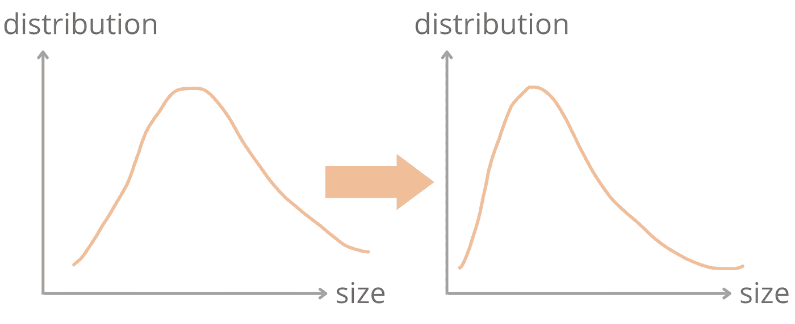
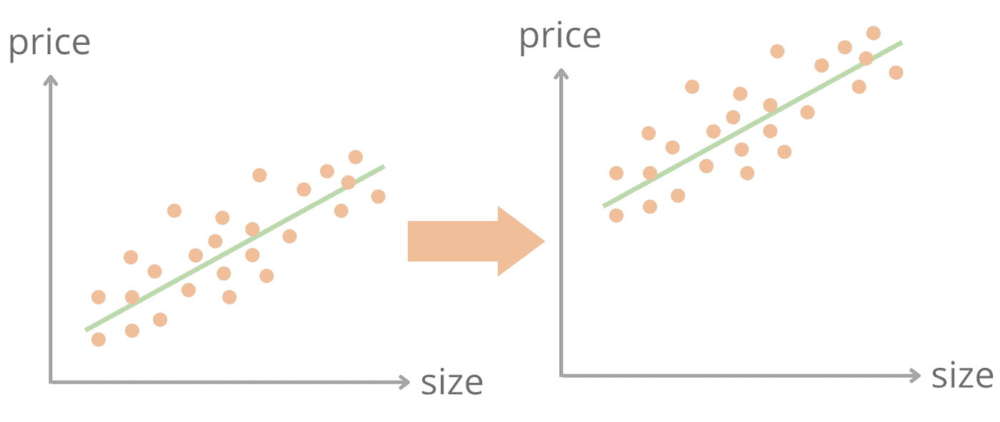

# 机器学习模型漂移

> 原文：<https://towardsdatascience.com/machine-learning-model-drift-9cc43ad530d6>

## 类型、原因、检测、缓解和工具

罗宾·皮耶尔在 [Unsplash](https://unsplash.com/s/photos/motion?utm_source=unsplash&utm_medium=referral&utm_content=creditCopyText) 拍摄的照片

在机器学习中，模型漂移意味着由于输入特征、目标变量或变量之间关系的统计属性的变化，机器学习模型变得越来越不准确。训练机器学习模型的数据称为训练数据或源数据。模型试图预测的数据称为服务数据或目标数据。训练/源数据分布可能不同于服务/目标数据分布。在本文中，我们将介绍模型漂移的类型、原因、如何检测模型漂移、如何减轻模型漂移，以及我们可以用来监控模型漂移的工具。

# 环境

给定一组输入特征 X，我们预测目标变量 y。例如，在房价预测模型中，X 可以是一组房屋特征(例如，卧室数量、大小、位置)，y 可以是房价。一对(X，y)表示数据集中的一条房屋记录。p(X)和 p(y)分别是观察到房屋特征 X 和房价 y 的概率，也称为边际概率或先验概率。p(y|X)是给定房屋特征的房价的条件分布。

# 模型漂移的类型

模型漂移包含两个关键类别:概念漂移和数据漂移。数据漂移还包括协变量/特征漂移和标签漂移。

## 协变量/特征漂移

当 p(X)改变但 p(y|x)保持不变时，会发生协变量漂移或特征漂移。输入房屋特征的边际分布发生变化，但给定房屋特征的房价的条件分布保持不变。

让我们来看看房子的一个特征——大小。想象一下，你的模型在 Covid 之前就已经被训练好了，而当时市场上有更多的大户型房子。在 Covid 期间，人们都想搬到更大的房子，市场上更大尺寸的房子越来越少。

图一。协变量漂移(图片由作者制作)

## 标签漂移

当 p(y)改变但 p(x|y)保持不变时，就会发生标签漂移。

在房价预测示例中，房价分布 p(y)可能会在之前训练模型后发生变化。例如，在疫情期间，房价大幅上涨，导致房价分布向更高值移动。

图二。标签漂移(图片由作者制作)

## 概念漂移

当 p(y|X)改变但 p(X)保持不变时，就会发生概念漂移。

在房价预测示例中，给定房屋特征 p(y|X)的房价的条件概率可以改变。让我们重新考虑一下前面的例子。假设房子大小的分布没有变化。因为现在人们喜欢更大的房子，更大的房子变得更贵。给定房屋尺寸的房价的条件概率可能发生变化，尤其是对于较大的房屋。

图 3。概念漂移(作者制作的图像)

# 模型漂移的原因

ML 模型漂移的原因有很多。以下是一些例子:

数据漂移的主要原因之一是**采样不匹配**。我们经常使用一些采样策略来寻找源数据来训练我们的模型。抽样策略可能有**偏差，不能代表全部人口。例如，如果我们想要开发一个模型来预测一般波士顿地区的房价，我们就不能使用仅包含 Back Bay 地区周围列出的房屋的训练数据。**

有时候，人们将他们训练有素的模型应用到**一个新产品/市场/环境**中，发现他们的模型并不好用。例如，疫情改变了世界的宏观经济。与《疫情时报》之前相比，我们处于一个非常不同的市场和环境中。此时，要素、标注的分布以及要素和标注的联合分布都可能发生变化。最好的解决办法是重新训练模型。

**异常**可能出现在训练数据中，也可能出现在目标数据中。异常会改变我们数据的分布。有时我们的模型会自动处理异常情况。其他时候，我们需要采用一些异常检测技术并过滤掉(例如，winsorize)异常。

**季节性影响**也会导致模型漂移。多个变量之间的关系，例如，房子大小和房价，可能会根据月份或季节而变化。通常建议在模型中考虑季节影响，或者在某些情况下，在不同的模型中模拟不同的场景。

**数据质量**问题的发生可能比你想象的要多。存在各种数据质量问题，例如不正确的输入数据、不正确的数据处理步骤和重复。有时，数据或数据处理管道中的变化不是质量问题，而是预期的和业务需求。如果不密切监控，这种数据变化也会导致模型漂移。设置护栏以验证数据并确保数据质量和一致性是 ML 模型的先决条件。

# 检测漂移

## 监控模型性能

检测漂移最直接的方法是通过监控模型性能指标。最常见的模型性能指标包括混淆矩阵、准确性、召回率、F1 评分和 ROC-AUC。根据您的模型使用情况，可能还有其他重要的模型行为度量标准。

同样，一些研究集中于误差率，并使用基于误差率的漂移检测方法。例如，漂移检测方法(DDM)算法可用于检测任何误差率的显著增加。

## 监控描述性统计

我们可以用最小值、最大值、中值、平均值、唯一性、相关性等度量来统计描述数据集。我们可以将所有这些描述性统计数据包含在我们的模型监控仪表板中，以可视化这些统计数据如何随时间变化。

## 监控分布变化

当您看到描述性统计数据中的变化时，您如何知道分布中有实际的变化，以及您如何知道这些变化是显著的和有意义的？人们使用几种统计测试或假设测试来检测统计上的分布变化，如群体稳定性指数、Kullback-Leibler (KL)散度、Jensen-Shannon、Kolmogorov-Smirnov 测试、Cramér-von Mises、Fisher 精确测试、最大平均差异(MMD)和最小二乘密度差。

例如，**人口稳定指数** ( [PSI](https://mwburke.github.io/data%20science/2018/04/29/population-stability-index.html) )衡量“随着时间的推移，或者在一个单一数字中的两个不同人口样本之间，人口发生了多大的变化”。 **Kolmogorov-Smirnov 检验**(或 [KS 检验](https://en.wikipedia.org/wiki/Kolmogorov%E2%80%93Smirnov_test))“量化样本的经验分布函数与参考分布的累积分布函数之间，或两个样本的经验分布函数之间的距离”。

此外，还有被设计用于检测模型漂移的监督和非监督 ML 模型。

# 缓解措施

在实践中，我们经常建立一个模型监测系统来检测模型漂移。其他时候，当我们的模型有问题时，我们通过模型分析发现数据漂移。在任一情况下，当模型漂移发生时，我们首先需要找到漂移的原因。模型漂移的原因是什么？不同的根本原因应该有不同的缓解策略。详情请参考“模型漂移的原因”。

假设我们的数据是正确和有效的，减轻模型漂移的一个常用方法是用新数据重新训练模型。你可能会想，为什么我们不一直重新训练模型，这样我们就不需要关心模型漂移了？这是一个很好的问题。事实上，很多公司都在尽可能地模拟再培训。然而，有时模型的再训练和部署并不那么简单。例如，您的新数据可能没有标签。你新训练的模型可能不会更好，特别是当你还没有做漂移分析，并且不确定它在哪里出了错的时候。

# 工具

有很多 ML 监控工具和模型漂移监控工具。以下是一些流行的工具:

whylogs 是一个“用于记录任何类型数据的开源库”。借助 whylogs，用户能够生成数据集的摘要(称为 whylogs 配置文件)，用于跟踪数据集中的变化，创建数据约束以了解数据是否符合预期，并快速可视化数据集的关键摘要统计信息。”

[显然](https://github.com/evidentlyai/evidently)是一个“在生产中评估、测试和监控 ML 模型的开源框架”

[Alibi Detect](https://github.com/SeldonIO/alibi-detect) 是一个“开源 Python 库，专注于异常、敌对和漂移检测。”

如果您使用这些平台，所有主要的云提供商和 MLOps 平台也都有自己的模型性能和模型漂移监控工具。例如，[Amazon sage maker Model Monitor](https://aws.amazon.com/sagemaker/model-monitor/)“通过将真实世界的数据与基线数据集(如训练数据集或评估数据集)进行比较来检测数据偏差。”

# 结论

在你的机器学习之旅中，设计一个机器学习模型只是一个开始。一旦你制作了完美的机器学习模型并将其部署到生产中，真正的挑战就来了。适用于当前数据的模型可能不适用于未来。持续监控的一个重要组成部分是模型漂移。监控和减轻模型漂移有助于保持您的机器学习模型愉快和成功！

# 参考资料:

*   [概念漂移适应研究综述。 *ACM 计算调查(CSUR)*](https://dl.acm.org/doi/10.1145/2523813)
*   Quionero-Candela，Joaquin 等*机器学习中的数据集转移*。麻省理工学院出版社，2009 年。
*   设计机器学习系统。奇普·胡恩。2022.
*   [https://www . fiddler . ai/blog/drift-in-machine-learning-how-to-identify-issues-before-you-have-a-problem](https://www.fiddler.ai/blog/drift-in-machine-learning-how-to-identify-issues-before-you-have-a-problem)
*   【https://mwburke.github.io/data 科学/2018/04/29/人口-稳定-指数. html

. . .

作者索菲亚杨 2022 年 8 月 23 日。

Sophia Yang 是 Anaconda 的高级数据科学家。在 [LinkedIn](https://www.linkedin.com/in/sophiamyang/) 、 [Twitter](https://twitter.com/sophiamyang) 和 [YouTube](https://www.youtube.com/SophiaYangDS) 上与我联系，并加入 ds/ml[❤️读书俱乐部](https://discord.com/invite/6BremEf9db)