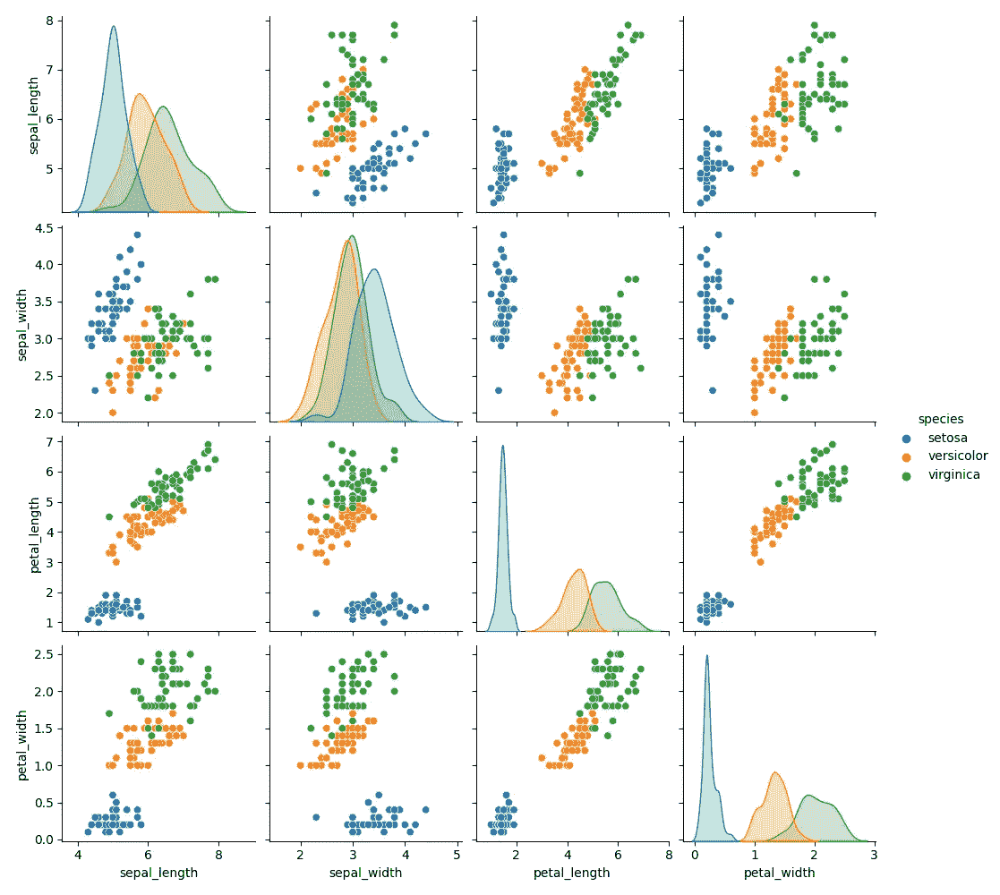
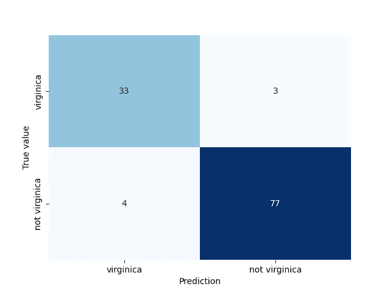
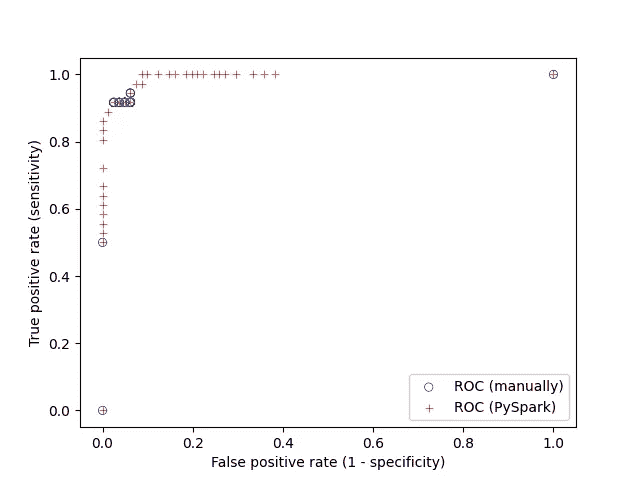
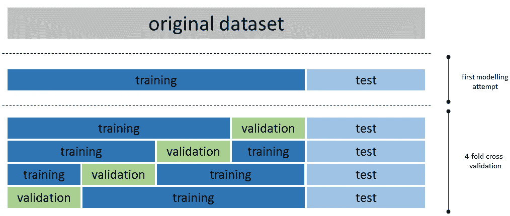
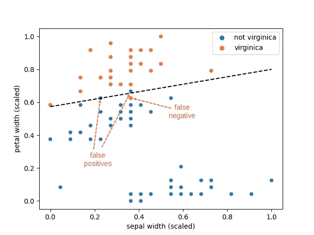

# 大规模的机器学习

> 原文：<https://towardsdatascience.com/machine-learning-on-a-large-scale-2eef3bb749ee>

## PySpark 中二项式和多项式逻辑回归的演示

戴维·尤斯科在 [Unsplash](https://unsplash.com?utm_source=medium&utm_medium=referral) 上的照片

随着本文本地部署的 Spark 3.2.1 的发布，PySpark 提供了一个流畅的 API，类似于 [scikit-learn](https://scikit-learn.org/) 的表达能力，但还提供了分布式计算的好处。本文演示了如何使用 pyspark.ml 模块在 spark 数据帧上构建 ml 管道(而不是使用旧的 pyspark.mllib 模块构建 rdd)。使用二项式和多项逻辑回归来举例说明该功能，不可否认，这不是最先进的机器学习算法。尽管如此，它们的简单性使它们成为演示 PySpark 机器学习 API 的理想选择。对于不熟悉 PySpark 机器学习的读者，以及更熟悉早期版本的 Spark，尤其是 pyspark.mllib 模块的读者，本教程可能会感兴趣。

**目录**

[设定场景](#2366)
[二项逻辑回归](#cb21)
∘ [准备工作](#942a)
∘ [首次建模尝试](#ea64)
∘ [评估模型质量](#8a85)
∘ [交叉验证和超参数调优](#caf5)
∘ [模型解释](#6609)
[多项逻辑回归](#c53a)
[结论](#a329)

# **设定场景**

我们首先通过分配 8gb 内存和四个内核来创建一个 spark 会话

上面的代码还包含整篇文章所需的所有 pyspark 导入。当涉及到其他软件包时，我们将根据需要使用更多的进口产品。

我们将使用通过`df = sns.load_dataset('iris')`从 [seaborn](https://seaborn.pydata.org/) 获得的虹膜数据集。这是一个著名的数据集，包含四个连续的特征，即属于三个不同物种的 150 朵鸢尾花的萼片和花瓣的长度和宽度:*鸢尾*、*杂色鸢尾*和*海滨鸢尾*。数据集没有空值，并且所有要素的比例都相当合理，但我们稍后将回到这一点。

显然，这是一个非常小的数据集，绝不需要分布式计算。然而，鉴于本文的目的是说明 PySpark 机器学习 API，选择一个小数据集进行实验是理想的，特别是在使用交叉验证进行超参数调整时，正如我们在本文中所做的那样。使用一个基本的机器学习算法和一个小的、相当干净的数据集并没有打破数据科学的新前沿，但这些选择是有意的。

为了了解分类的效果，我们使用`sns.pairplot(df, hue='species')`在数据集中绘制成对关系，给出

图 1:数据集中要素的成对关系

粗略地看一下，我们可以看到*鸢尾*可能被正确分类，但我们预计在区分*杂色鸢尾*和*海滨鸢尾*时会有一些困难。

# **二项逻辑回归**

为简单起见，我们将对二项式和多项式逻辑回归使用相同的数据集。对于二元分类，我们试图预测该物种是*海滨鸢尾*还是*海滨鸢尾*

从这一点开始，所有操作都将在 PySpark 中进行，将 pandas 数据帧转换成 PySpark 数据帧

自动转换自动生成了预期的模式。

## 准备工作

PySpark 使用转换器和估算器将数据转换为机器学习功能:

*   转换器是一种可以将一个数据帧转换成另一个数据帧的算法
*   估计器是一种算法，它可以适用于数据帧以产生变换

以上意味着变压器不依赖于数据。机器学习模型是一个转换器，它获取具有特征的数据帧，并通过其`.transform()`方法产生包含预测的数据帧。另一方面，估计器有一个`.fit()`方法，它接受数据帧并产生一个转换器。PySpark 中的流水线链接了 ML 工作流中的多个转换器和估算器。scikit-learn 的用户一定会有宾至如归的感觉！

回到我们的数据集，我们构造第一个转换器，将四个特征打包成一个向量

features 列看起来像一个数组，但它是一个向量。方便的是，向量组装器还会填充模式中 features 列的元数据属性

还可以检索原始特征的列名，尽管使用`feature_assembler.getInputCols()`可能会更方便。

尽管这些特征或多或少是成比例的，但是如果我们确保所有特征的范围从 0 到 1，那么拟合的逻辑回归系数的解释将变得容易。这可以使用最小-最大缩放器估计器来实现

在上面的代码中，`minMax_scaler_model`是一个通过将`minMax_scaler`估计器与数据相匹配而产生的转换器。使用矢量可以方便地一次性缩放所有连续要素。顺便提一下，`pyspark.ml.feature`模块包含了`vector_to_array()`和`array_to_vector()`函数来转换向量和数组，所以像`minMax_scaler`这样的估计器也可以用于机器学习之外的数据转换。

原则上，features_scaled 和 species 列现在可用于拟合逻辑回归模型。然而，在此之前，我们将引入另一个概念，ML 管道，它可用于编排 ML 工作流

结果和以前一样，但是代码更简洁。管道在技术上是一个估计器，并有一个返回转换器的`.fit()`函数。在幕后，装配一个管道调用用于变压器的`.transform()`函数和用于估计器的`.fit()`函数，按照它们在管道阶段被引入的顺序。在实践中，我们可以用不同的变压器和估算器构建多条管道，并通过构建模型来试验我们的选择的效果。

## 首次建模尝试

在调整模型和评估其准确性之前，先做一个粗略的尝试，看看最终得到一个合理模型的可能性有多大，这是很有用的。为此，我们不使用交叉验证，我们只指定必需的模型参数，其余的都保留默认值。

首先要做的是增加一个管道阶段，即使用一个`StringIndexerModel`将物种列从字符串转换为数值

因为这是以后需要的。或者，我们可以使用`StringIndexer` [估计器](https://spark.apache.org/docs/latest/ml-features.html#stringindexer)通过使用数据创建模型，并根据物种名称的频率分配指数。我们选择不这样做，因为我们想确保 *Iris virginica* 映射到 1.0，而不是 *Iris virginica* 映射到 0.0。然后，我们将数据集分成训练集和测试集

我们将种子指定为一种良好的实践，尽管在 Spark 世界中，由于数据的底层分区，这并不能确保确定性行为。如果你对这个令人难以置信的话题感到好奇，下面的实验可以说明这个问题

您可以在这篇[文章](https://medium.com/udemy-engineering/pyspark-under-the-hood-randomsplit-and-sample-inconsistencies-examined-7c6ec62644bc)中阅读更多内容，包括如何避免这个问题的想法，例如，通过缓存整个数据集而不仅仅是训练集(如下所述)。存储训练集和测试集并再次读取它们以构建模型是确保确定性行为的另一种方式。请注意，训练数据集在任何情况下都应该被缓存，因为在拟合模型时会重复使用它。这可能是 Spark 中最典型的缓存用例。

剩下的唯一事情就是拟合模型并评估其准确性。为了完整起见，提供了整个代码，这样更容易理解

为了方便起见，我们使用`pyspark.ml.feature.IndexToString()`将预测的数值转换回标签。请注意，我们只使用了萼片宽度和花瓣宽度作为自变量。此外，我们只使用了 20%的数据集进行训练。这些奇怪选择的原因是，这个机器学习问题实际上非常容易解决，因此我们几乎总是不费吹灰之力就能获得一个好的模型。通过丢弃一些特征和使用一个小的训练集，我们从一开始就计算出不完美的度量。

我们现在有了对测试集的预测，并且可以一瞥我们做得有多好。

## 评估模型质量

也许获得关于二项式分类模型性能的概念的最常见方法是计算[混淆矩阵](https://medium.com/@shivangisareen/confusion-matrix-3ac02a1719ba)。在 PySpark 中，这可以很容易地用

使用 seaborn 中带注释的热图，混淆矩阵也可以很容易地可视化

产生了

图 2:混淆矩阵

如果您尝试跟随，由于训练集和测试集的不同划分，您可能会获得稍微不同的结果。

有许多可以计算的指标，但我列出了与稍后的 ROC 曲线计算相关的最重要的指标:

*   **召回率、灵敏度或真阳性率:**反映模型识别阳性的能力，定义为 TP/(TP+FN)
*   **精度或阳性预测值**:显示预测阳性为真阳性的频率，定义为 TP/(TP+FP)
*   **特异性或真阴性率**:反映模型识别阴性的能力，定义为 TN/(TN+FP)
*   **假阳性率**:反映假阳性的概率，定义为 FP/(TN+FP)= 1-特异性

在计算出混淆矩阵后，这些度量很容易手动计算。或者，为了方便起见，也可以使用 PySpark API

测试集的受试者操作者特征(ROC)曲线可从`metrics.roc`中检索，但我们也将使用原始概率手动计算。我们使用 seaborn 来可视化这两种方法的结果

产生了

图 3: ROC 曲线。曲线从(0。, 0.)对应于等于 1 的阈值。这意味着每个预测都是负面的。曲线在(1)处结束。, 1.)对应于等于 0 的阈值。，这意味着每个预测都是正面的。

我不建议手动计算 ROC 曲线，原因有几个，包括对性能的担忧。然而，考虑到基于数据帧的 PySpark 机器学习 API 是新的，文档还不完善，所以要小心谨慎。建议检查结果是否有意义，以确保正确使用 API。PySpark API 还可以返回精确召回(PR)曲线，这在类非常不平衡时很有用。ROC 曲线的目的是选择阈值，以实现所需的灵敏度和特异性。阈值可视为模型的[参数，与所有参数一样，它不应在测试集上计算，而应在训练集上计算，或者更好的是，在验证集上计算(见下一节)。PySpark API 通过`lr_model.summary.roc`和`lr_model.summary.pr`为训练集曲线提供 ROC 和 PR 曲线。](https://alonhzn.medium.com/the-fallacy-of-an-roc-curve-on-a-test-set-c96d8fdf774)

ROC 曲线也用于计算 ROC 曲线指标下的面积。完美模型的 ROC 曲线会接近左上角，而随机模型会接近对角线(真阳性率=假阳性率)。ROC 曲线下的面积介于 0。并且可以通过一个`BinaryClassificationEvaluator`对象来计算

结果令人印象深刻，尽管试图阻碍模型质量。训练集的 ROC 曲线下的面积可从模型摘要中获得`lr_model.summary.areaUnderROC.``BinaryClassificationEvaluator`对象也可用于计算 PR 曲线下的面积。

## 交叉验证和超参数调整

与大多数其他模型一样，逻辑回归模型具有可以微调的参数，以优化模型的准确性和稳健性。上一节描述了第一次建模的尝试，这种尝试走了很多弯路。我们对逻辑回归模型的所有参数使用默认值，并通过将原始数据集分成两部分来简化模型开发，一部分用于训练，一部分用于测试。这是一个很好的开始方式，以便获得可以实现的第一个想法。一旦我们确信我们有可能产生一个可行的模型，我们就可以使用交叉验证来优化模型的参数。这是一个昂贵的手术。首先，对于一组给定的模型参数，我们对模型进行多次拟合和评估(这就是所谓的折叠)。其次，我们尝试许多不同的模型参数集。本节给出了使用 4 重交叉验证的二项式逻辑回归的完整代码，并作为 PySpark 中其他机器学习模型如何训练和优化的示例。

图 4:将原始数据集分成训练集、验证集和测试集(图片由作者提供)

交叉验证需要三个构件:

*   估计器(模型)，通常封装在 ML 管道中
*   我们试图调整的超参数网格
*   一个评估度量，本质上是超参数调整的目标函数

在我们的例子中，我们使用早期设置的管道。我们将微调逻辑回归模型的两个[参数](https://spark.apache.org/docs/latest/api/python/reference/api/pyspark.ml.classification.LogisticRegression.html#pyspark.ml.classification.LogisticRegression)，即

*   弹性净混合参数[α](https://www.statlearning.com/)(α= 0 表示 L2 惩罚，α-1 表示 L1 惩罚)，以及
*   [正则化参数](https://www.statlearning.com/)

这听起来可能很奇怪，但是我们也将通过调整传递给向量汇编器的特性来使用超参数调优来选择特性。对于这个例子来说，这有点牵强，但是我选择这样做是为了表明所有管道阶段的所有参数原则上都可以包含在微调中。参数组合的数量迅速增长，实际上运行时间的限制抑制了热情。

使用的评估器是在不同折叠的平均验证集上计算(正确)的 ROC 曲线下的面积。

网格搜索检查了 165 个参数组合，每个组合都适合并评估了四个模型。尽管 iris 数据集与 Spark 通常处理的数据集相比非常小，但这花费了大约 350 秒。每个参数组合的 ROC 曲线下的平均面积可以用`cv_model.avgMetrics`来检索，这表明几个组合达到了近乎完美的度量(ROC 曲线下的面积~=1。).可以用`cv_model.bestModel`从中检索最佳模型(不确定当两组参数表现相同时 Spark 如何选择最佳模型，但这在现实世界用例中不太可能发生)。

所有拟合的模型被存储，并可通过`cv_model.subModels[k][i]`检索，其中 k 是折叠，I 是参数网格中参数集的索引。在我们的例子中，对于 i=4 获得了最好的结果，并且对应于四个折叠的 4 个模型可以通过`[cv_model.subModels[k][4] for k in range(4)]`获得。我们应该检查不同褶皱的系数分布，这是模型[稳定性](https://stats.stackexchange.com/questions/253605/do-average-coefficients-in-k-fold-cross-validation-resemble-coefficients-when-tr)的指示，甚至使用最佳超参数再次拟合整个训练集。这超出了本文的范围。我们将使用与`cv_model.bestModel`一起返回的最佳模型，无需进一步调查。

## 模型解释

也许令人惊讶的是，通过仅使用萼片和花瓣宽度而不进行正则化，我们获得了一个非常好的模型。线性模型的系数和截距可以很容易地恢复

并储存在熊猫系列中。方便的是，vector assembler 将特征名称存储为可用于设置系列索引的模式元数据。这些特征已经过最小-最大缩放，有助于解释。花瓣宽度的影响大约是萼片宽度的 4 倍。

这是一个特殊的情况:超参数调整碰巧只保留了两个特征，而没有必要进行正则化。这允许可视化决策边界，唯一的复杂性是特征缩放的处理

产生了

图 5:最佳模型的决策边界

图 5 显示了训练集(意味着除测试集之外的所有数据点)，我们可以看到有一个假阴性和两个假阳性(一个几乎在决策边界上)，这与训练集的混淆矩阵一致。一切看起来都很好。

# **多项逻辑回归**

PySpark 还支持[多项式](https://spark.apache.org/docs/latest/ml-classification-regression.html)逻辑回归(softmax)，因此可以一次性预测虹膜数据集的所有类别。我们不会涵盖所有细节，因为这篇文章已经很长了。下面是首次尝试拟合多项式逻辑回归模型的完整代码

我们再次获得了一个良好的模型与第一次尝试。

# **结论**

机器学习是一个广阔的领域。解决问题需要设计功能、选择模型、决定使用哪个指标进行超参数调整，并设计一个策略通过改变参数来最大化该指标。本文不提供以上问题的答案，而是重点介绍如何使用 PySpark 最新的机器学习 API。构建模型从来都不是一个线性的过程，熟悉`pyspark.ml`模块提供的功能是加速实验的良好起点。大规模构建模型从未如此简单！