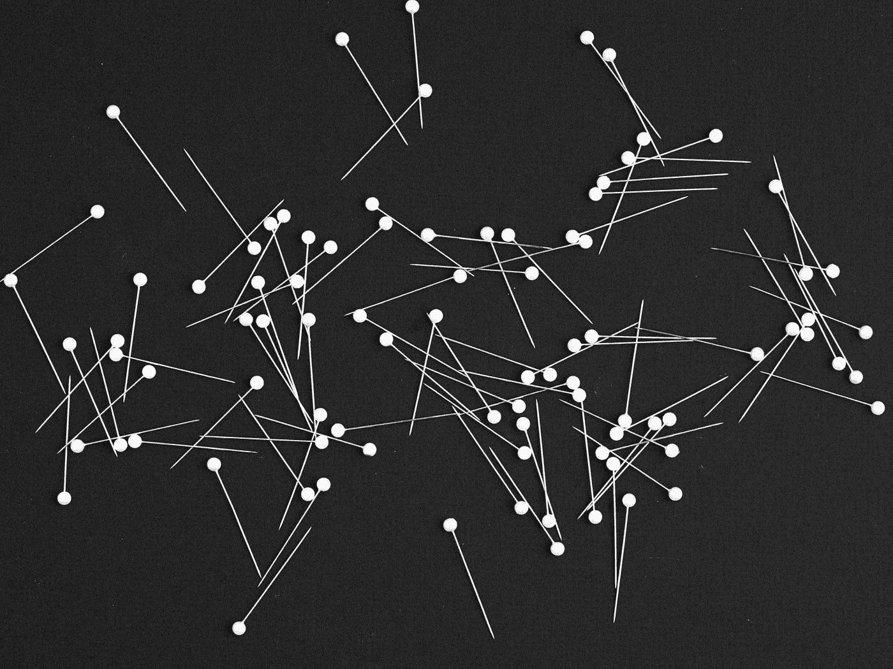

# 基于图形数据的机器学习

> 原文：<https://towardsdatascience.com/machine-learning-on-graph-data-eef60a8533f1>

## 如何在 ML 模型中利用图形信息

美国宇航局在 [Unsplash](https://unsplash.com?utm_source=medium&utm_medium=referral) 拍摄的照片

# 介绍

许多真实世界的数据集可以自然地被框成图表。比如在社交网络等线上平台上，用户可以表示为节点，关注或喜欢可以表示为边。

然而，当在来自这些领域的数据上构建模型时，人们经常通过忽略底层的图结构来简化问题。在这样做的时候，机器学习实践者忽略了有用的信息，这些信息将有助于将实体(例如，用户)置于他们所属的更广泛的网络的上下文中。

在这篇文章中，我将介绍各种方法，从非常简单到复杂，将图形信息合并到机器学习模型中。我将主要关注节点级别的任务，比如节点分类，而不是整个图级别的任务，因为它们在行业中更常见。

# 什么是图？

图形是对实体对之间的关系进行编码的数据结构。图中的实体称为*节点*，关系称为*边*。边缘可能是也可能不是*定向的*，这是指边缘是否双向应用。在有向图中，从 A → B 的边的存在并不意味着从 B →A 的边的存在，而在无向图中，它是存在的。

例如，在社交网络上，一个图可以根据用户关注的人将用户与其他用户联系起来。在这种情况下，节点将是用户，边将编码谁跟随谁。该图中的边是有向的，因为用户不必跟随跟随它们的每个人。

这个图中的节点也有*特征*，比如账户的年龄，或者用户来自哪个国家。这些属性将节点相互区分开来，并提供额外的上下文。

图为 [Kier 在](https://unsplash.com/@kierinsight?utm_source=medium&utm_medium=referral)的视线中在 [Unsplash](https://unsplash.com?utm_source=medium&utm_medium=referral) 上

在这个社交网络图中，我们可以观察到许多我们知道的社交网络现象，例如:

*   一些用户，如名人，会有更多的优势，因为名人有数百万粉丝，但很少跟随每个人回来。
*   一些用户，如机器人，会有相反的情况，可能会有更多的优势，因为机器人往往会跟随随机的人，但真正的用户不会跟随机器人。
*   用户通常会形成由倾向于相互认识的用户组成的紧密连接的群组的集群。同一兴趣小组中的朋友或人往往会追随许多相同的人。

# 机器学习方法

现在我们将开始讲述如何在您的模型中利用图表信息。这些方法从简单的统计到完全可训练的图形神经网络，每种方法都有自己的优点和缺点。

## 图表统计

利用图表信息的最简单方法是计算基本计数和比率，并将它们用作数字特征。

一些图表统计包括:

*   度，它计算给定节点有多少条边。
*   中心性，抽象地衡量一个给定的图对整个图的连通性有多重要。有各种类型的中心性度量，例如中间中心性和接近中心性，但是在高级别上，对于位于有效地将许多节点相互连接的路径中的节点，它们更高。
*   聚类系数，它有效地测量了图中节点局部的密度。具有全部相互连接的邻居的节点将具有较高的聚类系数。

这些图表统计是一个很好的起点，并且具有易于理解的标准化含义。

然而，它们所能传达的信息相对有限:

*   他们根本无法利用节点功能。对于这些汇总统计信息，具有相同值的所有节点是无法区分的。
*   在这些特征的产生中没有可学习的成分。我们不能适应一个定制的目标，也不能用一个下游任务来训练他们。

## 节点嵌入

利用图信息的下一种方法是学习图中每个节点的节点嵌入，并将这些嵌入用作下游模型中的特征。节点嵌入是我们可以映射到图中每个节点的可学习的数字向量，允许我们学习每个节点的唯一表示。

了解这些嵌入的最常见方法(来自 [DeepWalk](https://arxiv.org/pdf/1403.6652.pdf) 和 [Node2vec](https://arxiv.org/pdf/1607.00653.pdf) 的论文)是强制彼此靠近的节点具有相似的表示。他们使用随机行走的概念，从一个给定的节点开始，随机穿过边，产生彼此相邻的节点对。通过最大化在随机行走中同时出现的节点之间的余弦相似性来训练嵌入。这个训练目标利用了[同向性假设](https://en.wikipedia.org/wiki/Network_homophily)，该假设指出相互连接的节点倾向于彼此相似。

这些节点嵌入方法允许我们学习每个节点的独立于任务的表示，并且可能比前面部分的方法具有更大的表示能力，因为它们可以学习每个节点的独立表示。

然而，虽然这是朝着正确方向迈出的一步，但这些方法仍有不足之处:

*   它们根本不使用节点功能。他们假设附近的节点是相似的，而没有实际使用节点特征来证实这一假设。
*   它们依赖于从节点到嵌入的固定映射(即这是一种直推式方法)。这意味着对于可能添加新节点和边的动态图，必须从头开始重新运行算法，并且所有节点嵌入都需要重新计算。在现实世界的问题中，这是一个相当大的问题，因为大多数在线平台每天都有新用户注册，并且新的边缘不断被创建。

## 图形卷积网络

我将介绍的最后一种方法是图形卷积网络(GCN)。这是一种执行图形表示学习的更高级的方法，克服了以前的节点嵌入方法的许多缺点。

图卷积网络通过学习聚集节点邻域(连接到原始节点的节点集)的函数，使用图结构和节点特征来学习节点的表示。这些表示是节点邻域的函数，并且不是每个节点硬编码的(即，这是一种归纳方法)，因此图结构的变化不需要重新训练模型。

从概念上讲，GCN 的单个图层可以简单地认为是对原始节点邻域中的节点要素进行加权平均，其中权重是通过训练网络来学习的。然后，我们可以堆叠这些 GCN 层，以产生使用更多图表的聚合。对于我们添加的每个 GCN 层，我们将用于产生节点嵌入的子图的跨度扩展 1 跳。

GCNs 可以通过监督和非监督的方式进行训练。对于有监督的训练，我们简单地根据下游任务的标签进行训练。对于无监督训练，有几个选项，但最常见的方法类似于 Node2vec/DeepWalk 方法，其中我们强制附近的节点具有相似的表示。

gcn 克服了先前方法的许多问题，因为 1)它们是端到端可训练的，2)它们充分利用节点特征，以及 3)它们不依赖于从节点到嵌入的固定映射。

由于这些优势，这种类型的图形神经网络已经在许多现实世界的工业系统中使用，例如推荐系统(例如 [PinSage](https://arxiv.org/pdf/1806.01973.pdf) )和欺诈检测系统。

# 结论

在这篇博文中，我们介绍了在机器学习模型中利用图形信息的三种不同方法，从简单的图形统计到端到端的可训练图形神经网络。

这些方法允许机器学习模型利用许多问题中存在的丰富的图形上下文。读完这篇文章后，希望你能更清楚如何在你的模型中利用图表信息。