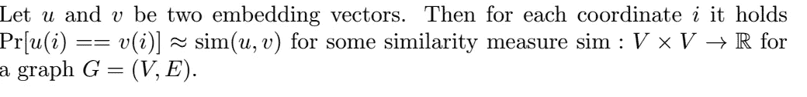
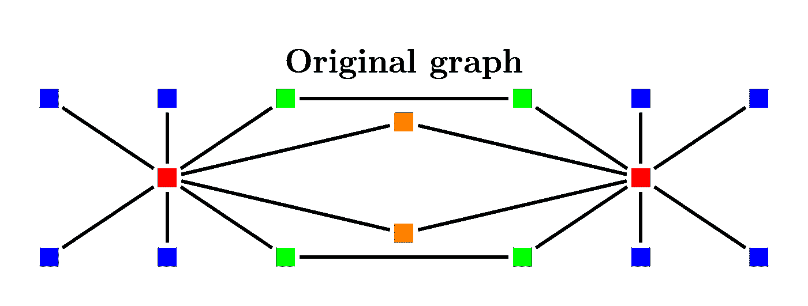
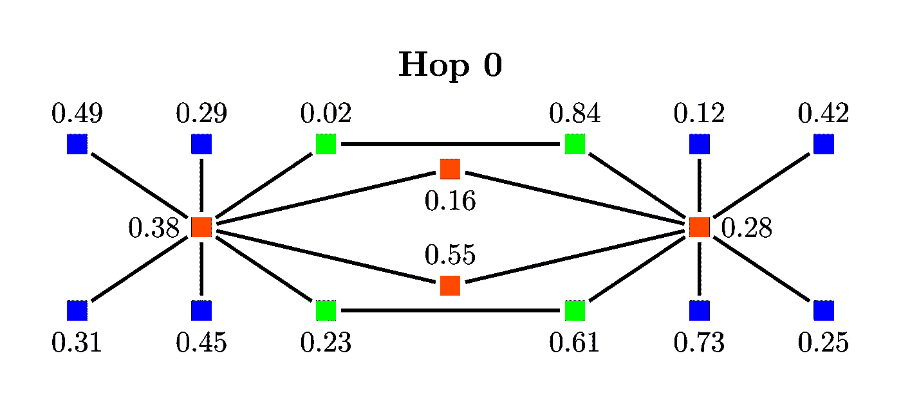
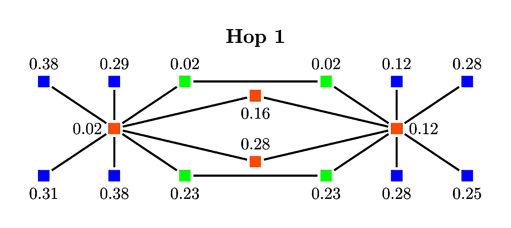
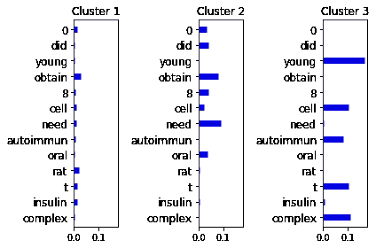

# 图上的机器学习，第 4 部分

> 原文：<https://towardsdatascience.com/machine-learning-on-graphs-part-4-44b690ec2ba3>

由 [Unsplash](https://unsplash.com/) 上的 [Clarisse Croset](https://unsplash.com/@herfrenchness) 拍摄的照片

# 学习离散节点嵌入

在这篇文章中，我想提出*离散*图节点嵌入，作为我关于图的机器学习系列的一部分([第 1 部分](https://medium.com/towards-data-science/machine-learning-on-graphs-part-1-9ec3b0bd6abc)、[第 2 部分](https://medium.com/towards-data-science/machine-learning-on-graphs-part-2-205c46b3ef60)、[第 3 部分](https://medium.com/towards-data-science/machine-learning-on-graphs-part-3-b968e1cc1aa3))。特别是，它还讨论了我上一篇关于离散节点嵌入的研究论文，这篇论文最近被接受在 AAAI 第 23 届人工智能大会上发表。

在[之前的一篇文章](https://medium.com/towards-data-science/machine-learning-on-graphs-part-2-205c46b3ef60)中，我介绍了学习节点嵌入算法背后的主要思想。默认情况下，当我们谈论自然语言处理中的单词嵌入或图形学习中的节点嵌入时，我们隐含的意思是连续嵌入。也就是说，像图形节点这样的离散对象由固定大小的连续向量表示。比如一个五维向量 like (0.3，0.67，-0.9，0.06，-0.55)。

众所周知，连续嵌入是一种强大而通用的数据表示技术。然而，尽管连续嵌入可能很强大，但对于人类用户来说，它们并不是很直观。

例如，考虑一个社交网络图，其中节点代表用户。每个用户由不同的属性描述，例如性别、位置、专业经验、个人兴趣等。连续的节点嵌入将利用这个信息。例如，伦敦的软件工程师很可能最终拥有类似的节点嵌入，因为他们在伦敦地区共享许多连接，例如与招聘人员或软件工程师同事。然而，连续的嵌入对于人类读者来说是没有意义的。我们大多数人都无法计算大脑中 50 维向量之间的余弦相似度或欧几里德距离。

另一方面，我们擅长通过滚动大量文本来获取信息。离散节点嵌入背后的思想是嵌入向量可以由人类可读的离散特征组成。所以，代替由 *k* 实值，每个节点由 *k* 离散特征表示。这些特征可以是节点属性或简单的其他图形节点。那么一个离散的嵌入向量看起来像

*(软件工程师，伦敦，数据科学家，剑桥，化学家)*

每个坐标都有一个定义明确的值。从上面我们可以推断，用户是拥有 STEM 学位的英国专业人士的专业团体的一部分。

我们需要解决以下问题:

1.  是什么使得离散节点嵌入在下游机器学习任务中有用？
2.  如何生成离散嵌入？
3.  如何用离散节点嵌入训练机器学习模型？

## 有用的离散嵌入

如前所述，离散节点嵌入很容易被人阅读。但是为了在可解释的机器学习模型中使用它们，我们需要有效地比较两个嵌入。第一个想法是随机收集一组“足够接近”的节点，和/或描述它们的属性，然后使用一组比较运算符，如 [Jaccard similarity](https://en.wikipedia.org/wiki/Jaccard_index) 。如果对应的集合彼此相似，则两个节点嵌入是相似的。这种方法可以工作，但用集合代替向量将限制我们可以使用的机器学习算法的选择。此外，计算集合交集比连续嵌入中使用的内积计算要慢。(即使两种情况下的渐近复杂度都是线性的，集员运算也会引入一些计算开销。)取而代之，我们设置以下要求。

也就是说，我们要求每个坐标对都是节点间相似性的无偏估计量。然后通过它们的汉明距离比较两个嵌入向量，即它们不同的坐标数，所谓的*重叠或汉明核*。关于上述定义中两个节点之间的相似性度量，在(属性化的)图节点之间有大量的度量。事实上，这是我在[上一篇文章](https://medium.com/towards-data-science/machine-learning-on-graphs-part-3-b968e1cc1aa3)中讨论图形内核的主题。在高层次上，我们希望被具有相似特征的节点“包围”的节点具有相似的嵌入。例如，一个简单的度量是由汉明核近似的节点邻域之间的 Jaccard 相似性。

## 如何生成离散嵌入？

第一个问题是哪些节点应该被认为是“足够接近”的采样点。我们因此定义一个节点的 *k-* 跳邻域为通过遍历最多 *k* 条边可以到达的所有图节点。节点 *u* 的 0 跳邻域因此是 *u* 本身，1 跳邻域是通过边连接到 *u* 的节点，2 跳邻域包括邻居的所有邻居，等等。

定义了要从中对节点或节点属性进行采样的节点集之后，下一个问题是如何生成向量。例如，在每个森林开始随机行走并遍历 *k* 条边将是一个选项。对于一个 *n* 维嵌入向量，我们可以在每个节点开始 *n* 次随机行走。但是很容易看出，这种嵌入不太可能有大的重叠。因此，对于有用的相似性度量，不满足上面定义的形式要求。因此，我们将利用一种叫做*协调采样*【3】的技术。

*协同采样*是一种强大的集合间相似性估计技术*。*非正式的*，*它是基于这样的想法，如果 x 是从集合 A 中采样的，并且如果 x 是另一个集合 B 的成员，那么 x 更有可能也是从 B 中采样的。这样，A 和 B 的共同点越多，它们越有可能以相同的样本结束，从而反映 A 和 B 之间的相似性。有许多不同的协调采样技术，例如参见[本演示文稿](http://www.cohenwang.com/edith/Talks/RANDOM_2013_coordinated_sampling.pdf)。让我们考虑一个简单的技术，使上述非正式的描述更加直观。

*使用 minwise 哈希的协同采样。*

考虑图 1 中简单的玩具图形示例。两个红色节点有两个橙色节点作为共同邻居。因此，1 跳邻域的 Jaccard 相似性是 2/16，因为所有图节点都连接到红色节点。2 跳邻域之间的 Jaccard 相似性是 8/16，因为 8 个蓝色节点在 2 跳中不能被 2 跳中的一个红色节点到达。我们想要应用协调采样，以便我们采样一个邻域节点作为每个节点的嵌入向量中的坐标。

图一。原始图表。图片作者。

我们将应用 [minwise 独立哈希](https://en.wikipedia.org/wiki/MinHash)。我们将随机排列节点，并将邻域集中排列的第一个节点作为样本。我们展示了如何以一种非常有效的方式实现该方法。

第一步，我们在每个节点生成一个介于 0 和 1 之间的随机数，见图 2。以这种方式可以生成的随机数的数量是巨大的(2**32 或 2**64)，因此随机数给出的顺序给出了节点上的随机排列。对于每个节点，我们希望从它的 k 跳邻域中找到具有最小随机数的节点。这将是节点的样本。

图二。给节点分配随机权重。图片由作者提供。

对于 k=0，我们什么都不做。节点的 0 跳邻域是节点本身。

图 3。将最小权重传播到邻居节点。图片由作者提供。

每个节点的 1 跳邻域是该节点的直接邻居的集合，即只有通过边连接的节点。在上面的例子中，蓝色节点只有一个邻居。

在图 3 中，我们看到了用一个邻居的最小权重更新每个节点后的结果。例如，右上绿色节点的邻居是权重为 0.02 的绿色节点和权重为 0.28 的红色节点。两个权重都小于其初始权重 0.84，我们更新红色节点，使其现在的权重为 0.02。类似地，右边的红色节点获得新的权重 0.12，因为这是权重最小的邻居。请注意，如果没有比当前节点权重更小的邻居节点，我们不会更新该节点的权重。

图 4。最小节点权重传播的第二次迭代。图片由作者提供。

在图 4 中，我们看到了该方法再一次迭代后的结果。最小权重 0.02 已经到达其 2 跳邻域内的所有节点。具体来说，两个红色节点现在具有相同的样本，即最初被赋予权重 0.02 的绿色节点。请注意，如果将最小的权重分配给其中一个蓝色节点，那么两个红色节点会以不同的样本结束。因为正好 50%的节点是蓝色的，所以很容易看出每个坐标是两个红色节点的 2 跳邻域之间的 Jaccard 相似性的无偏估计量。同样的推理适用于所有节点对。此外，该算法是高效的。每次迭代花费的时间与图的边数成线性关系。因此，对于在 *m* 边上的图，我们需要时间 *O(m*k*d)* 来通过从每个节点的 *k* 跳邻域中采样来计算所有节点的 *d* 维嵌入。

## 如何在机器学习模型中使用离散节点嵌入？

节点嵌入的两个典型用例是链路预测和节点分类。连续和离散节点嵌入可以以本质上相同的方式用于链路预测。预测具有由它们的嵌入给出的最高相似性分数的节点对作为新链接。然而，在节点分类中，我们已经标记了节点，并且我们想要使用嵌入向量来训练模型。因此，我们需要一个能够处理离散节点嵌入的分类模型。显然，像逻辑回归这样的标准选择并不真正适用。

*内核机器。*节点分类的一个直接选择是使用带有预先计算的核矩阵的核机器[2]。在选择节点的子集作为训练数据集 S 之后，我们计算 S 的 [Gram 矩阵](https://en.wikipedia.org/wiki/Gram_matrix)，即，对于来自 S 的每对节点，我们计算它们之间的重叠。显然，这种方法可能效率很低，因为它需要 O(m)的内存来训练 s 中的 m 个示例。训练具有预先计算的内核的内核机器可能导致 O(m)的时间复杂度。

*显性特征地图。*设 *U* 是离散嵌入可以取值的论域。例如，如果节点属性是短文本描述，那么 *U* 就是所有字典单词的集合。通过枚举 *U* 、 *d* 中的所有元素，维度嵌入可以由维度的稀疏向量 *d* *| *U* |来描述。即使这些向量非常稀疏，只有 *d* 个非零条目，在机器学习模型中使用它们也可能导致密集的决策向量，并且该方法将变得不可行。这是将嵌入投影到低维向量的想法，因此我在论文中指出，我们可以将离散嵌入投影到近似保持汉明核的 O(d)维向量。你可以在我的主题为的[帖子中读到更多关于显性特征地图的内容。显式地图的主要优势在于，我们用仅使用线性时间和空间的高效线性 SVM 模型取代了核心 SVM 模型。](https://medium.com/towards-data-science/explicit-feature-maps-for-non-linear-kernel-functions-171a9043da38)

## 可解释的机器学习。

*监督学习*。在介绍可解释的机器学习时，决策树是教科书上的例子。离散嵌入自然适用于这种设置。例如，我们选择训练向量的第 12 个坐标作为分割点，并在该坐标处区分两个子集的值。最终我们得到的结果是:“我们预测用户会下载这个 app，因为第 12 个坐标是‘会计’，第 8 个是‘生化科学家’，第 17 个是‘数据分析师’”。总体而言，这表明用户与其他具有技术背景的用户有联系，因此他们很可能会使用该应用程序。

*无监督学习。*我们可以使用适当的距离函数对向量进行聚类。然后，我们可以计算每个集群中的特征分布。在图 5 中，我们展示了对来自 PubMed 数据集的研究论文进行聚类后的结果。相应图中的节点是论文，如果一篇论文引用另一篇论文，那么两篇论文通过一条边连接。每个节点都有一组出现在论文摘要中的关键字作为属性。因此，嵌入由出现在邻域节点中的关键字组成。注意，在下面的例子中，我们使用了显式特征图，距离是欧几里德距离。请注意，该分布以对数标度显示，并显示三个群集的关键字分布非常不同。因此，我们确实发现了相互引用和具有不同主题的研究论文的分割。

图 5。来自(source [1])的群集。图片由作者提供。

## 连续与离散节点嵌入。

让我们简单比较一下离散节点嵌入和连续节点嵌入。离散嵌入的优点是:

1.  *计算的简易性和可扩展性。*离散嵌入相对容易计算。我们所需要的是在每个节点上从局部邻域进行协调采样的过程。特别是，我们避免了训练可能很慢的类似 word2vec 的模型的需要。
2.  *可解释性*。如果节点包含可解释的属性，那么由此产生的嵌入为可解释的机器学习打开了大门。

另一方面，离散嵌入的*缺点*是:

1.  离散嵌入并不是真正通用的。我们可以使用连续嵌入作为每个可以想到的机器学习模型的输入，而离散嵌入的选择相当有限。使用上面描述的显式映射方法可以解决这个问题。但是，如果可能的话，可解释模型的设计变得更具挑战性。
2.  连续嵌入可以捕获更多关于数据底层结构的信息。像*emb(king)*~*emb(queen)+emb(man)—emb(woman)*这样臭名昭著的单词嵌入例子显示了连续嵌入捕捉更复杂关系的能力。不太可能使用离散嵌入从原始图结构中提取如此复杂的关系。

## 更多关于我的 AAAI 论文和提供的代码。

最后，让我简要总结一下我的 AAAI 论文的要点:

1.  基于 minwise 散列的方法相当有限。它只考虑图中两个节点之间是否存在路径，而不考虑有多少条路径。本文提出了局部邻域采样算法，该算法根据两个节点之间的路径数对邻域节点进行采样。
2.  一个主要的贡献是提出的算法有严格理解的性质。特别是，我提供了定理和不同采样方法保存的节点之间的相似性度量的解释。

*一些实用的建议如果你使用实现*:

1.  一个参考 Python 实现可以在[https://github.com/konstantinkutzkov/lone_sampler](https://github.com/konstantinkutzkov/lone_sampler)找到，虽然这个实现对于较小的图来说已经足够好了，但是对于大规模的图来说还需要进一步优化。特别地，不同坐标的嵌入生成可以容易地并行化，因此可以利用现代计算平台。
2.  为了了解预期的结果，请尝试高度可伸缩的 minwise 哈希方法和 NodeSketch [2]方法。对 minwise 哈希使用较小的邻域深度，1 或 2。
3.  小心二分图。如果在二分图上应用这些方法，建议使用偶数跳深。
4.  如本文的实验评估所示，最好的结果是通过称为 L1 和 L2 采样的更先进的方法获得的。这些方法相当先进，可以在面向普通读者的博客文章中描述。但是如果您决定使用它们，请注意草图大小实际上是一个需要调整的超参数。对于实验评估，我使用了理论分析建议的相当大的草图尺寸值。但是草图越大，算法的时间和空间消耗就越大。建议先小数值开始，然后再加大，看看有没有实际优势。

## 参考

[1]康斯坦丁·库茨科夫。LoNeSampler:学习离散节点嵌入的局部邻域采样。AAAI 2023，出现。

[2]杨、、保罗·罗索、和菲利普·库德雷-毛鲁。NodeSketch:通过递归草图实现高效的图形嵌入。KDD 2019

[3]伊迪丝·科恩(Edith Cohen)，[海姆·卡普兰(Haim Kaplan)](https://dblp.org/pid/48/3950.html):你能用协调样本做什么。大约随机 2013 年