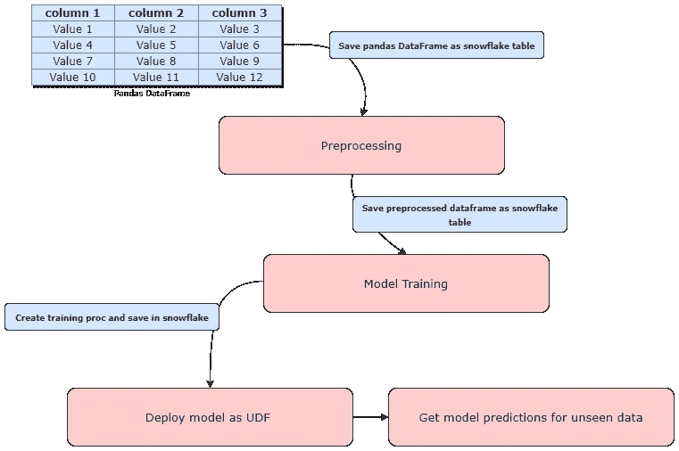
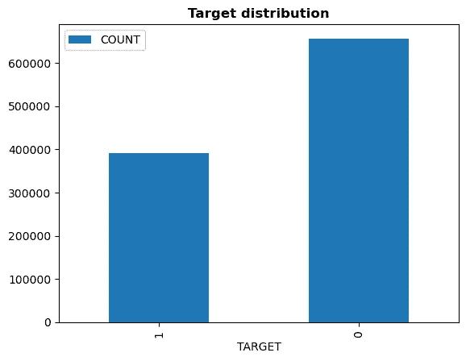
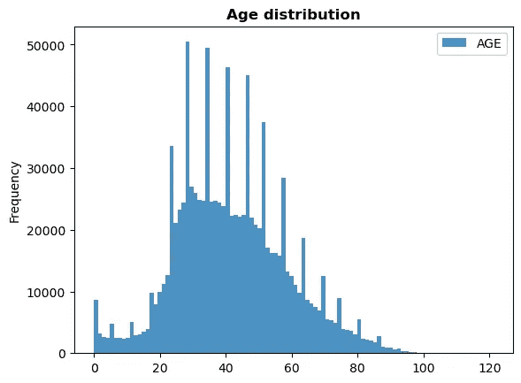
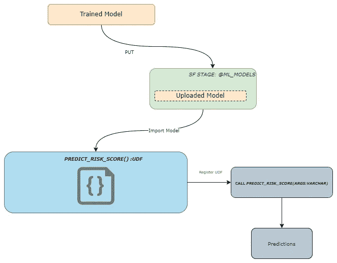
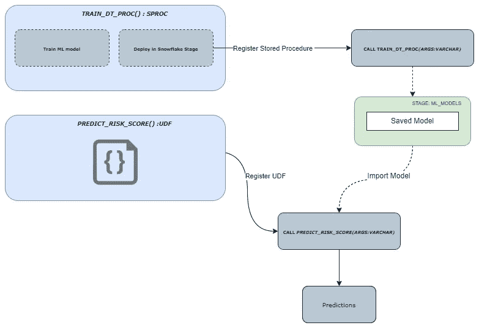
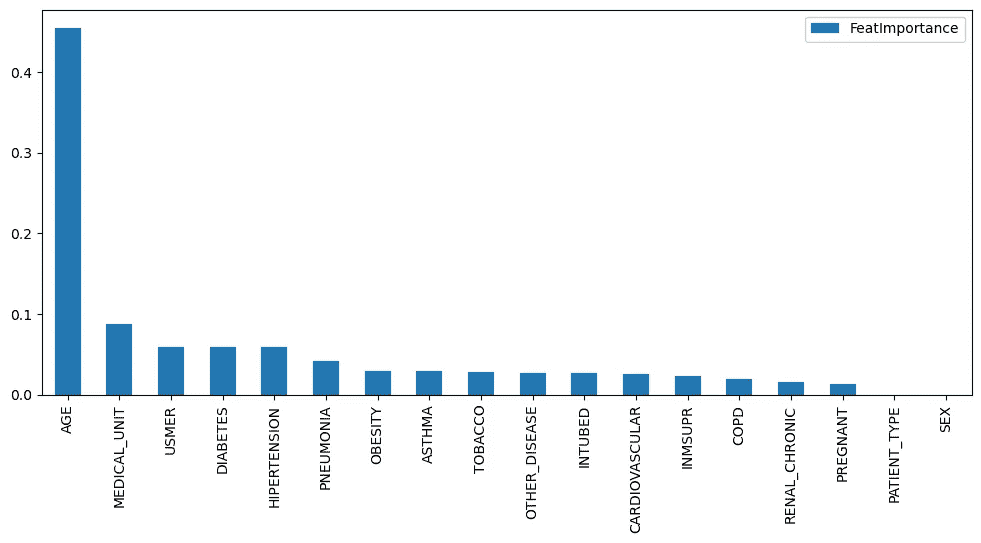

# 如何在雪花上建立机器学习模型

> 原文：<https://towardsdatascience.com/machine-learning-on-snowflake-ea6c559af2d>

## 雪花是领先的数据平台之一。在本文中，我们将探索它的 snowpark Python 库的功能


照片由 [Aaron Burden](https://unsplash.com/@aaronburden?utm_source=medium&utm_medium=referral) 在 [Unsplash](https://unsplash.com?utm_source=medium&utm_medium=referral)

在本文中，您将学习如何使用，

1.  用于原始数据预处理的 snowpark-python 功能
2.  在雪花中训练和部署机器学习模型
3.  以 pythonic 方式定义 UDF，并在雪花中部署它们



本文涵盖的主题|作者图片

如果你愿意跟随教程，你应该有一个[支持 Anaconda 集成的雪花账户](https://docs.snowflake.com/en/developer-guide/udf/python/udf-python-packages.html#using-third-party-packages-from-anaconda)。否则，你必须注册一个免费的[雪花试用账户](https://signup.snowflake.com/)，并按照这里[的描述](https://docs.snowflake.com/en/developer-guide/udf/python/udf-python-packages.html#using-third-party-packages-from-anaconda)进行配置。

乍一看，snowpark 是一个机器学习和数据科学框架，它在 Python 的灵活性中提供了 SQL 的强大功能。有时，这类似于 Apache spark 框架。然而，这为我们的机器学习和数据科学项目提供了一个普遍的框架。在尝试本文中的任何内容之前，您应该在 python 和雪花之间建立一个连接。代码示例可以参考[我的代码报告](https://github.com/Ransaka/ML-on-Snowflake)。让我们创建一个数据库连接。

```
from snowflake.snowpark.session import Session

accountname = "********" # your accountname
username = "**********" #your snowflake username
password = "*************" #snowflake password

connection_parameters = {
    "account": accountname,
    "user": username,
    "password": password,
    "role": "ACCOUNTADMIN"
}

def snowflake_connector():
    try:
        session = Session.builder.configs(connection_parameters).create()
        print("connection successful!")
    except:
        raise ValueError("error while connecting with db")
    return session

#define a session
session = snowflake_connector()
```

现在我们可以开始主要的数据预处理部分。我将在 snowpark 端做这件事，而不是用 Pandas DataFrame 进行预处理。这里我将使用[新冠肺炎](https://www.kaggle.com/datasets/meirnizri/covid19-dataset)数据集，它可以在 [CC0: Public Domain](https://creativecommons.org/publicdomain/zero/1.0/) 下的 Kaggle 中找到。我已经将该数据集作为雪花表加载。由于这不是本文的主要目标，我将跳过这一部分。您可以按照本文的 GitHub repo 中的描述加载数据集。让我们读一下表格。

```
snowpark_df = session.table("COVID19_RECORDS")

print(type(snowpark_df) # snowflake.snowpark.table.Table
print(f"Size of the table object: {(sys.getsizeof(snowpark_df)/1e6)} MB")
#'Size of the table object: 4.8e-05 MB'
```

上面的`snowpark_df`是一个惰性评估表；因此，它不会像熊猫数据帧那样消耗太多内存。但是我们可以应用任何转换聚合，就像我们对熊猫所做的那样。

```
snowpark_df.schema.fields

# [StructField('USMER', LongType(), nullable=True),
#  StructField('MEDICAL_UNIT', LongType(), nullable=True),
#  StructField('SEX', LongType(), nullable=True),
#  StructField('PATIENT_TYPE', LongType(), nullable=True),
#  StructField('DATE_DIED', StringType(), nullable=True),
#  StructField('INTUBED', LongType(), nullable=True),
#  StructField('PNEUMONIA', LongType(), nullable=True),
#  StructField('AGE', LongType(), nullable=True),
#  StructField('PREGNANT', LongType(), nullable=True),
#  StructField('DIABETES', LongType(), nullable=True),
#  StructField('COPD', LongType(), nullable=True),
#  StructField('ASTHMA', LongType(), nullable=True),
#  StructField('INMSUPR', LongType(), nullable=True),
#  StructField('HIPERTENSION', LongType(), nullable=True),
#  StructField('OTHER_DISEASE', LongType(), nullable=True),
#  StructField('CARDIOVASCULAR', LongType(), nullable=True),
#  StructField('OBESITY', LongType(), nullable=True),
#  StructField('RENAL_CHRONIC', LongType(), nullable=True),
#  StructField('TOBACCO', LongType(), nullable=True),
#  StructField('CLASIFFICATION_FINAL', LongType(), nullable=True),
#  StructField('ICU', LongType(), nullable=True)]
```

数据集中有 1，048，575 条唯一记录和 21 列。我们来做一些基本面分析。首先，让我们如下定义目标变量。根据数据集的描述，`CLASSIFICATION_FINAL`列中的 1、2、3 值代表正例，其余代表负例。让我们应用上面的逻辑定义一个名为`TARGET`的新列。等效的 SQL 逻辑将是，

```
SELECT
    "USMER",
    "MEDICAL_UNIT",
    "SEX",
    "PATIENT_TYPE",
    "DATE_DIED",
    "INTUBED",
    "PNEUMONIA",
    "AGE",
    "PREGNANT",
    "DIABETES",
    "COPD",
    "ASTHMA",
    "INMSUPR",
    "HIPERTENSION",
    "OTHER_DISEASE",
    "CARDIOVASCULAR",
    "OBESITY",
    "RENAL_CHRONIC",
    "TOBACCO",
    "CLASIFFICATION_FINAL",
    "ICU",
    CASE
        WHEN ("CLASIFFICATION_FINAL" < 4 :: INT) THEN 1 :: INT
        ELSE 0 :: INT
    END AS "TARGET"
FROM
    COVID19_RECORDS
```

因为我们正在使用 snowpark API，所以让我们用 snowpark 来创建它。

```
import snowflake.snowpark.functions as F

snowpark_df.with_column('TARGET', F.when(F.col('CLASIFFICATION_FINAL')
                        < 4, 1).otherwise(0))
```

让我们看看我们的目标分布。

```
snowpark_df\
.group_by("TARGET").count().to_pandas().set_index("TARGET")\
.plot.bar()

plt.title("Target distribution",fontweight='semibold')
plt.show()
```



目标分布|作者图片

让我们再创造一个情节。

```
snowpark_df\
.select('AGE').to_pandas()\
.plot.hist(bins=100,alpha=0.5)

plt.title("Age distribution",fontweight='semibold')
plt.show()
```



年龄分布|作者图片

让我们找出年龄变量和目标变量之间的关系。

```
snowpark_df = snowpark_df.with_column(
    "AGE_BKT",
    F.when(F.col("AGE") < 21, "YOUNG").otherwise(
        F.when(F.col("AGE") < 49, "ADULT").otherwise("OLD ADULT")
    ),
)

age_bkt_df = snowpark_df.select(
    F.col("AGE_BKT"),
    F.when((F.col("AGE_BKT")=='YOUNG') & (F.col("TARGET")==1),1).otherwise(0).as_("YOUNG_"),
    F.when((F.col("AGE_BKT")=='ADULT') & (F.col("TARGET")==1),1).otherwise(0).as_("ADULT_"),
    F.when((F.col("AGE_BKT")=='OLD ADULT') & (F.col("TARGET")==1),1).otherwise(0).as_("OLD_ADULT_")
)

age_bkt_df.group_by(F.col("AGE_BKT")).count().show()

# -----------------------
# |"AGE_BKT"  |"COUNT"  |
# -----------------------
# |OLD ADULT  |342413   |
# |ADULT      |628554   |
# |YOUNG      |77608    |
# -----------------------

age_bkt_df.select(
    ((F.sum("YOUNG_") * 100 ) / F.count("YOUNG_")).as_("YOUNG % OF CASES"),
    ((F.sum("ADULT_") * 100) / F.count("ADULT_")).as_("ADULT % OF CASES"),
    ((F.sum("OLD_ADULT_") * 100) / F.count("OLD_ADULT_")).as_("OLD_ADULT % OF CASES")
).show()

# --------------------------------------------------------------------
# |"YOUNG % OF CASES"  |"ADULT % OF CASES"  |"OLD_ADULT % OF CASES"  |
# --------------------------------------------------------------------
# |1.534463            |20.877858           |14.969745               |
# --------------------------------------------------------------------
```

完成分析后，我们可以使用以下方法将转换后的数据集保存为新的雪花表。

```
snowpark_df.write.save_as_table(
    table_name='COVID19_RECORDS_PROCESSED',
    mode='overwrite'
)
```

好了，现在我们有了预处理过的数据集。让我们开始模型训练阶段。

```
# read the table 
train_data = session.table("COVID19_RECORDS_PROCESSED")

#create the stage for storing the ML models
session.sql('CREATE OR REPLACE STAGE ML_MODELS').show()
```

我们可以使用两种不同的方法在雪花中训练和部署模型。

1.  我们可以在本地训练模型，将其上传到一个阶段，并在调用 UDF 时从该阶段加载它。
2.  我们可以定义 SPROC，它可以训练模型，并在调用 SPROC 时将训练好的模型保存到雪花阶段。这里我们需要一个独立的 UDF 用于推理部分。

在本文中，我们将探讨上述两种方法。

## 在本地训练模型，将其上载到舞台，并从舞台加载它



作者图片

首先，我们必须定义局部训练模型的函数。

```
def train_model_locally(train:snowflake.snowpark.table.Table):
    from sklearn.tree import DecisionTreeClassifier

    #convert into pd dataframes

    train = train.to_pandas()

    xtrain,ytrain = train.drop('TARGET',axis=1),train['TARGET']

    model = DecisionTreeClassifier()
    model.fit(xtrain,ytrain)

    return model

#let's train the DT model
model = train_model_locally(train_data_sf)

#save the model
import joblib
joblib.dump(model, 'predict_risk_score.joblib')

#upload into the ML_MODELS SNowfla
session.file.put(
    "predict_risk_score.joblib", "@ML_MODELS", auto_compress=False, overwrite=True
)
```

与其他机器学习管道类似，我们需要定义库依赖关系。

```
session.clear_imports()
session.clear_packages()

#Register above uploded model as import of UDF
session.add_import("@ML_MODELS/predict_risk_score.joblib")

#map packege dependancies
session.add_packages("joblib==1.1.0", "scikit-learn==1.1.1", "pandas==1.3.2")
```

让我们来定义 UDF。在 UDF 内部，它应该从舞台加载模型，然后使用它进行推理。

```
from snowflake.snowpark.types import PandasSeries, PandasDataFrame

def read_file(filename):
    import joblib
    import sys
    import os

    #where all imports located at
    import_dir = sys._xoptions.get("snowflake_import_directory")

    if import_dir:
        with open(os.path.join(import_dir, filename), 'rb') as file:
            m = joblib.load(file)
            return m

#register UDF
@F.udf(name = 'predict_risk_score', is_permanent = True, replace = True, stage_location = '@ML_MODELS')
def predict_risk_score(ds: PandasSeries[dict]) -> PandasSeries[float]:

    # later we will input train data as JSON object
    # hance, we have to convert JSON object as pandas DF
    df = pd.io.json.json_normalize(ds)[feature_cols]
    pipeline = read_file('predict_risk_score.joblib')
    return pipeline.predict_proba(df)[:,1]
```

现在我们已经成功地在雪花注册了我们的 UDF。您可以使用以下方式验证它。

```
session.sql("DESC FUNCTION PREDICT_RISK_SCORE()").show()

# ------------------------------------------------------------------------
# |"property"       |"value"                                             |
# ------------------------------------------------------------------------
# |signature        |()                                                  |
# |returns          |FLOAT                                               |
# |language         |PYTHON                                              |
# |null handling    |CALLED ON NULL INPUT                                |
# |volatility       |VOLATILE                                            |
# |body             |                                                    |
# |                 |import pickle                                       |
# |                 |                                                    |
# |                 |func = pickle.loads(bytes.fromhex('800595050400...  |
# |                 |# The following comment contains the UDF source...  |
# |                 |# import pandas as pd                               |
# |                 |# def read_file(filename):                          |
# |                 |#     import joblib                                 |
# |                 |#     import sys                                    |
# |                 |#     import os                                     |
# |                 |#                                                   |
# |                 |#     import_dir = sys._xoptions.get("snowflake...  |
# |                 |#     if import_dir:                                |
# |                 |#         with open(os.path.join(import_dir, fi...  |
# |                 |#             m = joblib.load(file)                 |
# |                 |#             return m                              |
# |                 |# @F.udf(name = 'predict_risk_score', is_perman...  |
# |                 |# def predict_risk_score(*args) -> PandasSeries...  |
# |                 |#     df = pd.DataFrame([args])                     |
# |                 |#     pipeline = read_file('predict_risk_score....  |
# |                 |#     return pipeline.predict_proba(df)[:,1]        |
# |                 |#                                                   |
# |                 |# func = predict_risk_score                         |
# |                 |#                                                   |
# |                 | *********RESULTS TRUNCATED**************           |
# ------------------------------------------------------------------------
```

让我们用 UDF 进行推理。

```
# `test_data_sf` is a fraction of `train_data`
test_data_sf.with_column(
    'PREDICTION', 
    predict_risk_score(F.object_construct('*')))\
.select("TARGET","PREDICTION").show(20)

# ---------------------------------
# |"TARGET"  |"PREDICTION"        |
# ---------------------------------
# |1         |0.8333333333333334  |
# |1         |0.0                 |
# |1         |1.0                 |
# |1         |1.0                 |
# |1         |0.3333333333333333  |
# |0         |0.0                 |
# |1         |0.4                 |
# |0         |0.5                 |
# |1         |0.421875            |
# ---------------------------------

#similary, you can use below SQL as well.

select
    target,
    predict_risk_score(object_construct(*)) as predictions
from
    COVID19_RECORDS_PROCESSED
limit
    100;
```

## 定义培训和推理过程/自定义项

此方法将创建用于定型模型的存储过程和用于推理模型的 UDF。你可以参考下面的图表获得更多的见解。



作者图片

让我们定义存储过程。首先，我们将实现 Python 函数，我们可以在后面的步骤中将其转换为雪花存储过程。

```
def train_dt_procedure(
    session: Session,
    training_table: str,
    feature_cols: list,
    target_col: str,
    model_name: str,
) -> T.Variant:

    """
    This will be our training procedure. Later we will register this as snowflake procedure.

    training_table: snowflake table name to be used for training task
    feature_cols: list of columns to be used in training
    target_col: target column to be used
    model_name: model name to used for model saving purpose

    """

    #convert as pandas DF, rest of the steps similar to the local model training and saving.
    local_training_data = session.table(training_table).to_pandas()

    from sklearn.tree import DecisionTreeClassifier

    X = local_training_data[feature_cols]
    y = local_training_data[target_col]

    model = DecisionTreeClassifier()
    model.fit(X, y)

    #do what ever you want to do with model, even the hyperparameter tuning..
    # here I'll get feature importance
    feat_importance = pd.DataFrame(
        model.feature_importances_, feature_cols, columns=["FeatImportance"]
    ).to_dict()

    from joblib import dump

    dump(model, "/tmp/" + model_name)
    session.file.put(
        "/tmp/" + model_name, "@ML_MODELS", auto_compress=False, overwrite=True
    )
    return feat_importance
```

让我们将上面的 Python 函数注册为一个存储过程。

```
sproc_train_dt_model = session.sproc.register(
                    func=train_dt_procedure, 
                    name='sproc_train_dt_model', 
                    is_permanent=True, 
                    replace=True, 
                    stage_location='@ML_MODELS', 
                    packages=[
                        'snowflake-snowpark-python',
                        'scikit-learn',
                        'joblib']
)
```

现在我们可以如下使用程序`SPROC_TRAIN_DT_MODEL()`。

```
train_data = session.table("COVID19_RECORDS_PROCESSED")

#create train and test dataframes
train_data_pd,test_data_pd = train_test_split(
                                        train_data_pd,
                                        stratify=train_data_pd['TARGET'],
                                        test_size=0.1
)

# writing as tempoary tables for mode training and inferencing part
session.write_pandas(
    train_data_pd,
    table_name="TRAIN_DATA_TMP",
    auto_create_table=True,
    table_type="temporary",
)
session.write_pandas(
    test_data_pd,
    table_name="TEST_DATA_TMP",
    auto_create_table=True,
    table_type="temporary",
)

train_data_pd = train_data.to_pandas()

feature_cols = train_data.columns
feature_cols.remove('TARGET')
target_col = 'TARGET'
model_name = 'decisiontree.model' # How model should be saved in stage

model_response = sproc_train_dt_model('TRAIN_DATA_TMP', 
                                            feature_cols, 
                                            target_col,
                                            model_name, 
                                            session=session
                                           )

print(model_response)

# {
#   "FeatImportance": {
#     "AGE": 0.4543249401305732,
#     "ASTHMA": 0.029003830541684678,
#     "CARDIOVASCULAR": 0.025649097586968667,
#     "COPD": 0.019300936592021863,
#     "DIABETES": 0.059273293874405074,
#     "HIPERTENSION": 0.05885196748765571,
#     "INMSUPR": 0.0232534703448427,
#     "INTUBED": 0.026365011429648998,
#     "MEDICAL_UNIT": 0.08804779552309593,
#     "OBESITY": 0.02991724846285235,
#     "OTHER_DISEASE": 0.026840169399286344,
#     "PATIENT_TYPE": 0,
#     "PNEUMONIA": 0.04225497414608237,
#     "PREGNANT": 0.012929499812685114,
#     "RENAL_CHRONIC": 0.015894267526361774,
#     "SEX": 0,
#     "TOBACCO": 0.028563364646896985,
#     "USMER": 0.059530132494938236
#   }
# }

#plot feature importance
feature_coefficients = pd.DataFrame(eval(model_response))

feature_coefficients\
.sort_values(by='FeatImportance',ascending=False)\
.plot\
.bar(y='FeatImportance', figsize=(12,5))
plt.show()
```



功能重要性|按作者分类的图片

我们可以把 UDF 定义如下。这个函数类似于上一个函数。

```
def udf_predict_risk_score(*args) -> float:
    import os
    import sys
    from joblib import load

    IMPORT_DIRECTORY_NAME = "snowflake_import_directory"
    import_dir = sys._xoptions[IMPORT_DIRECTORY_NAME]
    model_name = 'decisiontree.model'
    model = load(import_dir+model_name)

    #unlike previous JSON object, this will be a array, hence no need to
    # decode the input
    scored_data = model.predict(pd.DataFrame([args]))[0]

    return scored_data
```

最后，注册 UDF。

```
udf_risk_score_model = session.udf.register(
                            func=udf_predict_risk_score, 
                            name="udf_risk_score_model", 
                            stage_location='@ML_MODELS',
                            input_types=[T.FloatType()]*len(feature_cols),
                            return_type = T.FloatType(),
                            replace=True, 
                            is_permanent=True, 
                            imports=['@ML_MODELS/decisiontree.model'],
                            packages=['scikit-learn==1.1.1','pandas','joblib'], 
                            session=session
)
```

好了，是时候为我们的验证数据集进行预测了。在这里，我用雪花编辑器做它。

```
SELECT
    "TARGET",
    udf_risk_score_model(
        "USMER",
        "MEDICAL_UNIT",
        "SEX",
        "PATIENT_TYPE",
        "INTUBED",
        "PNEUMONIA",
        "AGE",
        "PREGNANT",
        "DIABETES",
        "COPD",
        "ASTHMA",
        "INMSUPR",
        "HIPERTENSION",
        "OTHER_DISEASE",
        "CARDIOVASCULAR",
        "OBESITY",
        "RENAL_CHRONIC",
        "TOBACCO"
    ) AS "PREDICTION"
FROM
    COVID19_RECORDS_PROCESSED limit 100;
```

## 结论

虽然 snowpark 为我们的机器学习任务提供了一个全面的平台，但在撰写本文时，它还有一些问题。作为一个例子，PyTorch 仍然需要一个雪地公园的支持。此外，康达仅提供精选套餐；如果我们想使用其他包，比如 catboost，我们必须手动将它们导入到我们的环境中，如这里的[所述](https://docs.snowflake.com/en/developer-guide/snowpark/python/creating-udfs.html#reading-files-from-a-udf)。

感谢阅读！在 [LinkedIn](https://www.linkedin.com/in/ransaka/) 上与我联系。