# 使用 Ploomber、PyCaret 和 MLFlow 的机器学习管道

> 原文：<https://towardsdatascience.com/machine-learning-pipeline-with-ploomber-pycaret-and-mlflow-db6e76ee8a10>

## 用于训练和推理的端到端机器学习管道


照片由[迈克·本纳](https://unsplash.com/@mbenna?utm_source=medium&utm_medium=referral)在 [Unsplash](https://unsplash.com?utm_source=medium&utm_medium=referral) 上拍摄

# 介绍

机器学习流水线由自动化机器学习工作流的一系列步骤组成。机器学习管道中的常见步骤包括数据收集、数据清洗、特征工程、模型训练、模型评估。在本文中，我们将研究如何使用 Ploomber、Pycaret 和 MLFlow 创建机器学习管道，用于模型训练和批量推理。让我们来看看这些工具各自的功能。

**目录**

*   [简介](https://medium.com/p/db6e76ee8a10/#eeb3)
*   [机器学习管道](https://medium.com/p/db6e76ee8a10/#4a8f)
    - [设置环境](https://medium.com/p/db6e76ee8a10/#11b5)
    - [MLFlow 服务器](https://medium.com/p/db6e76ee8a10/#33f0)
    - [训练管道](https://medium.com/p/db6e76ee8a10/#e6a6)
    - [运行训练管道](https://medium.com/p/db6e76ee8a10/#6c59)
    - [服务管道](https://medium.com/p/db6e76ee8a10/#07ac)
    - [批量推理](https://medium.com/p/db6e76ee8a10/#4614)
*   [结论](https://medium.com/p/db6e76ee8a10/#c42a)

**砰然一声**

Ploomber[1]是一个开源框架，用于使用 python 脚本、函数或 Jupyter 笔记本的集合来构建模块化的数据管道。假设我们有多台 Jupyter 笔记本，每台都有不同的用途，例如数据清理、特征工程、模型训练和模型评估。Ploomber 帮助根据用户定义的`pipeline.yaml`文件将所有这些笔记本连接成一系列步骤。下面显示了一个 Ploomber 管道的例子。`visualize`和`train`任务依赖于`clean`任务。

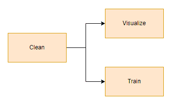

管道插图。作者图片

这就是对应的`pipeline.yaml`。`product`是任务的输出，可以作为后续任务的输入(`upstream`)。例如，`visualize`任务依赖于`clean`任务的产品，因此`clean`任务是`visualize`任务的`upsteam`。

```
# pipeline.yamltasks:
  - source: tasks/clean_data.ipynb
    name: clean
    product:
      nb: products/clean_train_data.ipynb
      data: products/cleaned_train_data.csv
		... - source: tasks/visualize_data.ipynb
    name: visualize
    upstream: ['clean']
    product:
      nb: products/visualize_data.ipynb
		... - source: tasks/train_model.ipynb
    name: train
    upstream: ['clean']
    product:
      nb: products/train_model.ipynb
		...
```

**MLFlow**

MLFlow[2]是一个管理 ML 生命周期的开源平台，包括实验、可复制性、部署和中央模型注册。MLFlow 提供 4 种不同的组件:

1.  **MLFlow Tracking:** 记录和查询实验:代码、数据、配置和结果
2.  **MLFlow 项目:**将数据科学代码打包成可在任何平台上运行的格式
3.  **MLFlow 模型:**在不同的服务环境中部署机器学习模型
4.  **模型注册:**在中央存储库中存储、注释、发现和管理模型

我们将使用 MLFlow 跟踪功能来记录机器学习实验的参数、结果和工件。它允许在本地或远程跟踪服务器上记录实验，用户可以从图形用户界面查看实验。

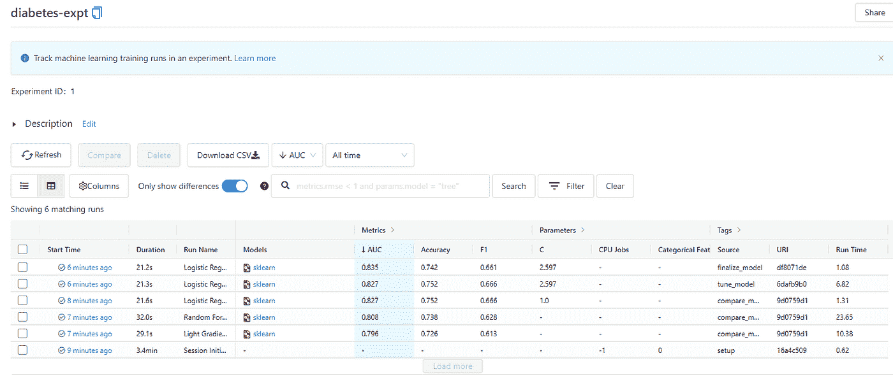

MLFlow UI。图片作者。

**PyCaret**

PyCaret[3]是一个用 python 编写的开源、低代码自动机器学习(AutoML)库。PyCaret 通过自动化数据预处理、超参数优化、叠加、混合和模型评估等步骤，帮助简化模型训练过程。PyCaret 与 MLFlow 集成，并自动将运行的参数、指标和工件记录到 MLFlow 服务器上。

# 机器学习管道

现在我们已经了解了每个工具的作用，如果你还没有猜到，我们将使用 Pandas 清理数据，使用 PyCaret 训练模型，使用 MLFlow 记录我们的实验，整个管道将由 Ploomber 协调。

让我们来看一个例子。我们将使用美国国家糖尿病、消化和肾脏疾病研究所的 Pima 印度糖尿病数据集[4]。数据集的目的是基于数据集中包含的某些诊断测量结果，诊断性地预测患者是否患有糖尿病。从一个较大的数据库中选择这些实例有几个限制。特别是，这里的所有患者都是至少 21 岁的皮马印第安血统的女性。数据集由几个医学预测变量和一个二元目标变量`Outcome`组成。预测变量包括患者的怀孕次数、身体质量指数、胰岛素水平、年龄等。我们将数据分成两组，分别命名为`diabetes_train.csv`和`diabetes_test.csv`，用于开发我们的训练管道和测试服务管道。

## 设置环境

此示例需要一个 IDE(例如，VSCode、Jupyter Notebook 等)和命令行界面。我使用的是 Windows 11、VSCode 和 VSCode 中的终端，但是你可以自由使用任何你选择的操作系统、IDE 和命令行界面。

**康达环境**

确保您的机器上安装了 miniconda3。从命令行界面创建 python 3.7 conda 环境。环境名是任意的，我将其命名为`general`。

```
#command line 
conda create -n general python=3.7
```

激活康达环境。我们将在这种环境下进行所有的开发工作。

```
#command line
conda activate general
```

安装必要的软件包

```
#command line
pip install ploomber
pip install pycaret
pip install mlflow
pip install pandas
```

**项目目录结构**

让我们设置项目目录结构。Ploomber 提供命令行来创建一个准系统项目目录结构。

```
# command line
ploomber scaffold sample-ml --empty
```

Ploomber 用一个空的`pipeline.yaml`文件创建了一个名为`sample-ml`的新文件夹。让我们修改项目目录结构，以更好地满足我们的需求。

```
# command line
cd sample-ml
mkdir tasks # add folder
mkdir mlflow # add folder
mkdir input_data # add folder
rmdir /s exploratory # remove folder created by ploomber
```

这是修改后目录的样子。

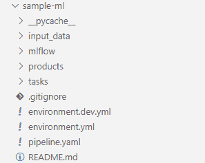

作者图片

*   `tasks`:包含要执行的 Jupyter 笔记本
*   `products`:存储已执行的 Jupyter 笔记本、中间和最终输出
*   `mlflow`:存储使用 MLFlow 记录的参数、结果和工件
*   `input_data`:存储原始数据

## MLFlow 服务器

让我们在本地主机上启动一个 MLFlow 跟踪服务器来记录实验。

```
#command line
cd sample-ml/mlflow
mlflow server --backend-store-uri sqlite:///expt.db --default-artifact-root "file:\\My Drive\\Data-Science\\Projects\\ploomber\\sample-ml\\mlflow\\ml-artifacts"
```

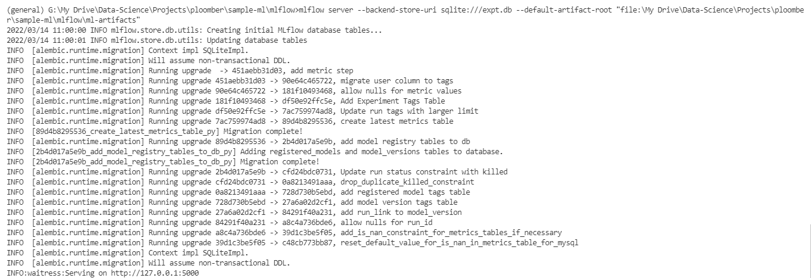

作者图片

*   `backend-store-uri`:将实验和运行数据保存到的 URI。为此，我们使用了 SQLite 数据库。
*   `default-artifact-root`:为任何新创建的实验存储工件的目录

MLFlow 服务器可以通过 [http://127.0.0.1:5000](http://127.0.0.1:5000) 访问。

## 培训渠道

**定义 pipeline.yaml**

Ploomber 管道是一个包含任务和任务间关系的`.yaml`文件。让我们在`pipeline.yaml`文件中定义我们的培训管道。

```
# pipeline.yaml
meta:
  extract_upstream: Falsetasks:
  - source: tasks/clean_data.ipynb
    name: clean
    product:
      nb: products/clean_train_data.ipynb
      data: products/cleaned_train_data.csv
    params:
      input_path: '{{root}}\\input_data\\diabetes_train.csv' - source: tasks/visualize_data.ipynb
    name: visualize
    upstream: ['clean']
    product:
      nb: products/visualize_data.ipynb - source: tasks/train_model.ipynb
    name: train
    upstream: ['clean']
    product:
      nb: products/train_model.ipynb
      config: products/config.pkl
    params:
      mlflow_tracking_uri: <http://127.0.0.1:5000>
      experiment_name: 'diabetes-expt'
      train_size: 0.8
      fix_imbalance: True
      numeric_imputation: median
      include_models: ['rf', 'lightgbm', 'lr']
```

我们在管道中定义了 3 个任务，分别名为`clean`、`visualize`和`train`。对于每项任务，我们定义了以下内容:

*   `source`:我们打算运行的 Jupyter 笔记本(`.ipynb`)或 python 脚本(`.py`)的路径
*   `name`:任务名称
*   `upstream`:上游任务名称。这就告诉了我们笔记本之间的依赖关系。例如，`visualize`任务将`clean`任务作为其上游，表示`visualize`任务需要来自`clean`任务的输出。
*   `product`:任务生成的输出(如果有)。每台笔记本可以有多种产品。例如，在`clean_data.ipynb`中我们有两个产品:(1) `nb`:被执行的`clean_data.ipynb`的副本的路径。该笔记本副本将包含 Jupyter 笔记本单元的输出。(2) `data`:由`clean_data.ipynb`输出的中间数据的路径
*   `params`是执行时传递给 Jupyter 笔记本的参数

`{{root}}`占位符是指`pipeline.yaml`文件所在的目录路径。

**创建笔记本**

现在我们已经定义了管道，让我们为 3 个任务创建 Jupyter 笔记本。

```
# command line
ploomber scaffold
```

我们再次使用了`ploomber scaffold`，但是 Ploomber 没有使用空的`pipeline.yaml`文件创建项目目录结构，而是读取现有的`pipeline.yaml`文件并创建缺失的 Jupyter 笔记本。现在在`tasks`文件夹中有 3 个新的 Jupyter 笔记本。

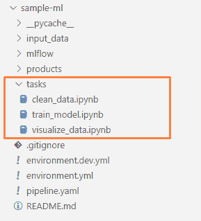

作者图片

下图显示了 Ploomber 创建的`clean_data.ipynb`笔记本。`upstream`和`product`变量当前设置为`None`。

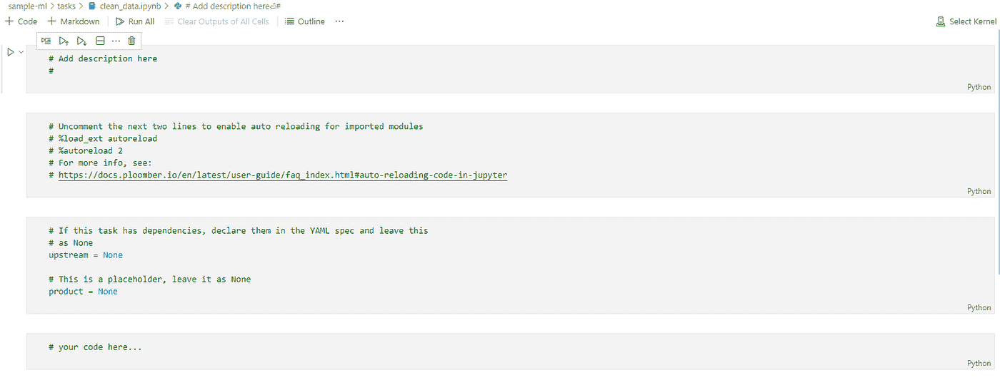

作者图片

我们之前已经在`pipeline.yaml`中定义了`upstream`和`product`信息。让我们使用细胞注射将信息转移到 Jupyter 笔记本中。

```
# command line
ploomber nb --inject
```

Ploomber 基于带有单元注入的`pipeline.yaml`文件，帮助填充每个笔记本的输入(即上游)和输出(即产品)路径。一个新的“参数”单元格被注入到笔记本中，其中包含我们之前定义的`product`和`upstream`信息。前 3 个单元格没有用，我们可以删除它们。

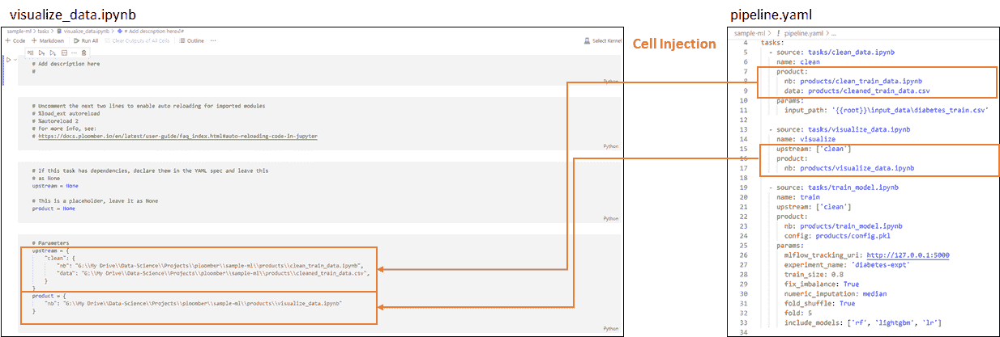

作者图片

现在我们已经设置了参数，让我们进入每个笔记本的实际代码。

`**clean_data.ipynb**`

本笔记本包含基本的清洁步骤。为了简化示例，我们在本笔记本中只有一个数据清理步骤。我们在选定的列中找到“0”值，并用“NaN”替换它。缺少的值将由 PyCaret 中的数据转换管道处理。

```
import pandas as pd
import numpy as npdf = pd.read_csv(input_path, sep = ',')# replace zeros in the following columns with NaN
df[['Glucose','BloodPressure','SkinThickness','Insulin','BMI']] = df[['Glucose','BloodPressure','SkinThickness','Insulin','BMI']].replace(0,np.NaN)df.to_csv(product['data'], index = False)
```

这是笔记本现在的样子。

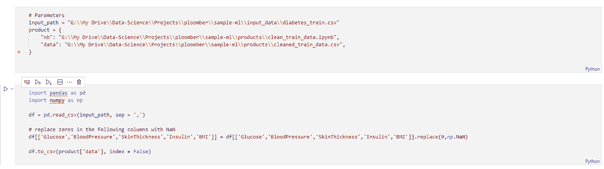

作者图片

我们使用注入参数单元中的`input_path`和`product`来分别确定原始输入数据和干净训练数据的路径。

`**train.ipynb**`

此笔记本使用 PyCaret 训练模型，并将参数、结果和工件记录到 MLFlow 服务器。这是笔记本注射细胞后的样子。

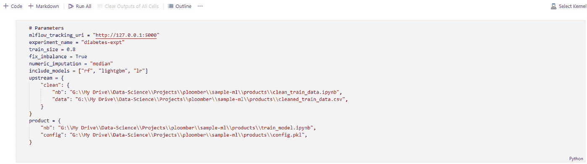

作者图片

我们在后续单元格中执行以下步骤:

1.  导入包
2.  设置 MLFlow 跟踪 URI
3.  读取`clean_data.ipynb`输出的清除数据
4.  为培训设置 PyCaret
5.  保存 PyCaret 安装配置
6.  培训、调整和最终确定模型

```
from pycaret.classification import *
import pandas as pd
import mlflow# set the mlflow tracking uri
mlflow.set_tracking_uri(mlflow_tracking_uri)# read the cleaned data
df = pd.read_csv(upstream['clean']['data'])# setup pycaretnumeric_features = ['Pregnancies', 'Glucose', 'BloodPressure', 'SkinThickness', 'Insulin', 'BMI', 'DiabetesPedigreeFunction', 'Age']clf = setup(data=df,
            target='Outcome',
            train_size = train_size,
            fold_shuffle = fold_shuffle,
            fold = fold,
            html = False,
            silent = True,
            numeric_features = numeric_features,
            experiment_name = experiment_name,
            log_experiment = True,
            fix_imbalance = fix_imbalance,
            numeric_imputation = numeric_imputation,
            session_id=1)# save setup configuration
save_config(product['config'])
mlflow.log_artifact(product['config'])
```

下面是 PyCaret `setup`中使用的参数的简要说明:

*   `data`:训练数据框
*   `target`:目标变量的列名
*   `train_size`定义了用于训练的训练数据帧的比率。其余的将用作维持集。
*   `shuffle_fold`:设置为真，进行交叉验证时混洗数据
*   `html`:设置为假，防止监视器运行时显示
*   `silent`:设置为真，跳过输入数据类型的确认
*   `experiment_name` : MLFlow 实验名称
*   `log_experiment`:设置为 True，将度量、参数和工件记录到 MLFlow 服务器
*   `fix_imbalance`:设置为 True，平衡目标类的分布。默认情况下，应用 SMOTE 为少数类创建合成数据点
*   `numeric_imputation`:数值的插补方法，如平均值、中值或零
*   `session_id`:控制实验的随机性。用于生成可重复的实验

PyCaret 的`compare_models`函数使用交叉验证来训练和评估模型库中所有可用估计器的性能，并输出一个带有平均交叉验证分数的分数网格。这些估计器在它们的默认超参数上被训练，在这个阶段没有超参数调整。

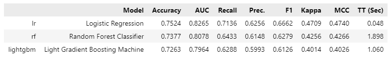

作者图片

参数:

*   `include_models`:训练和评估模型的选择列表。请注意，我们已经使用细胞注射将此参数从`pipeline.yaml`传递到笔记本中。
*   `sort`:根据选择的指标对输出结果进行排序
*   `n_select`:选择要返回的前 n 个型号

我们将`n_select`定义为 1，因此只选择基于 AUC 的最佳模型。

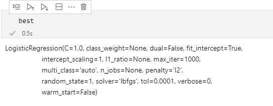

作者图片

接下来，我们使用`tune_model`对逻辑回归模型进行超参数调整，选择基于 AUC 的最佳表现模型，并最终确定模型。Pycaret 的`finalize_model`函数在包括维持集在内的整个数据集上训练给定的估计器。

```
final_model = finalize_model(tune_model(best, choose_better = True, optimize = 'AUC'))
```

`**visualize.ipynb**`

在本笔记本中，我们使用 pandas-profiling[5]对清理后的数据进行基本的探索性描述性分析。

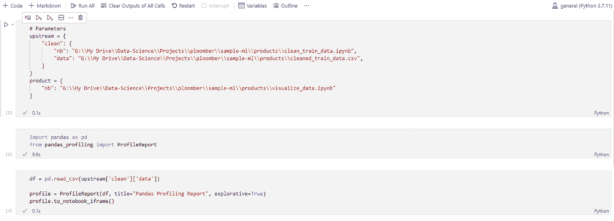

作者图片

在执行 Ploomber 管道之后，我们可以在由 product[' nb ']【T16]给出的文件路径中查看已执行的笔记本，其中填充了 pandas 分析结果。

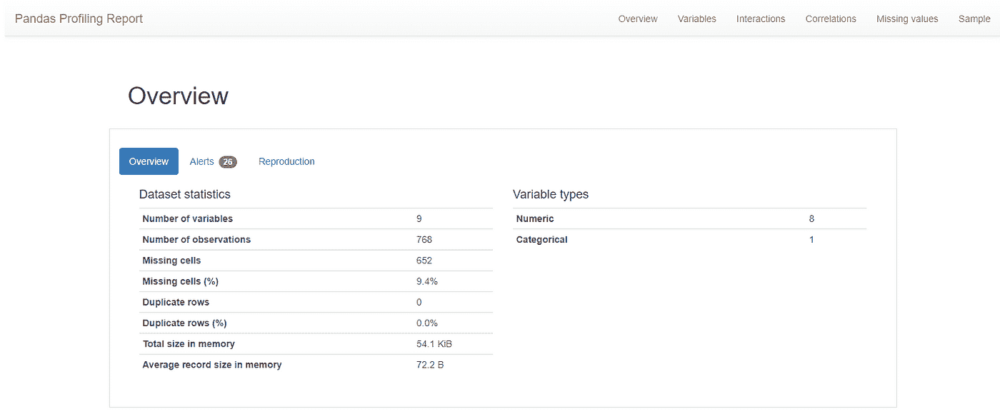

作者图片

**可视化管道**

让我们想象一下管道的样子。

```
# command line
ploomber plot
```

此功能对于检查复杂的管线非常有用。

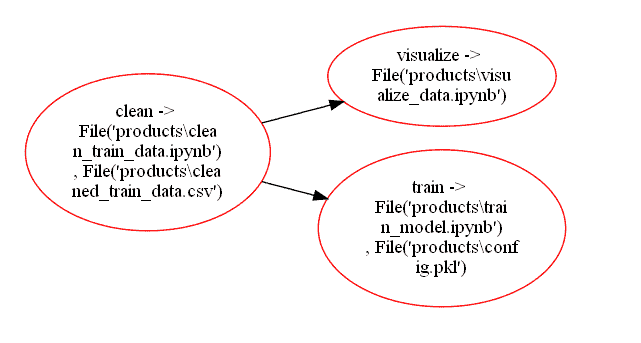

作者图片

## 运行培训管道

让我们执行培训管道。

```
# command line
ploomber build#OR
ploomber build -e pipeline.yaml
```

默认情况下，Ploomber 寻找`pipeline.yaml`文件作为入口点，因此显式定义入口点是可选的。这是成功运行后的终端输出。

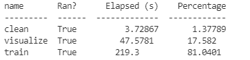

PyCaret 自动将结果记录到 MLFlow 中，并可在`http://127.0.0.1:5000`通过 MLFlow UI 查看。


作者图片

请注意，本文的目的是演示 Ploomber、Pycaret 和 MLFlow 的使用，因此我们不会花费额外的精力来获得更好的模型结果。让我们选择使用 PyCaret 的`finalize_model`训练的模型。记下`model.pkl`文件的路径，我们稍后将需要这个文件用于服务管道。

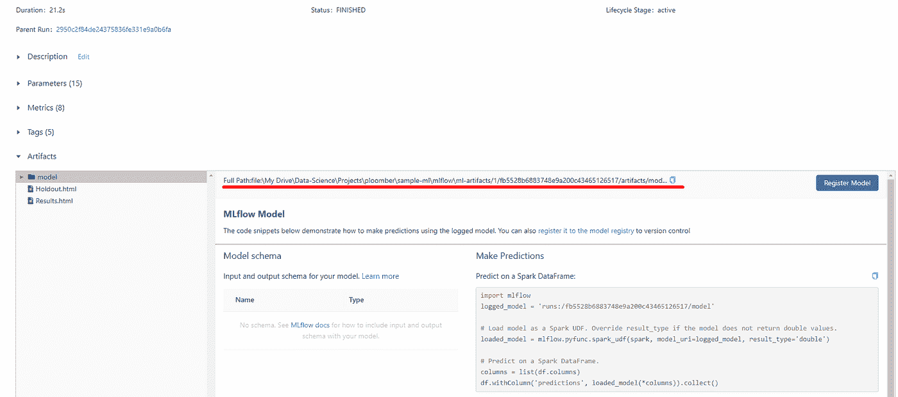

作者图片

## 服务管道

服务管道用于对新的未知数据进行预测。为了避免训练-服务-偏斜，看不见的数据应该经过与训练数据相同的数据处理步骤。我们可以通过修改`upstream`和`product`来重复使用`clean_data.ipynb`笔记本。我们还需要另一个笔记本`serve_model.ipynb`来对看不见的数据进行预测。

为服务管道创建`pipeline.serve.yaml`。

```
# pipeline.serve.yamlmeta:
  extract_upstream: Falsetasks:
  - source: tasks/clean_data.ipynb
    name: clean
    product:
      nb: products/clean_serve_data.ipynb
      data: products/cleaned_serve_data.csv
    params:
      input_path: '{{root}}\\input_data\\diabetes_test.csv' - source: tasks/serve_model.ipynb
    name: serve
    upstream: ['clean']
    product:
      nb: products/serve_model.ipynb
      data: products/predict_data.csv
    params:
      model_path: '{{root}}\\mlflow\\ml-artifacts\\1\\fb5528b6883748e9a200c43465126517\\artifacts\\model\\model'
```

类似于我们在培训管道中创建笔记本的方式，从我们使用的`pipeline.serve.yaml`中创建笔记本

```
# command line
ploomber scaffold -e pipeline.serve.yaml
```

记得说明入口点，否则将使用默认的`pipeline.yaml`入口点。接下来，我们使用以下方法将参数注入笔记本

```
ploomber nb --inject -e pipeline.serve.yaml
```

除了上述细胞注射命令引起的参数变化外，`clean_data.ipynb`不需要进一步的代码变化。

`**serve_model.ipynb**`

笔记本电脑执行以下操作:

1.  加载已清理的不可见数据
2.  从 MLFlow 加载模型
3.  对已清理的不可见数据运行预测
4.  将预测保存到 csv 文件中

单元注入创建了一个包含所需参数的附加单元

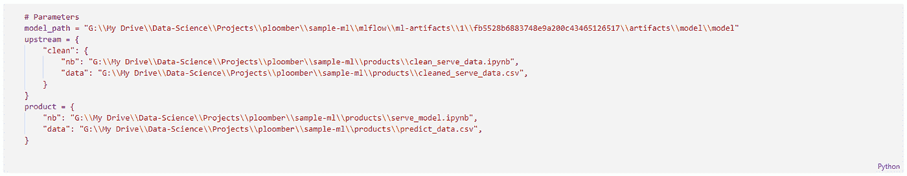

作者图片

下面是主要的服务代码

```
# import packages
import pandas as pd
import mlflow
from pycaret.classification import *# load data
df = pd.read_csv(upstream['clean']['data'])# load model
loaded_model = load_model(model_path)# predict
df_result = predict_model(loaded_model, data = df, raw_score=True)# save results
df_result.to_csv(product['data'], index = False)
```

## 批量推断

使用服务管道对新数据集运行批量推断

```
# command line
ploomber build -e pipeline.serve.yaml
```

在每个`ploomber build`期间，Ploomber 会复制一份已执行的笔记本，并将其存储为产品。我们可以在`products/serve_model.ipynb`中查看笔记本及其电池输出。我们来看看`df_result` DataFrame。`Label`、`Score_0`和`Score_1`列是 PyCaret 附加到输入数据帧的预测结果。

*   `Label`:预测类，0 或 1
*   `Score_0`:类 0 的概率
*   `Score_1`:第一类的概率

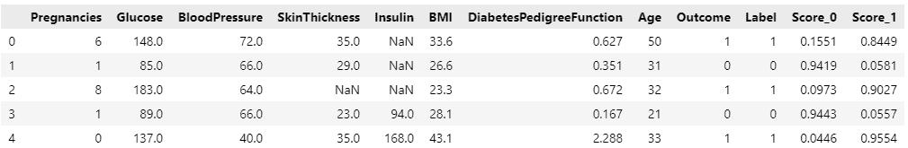

作者图片

# 结论

在本文中，我们研究了如何集成三个开源包——Ploomber、Pycaret 和 MLFlow，以构建机器学习训练和批量推理管道。Ploomber 使我们能够将管道构建为代码，这省去了直接在笔记本中编辑参数的麻烦，并允许使用 Git 对管道进行版本控制。PyCaret 通过简化预处理、训练和评估过程实现了快速实验，而 MLFlow 跟踪则确保了我们机器学习实验的高重现性。这些工具还有很多，请在下面的参考资料部分查看它们各自的文档。

*   [加入灵媒](https://medium.com/@edwin.tan/membership)阅读更多这样的故事
*   [关注我](https://medium.com/@edwin.tan)获取更多类似的帖子

# 参考

[1] [爆炸头](https://docs.ploomber.io/en/latest/get-started/basic-concepts.html)

[2] [MLFlow](https://mlflow.org/)

[3] [PyCaret](https://pycaret.gitbook.io/docs/)

[4] [皮马印第安人糖尿病数据集](https://www.kaggle.com/uciml/pima-indians-diabetes-database)，特许 CC0 公共领域

[5] [熊猫简介](https://github.com/ydataai/pandas-profiling)