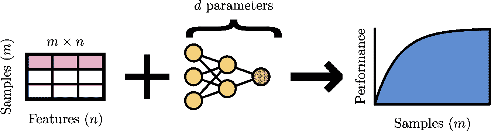
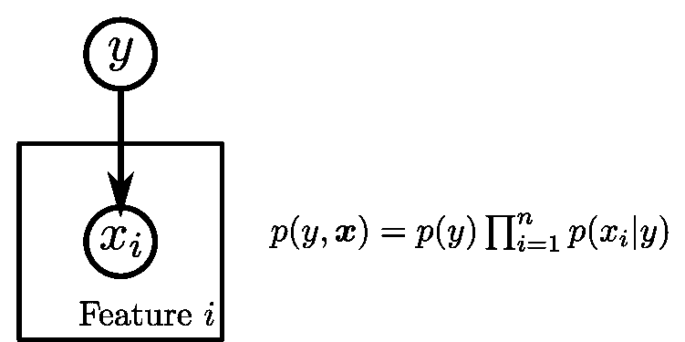
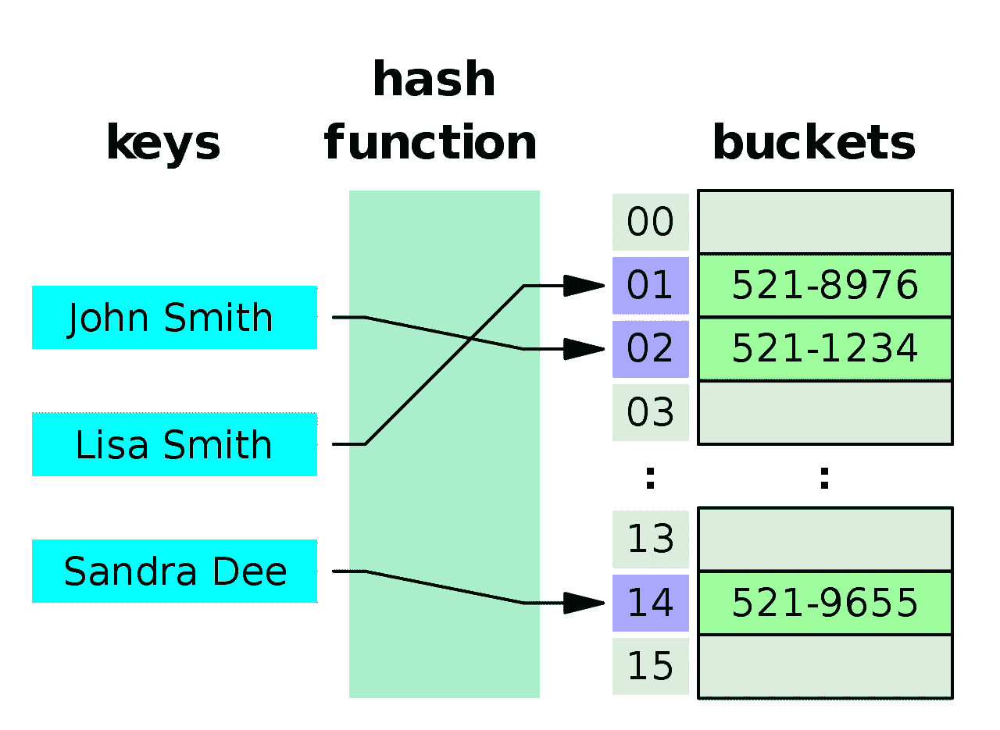

# 机器学习的经验法则

> 原文：<https://towardsdatascience.com/machine-learning-rules-of-thumb-b50232b4b2f8>

## 给你的模型一个好的起点的一些可靠的指导方针

可悲的是，机器学习项目的成功并不能得到保证。因此，您从一个快速而肮脏的实现开始。首先出现的问题之一是“我需要多少数据”？问任何一个机器学习从业者，他们都会告诉你:“看情况”。他们是对的！谈到机器学习，没有放之四海而皆准的真理。它既是一门科学，也是一门艺术。然而，我确实发现，对于机器学习的大多数方面来说，有一些经验法则往往是很好的起点。在这里，我试着收集了一些常见的规则。

# 多少数据？

图 1:模型性能与收集的样本的数量和质量、特征的数量和效用以及模型的容量相关联。图片作者。

样本数量( *m* )、特征( *n* )、模型参数( *d* )构成了机器学习的神圣三位一体。大多数经验法则在很大程度上可以回到这个三元组(图 1)。让我们仔细看看。

## 多少样品？

性能通常与 log *m，*成比例，其中 *m* 是样本数(图 1)，通常由标签中的噪声从上方限制。因此，当训练数据被人类标记时，该界限通常对应于人类水平的表现。因此，关注数据质量而非数量可能是有用的，正如以数据为中心的人工智能运动所建议的那样。

一般来说，回归比分类需要更多的样本[1]。具体来说，给定 *n* 个输入特征和 *C* 个类别进行分类，建议至少有[1]

*m*≥10*n*C

样品。用于回归

*m* ≥ 50 *n，*

建议提供样品。

# 多少参数？

回想一下你的线性代数课，要解一个有 *d* 个自由度的线性系统，你需要 *d* 个约束。对于线性回归，每个样本都是一个约束。因此，要确定 *d* 的参数，你需要*至少*一样多的样本——否则你的系统被称为[欠定](https://en.wikipedia.org/wiki/Underdetermined_system)。更一般地，通过将模型的参数解释为自由度，一个常见的启发是十倍超定系统

*d* ≤ *m/* 10，

尽管也建议了神经网络的更保守的界限，例如*d*≤*m*/50【2】。反过来，确定了参数的数量后， *d，*可以帮助您决定是否需要减少特征的数量， *n，*。

然而，需要谨慎，因为对于许多模型，例如概率图形模型，约束条件的数量可以是 *O* ( *n* )并且与样本大小 *m* 无关。

# 哪个型号？

## 结构数据

图 2:表示为概率图形模型的朴素贝叶斯。节点表示分布，箭头表示条件依赖。特征周围的标牌指示该关系被复制(在本例中为 *n* 次)并由 *i* 索引。图片作者。

*   小数据集(20 ≤ *m* ≤ 10 ): [朴素贝叶斯](https://scikit-learn.org/stable/modules/naive_bayes.html)，[弹性网](https://scikit-learn.org/stable/modules/linear_model.html#elastic-net)

当样本不足时，使用具有较大归纳偏差的可解释模型。具体来说，当[校准](https://en.wikipedia.org/wiki/Calibration_(statistics))是一个问题时，进行逻辑回归。否则，它的生成对应朴素贝叶斯[3，4]是一个很好的候选(图 2)。(关于它们等价性的讨论，见参考文献。)。[3]).在小数据范围内，后者优于前者[5]。这里的直觉是，强加额外的严格模型假设会减少模型系数的方差。弹性网络(或者，对权重同时使用₁和₂惩罚的线性回归)以类似的方式工作，*事实上*编码了对稀疏和收缩系数的偏好。

*   中间数据集(10 ≤ *m* ≤ 10⁴): [梯度增强树](https://catboost.ai/)

Kaggle 竞赛让我们了解到，梯度增强树的用途非常广泛，在许多真实生活、嘈杂的数据集上都能很好地工作。对于较大的数据集，相对于较简单的模型，更灵活的梯度增强树可以从数据中榨取更多的汁液，但代价是可检查性。幸运的是，可解释人工智能的进步(例如， [SHAP](https://github.com/slundberg/shap) )使得这些以前的黑箱模型变得相当容易理解和询问。

*   大型数据集(10⁴ ≤ *m* ):神经网络

正如人工智能的大多数进展所证明的那样，大型训练语料库与神经网络的结合是天作之合。训练与数据集的大小成线性比例(即，对于给定的一组权重，∧*m*)，使得神经网络特别适合于大型数据集。此外，TensorFlow 和 PyTorch 已经使神经网络变得惊人地快速和容易地跨多台机器扩展。

## 非结构化数据

当数据集由图像、文本或音频等非结构化数据组成时，建议您利用现有的预训练模型。为了微调一个图像分类器，你可能只需要每类 *m* = 10 个样本。你可以浏览[模型动物园](https://modelzoo.co/)或 [TensorFlow Hub](https://tfhub.dev/) 寻找符合你需求的预训练模型。或者，也有无代码云服务，如亚马逊的 [SageMaker](https://aws.amazon.com/sagemaker/) 或谷歌的 [Vertex AI](https://cloud.google.com/vertex-ai) 来帮你做所有繁重的工作。

# 规范化程度如何？

帮助你的模型在训练集之外一般化的一个方法是对你的模型的重量大小进行惩罚。这就是所谓的正规化。两个受欢迎的惩罚是曼哈顿规范(或₁规范)，以城市命名，因为距离类似于沿着矩形街道网格行进，以及“标准”欧几里得规范(或₂规范)。

进行正则化时，验证所有*特征是否通过标准化等手段缩放至一阶(无量纲)。这确保了惩罚同等地影响所有权重。球园估计可以通过研究两个线性回归案例得到，这两个案例可以以封闭形式求解，即[拉索](https://scikit-learn.org/stable/modules/generated/sklearn.linear_model.Lasso.html)(即 *L* ₁正则化*λ*₁|***w***|₁权重 ***w*** )和[岭型](https://scikit-learn.org/stable/modules/generated/sklearn.linear_model.Ridge.html)回归( *L* ₂正则化 *λ* ₂| **当特征集中且不相关时，它们的解可以用非专利解[a，b]来表示。套索剪切(或截断)所有低于 *λ* ₁ [a]的未设定系数。因此，合理的起点可以是 *λ* ₁ = 0.1。另一方面，Ridge 只会将它们的大小缩小到零[b]。要选择λ₂，你可能要考虑你的系统在多大程度上是超定的。一个警告:scikit-learn 为他们的目标使用了稍微不同的约定(参见[脊](https://scikit-learn.org/stable/modules/generated/sklearn.linear_model.Ridge.html)与[套索](https://scikit-learn.org/stable/modules/generated/sklearn.linear_model.Lasso.html#sklearn.linear_model.Lasso)中的 1/(2 *m* )因子)。***

# 多少个哈希桶？

图 3:散列技巧的图示，其中通过计算散列将项目分配给桶。图片由 Jorge Stolfi 拍摄，从维基百科的[散列表](https://en.wikipedia.org/wiki/Hash_table)文章中获得，版权归 [CC BY-SA 3.0](https://creativecommons.org/licenses/by-sa/3.0/) 所有。

哈希技巧通过基于项目的哈希生成新的索引来对项目进行分组(图 3)。例如，英语包含*n*= 60 万个单词[6]，我们可能希望在训练之前将其缩减到固定的大小*n*↦*n’*。此外，当我们说话的时候，新的词汇正在被发明出来。).这给上菜带来了问题，因为这些新单词不是训练集的一部分。特征散列以保真度为代价解决了这两个问题。保真度由哈希冲突的数量控制，而哈希冲突的数量又由哈希桶 *n* 的数量决定。为了解决词汇外的项目，建议采取[1]

*n* ' = *n* /5，

哈希桶。当目标是减少词汇量时，我还没有找到一个好的启发式方法。然而，选择 *n* 散列桶使得模型的大小 *d ≤ m/10* 似乎是一个合理的猜测。

# 我嵌入的大小？

在神经网络中，嵌入层将稀疏向量——主要包含零——压缩成一个小的密集表示。考虑将一个独热编码的单词——除了单词的索引之外，所有条目都是零——转换成单词嵌入。但是我应该将我的高基数输入数据压缩到什么程度呢？给定一个要嵌入的类别列表，我遇到了以下两种选择嵌入大小的启发法。即平方根标度[1]

*d* ₑ = 1.6 √ *q，*

或取第四个根[7]

d ₑ = ∜ *q* 。

# 讨论

[没有免费的午餐定理](https://en.wikipedia.org/wiki/No_free_lunch_theorem)告诉我们，机器学习没有灵丹妙药。因此，这些经验法则必然是错多于对。然而，它们可能是针对特定数据集进行估计的良好起点。超参数调整和交叉验证可以帮助您找到数据集的最佳点。

正如您已经注意到的，这篇文档远非详尽无遗。例如，我们还没有触及到训练神经网络的所有超参数。为此，我推荐杰夫·马卡卢索的优秀[深度学习清单](https://jeffmacaluso.github.io/post/DeepLearningRulesOfThumb/)。

我很想知道你的启发。请在评论中留下你的建议来扩充这个收藏。

# 承认

我要感谢 [Rik Huijzer](https://huijzer.xyz/) 发起这篇文章的讨论和校对。

# 脚注

[a]:假设特征集中且不相关。设 **w*** 为无正则化线性回归的最大似然估计。拉索回归(线性回归用 *L* ₁正则化 *λ* ₁| ***w*** |₁为权数 ***w*** )解原来是[3]

***w***= SGN(***w****)relu(***w****-***λ*₁)**

**其中 sgn( *x* )是 *x* 的符号，ReLU( *x* )是整流后的线性单位。**

**[b]:像在[a]中一样，假设特征是集中的和不相关的，并且 **w*** 是非正则解。对于[脊](https://scikit-learn.org/stable/modules/generated/sklearn.linear_model.Ridge.html)回归(线性回归用 *L* ₂正则化*λ*₂|***w***|₂的权重 ***w*** )权重缩小它们的大小【3】**

*****w***=***w****/(1+λ₂)，**

**走向零。**

# **参考**

**[1]:瓦利亚帕·拉克什马南、萨拉·罗宾逊和迈克尔·穆恩。*机器学习设计模式*。奥莱利媒体，2020。**

**[2]: Ahmad Alwosheel、Sander van Cranenburgh 和 Caspar G. Chorus。“你的数据集够大吗？使用人工神经网络进行离散选择分析时的样本大小要求。”*选择建模杂志*28(2018):167–182。**

**[3]:凯文·p·墨菲，*概率机器学习:导论*。麻省理工学院出版社，2022 年。**

**[4]:达芙妮·柯勒和尼尔·弗里德曼。*概率图形模型:原理与技术*。麻省理工学院出版社，2009 年。**

**[5]:吴恩达和迈克尔·乔丹。"区别性与生成性量词的比较:逻辑回归和朴素贝叶斯."*神经信息处理系统进展* 14 (2001)。**

**[6]:[https://en . Wikipedia . org/wiki/List _ of _ dictionary _ by _ number _ of _ words](https://en.wikipedia.org/wiki/List_of_dictionaries_by_number_of_words)**

**[7]:[https://developers . Google blog . com/2017/11/introducing-tensor flow-feature-columns . html](https://developers.googleblog.com/2017/11/introducing-tensorflow-feature-columns.html)**