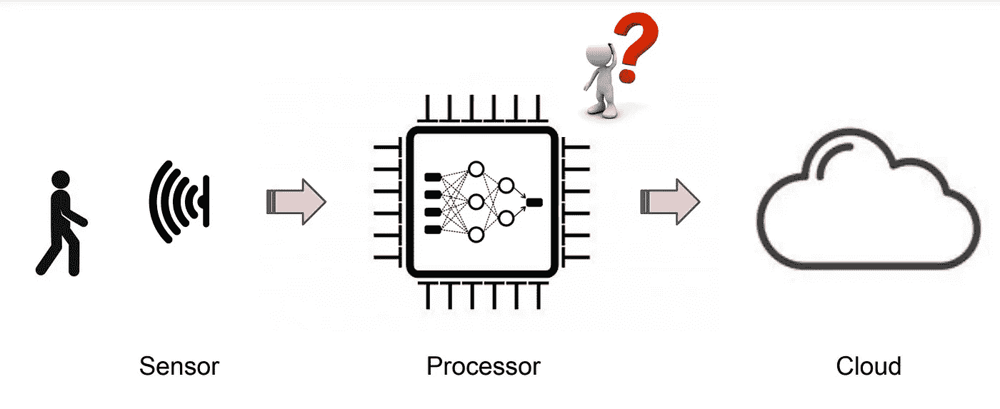
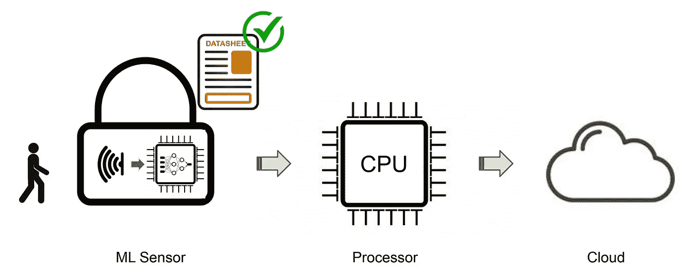
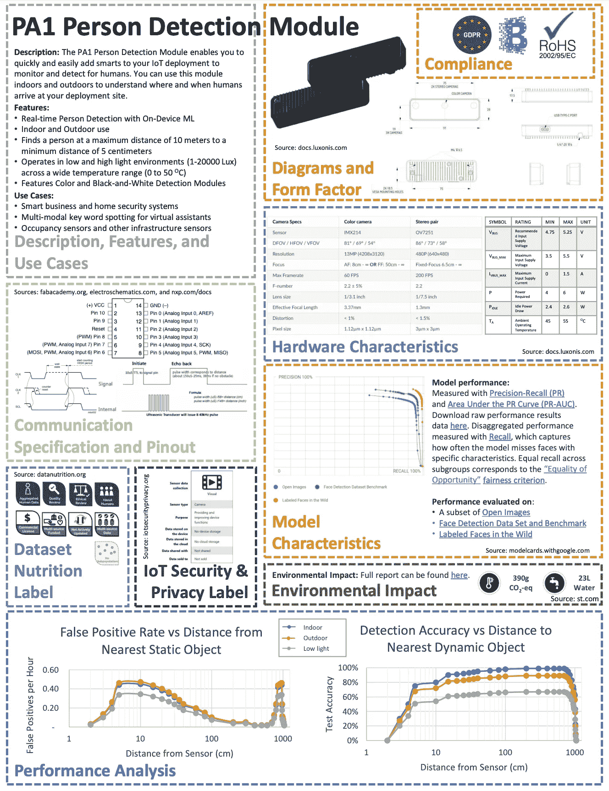

# 机器学习传感器:真正以数据为中心的人工智能

> 原文：<https://towardsdatascience.com/machine-learning-sensors-truly-data-centric-ai-8f6b9904633a>

## 在边缘设备上嵌入机器学习智能的新方法

> “矛盾的是，数据是人工智能最被低估和去美化的方面”——谷歌研究作者“ [***数据在高风险人工智能***](https://storage.googleapis.com/pub-tools-public-publication-data/pdf/0d556e45afc54afeb2eb6b51a9bc1827b9961ff4.pdf) ***”***
> 
> “数据是人工智能的食物”——吴恩达，加州大学伯克利分校教授，以数据为中心的人工智能哲学的先驱。

在 ML 传感器中，ML 模型与物理传感器紧密耦合。

近年来，机器学习已经出现了向更小和更大模型的分叉。具有数千亿个参数的大规模语言模型正在定期发布，并且没有性能饱和的迹象，我们可以期待看到这种趋势继续下去。

另一方面，[微型机器学习](/tiny-machine-learning-the-next-ai-revolution-495c26463868) (TinyML)领域——在资源受限的微控制器上部署机器学习模型——也开始占据一席之地。TinyML 的商业应用已经存在，从智能手机中的关键字识别(例如，“嘿 Siri”和“OK Google”)到控制智能照明、HVAC 和安全系统的人员检测。

这种分歧体现了以计算为中心和以数据为中心的人工智能的竞争哲学。虽然内置在云端的大规模模型体现了以计算为中心的人工智能的极端，但以数据为中心的人工智能迄今为止一直受到传统系统架构的限制。将这一理念发挥到极致，我们需要将计算能力直接放在生成数据的地方。进入机器学习传感器。

## ML 传感器

ML 传感器范式的灵感来自 Andrej Karpathy 的“[软件 2.0](https://karpathy.medium.com/software-2-0-a64152b37c35) ”概念——我们目前熟悉的定义明确、基于规则的软件(被描述为软件 1.0)向更“智能”的软件的转变，这些软件以更难解释的方式编码，例如在神经网络的权重中。

同样，我们可以想象现有的嵌入式 ML 硬件实例体现了“传感器 1.0”或“嵌入式 ML 1.0”范式，将传感器数据传递给 CPU 进行模型处理。相比之下，ML 传感器范例体现了“传感器 2.0”或“嵌入式 ML 2.0”，其中处理发生在传感器本身，只有更高级别的和已经处理的信息被发送到 CPU。

在此基础上，ML 传感器可以定义为:

> “ML 传感器是一个独立的系统，
> 通过观察物理世界中一些复杂的
> 现象，利用设备上的机器学习来提取有用的信息，并通过一个简单的接口将其报告
> 给更广泛的系统。”

根据上述定义，这与物联网设备的不同之处在于，设备不需要连接到互联网，而是使用 ML on-device 来代替云处理。这也不同于与 TinyML 一起配置的标准传感器，因为处理直接发生在传感器上，如下所示。

比较(上图)更传统的传感器 1.0 模式和(下图)ML 传感器(传感器 2.0)模式。ML 模型与物理传感器紧密耦合，与 ML 传感器中的应用处理器分离。

这种区别似乎微不足道，不重要，但是这种方法有几个实际的好处。

**无摩擦界面。**ML 传感器的首要目标是从最终用户那里提取 ML 细节。从硬件的角度来看，人们不需要成为 ML 方面的专家来构建包含它的设备。通过提高抽象级别，也减少了非专家将 AI 纳入现有硬件系统的摩擦。如果需要任何定制，例如定制面部识别算法以仅识别您的面部而不识别其他人的面部，它应该不需要用户加载 Python 环境并执行模型训练或转移学习。

**自成一体，模块化。**ML 传感器中的硬件和软件必须是独立的和模块化的。想象一下，去商店买一个“人体探测器”模块，就像你可能会买一个红外线或温度传感器一样。这种模块化使它们可以轻松集成到电子设备中，而不需要任何 ML 领域的专业知识。

**隐私和安全。**与更传统的工作流程相比，ML 传感器可提供更强大的隐私和安全保障因为敏感信息无需离开设备。虽然这最明显地应用于视频和音频数据，但是原则上，这可以应用于任何传感器数据。

**可组合性。**通常，当工程师设计和构建一个系统时，他们需要以特定的方式组合传感器来解决更具体的问题，例如控制车辆的运动。ML 传感器的模块化特性允许类似地实现这一点。更重要的是，ML 传感器可以与传统的非 ML 传感器以及其他 ML 传感器相结合，以创建增强的应用解决方案。

作为可组合性的一个例子，想象一个简单的场景，我们想要创建一个智能门系统，只为房子的主人打开前门。该系统需要(1)系统知道何时有人在门口的方法，(2)系统知道门口的人是否是主人的方法，以及(3)解除门锁的方法。

第一个挑战可以通过使用人体探测器“芯片”来解决这种输出可以与第二个“芯片”结合，进行面部识别。对于像这样的常见组合应用，这些模型可以折叠到单个 ML 传感器中，构建人检测模型，并从开源训练集(如[视觉唤醒词数据集](https://arxiv.org/abs/1906.05721))闪存到设备中。类似地，面部识别模型可以使用通过少数镜头学习定制的模型来训练。该传感器可以集成到标准电子锁系统中，m1 传感器的输出与锁机构相互作用。

上述方法的好处是(1)架构师不需要知道任何关于机器学习的知识来构建系统，因为 ML 方面是从用户那里抽象出来的，(2)我们使用传感器的**可组合性**来创建一个更具体的问题的解决方案，而不仅仅是“人的检测”，以及(3)我们的数据不需要去任何地方，这意味着系统是**隐私保护的**，并带来最小的安全风险。此外，从**可扩展性**的角度来看，如果数以千计的智能门配置了 ML 传感器，那么配置它们要比手动为每个门设置计算环境容易得多。

## 数据表

传统传感器都有数据表，比如[这个](https://www.belimo.com/mam/Datasheets/en-gb/belimo_22UTH-53_datasheet_en-gb.pdf)。ML 传感器应提供类似的数据表。为什么？当有人购买传感器时，他们主要想知道它是否适用于他们的特定应用——如果你知道温度传感器会在水的沸点以下融化，你不会为你的水壶购买温度传感器，对吗？

这对于 ML 传感器来说没有什么不同。对于人员探测器，我们希望确保传感器能够在部署它的物理环境中工作。这可能需要考虑影响模型的特征，例如照明环境或人与传感器的距离。然而，它可能还需要考虑硬件特性，如工作温度、功耗和每秒推断次数。

借鉴传感器界的智慧，ML 传感器包含包含这些硬件和模型特性的数据手册是有意义的。通过这种方式，潜在的最终用户可以审查这对于他们的应用是否有意义，并且还可以获得关于设备性能的一些保证。由于增加了透明度，这还可以提高对基础模型的信任，特别是如果数据是由第三方实体验证的，并且有其他认证或认可。

下面是一个人体探测器模块的 ML 传感器数据表示例。请注意，这包括在传统传感器数据手册中看到的部分，以及概述 ML 模型性能、端到端性能分析和明确阐述隐私、道德和环境考虑因素的附加部分。

ML 传感器数据手册的示例。顶部是当前标准数据手册中的内容:描述、特性、使用案例、原理图和外形尺寸、硬件特性、通信规格和引脚排列。在底部，我们有需要包含在 ML 传感器数据手册中的新项目:ML 模型特征、数据集营养标签、环境影响分析和端到端性能分析。虽然我们将数据手册压缩为一页的说明性示例，综合了各种来源的特性和数据，但在实际的数据手册中，我们假设每一部分都会更长，并包含额外的说明文字，以增加器件对最终用户的透明度。

## **生态系统**

人们可以将 ML 传感器生态系统想象为闭源、开源或两者的混合。这些方法各有利弊。类似于 ML 和其他软件的开源开发如何从根本上改变了软件生态系统，围绕 ML 传感器的开源生态系统可能会加快 ML 传感器的步伐和创新。

与 TensorFlow 和 Keras 等大型开源 ML 项目类似，人们可以想象一个类似的生态系统，为最普遍的应用(如人员检测和关键字识别)构建强大的 ML 传感器。这种方法将允许数据的众包，并可以利用社区的专业知识，同时还确保最终的模型和设备是公开可用的，从而拓宽了 ML 资源的整体可访问性。

然而，真正开放的方法可能会将 ML 传感器的效用限制在最普遍的应用中，因为公司提供自己的解决方案的经济激励很少。闭源解决方案也不理想，因为它会通过付费墙限制可访问性，并且由于有限的专业知识和对数据的访问，解决方案可能不是最理想的。

也许最突出的方法是半透明的。这样，公司可以通过其 ML 传感器数据表提供保证，并向用户提供足够的信息，如验证数据集，以探测和验证模型声明，而无需发布 ML 传感器的全部知识产权，如模型架构和完整的训练数据集。这种方法将在激励最普遍应用的开源解决方案、为公司提供自己的解决方案提供经济激励以及促进公司和最终用户之间的信任之间实现平衡。

## 摘要

与任何方法一样，这种模式也不是没有问题。传统的 ML 问题仍然存在，例如模型偏差，敌对攻击的可能性，以及我们设备功能的可解释性和可解释性的降低。ML 传感器也有可能被恶意利用，例如用于武器或压制言论自由。也就是说，增加 ML 在硬件应用中的可用性所带来的净影响有望是积极的，特别是如果个人在设计和开发 ML 传感器时考虑了适当的道德因素。

正如电气工程从电磁学发展而来，化学工程从化学发展而来，ML 传感器标志着 ML 从研究领域到与电气工程紧密交织的成熟(原型)工程学科的旅程中的天然垫脚石。虽然还不清楚该领域将如何继续发展，但我预计它将以某种方式融入 ML 传感器的理念。

截至撰写本文时，还没有人构建出一个功能性的 ML 传感器，但考虑到这种设计方法的实用性，这很可能只是一个时间问题。你可以在我们发布在 ArXiv 上的“ [*机器学习传感器*](https://arxiv.org/abs/2206.03266) ”论文中更深入地了解这个概念，并在 MLSensors.org了解更多关于我们的最新更新。

 [## GitHub -哈佛-edge/ML-传感器

### 该存储库包含与 ML 传感器相关的资源，ML 传感器是一种新的边缘设备范例，它将传感器…

github.com](https://github.com/harvard-edge/ML-Sensors)  [## 机器学习传感器

### 机器学习传感器代表了嵌入式机器学习应用未来的范式转变。当前…

mlsensors.org](http://mlsensors.org) 

本文包含的所有图片均由作者提供。