# Kafka、Debezium 和 BentoML 的机器学习流

> 原文：<https://towardsdatascience.com/machine-learning-streaming-with-kafka-debezium-and-bentoml-c5f3996afe8f>

## 使用现代数据相关工具创建实时价格推荐系统


照片由[EJ·斯特拉特](https://unsplash.com/@xoforoct?utm_source=medium&utm_medium=referral)在 [Unsplash](https://unsplash.com?utm_source=medium&utm_medium=referral) 上拍摄

# 介绍

最近，GitHub 宣布了预期的(也是有争议的)Copilot，这是一个能够生成和建议代码片段的人工智能，具有相当好的性能。

然而，Copilot 令人印象深刻的不仅是它的建议能力——这在科学论文中已经实现了——而且主要是因为它是一款[优秀产品](https://bdtechtalks.com/2022/07/05/github-copilot-large-language-model-product-management/)(我也是从用户的角度来说的)，能够通过简单的文本编辑器扩展同时为数百万开发者提供实时预测。

随着机器学习技术的成熟，不仅要了解人工智能模型如何工作以及如何提高它们的性能，还要了解如何将它们投入生产并与其他系统集成的技术部分，这变得越来越重要。

为了练习“人工智能基础设施”的这一部分，在这篇文章中，我们将模拟一个真实的情况(或几乎真实的情况)，在这种情况下，将有必要将机器学习模型与“生产”数据库相集成，以便随着新记录的增加而进行实时预测。

也许这篇文章有点长，所以卷起你的袖子和我一起做这个项目吧。

# 问题是

假设我们有一个卖车平台，用户可以在那里注册并公布他们的车辆。随着新车注册(在数据库中)，应用程序应该建议(使用我们的机器学习模型)车辆的价格。当然，这个应用程序需要实时运行，这样用户才能快速收到适当的反馈。

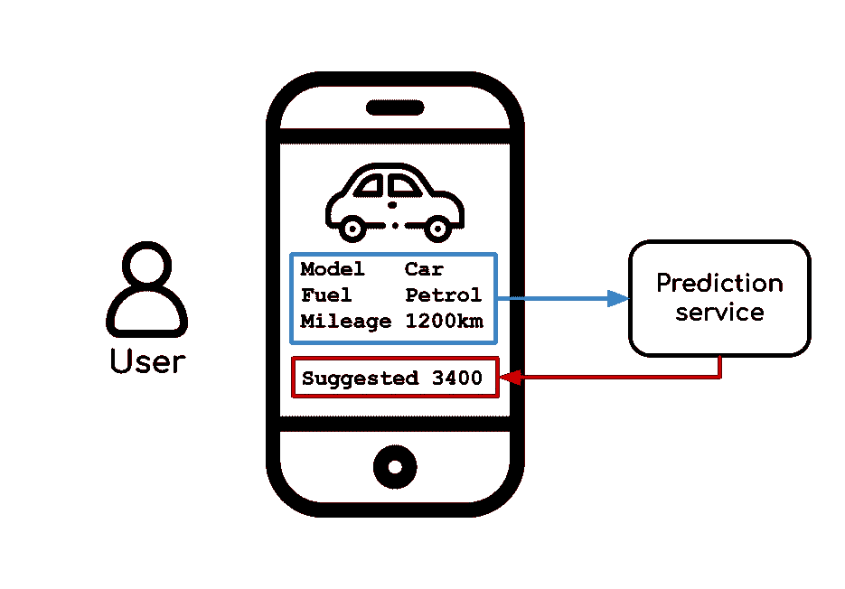

提议的应用程序。图片作者。弗里皮克的图标。

为了模拟数据，我们将使用 Kaggle 的 [**福特二手车列表**](https://www.kaggle.com/datasets/mysarahmadbhat/ford-used-car-listing) 数据集，该数据集包含超过 15k 辆汽车的销售价格及其各自的属性(燃料类型、里程、型号等)。

我之前在数据集上做了一些实验，发现了一个足够好的模型，(完整代码将在 GitHub 上提供)，所以让我们跳过数据分析/数据科学部分，专注于我们的主要目标——让应用程序工作。

# 提议的架构

为了解决我们的问题，我们将需要以下东西:一种检测新条目何时添加到数据库的方法(更改数据捕获)，一种读取这些条目并使用机器学习模型预测价格的应用程序，以及一种将这些条目写回原始数据库(带有价格)的方法，所有这些都是实时的。

幸运的是，我们不必重新发明轮子。下面几节中介绍的工具对我们帮助很大，只需要很少(或者根本不需要)代码。

## CDC 与 Debezium & Kafka

变更数据捕获，或简称为 CDC，是监视和跟踪数据库中的变更的行为。您可以将 CDC 视为数据八卦，每次数据库内部发生一些事情时，CDC 工具都会监听并与它的“朋友”共享消息。

例如，如果将条目(joo，21)添加到表 *neighbors，*中，该工具将发出类似这样的声音:{ ' added ':{ ' name ':' joo '，' age':21，' id':214}}。

这对于许多应用程序非常有用，因为捕获的更改可以用于许多任务，如数据库同步、数据处理和机器学习，这就是我们的情况。

Debezium 是一个专注于 CDC 的开源工具。它的工作原理是读取数据库(在本例中称为源)日志，并将检测到的更改转换为标准化的结构化消息，格式为 AVRO 或 JSON，因此另一个应用程序可以使用它，而不用担心谁是源。

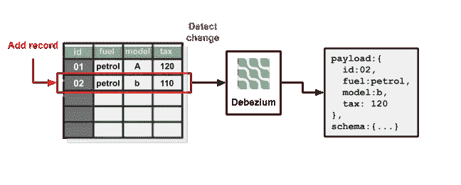

来源 CDC 与 Debezium。图片作者。弗里皮克的图标。

它也可以用另一种方式来完成，通过接收描述变更的标准化消息，并将其反映到数据库中(在这种情况下称为 sink)。

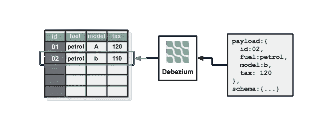

用 Debezium 吸收 CDC。图片作者。弗里皮克的图标。

Debezium 建立在 Apache Kafka 的基础上，Apache Kafka 是一个著名的开源*分布式事件流工具*，被许多大公司使用，如优步和网飞，每天移动千兆字节的数据。由于在数据移动方面的巨大可扩展性， [Kafka 拥有巨大的潜力来帮助生产中的机器学习模型](https://www.kai-waehner.de/blog/2020/10/27/streaming-machine-learning-kafka-native-model-server-deployment-rpc-embedded-streams/)。

对于这个项目，我们不需要了解很多关于卡夫卡的知识，只需要了解它的基本概念。在 Kafka 中，我们有一个主题结构，包含由生产者编写并由消费者阅读的信息(字面上只是一串字节)。后两者可以是任何能够与 Kafka 连接的应用程序。

它已被证明是一个大规模应用程序的优秀工具，这肯定不是我们这个简单项目的情况，但它在使用中的简单性支付了任何额外的开销(在这个项目中)。

这就是我们的数据是如何移动的:当 Debezium 被配置为观察我们数据库中的某个表时，它会将检测到的变化转换为标准化的消息，将它们序列化为字节，然后将它们发送到 Kafka 主题。

然后，另一个应用程序可以连接到该主题，并根据需要使用数据。

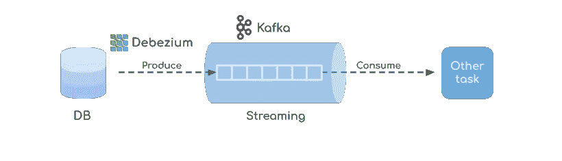

数据移动。图片作者。弗里皮克的图标。

## BentoML

BentoML 是一个服务于 ML 模型的开源框架。它允许我们用一个简单的 python 库对我们的机器学习模型进行版本控制和部署。

这是一个非常好的工具，尤其是如果您来自数据科学领域，并且从未从 Jupyter 笔记本的“快乐领域”脱下模型进入“生产”世界。

著名的用于机器学习的 python 库要么没有为模型服务的方法，因为他们认为这超出了范围，要么当他们有它时，它不那么容易使用。正因为如此，许多项目依赖于通过用 FastAPI 或 Flask 构建的 API 来交付他们的模型，这很好，但不是最佳的。

在我看来，BentoML 非常好地缩小了模型训练和部署之间的差距。

我们将在接下来的章节中了解更多。

## 将一切连接在一起

现在我们知道了，至少是表面上知道了，所使用的工具，你可能已经知道我们将如何解决这个问题。

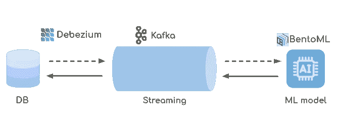

提议的架构。图片作者。弗里皮克的图标。

我们将有一个 Debezium 实例监视我们的数据库，将检测到的每一个变化传输到 Kafka 主题。另一方面，python 应用程序使用消息并将它们重定向到 BentoML 服务，后者返回预测价格。然后，python 应用程序将记录与它们的预测价格结合起来，并将它们写回到另一个 Kafka 主题。最后，Debezium 实例也在关注这个主题，它读取消息并将它们保存回数据库。

好吧，这是很多步骤，但不要害怕，我保证做这一切的代码非常简单。

为了便于理解，让我们在上面的图像上做一个 x 光，看看我们的生物(建筑)的一些内部器官(组件)。


建议的建筑 X 射线。图片作者。弗里皮克的图标。

我们需要做的就是创建数据库，配置 Debezium 连接器(源和宿)并使用 Python 部署我们的机器学习模型。

# 实施

我会尽量简短，完整的详细代码将在 GitHub 上。

## 环境

首先要做的是配置环境，您所需要的是:

1.  包含以下包的 Python 环境:

```
numpy
pandas
scikit-learn==1.1.2
xgboost==1.6.1
bentoml
pydantic
```

用于训练和部署机器学习模型。

2.Docker 和 docker-compose。

所有的基础设施都是使用容器构建的。此外，我们将使用 Postgres 作为我们的数据库。

仅此而已👍

## 配置 Postgres

Postgres 的配置非常简单，我们只需要创建一个表来存储汽车数据，并设置配置 wal_level=logical。

在 Postgres 中创建表的 SQL 脚本。

因此，Postgres Dockerfile 文件是这样的:

> wal_level=logical 是 Postgres 正确使用 Debezium 所需的配置。

## 配置 Debezium 和 Kafka 连接器

开始使用 Kafka 和 Debezium(使用 Docker)很简单，只需要正确配置图像和连接器。这个项目中使用的 docker-compose 和 Dockerfile 是基于官方库中 Debezium 的一个例子。

> 注意:我隐藏了一些行以使这个代码块更短，请查看 GitHub 上的完整代码。

Debezium Dockerfile 配置了 Kafka Connect 和 Postgres 的驱动程序。

有了这个 docker-compose 文件，我们就可以配置 Debezium 了。要启动容器，请在终端中键入:

```
docker-compose up --build
```

在一些初始配置(和大量日志)之后，容器应该可以正确启动。现在你可以在 **localhost:8083** 上打开你的浏览器。

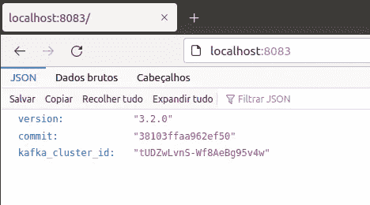

本地主机:8083。图片作者。

这是 Debezium 的 API 的基本端点，所有的配置都发生在这里。例如，如果我们移动到**localhost:8083/connector-plugins/**，就可以看到所有可用于创建连接器的插件。

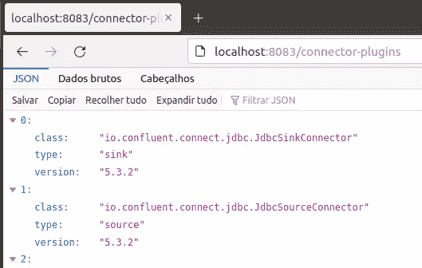

localhost:8083/连接器插件。图片作者。

为了创建一个新的数据库连接器，我们需要向端点**/连接器**发送一个 POST 请求，其中包含连接器的配置。如前所述，有两种类型的连接器，源连接器从数据库中检索更改并将其传输到 Kafka，接收器连接器从 Kafka 读取消息并将其反映到数据库。

让我们为 Postgres 数据库创建源连接器，看看它是如何工作的。

我们只需要传递数据库地址和凭证、连接器类(端点 **/connector-plugins/** 中可用的一个)以及我们想要捕获的表。

> 你可以在这篇文章中了解更多关于这些连接器和配置的信息。

现在，Debezium 将创建一个名为*car _ database . public . car _ data*的 Kafka 主题，并开始对其进行流式修改。

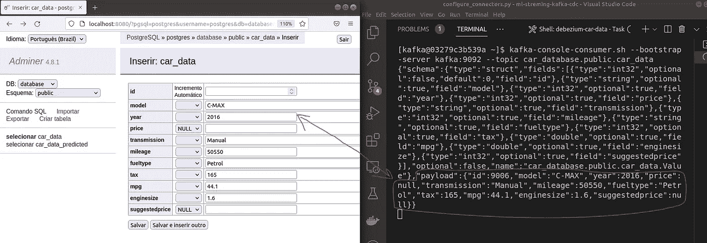

流向卡夫卡的记录示例。图片作者。

在上面的图片中，在左边，我们可以看到我添加到数据库中的条目，在右边，是在 Kafka 上创建的消息。消息是用 AVRO 写的，[可以理解为一个 JSON，分为“payload”和“schema”](https://www.confluent.io/blog/avro-kafka-data/)。

接收器连接器的配置遵循相同的逻辑，但是在这种情况下，我们还需要为我们的主题命名。Debezium 将使用主题的标题自动创建 sink 表(如果它不存在),根据发送的第一条消息推断列。

这就是为什么我们不需要在 Postgres 中创建第二个表:它将由 Debezium 自动生成。

## 用 BentoML 部署我们的模型

接下来要做的就是用 BentoML 部署我们的机器学习模型。这是通过三个步骤实现的:保存我们的模型，构建一个便当，并将其转换为 Docker 容器。

保存一个模型与保存任何文件没有太大的不同，您只需给它一个名称，并使用 save_model 函数将它保存在磁盘上。

BentoML 提供了许多功能来[监控和版本化保存的模型](https://docs.bentoml.org/en/latest/concepts/model.html)，这些都是值得检查的。

有了保存的模型，我们可以构建一个服务来部署它。

训练好的模型作为*跑步者*被加载，这是 BentoML 用来表示模型的一种特殊类型的对象。[runner 用于创建一个*服务*对象](https://docs.bentoml.org/en/latest/concepts/service.html)，并使用它定义 **/ *预测*** 端点，负责接收记录并返回其预测价格。

在部署我们的模型之前要做的最后一件事是定义一个 **bentofile** ，BentoML 使用这个特殊的配置文件来描述部署环境。

然后，通过运行下面的命令，[我们用我们的名为**Ford _ price _ predictor:1 . 0 . 0**的服务创建一个 Docker 映像](https://docs.bentoml.org/en/latest/concepts/deploy.html#containerize-bentos)。

```
bentoml build --version 1.0.0
bentoml containerize ford_price_predictor:1.0.0
```

最后，我们可以启动服务的容器实例。

```
docker run -p 3000:3000 ford_price_predictor:1.0.0
```

并通过访问 **localhost:3000** 与之交互。

## 连接流和模型

现在，我们已经构建了管道的两个主要部分，剩下的就是连接它们，这将使用 python 脚本来实现。

一方面，Debezium 将数据流式传输到 Kafka 主题*car _ database . public . car _ data*，并等待 *car_data_predicted* 中的消息。另一方面，BentoML 服务被部署并等待端点上的预测**/预测**。

为了连接到 Kafka，我们将使用 *confluent_kafka* 包，并且为了连接到部署的模型，*请求*包。

接下来，我们定义 Kafka 主题和便当服务 URL。
*URL 不是 localhost，因为这个脚本将在另一个容器中运行。*

然后，为源主题创建一个 Kafka 消费者，为接收器主题创建一个生产者。

消费者从源主题中一次检索一条消息。然后，从每条消息中只提取进行预测所需的字段。

消息通过 POST 请求发送到机器学习模型，该请求返回预测价格。

最后，预测价格被添加到原始消息中，以便生产者可以将其发送到接收器主题。

Debezium 将读取这个新消息，并在数据库中创建相应的记录。

我们可以收工了！

## 看到它工作

终于到了看到我们的项目工作的时候了:)

不幸的是，我没有一个花哨的应用程序来测试我们的管道，所以我们将通过直接与数据库交互来完成。

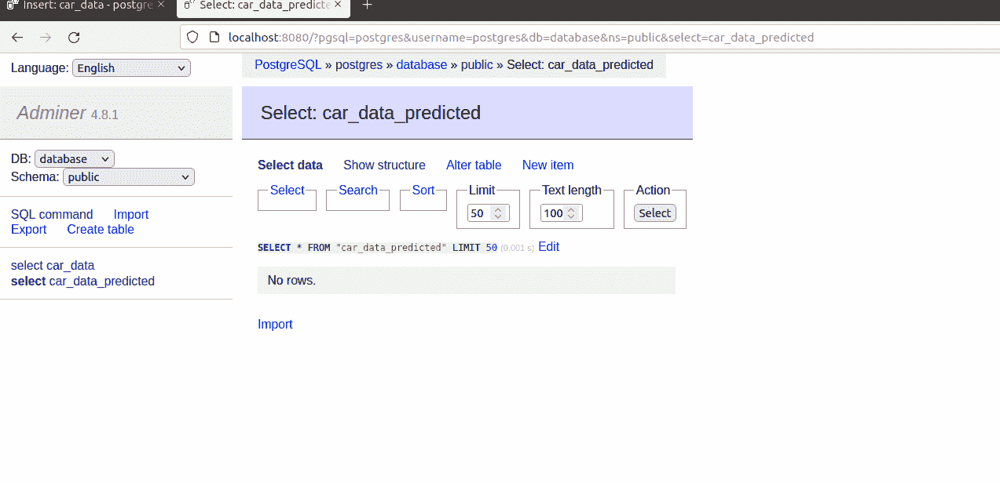

添加示例记录。图片作者。

正如我们在 gif 中看到的，当在 *car_data、*中添加一条新记录时，在*car _ data _ predicted*表中会自动创建另一条记录，并给出建议价格。

如果我们继续在 *car_data* 表中添加越来越多的记录。

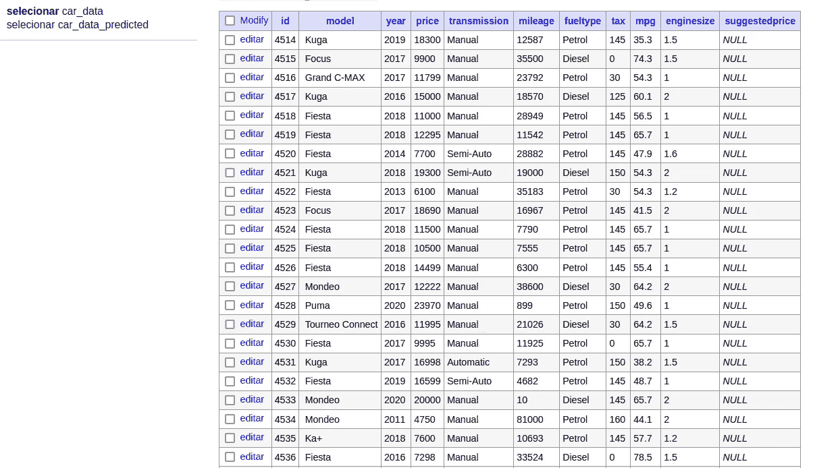

记录已添加。图片作者。

它们将与建议价格一起复制到 *car_data_predicted* 表中。

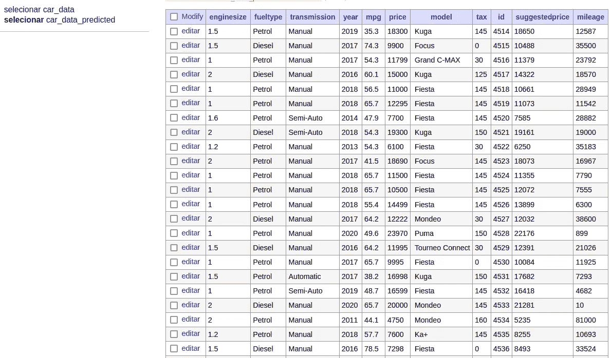

预测价格的记录。图片作者。

综上所述，奏效了！

# 结论

将机器学习项目投入使用不是一项简单的任务，就像任何其他软件产品一样，它需要许多不同种类的知识:基础设施、商业、数据科学等。

我必须承认，在很长一段时间里，我只是忽略了基础设施部分，让我的项目在 Jupiter 笔记本中平静地休息。但是当我开始学习它的时候，我意识到这是一个非常有趣的话题。

机器学习仍然是一个不断发展的领域，与其他 IT 相关领域(如 Web 开发)相比，社区仍然有很多东西需要学习。幸运的是，在过去的几年中，我们已经看到了许多新技术的出现，帮助我们构建一个 ML 应用程序，如 Mlflow，Apache Spark 的 Mlib 和 BentoML，在这篇文章中进行了探讨。

在这篇文章中，我们探索了一种机器学习架构，并利用其中的一些技术来构建一个实时价格推荐系统。为了将这一概念付诸实践，我们不仅需要与 ML 相关的工具(BentoML & Scikit-learn)，还需要其他软件(Postgres、Debezium、Kafka)。

当然，这是一个简单的项目，甚至没有用户界面，但是这篇文章中探讨的概念可以很容易地扩展到许多情况和真实场景。

我希望这篇文章在某种程度上帮助了你，我不是所讨论的任何主题的专家，我强烈建议进一步阅读(见下面的一些参考资料)。

感谢您的阅读！；)

# 参考

> *所有的代码都可以在* [*这个 GitHub 资源库*](https://github.com/jaumpedro214/ml-streming-kafka-cdc) *中找到。*

[1] [Debezium 官方文档](https://debezium.io/)
【2】Jiri Pechanec(2017)[将数据流式传输到下游数据库](https://debezium.io/blog/2017/09/25/streaming-to-another-database/) — Debezium 博客
【3】[Bentoml API I/O 描述符](https://docs.bentoml.org/en/latest/reference/api_io_descriptors.html#structured-data-with-json) — BentoML 文档
【4】[Bentoml 概念](https://docs.bentoml.org/en/latest/concepts/bento.html) — BentoML 文档
【5】Kai Waehner(2020)[流式机器学习与 Kafka-原生模型](https://www.kai-waehner.de/blog/2020/10/27/streaming-machine-learning-kafka-native-model-server-deployment-rpc-embedded-streams/) — BentoML 博客
【7】[Debezium 实例](https://github.com/debezium/debezium-examples/blob/main/unwrap-smt/docker-compose.yaml) — Debezium 官方知识库在 Github 上
【8】本·迪克森(2022)[Github Copilot 是首批基于大型语言模型的真实产品](https://bdtechtalks.com/2022/07/05/github-copilot-large-language-model-product-management/) —技术会谈
【9】[福特二手车上市](https://www.kaggle.com/datasets/mysarahmadbhat/ford-used-car-listing)、 [CC0:公共领域](https://creativecommons.org/publicdomain/zero/1.0/) — Kaggle