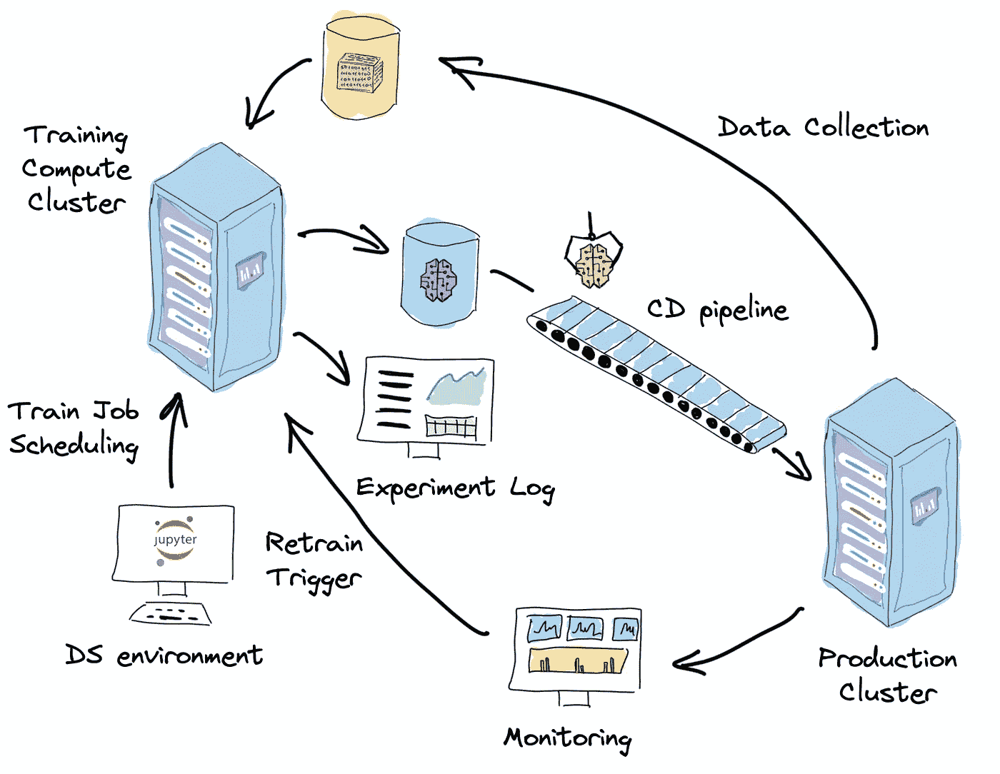
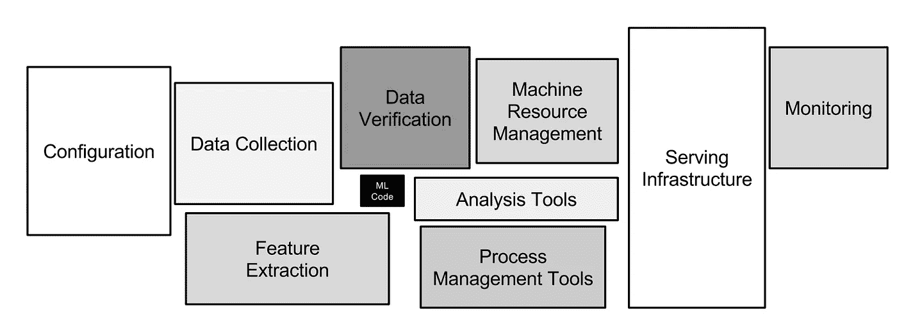
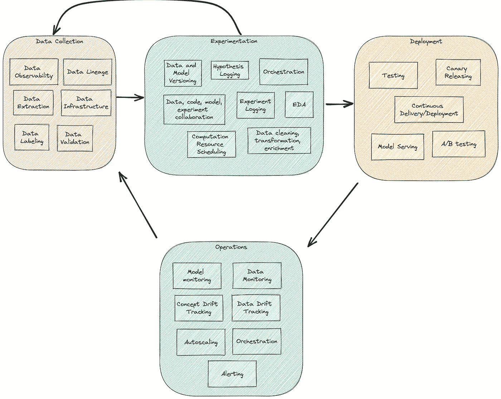
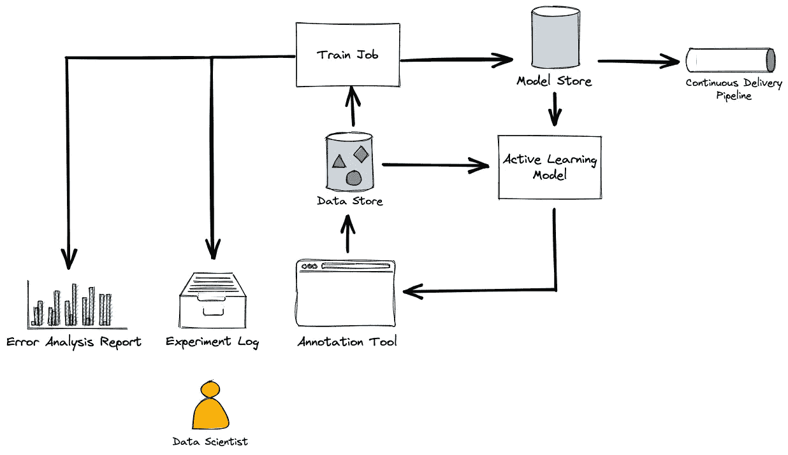
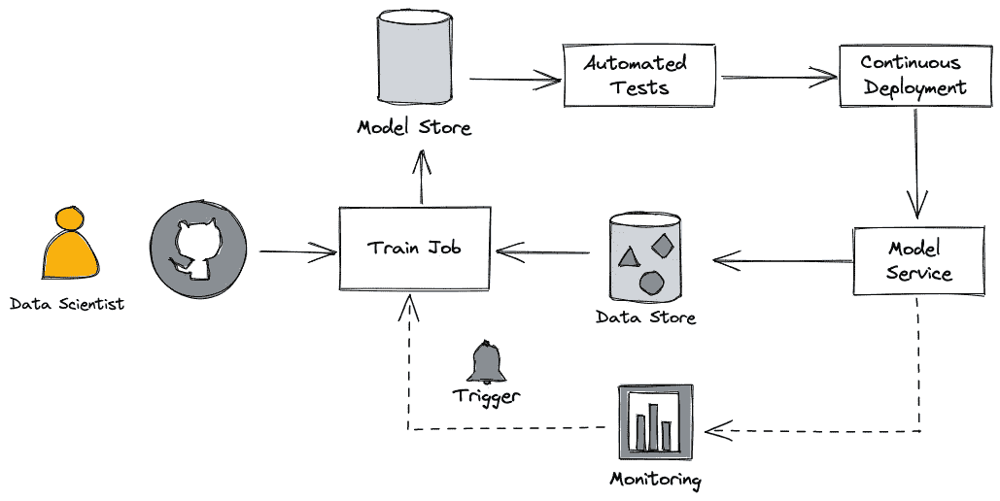

# 机器学习系统与机器学习模型

> 原文：<https://towardsdatascience.com/machine-learning-systems-versus-machine-learning-models-3955d038ea1f>

一个机器学习系统的例子。图片由作者提供

一个正常运行的人工智能产品不仅仅包含一个机器学习模型。你需要在你的 ML 汤里加很多食材，才能让它给顾客带来价值。我们把所有这些成分合在一起称为机器学习系统。

但是，我们往往过于关注我们的 ML 模型，而忽略了更大画面的其他部分。我把这种现象称为**以模型为中心的偏见**。

以模型为中心的偏见会导致糟糕的结果，原因有很多:

首先，我们机器学习系统的大部分复杂性都存在于 ML 模型源代码之外。如果我们忽视这一事实，只专注于模型开发，我们就有积累太多技术、文化和研究债务的风险。

其次，除了编程代码，机器学习模型还有一个额外的组件——数据。你的模型只能和你的数据一样好。以模型为中心的偏见造成了忽视数据的倾向。

由于对数据的依赖性，机器学习系统往往比传统软件更脆弱。我们必须做出额外的系统设计决策来处理这种脆弱性，并为系统引入适应性。

最后，从精益的角度来看，只有系统作为一个整体才能给客户带来价值。

这就是为什么我们需要停止孤立地考虑我们的机器学习模型，而是将它们视为一个动态的、不断适应的系统的一部分——**机器学习系统**。

本文的其余部分将更详细地探讨这个概念。

# 模型中心偏差

我相信以模型为中心的偏见来源于我们在人工智能和人工智能社区中制定研究目标的方式。我们使用标准数据集创建了一个基准，并撰写了一些论文，试图在这方面击败当前的 SotA。同样的方法也出现在应用 ML 和 DS 社区中，以 Kaggle 和其他带有排行榜设置的竞赛的形式出现。

虽然这是迄今为止我们所知的符合[波普尔的可证伪性原则](https://en.wikipedia.org/wiki/Falsifiability)并拥有衡量研究进展的共同标准的最佳方式，但它造成了只关注模型的偏见。当我们从学术环境转向构建人工智能产品时，我们带来了它。

为什么以模型为中心的观点有害？

## 机器学习系统的复杂性

机器学习系统的复杂性存在于机器学习模型源代码之外。

2015 年，谷歌发表了一篇论文“机器学习系统中隐藏的技术债务”，他们根据自己对机器学习产品的经验，对这一现象进行了探索。下面是那篇论文的图片，展示了大部分复杂性集中的领域，以及系统倾向于积累技术债务的领域。

机器学习系统的复杂性地图。D.Sculley 等人《机器学习系统中隐藏的技术债务》

开发和部署机器学习模型相对容易，但很难让整个机器学习系统投入生产。ML 系统是复杂的，并且倾向于积累技术、研究和文化债务。随着时间的推移维护它们是非常困难和昂贵的。

## 机器学习模型反映了它被训练的数据。

机器学习模型是编程代码和数据的融合。我们没有明确地写出程序的算法，而是从给出的例子中推断出来。

这意味着数据在最终学习算法的质量中起着至关重要的作用。此外，虽然模型的代码可以被显著标准化并提取到可重用的库和工具中，但是数据代表了产品的唯一性。您生成的模型只能和您的数据一样好:

> 垃圾进，垃圾出。—[GIGO 原则](https://en.wikipedia.org/wiki/Garbage_in,_garbage_out)。

这意味着我们需要更多地关注数据:测试数据，迭代改进数据，统一和修正数据集的标注方案。

Andrew NG 在[举办的精彩网络研讨会](https://www.youtube.com/watch?v=06-AZXmwHjo)更详细地探讨了这个想法。

## 脆弱和适应。

模型生命周期不会随着初始部署而结束。这对于传统的非最大似然算法是有效的，对于高度依赖数据分布稳定性和缺乏可解释性的机器学习模型尤其如此。这些系统非常脆弱。

补救措施来自反馈循环的系统理论概念:通过引入快速的反向信息流和对该信息的反应，我们使系统具有适应性和持久性。

这就要求我们在系统层面做出设计决策。只专注于模型而不考虑其背景将导致脆弱和低质量的人工智能产品。

## 机器学习模型本身并不能带来价值。

最后，我们为客户提供的价值才是最重要的。价值——是客户想要并愿意支付的东西。这是精益的核心理念，也是 DevOps 和 MLOps 实践的核心。一个经过训练的机器学习模型本身并不能带来任何价值。它只是一个二进制文件，在文件系统的某个地方积灰。是系统作为一个整体产生并带来价值。

那么，什么是机器学习系统呢？

# 什么是机器学习系统？

让我们看看机器学习项目的一般价值流。

这是一个迭代过程，通常由以下阶段组成:

*   数据收集—我们创建数据集并保持其最新状态。
*   实验—我们探索我们的数据，制定和验证关于数据和模型的不同假设，并构建训练和预测管道。
*   部署——我们将结果管道集成到工作产品中。
*   运营—我们监控运行模型，使其与不断变化的环境保持同步。

机器学习系统的通用价值流图。图片由作者提供。

虽然这是一个通用的模板，但是许多参数决定了您的 ML 项目的独特性。其中一些是:

*   问题域
*   项目时间和其他资源限制
*   数据质量
*   标签质量和可用性
*   数据集大小
*   Data domain 可变性
*   应用基础设施和架构
*   贵公司的结构

根据您在这个属性空间中的位置，您将拥有一组独特的活动、工具和流程。

我喜欢将术语机器学习系统定义为所有活动及其工件的具体实现，这些活动及其工件使用机器学习方法向客户交付价值。

> 机器学习系统是我们使用机器学习方法向客户提供价值的一种方式。

机器学习系统指定:

*   我们如何收集、标记和测试数据，
*   我们如何迭代我们的模型和特性的增量改进，
*   我们如何部署模型并对其进行变更，
*   我们如何将模型与应用程序的其余部分集成在一起，
*   我们如何监控它并对环境的变化做出反应。

所有这些构成了复杂的动态适应系统。

让我们看一些机器学习系统的例子。

## 早期 PoC 项目。

在早期项目中，我们的目标通常是验证主要的业务假设和 ML 方法解决问题的适用性。我们花时间确定项目范围，收集初始数据，并计算出目标度量和评估协议。

通常，目标是快速提出一些基线解决方案，然后迭代地改进。因为项目在那个阶段的计划通常不是向用户交付价值，而是验证有一些价值的假设，最终结果很可能不是现成的产品，而是用户应该验证的原型。这就是我们不关注部署和运营阶段的原因。相反，我们优化实验阶段。我们的目标是通过自动化指标和交互式仪表板创建更短的反馈循环。

在计算资源调度和实验可重复性方面，没有成熟的培训基础设施。通常，数据科学家在 JupyterHub 这样的交互式编码环境中完成大部分工作。

部署是手动的，通常是将模型从数据科学家移交给 ML 或软件工程师。

分离代码库区域是实现实验灵活性和技术成熟度积累之间的折衷的典型模式。实验区没有在代码上强加工程质量标准——它是一个短命的、不可重用的实验功能区。我们不断地审查、重构和提取稳定的、可重用的功能到一个稳定的代码库区域，并将其部署到一个包中。

在这样的项目中，我们通常不太关心数据的可观察性或血统。数据科学家仅从交互式数据科学环境中创建新数据集。

早期 PoC 项目的机器学习系统示例。图片由作者提供。

## 无标签场景。

想象一个不同的场景，当我们对一个新启动的项目没有任何合适的质量标签。

注释过程可能是我们价值流的瓶颈，一个合适的注释工具将在项目的成功中起到至关重要的作用。

此外，我们可能会利用**主动学习**方法来提高贴标流程的效率，并减少必要的贴标工作。

如果我们的 ML 基础设施足够成熟，我们可以通过作业调度程序和提交界面来自动化培训过程。

最终的机器学习系统可能看起来像这样:

一个利用主动学习方法的机器学习系统的例子。图片由作者提供。

上图中的边代表了工件流。它们可以手动或自动执行。自动化程度越高，迭代和进步的速度就越快。

## 标签存在于推理时间数据中。

让我们想象一下相反的场景——我们有一个日常用户正在运行的产品。我们可以从用户那里得到标签，在推理时纠正模型的错误行为。

我们实施**持续培训**模式，端到端地自动化整个周期。数据被自动收集并转换成训练和验证数据集。我们将培训过程自动化，并通过自动化的单元和数据测试以及模型评估将其放入 CI/CD 管道中。

我们可以选择持续部署或持续交付策略，并通过引入 canary 版本和自动回滚来进一步推进这一策略。

模型服务被持续监控模型性能，当性能下降时，系统触发重新训练/重新部署过程。

利用连续训练方法的机器学习系统的例子。图片由作者提供。

这些只是可能的机器学习系统的几个例子。还有很多，适合你的会不一样，体现你项目的独特性。

所以我们总结一下。

# 结论

虽然机器学习模型是人工智能产品的核心，但它通常不是复杂性集中的地方。

当我们计划我们的 ML 项目时，我们需要从一开始就将我们的焦点转移到机器学习系统上。

我们必须开始更多地思考和讨论这样的系统，并开发可重用设计模式和良好实践的词汇表。

# 跟我来

如果你觉得我与你分享的想法很有趣，请不要犹豫，在[媒体](https://medium.com/@areshytko)、[推特](https://twitter.com/areshytko)、 [Instagram](https://www.instagram.com/areshytko/) 或 [LinkedIn](https://www.linkedin.com/in/areshytko) 上联系我们。