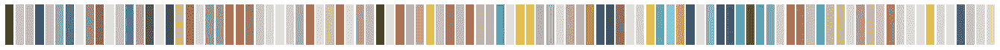
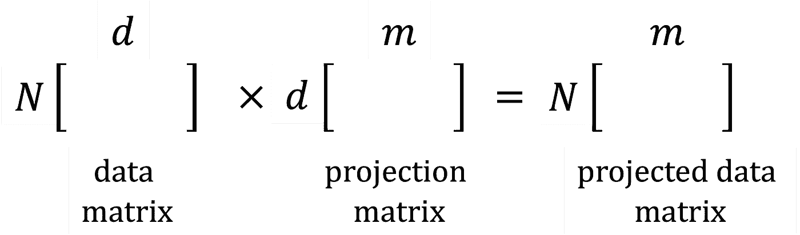
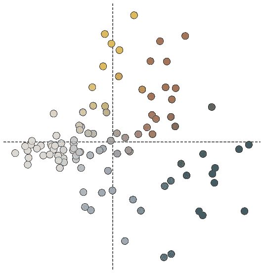
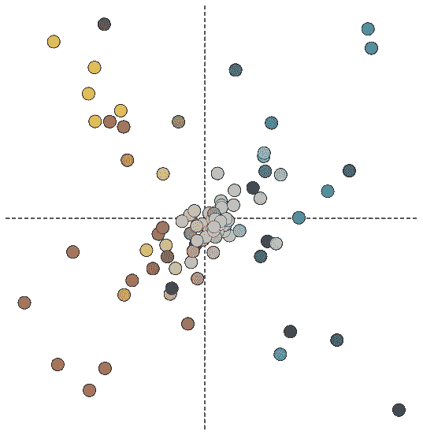
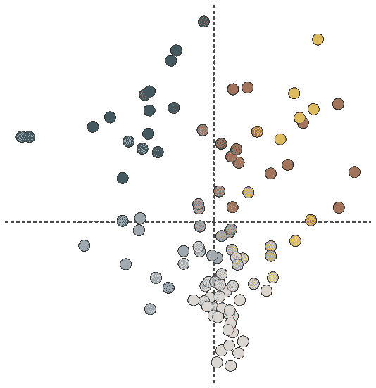
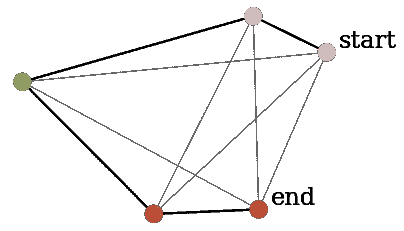
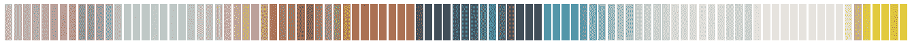
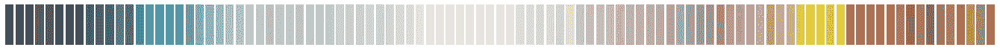

# 基于机器学习的视觉排序

> 原文：<https://towardsdatascience.com/machine-learning-to-visually-sort-7349d3660e1>

## 无监督学习方法

在 [unsplash](https://unsplash.com) 上由 [Luisa Brimble](https://unsplash.com/@luisabrimble) 拍摄的照片。

随着时间的推移，我们收集书籍，在某个时候，我们可能会决定整理它们。拼色书架是根据颜色相似度来排列书籍的一种趋势。整理书架的一种流行方式是创造彩虹效果。这创造了一个令人愉快的视觉安排。根据书籍的数量，这可能是一项容易或困难的任务。

可以自动排书吗？我想探索机器学习技术来分类书籍并比较它们的结果。在这篇文章中，我应用无监督的机器学习方法按颜色对书籍进行排序。每种算法都使用一个目标函数来对颜色进行排序。基于算法的类型，我们会得到不同的结果。我用流行的无监督算法对颜色进行了分类，包括:

1.  主成分分析
2.  核主成分分析
3.  随机投影
4.  最近邻
5.  自组织地图

我将首先检查数据集准备，然后探索不同的无监督算法。

# 数据集和要素

我们的任务是根据图像来排列书籍。图像像素不是信息特征。由于大多数书籍的颜色很少，将书籍图像中的颜色分布减少到单一 RGB 值效果很好。书单涵盖了各种各样的颜色。我用占主导地位的 RGB 值创建了一个调色板数据集来表示我的图书列表中的每本书。最终数据集的维数为 99 × 3，用颜色特征的数量来表示书籍的数量。该数据集的随机排序颜色如下所示。

随机排序的颜色。

接下来，我探索了将数据从 RGB 空间映射到一维空间的不同方法。

# 降维

*降维映射。*

降维算法在降维的同时保留了高维数据中的信息。每种方法的独特之处在于它在低维中保存的信息类型。我们希望我们的颜色排列成相似的颜色相互靠近。我们将 RGB 数据映射到一维数组，并对其进行排序。不同的方法使用不同的目标函数来降维。

在降维方法中，我们首先学习一个维数较低的投影矩阵， **d × *m*** ，其中 **m < d** 。然后将我们的 **N × d** 维数据映射到投影矩阵上，得到低维数据 **N × m** 。我使用了 [scikit-learn](https://scikit-learn.org/stable/modules/classes.html) python 库来实现降维方法。

## **主成分分析**

主成分分析(PCA)将数据映射到一个低维子空间上，使方差或数据分布最大化。低维子空间包含称为主分量的样本协方差矩阵的特征向量。由于 PCA 将 RGB 数据降低到一个维度，它可以用于对颜色进行排序。我将主成分分析应用于调色板数据集。为了可视化，我们将 RGB 数据映射到第一和第二主成分上。

PCA 变换后的可视化颜色。

相似的颜色群聚集在一起。颜色趋势是从浅到深(从左到右)。我们将特征映射到第一主成分上，并对投影进行排序。

PCA 变换后的颜色排序。

存在从较亮到较暗颜色的明显颜色亮度趋势，但是没有颜色内聚类排列。

## 核主成分分析

高维数据可以有一个非线性的数据结构，不能用线性 PCA 学习。PCA 的非线性扩展是核版本，其中我们在提取主成分之前使用核函数来映射数据。核函数计算数据点之间的相似性。不同的核函数捕捉不同类型的相似性。基于我们的数据，我们必须试验不同的内核函数。我使用余弦内核，因为它提供了一个很好的排序结果。

核 PCA 变换后的颜色可视化。

在上面的二维图像中，我们看到了漂亮的内部颜色簇。我们也看到不同颜色的阴影向中心聚集。在将我们的数据映射到主要主成分并排序后，我们看到颜色趋势从暖色变为浅灰色并趋向冷色。

核 PCA 变换后的排序颜色。

## 随机投影

在 PCA 和核 PCA 中，我们学习数据相关投影。当数据维数非常高时，我们会遇到特征值分解或协方差矩阵构造的内存问题。随机预测是与数据无关的预测。当我们在这些投影上绘制数据时，成对距离会保留一定的系数。我们通过从具有零均值和方差的高斯分布中采样向量来构建具有较小维度的投影矩阵，其中方差由维度的数量 **m** 来缩放。我们的最终结果每次都会改变，因为抽样是随机的。

高斯随机投影变换后的颜色可视化。

随机预测出奇地有效。色带从冷蓝色调过渡到中间的浅粉色，并向暖色过渡。

高斯随机投影变换后的排序颜色。

虽然核 PCA 和随机投影学习分离暖色和冷色的映射，但有趣的是看到这两种方法的过渡如何不同。

接下来，我将探索如何通过将颜色排序重新定义为成本最小化问题来使用优化方法对颜色进行排序。与降维方法相比，优化方法使用 RGB 数据而不降维。

# 旅行推销员问题

最近邻旅行商问题的一种解法。黑线显示连接每种颜色的最短路径。

旅行推销员问题的目标是为给定的城市列表找到最短距离的路线，使得所有的城市只被访问一次。我们可以将颜色排序重构为一个旅行推销员优化问题。在我们的颜色排序问题中，我们可以用颜色代替城市。上图展示了给定起始节点，基于欧几里德距离的五个 RGB 值之间的最短路径。

## 最近邻

解决旅行推销员问题的一个启发式方法是使用最近邻法。给定一个二维距离相似矩阵，我们从一个随机颜色开始，迭代地找到最近的颜色聚类。根据使用的距离度量，结果会有所不同。这种方法会产生彩虹般的效果。我使用欧几里得度量来创建距离相似性矩阵。

用最近邻法对颜色进行排序。

## 自组织映射

自组织映射(SOM)是一种人工神经网络，它通过竞争学习来学习数据的二维映射。SOM 有助于数据可视化和聚类。我们学习了 **N** × **d** 维数据的二维图，其中数据基于相似性进行聚类。相似的颜色比不相似的颜色更接近。

用自组织图排序颜色。

与降维方法相比，SOM 创建了更好的颜色内聚类。我使用了 [MiniSom](https://github.com/JustGlowing/minisom) python 库来实现 Som。

# 结论

综上所述，以上所有方法对颜色的分组都是不同的。在 PCA 中，只有亮度信息被认为是重要的。与 PCA 相比，其他降维方法保持颜色内分组，而 SOM 和最近邻方法创建彩虹般的颜色排列。

## **参考文献**

[1] Jura Koncius，[按颜色整理书籍:你属于哪个阵营？](https://www.washingtonpost.com/lifestyle/home/organizing-books-by-color-which-camp-are-you-in/2015/08/03/e3688b04-37a1-11e5-9d0f-7865a67390ee_story.html)

[2] Cameron Davidson-Pilon，[利用 PCA 对高维对象进行分类](https://nbviewer.org/gist/CamDavidsonPilon/abe3f0e4f589f53c4128)

[3] Alan Zucconi，[令人难以置信的具有挑战性的颜色分类任务](https://www.alanzucconi.com/2015/09/30/colour-sorting/)

*所有图片，除非特别注明，均为作者所有。*