# 基于模糊逻辑的机器学习

> 原文：<https://towardsdatascience.com/machine-learning-with-fuzzy-logic-52c85b46bfe4>

## *如何使用模糊逻辑从数据中提取控制规则*


Photo by [愚木混株 cdd20](https://unsplash.com/@cdd20?utm_source=unsplash&utm_medium=referral&utm_content=creditCopyText) on [Unsplash](https://unsplash.com/s/photos/logic?utm_source=unsplash&utm_medium=referral&utm_content=creditCopyText)

# 介绍

模糊逻辑的基础是真理可以表述为连续体的思想；换句话说，一个事件不是绝对的真或假，而是部分真或部分假[1]。在模糊逻辑中，系统变量的值可以用语言术语来表示，例如“高”、“低”和“中”，它们指定了数据集中感兴趣的区域。这些语言表达式被称为模糊集(或区域)。然后，模糊化提供了一种方法，通过这种方法，每个观察值被分配一个属于每个模糊集的程度。这允许我们开发一个数字数据集的语言摘要，并获得对潜在模式的直观理解。随后，生成的文本模型可以被部署来创建用于做出未来预测的控制规则。这就是模糊逻辑在控制系统中大量应用的原因。

本文的目的是提出一种从数字数据中生成模糊规则的直接而实用的方法。这将通过一组包含对**相对湿度、温度**和**炎热指数**的观测数据来说明。最后，一个数字观察，如

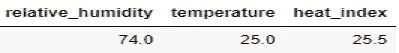

将被转换成如下文本信息

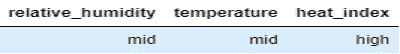

要获得规则语句:

```
**IF** relative humidity is medium and temperature is medium, **THEN** heat index is high
```

通过这种输入到输出的逻辑映射，即，

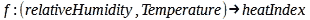

模糊逻辑为我们提供了一个强大的建模工具——一个可以应用于预测建模的 IF-THEN 规则。

# 从数据生成模糊规则的步骤

*步骤 1* :对数据进行预处理后，输入和输出空间的论域(或模糊逻辑中常用的论域)被确定。

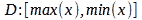

变量域:相对湿度、温度和热指数是由记录的最小和最大观察值定义的区间。

*步骤 2:* 使用如下所示的三角函数将区间分成 3 个重叠区域。这现在创建了表示为低、中和高的模糊区域。

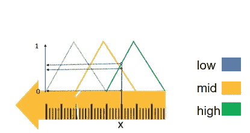

数值测量的模糊化，x .作者的图像

单个测量值将属于该区域的每一个，等级范围为 0-1。该值越高，属于该特定区域的程度越大。度量的隶属度之和将等于 1。上图中位于标尺长度区间内的尺寸 X 将被模糊化，如下所示。

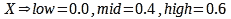

因此，X 属于等级为 0 的集合“低”，等级为 0.4 的集合“中”，等级为 0.6 的集合“高”

步骤 3:将每个观察值分配到其成员级别最高的区域。上面的测量值 X 将被分配给“高”区域，并记录其程度。

第四步:此时，数据中的每一条记录都已经转化为文本，形成了一条规则。计算规则度，它是构成规则一部分的模糊集的隶属度的乘积。例如，下面显示的转换后的观察给出了一个规则，如前所述。


那么，标准度数就是相对湿度为“中等”，温度为“中等”，热指数为“高”的等级的乘积。

步骤 5:在最后阶段，通过从一组具有相同前提的规则中获取一个规则来构建规则摘要。所选择的规则是具有最高规则等级的规则；因此，其结果得以保留。规则的前件是输入变量(温度和相对湿度)的指定成员，而后件是输出变量(热量指数)的成员。

# Python 实现

为了设置开发 Python 代码的阶段，需要导入相关的模块和预处理数据。该数据由 13801 个训练集观察值组成。为了简单起见，我分别用湿度和热量来表示相对湿度和热量指数。

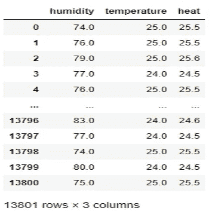

万隆理工学院 [AP-Channel](http://purqon.id/) 研究小组的数据

接下来，构造模糊化器类——它接受一个数据序列并给观察值分配一个属于模糊集的等级。sickit-fuzzy 库用于开发代码。fuzz.trimf()方法创建三角形隶属函数，而 fuzz.interp_membership()方法为观测值分配模糊区域的隶属等级。

以下代码将模糊化应用于数据中的所有变量。

相对湿度:

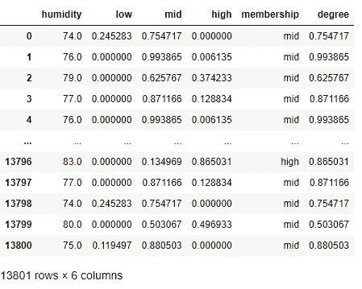

温度:

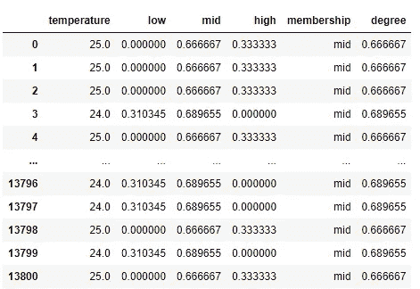

热量指数:

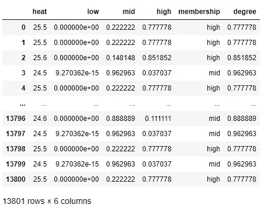

合并成员资格列时，将获得以下转换后的数据集:

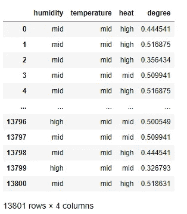

最后，创建一个总结函数来提取最终的规则集。

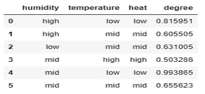

上面的数据框描述了数据中最强的关系。这可以很容易地转换成如下控制规则:

```
Rule 1: **IF** relative humidity is high and the temperature is low, **THEN** heat index is lowRule 2: **IF** relative humidity is high and temperature is medium, **THEN** heat index is medium
                        .
                        .
                        .
Rule 6: **IF** relative humidity is medium and temperature is medium, **THEN** heat index is medium
```

# 结论

已经开发了一种基于模糊逻辑的机器学习方法来从数据集中提取被建模为规则的关系。在这个项目中获得的六个规则总结了变量之间最强的联系，并可用于预测在相同条件下收集的一条看不见的数据的热指数——使用温度和相对湿度——具有显著的准确性，同时提供数据集中固有模式的语言快照。这使得模糊逻辑在需要非清晰输入的控制系统中成为一个重要的建模工具。

# 参考资料:

[1] Sickit 图像团队(2016)，模糊控制初级读本，sick it-模糊文档

***数据来源:*** *图中使用的数据集是由印尼万隆理工学院的* [*AP 频道*](http://purqon.id/) *研究小组为 Acep Purqon 博士赞助的一个精准农业项目生成的。它包括生长青菜的生长室的温度、相对湿度和热指数的 20 天测量。*