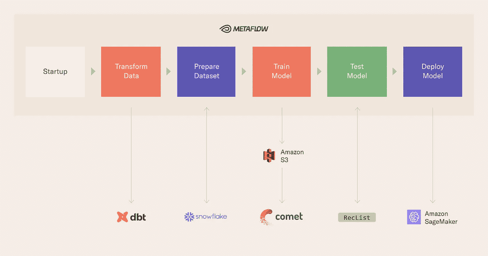
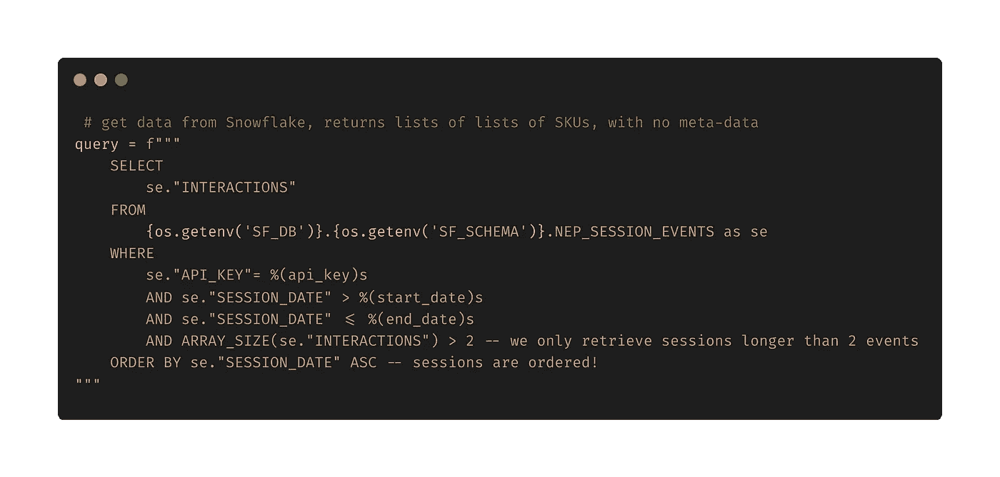

# 基于现代数据堆栈的机器学习:案例研究

> 原文：<https://towardsdatascience.com/machine-learning-with-the-modern-data-stack-a-case-study-50f0c2e1fbb>

在 [Unsplash](https://unsplash.com/s/photos/machine-learning?utm_source=unsplash&utm_medium=referral&utm_content=creditCopyText) 上由 [Hitesh Choudhary](https://unsplash.com/@hiteshchoudhary?utm_source=unsplash&utm_medium=referral&utm_content=creditCopyText) 拍摄的照片

关于[现代数据栈](https://towardsdatascience.com/tagged/modern-data-stack) (MDS)已经说了很多，但情况明显更分散在机器学习这一边:*一旦数据被适当地转换，它如何在下游被消费以产生商业价值？*

这篇文章是为那些想在处理数据和使用机器学习实际交付商业价值之间架起一座桥梁的人而写的。

**TL；博士**

*   在采用现代数据堆栈(MDS)后，各组织仍处于成为“数据驱动型”的早期阶段，MDS 需要与 MLOps 和实际数据驱动型软件相结合才能取得成功；
*   您将了解在一个不断发展的组织中处理数据所面临的挑战以及如何克服这些挑战，包括[端到端代码](https://github.com/jacopotagliabue/post-modern-data-stack)展示如何将 DataOps 和 MLOps 与最先进的开源工具相结合，如 [Metaflow](https://metaflow.org/) 和 dbt
*   一个关键点是操作的抽象级别:从数据到服务，整个管道不需要任何特殊的 DevOps 人员、基础设施工作或 yaml 文件。SQL 和 Python 是存储库中仅有的语言。
*   在后续的帖子中，我们将展示好的工具如何提供一种更好的方式来思考工作和生产力的划分，从而为经理和数据领导者提供一个组织模板。

# 从现代数据堆栈到 MLOps

现代数据堆栈(MDS)已被整合为围绕数据收集、存储和转换的一系列最佳实践。特别是，MDS 包括三大支柱:

*   可扩展的摄取机制，通过工具(例如 Fivetran、Airbyte)或[基础设施](https://github.com/jacopotagliabue/paas-data-ingestion)；
*   将所有数据源存储在一起的数据仓库(例如雪花);
*   一种转换工具(如 dbt)，确保使用 SQL 对原始数据进行版本化的 DAG 式操作。

关于这种 MDS 已经说了很多，但是栅栏另一边的情况更加“分散”:*一旦数据被适当地转换，下游如何消费这些数据以产生商业价值*？归根结底，吸收和转换数据(对大多数公司来说)本身并不是目的:虽然科技巨头们不久前就想出了如何“将模型投入生产”，但大多数公司仍在努力在不到 [3 个月](https://algorithmia.com/state-of-ml)的时间内将模型投入生产。

我们采取的方法是接受这样一个事实，即不是每个公司都需要像 Googles 和 Metas 部署的那样复杂和无限可扩展的基础设施，而[这完全没问题](https://www.youtube.com/watch?v=SAal0hqqE74) : [以“合理的规模”进行 ML 比以往任何时候都更有价值和有效，这要归功于供应商和开源解决方案的伟大生态系统。在](/ml-and-mlops-at-a-reasonable-scale-31d2c0782d9c)[的配套知识库](https://github.com/jacopotagliabue/post-modern-stack)中，我们使用深度学习管道来训练一个用于顺序推荐的模型:如果你看到一个购物者正在与 *k* 产品进行交互，她接下来会做什么？我们…

*   有目的地避免玩具数据集和仅本地部署；
*   提供一个云就绪、“合理规模”的项目；
*   展示培训、测试和服务( *MLOps* 步骤)如何自然地嵌入到以数据和功能(*数据操作*步骤)开始的管道中。

这项工作的主干由 Metaflow 提供，这是我们的开源框架，它(除其他外)降低了数据科学家从原型到生产的机器学习的门槛，一般堆栈看起来是这样的，尽管 Metaflow 允许您切换任何其他组件:

作者图片

在这篇文章和后续文章中，我们讲述了我们在 Coveo 任职期间工具和文化如何一起改变的故事，并分享了在工作代码中体现我们数据协作原则的开源存储库:根据我们的经验，DataOps 和 MLOps 在相同的原则下做得更好，而不是将工件“移交”给围栏另一边的团队。特别是，我们的目标是双重的:

*   基于我们的经验，我们为刚起步的团队提供了一个*技术*模板，并想知道如何有效地加入 DataOps 和 MLOps
*   我们展示了好的工具如何提供一种更好的方式来思考工作和生产力的分工，从而为经理和数据领导者提供一个*组织*模板。我们将在后续文章中讨论这个问题。

总而言之，虽然我们对空间的[增长感到兴奋，但我们也知道可供选择的数量可能会让*和*感到害怕，因为这个领域仍然是混乱的，并且在快速发展。我们在此提出的解决方案是一个实用的堆栈，它不仅为测试 MLOps waters 的团队提供了可靠的第一步，还详细展示了简单的部分如何在构建可扩展的 ML 系统方面发挥重要作用。](https://www.mihaileric.com/posts/mlops-is-a-mess/)

你可以在这里找到指导这篇文章的视频教程:

# 利用现代数据堆栈进行机器学习

这个堆栈如何将良好的数据文化转化为大规模的工作软件？隔离(和降低)复杂性的一个有用的方法是通过理解*计算发生的地方*。在我们的管道和我们在组织间看到的模式中，有几个计算步骤和多个提供商:

*   数据在雪花中存储和转换，雪花为 SQL 提供底层计算，包括由 dbt 这样的工具管理的数据转换；
*   训练在 AWS Batch 上进行，利用 Metaflow 提供的抽象；
*   服务在 SageMaker 上，利用 AWS 的 PaaS 产品；
*   调度基于 AWS 步骤函数，再次利用元流(未在回购中显示，但[可以直接实现](https://docs.metaflow.org/going-to-production-with-metaflow/scheduling-metaflow-flows))。

设计中的一个关键点是我们选择操作的抽象层次:整个管道不需要任何特殊的 DevOps 人员、基础设施工作或 yaml 文件。SQL 和 Python 是存储库中仅有的语言:基础设施要么是不可见的(如 Snowflake 透明地运行我们的 dbt 查询)，要么是*声明性的*(例如，您指定您需要的计算类型，如 GPU，Metaflow 使它发生)。

虽然您可能对 DataOps 部分比较熟悉，但还是有必要对 MLOps 部分做一个高层次的概述。请记住:*转换和规范化数据本身很少是目的——只有当你从中获得一些东西，从可视化中获得洞察力或从机器学习模型中获得预测时，数据才有价值。*

[我们的堆栈利用由 dbt 构建的 SQL DAG](https://github.com/jacopotagliabue/post-modern-stack/blob/fa94da5a131f6b3548f0dd1b9454d3d05dd9166e/src/dbt/models/metaflow/nep_session_events.sql#L7) ,为我们的推荐模型运行从原始购物事件到产品交互序列的必要转换，通过使用 SQL，我们实现了两个重要目标:

*   *首先*，ML 团队可以在一个统一的环境中直接在分析工程师下班后工作(可以说 SQL 是数据的*通用语*)；
*   *第二个*，我们将所有(分布式)计算下推到雪花，使 Python 方面的事情变得相当轻量级，因为我们不会真正受到机器内存的限制来聚合和过滤数据行。

这段代码显示，由于数据已经被转换，所以只需要一个简单的查询就可以让数据集为下游建模做好准备

培训部分本身是一个典型的深度模型[用于会议建议](https://arxiv.org/abs/2007.14906)，没有任何细节依赖于它:同样的原则适用于更复杂的模型。令人兴奋的是，一个简单的 SQL 查询，易于阅读和维护，是连接云中 GPU 上的功能准备和深度学习训练所需要的一切。训练一个模型产生一个工件(也就是一个现成的模型！)，它现在可以生成预测:由于在将模型部署到实际交通之前，在看不见的数据上测试模型是一个好的做法，我们在 *test_model* 中展示了一种先进技术的草案，[行为测试](https://github.com/jacopotagliabue/reclist)。

最后，管道以部署结束，也就是说，将通过培训产生并通过测试验证的工件运送到像任何其他 API 一样可以到达的公共端点的过程；根据我们训练的模型，通过提供购物会话，端点将以最可能的延续进行响应。

对于数据科学家、经验丰富的 ML 工程师、刚刚开始使用 Python 的分析工程师，甚至监控项目的 PM 来说，这是一个舒适的堆栈:鼓励协作和有原则的分工。虽然我们提出了一个 RecSys 用例，但上述考虑因素大部分(如果不是全部的话)适用于许多其他行业的类似管道:[毕竟，你不需要更大的船](https://github.com/jacopotagliabue/you-dont-need-a-bigger-boat)来做尖端的 ML。

这个堆栈还可以在越来越复杂的配置中运行，这取决于您想要包含多少工具/功能:即使在“完全复杂”的情况下，它也是一个非常简单的、无需干预的万亿字节级处理堆栈；此外，一切都是相当解耦的，所以如果你想用[塞尔顿](https://outerbounds.com/blog/machine-learning-pipelines-from-prototype-to-production)交换 SageMaker，或者用权重&偏差交换 Comet，你可以轻而易举地做到。

整个堆栈包含到实验跟踪平台的现成连接和一个定制 DAG 卡(的存根),根据雅格布团队的行为测试开源框架 [RecList](https://github.com/jacopotagliabue/reclist) 显示推荐系统的表现。我们可以就此写一篇文章(实际上，我们[确实写了](/ndcg-is-not-all-you-need-24eb6d2f1227)，加上[两篇学术论文](https://arxiv.org/abs/2111.09963)):即使作为一个非常小的测试例程，我们也希望确保将它作为一个通用的提示，提醒人们在部署之前理解模型行为是多么重要，以及可读、可共享、低接触的文档对于生产中的 ML 管道是多么重要。

这个堆栈很简单，但是很有效，而且是模块化的:它可能不是旅程的终点，但是它肯定是一个很好的开始。

在后续的帖子中，我们将展示好的工具如何提供一种更好的方式来思考工作和生产力的划分，从而为经理和数据领导者提供一个组织模板。如果您对这些话题感兴趣，请在[我们的社区 slack here](http://slack.outerbounds.co/) 上与我们聊天。

**注:**

这篇博文是 Metaflow 的长期用户 [Coveo](http://coveo.com) 和 Outerbounds 的合作。在外部，我们已经与 Coveo 合作过几次，合作项目包括[元流卡](https://outerbounds.com/blog/integrating-pythonic-visual-reports-into-ml-pipelines)和最近关于[合理规模机器学习的炉边谈话——你不是谷歌，这完全没问题](https://www.youtube.com/watch?v=SAal0hqqE74)。在这篇文章中，我们与来自 Coveo 的 Jacopo 坐在一起，思考他们如何使用 Metaflow 将 DataOps 与 MLOps 连接起来，以回答这个问题:*一旦数据被适当地转换，它如何在下游被消费以产生商业价值？*

**致谢**

特别鸣谢:dbt Labs 的 Sung Won Chung、Coveo 的 Patrick John Chia、Luca Bigon、Andrea Polonioli 和 Ciro Greco。如果没有 Coveo 去年发布的神奇数据集[，这一切都是不可能的，该数据集包含了数百万真实世界的匿名购物事件。](https://github.com/coveooss/SIGIR-ecom-data-challenge)

如果您喜欢这篇文章，请花点时间支持我们的开源计划，为我们的 [RecList 包](https://github.com/jacopotagliabue/reclist)、 [this repo](https://github.com/jacopotagliabue/post-modern-data-stack) 和 [Metaflow](https://github.com/netflix/metaflow) 添加一颗星。

*原载于 2022 年 7 月 28 日 https://outerbounds.com**T21*[。](https://outerbounds.com/blog/modern-data-stack-mlops)