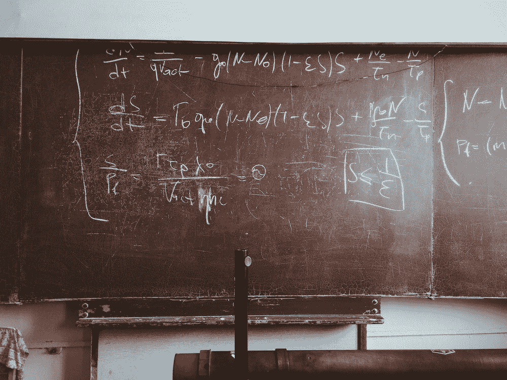
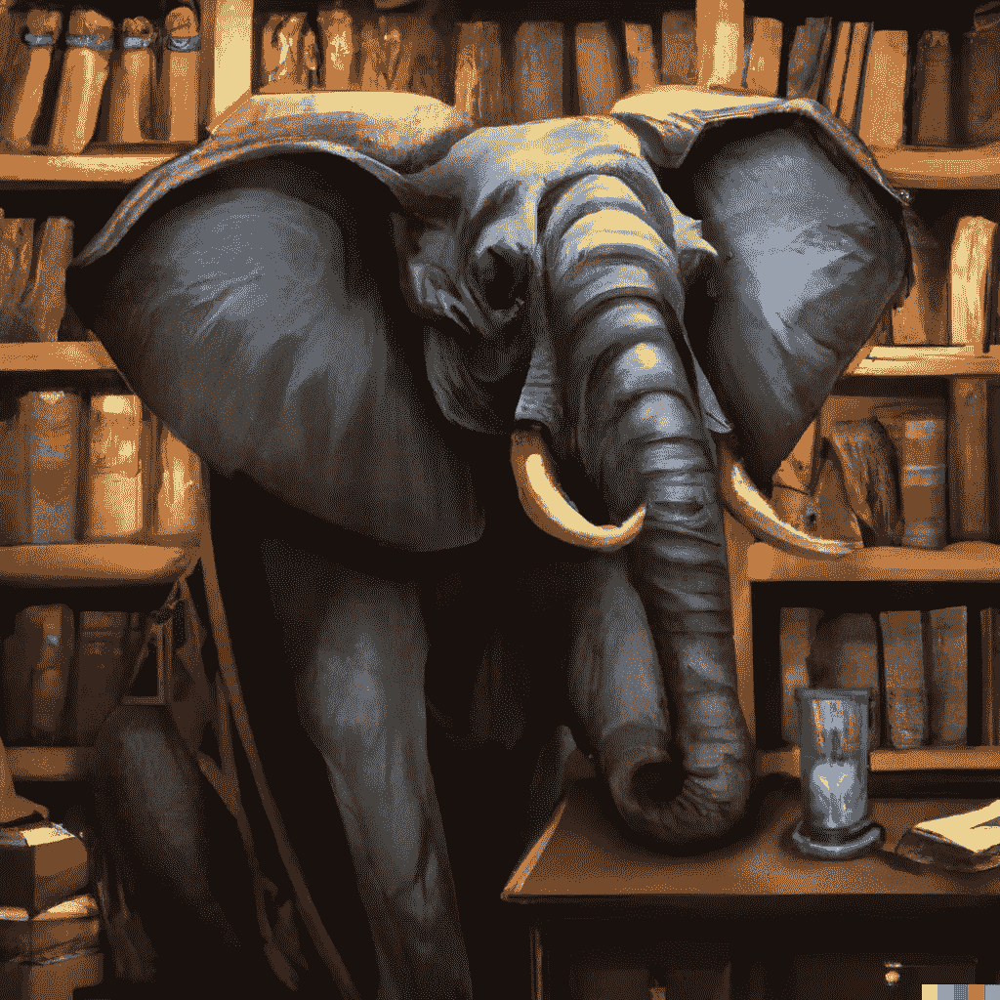
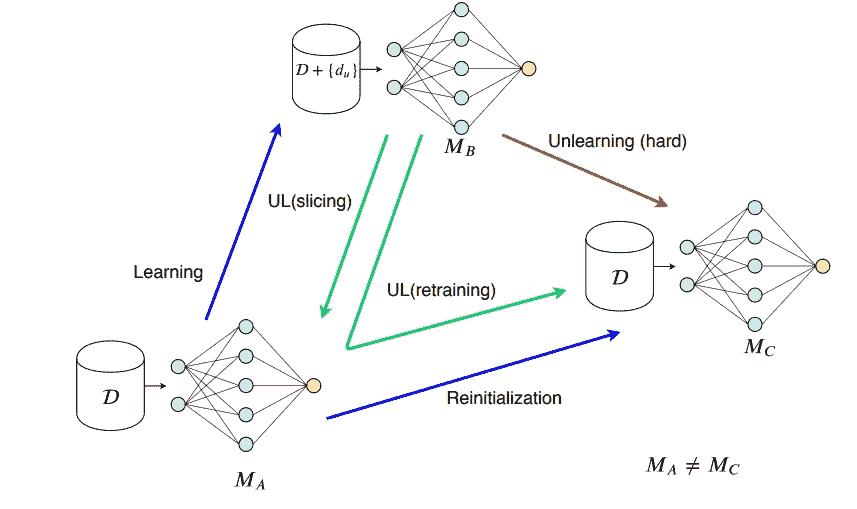

# 机器遗忘:遗忘的职责

> 原文：<https://towardsdatascience.com/machine-unlearning-the-duty-of-forgetting-3666e5b9f6e5>

## 意见

## 从人工智能模型中删除数据点信息的重要性

图片由来自 unsplash.com[的](https://unsplash.com/)[罗马法师](https://unsplash.com/@roman_lazygeek)拍摄

什么是被遗忘的权利？什么是机器去学习？对隐私的新关注导致了新的法规。机器学习应该能够消除信息，但这是一项具有挑战性的任务。为什么？我们能做什么？

**电子象的记忆**

图片由作者用[OpenAI](https://openai.com/)DALL-E 生成

2020 年互联网上的数据量是 [64 zettabytes](https://healthit.com.au/how-big-is-the-internet-and-how-do-we-measure-it/) (其中一个 zettabyte 就是一万亿千兆字节)。此外，Instagram 上有超过 400 亿张[图片，](https://www.wordstream.com/blog/ws/2017/04/20/instagram-statistics)[每天有 3.4 亿条推文](https://www.internetlivestats.com/twitter-statistics/)，脸书上有无数帖子等等。我们分享了很多数据，但仅仅是浏览互联网，我们也会留下很多痕迹。

近年来，全球对隐私和数据保护的兴趣日益增长。用户已经意识到我们通过使用无数的应用程序或访问无数的网站分享了多少数据。另一方面，用户已经意识到这些数据被收集、使用和出售。像《剑桥分析》这样的丑闻增加了人们对我们在线共享数据价值的认识。

定向广告在社交网络和谷歌搜索中的显示方式也证明了数据分析的有效性。算法能够如此好地描述我们的事实让我们想知道这些数据被卖给了谁。事实上，利用数据中的信息可以让公司赚取数十亿美元。

无论我们如何改变，我们的思想如何改变，世界如何改变，但数据永远留在互联网上。

**被遗忘权**

图片来自[廷杰伤害律师事务所](https://unsplash.com/@tingeyinjurylawfirm)上【Unsplash.com】T2

被遗忘权被定义为“在某些情况下，一个人的私人信息被从互联网搜索和其他目录中删除的权利”([维基百科](https://en.wikipedia.org/wiki/Right_to_be_forgotten))。然而，对于这一定义，或者是否考虑将这一定义列入人权清单，还没有达成一致意见。另一方面，一些机构和政府正着手讨论并提出监管建议(阿根廷、欧盟、菲律宾)。

> 这种被遗忘权的概念是基于个人以自主方式决定其生活发展的基本需要，而不会因为过去所做的具体行为而永久或周期性地蒙受耻辱，特别是当这些事件发生在许多年前并且与当代背景没有任何关系时——[欧盟提案](https://www.sciencedirect.com/science/article/pii/S0267364913000654)

事实上，过去的信息和事件甚至在多年后仍然会造成耻辱和后果。举个简单的例子，詹姆斯·古恩[在他的攻击性推文再次出现后，被迪士尼从《银河护卫队 3》](https://techcrunch.com/2018/07/20/james-gunn-fired-from-guardians-of-the-galaxy-3-after-offensive-tweets-resurface/)中解雇。他在 2018 年被解雇，因为他在 2008 年至 2011 年间写了推文。

> “我将近十年前的话在当时是完全失败和不幸的挑衅努力。从那以后，我后悔了很多年——不仅仅是因为它们愚蠢、一点也不好笑、麻木不仁，当然也不像我希望的那样具有煽动性，还因为它们没有反映出今天的我或者一段时间以来的我。”—詹姆斯·古恩[声明](https://deadline.com/2018/07/james-gunn-responds-marvel-firing-guardians-of-the-galaxy-for-tweets-1202430535/)

当然，你可以删除你在脸书和 Instagram 上发的推文或帖子。但是，删除网上分享的东西就没那么容易了。例如，脸书推出了一款名为“[脸书外活动](https://www.washingtonpost.com/technology/2020/01/28/off-facebook-activity-page/)”的工具，用户可以删除第三方应用和网站与脸书分享的数据。然而，事实证明脸书只是[将数据](https://www.technologyreview.com/2020/01/29/276020/facebook-has-finally-launched-its-clear-history-button-but-it-doesnt-delete-anything/)与用户分离。

2014 年，[西班牙法院裁定](https://en.wikipedia.org/wiki/Google_Spain_v_AEPD_and_Mario_Costeja_Gonz%C3%A1lez)一名要求从谷歌搜索中删除某些信息的男子胜诉。这个男人在 1998 年不得不卖掉一处房产来偿还社会保险的债务。谷歌拒绝了，但法院和欧盟法院都裁定谷歌需要删除搜索结果。法院裁定，由于债务是在很久以前支付的，搜索结果“根据过去的时间来看，似乎是不充分、不相关或不再相关或过多的。”

谷歌的一个视频讲述了被遗忘的权利、规则以及如何请求删除内容

被遗忘的权利在许多情况下被视为一种必要，防止一个人在搜索引擎中被索引为复仇色情，过去犯下的轻微罪行，未偿还的债务等等。然而，批评这项权利的人说，这项立法被视为对批评权和言论自由的攻击。欧盟试图在隐私权与批评和言论自由之间寻求平衡。

机器学习被认为能够通过收集和分析所有这些数据(从电子邮件到医疗数据)来永久保存这些信息，从而加剧这个问题。此外，在保险、医疗和贷款申请模型中使用这些信息会导致明显的伤害和放大偏见。

**如何教会机器遗忘**

图片来自[罗伯特·林德](https://unsplash.com/@rwlinder)在[Unsplash.com](https://unsplash.com/)

[机器遗忘](http://www.cleverhans.io/2020/07/20/unlearning.html)是人工智能的一个新兴领域，目标是在不影响性能的情况下，从模型中删除选定数据点的所有痕迹(选择性遗忘)。机器遗忘有不同的应用:从授予被遗忘的权利到避免人工智能模型[可能泄露敏感信息](https://www.wired.com/story/facebooks-red-team-hacks-ai-programs/)。此外，机器学习将有助于对抗数据中毒和敌对攻击。

公司花费数百万美元来训练和部署大型人工智能模型，他们不愿意重新训练或移除这些模型。然而，欧盟和美国监管机构警告称，根据敏感数据训练的模型可能会被强制删除。英国政府[在一份专注于人工智能框架](https://ico.org.uk/media/2617219/guidance-on-the-ai-auditing-framework-draft-for-consultation.pdf)的报告中解释说，机器学习模型可能会在 [GDPR](https://gdpr-info.eu/) 下遭到数据删除。例如，Paravision 不恰当地收集了数百万张面部照片，美国美国联邦贸易委员会迫使[删除了数据和训练模型](https://www.wired.com/story/startup-nix-algorithms-ill-gotten-facial-data/)。

然而，正如该领域的一篇[开创性论文](https://arxiv.org/pdf/1912.03817.pdf)所强调的那样，机器遗忘并不是一件容易的事情:

*   **我们对数据点如何影响模型的了解有限**。对于大型神经网络来说，这尤其困难，因为我们有许多不同的层，一个数据点可以影响许多参数。
*   **训练中的随机性**。在神经网络期间，我们使用随机选择的小批量数据，并且顺序随着时期而变化，因此在训练期间很难重建数据流。
*   **培训是渐进式的**。如果模型因训练数据点的存在而更新，则所有后续的模型更新都以某种隐含的方式依赖于该数据点。
*   学习中的随机性。将数据点与从中得出的假设相关联是一项挑战

最简单的方法是从训练数据中删除数据点，然后重新训练模型。然而，这显然是昂贵的。例如，OpenAI 估计花费了 1000 到 2000 万美元来训练 T2 GPT 3 号。因此，我们需要更好更便宜的替代品。

其中最著名的是由多伦多大学的研究人员在 2019 年提出的 [SISA 方法](https://arxiv.org/abs/1912.03817)。分片、隔离、切片和聚合(SISA)方法建议将数据分成多个部分进行处理。其思想是，如果有数据点要删除，只需重新处理一小部分输入数据。简而言之，数据集被分成不同的碎片，并在训练期间逐渐呈现给模型。在添加另一个碎片之前保存参数，从而允许刚好在要被忽略的点被使用之前开始重新训练。

SISA 方法:代替重新训练模型，你只需要重新处理部分输入。图片来自原始文件(此处)

然而，这种方法并非没有缺陷:它只能忘记一定数量的数据点，如果不是以特定的顺序询问的话。因此，2021 年[发表了一篇文章](https://arxiv.org/abs/2103.03279)，旨在解决这些问题。他们声称他们的方法可以删除更多的数据点。

另一个有前途的方法是差别隐私，公司只收集和分享关于用户习惯的汇总信息，维护个人隐私。微软、谷歌和苹果都在投资这项技术，但它仍未得到广泛应用。

虽然这个主题相对较新，但已经发表了几篇文章，将来还会有所增长。

**离别的思念**

> 被遗忘的权利就是拥有不完美过去的权利——苏珊·摩尔

2022 年，被遗忘的权利被几项裁决重申([义大利](https://brevettinews.it/en/privacy-identity/the-limits-of-the-right-to-be-forgotten-in-the-digital-era/)、[阿根延](https://www.globalcompliancenews.com/2022/07/16/argentina-right-to-be-forgotten-supreme-court-ruling-01072022/)、[印度](https://www.reuters.com/legal/government/indians-fight-court-right-be-forgotten-online-2022-03-16/))。一般来说，GDPR 规定，如果被要求，公司必须删除用户数据。目前，现行判例法要求对每一项请求进行个案分析。但是，近年来，机构越来越关注隐私和人工智能。

未来几年很可能会通过更多的新法规。加州在 2020 年颁布了一项被遗忘权法律([加州消费者隐私法案](https://www.varonis.com/blog/ccpa-vs-gdpr))，北卡罗来纳州也在朝着相同的方向，在[联邦层面也有讨论](https://www.varonis.com/blog/gdpr-requirements-list-in-plain-english)。此外，欧盟正在讨论监管人工智能的其他方面，如上所述，人工智能模型可能会受到被遗忘权的影响。

另一方面，我们需要平衡隐私和表达权，防止被遗忘权被用作一种审查形式。此外，[区块链等新技术也带来了有待解决的新挑战](https://news.bloomberglaw.com/privacy-and-data-security/businesses-adopting-blockchain-question-eus-strict-privacy-law)。

此外，如今人们对这个话题更加敏感。这种观点已经被许多公司所接受，其中许多公司正在采取措施增加用户隐私。例如，最近，[谷歌宣布了](https://www.oif.ala.org/oif/google-quietly-rolls-out-the-right-to-be-forgotten-mechanism-in-the-us/)一项针对美国公民的扩展政策，从搜索结果中删除个人数据(电子邮件地址和物理地址、手写签名、未经同意的明确或私密的个人图像等等)。

如前所述，我们需要找到一种方法，如果数据被消除，已经训练的人工智能模型就会被从这些数据点提取的信息清理掉。机器去学习并不是一个简单的挑战，但是一些方法已经被测试过，其他的正在开发中。总之，机器去学习虽然是一个相对较新的领域，但它是一个不断发展的领域，随着规则的增加，它将变得非常有用。

如果你从事机器学习或者对人工智能伦理感兴趣，我对你的观点感兴趣。

# 如果你觉得有趣:

你可以寻找我的其他文章，你也可以 [**订阅**](https://salvatore-raieli.medium.com/subscribe) 在我发表文章时得到通知，你也可以在**[**LinkedIn**](https://www.linkedin.com/in/salvatore-raieli/)**上连接或联系我。**感谢您的支持！**

**这是我的 GitHub 知识库的链接，我计划在这里收集代码和许多与机器学习、人工智能等相关的资源。**

**  

或者随意查看我在 Medium 上的其他文章:

        

**附加资源**

*   关于被遗忘权的附加信息:[此处](https://www.stanfordlawreview.org/online/privacy-paradox-the-right-to-be-forgotten/)、[此处](https://gdpr.eu/right-to-be-forgotten/)、[此处](https://support.google.com/legal/answer/10769224?hl=en)
*   一个 GitHub 知识库，提供了大量关于机器遗忘的文章:[这里](https://github.com/jjbrophy47/machine_unlearning)
*   一个关于机器遗忘的研讨会:[这里](https://www.youtube.com/watch?v=xUnMkCB0Gns&ab_channel=IEEESymposiumonSecurityandPrivacy)
*   关于差分隐私:[这里](https://theconversation.com/explainer-what-is-differential-privacy-and-how-can-it-protect-your-data-90686)**