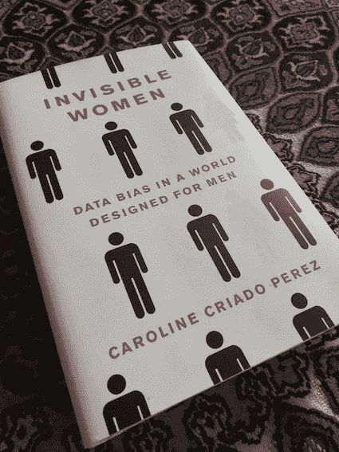

# 机器没有同理心，数据科学家应该有

> 原文：<https://towardsdatascience.com/machines-do-not-have-empathy-data-scientists-should-69b38a37ee45>

## 同理心是许多数据科学家忽视的解决问题的重要步骤。ML 民主化可能没有帮助！

之前我写了一篇关于[UX 研究和数据科学如何拥有非常相似的工作流程](https://uxdesign.cc/ux-data-science-smarter-decisions-6ea847c7288f)并可以互补以帮助解决问题和做出明智的决策的文章。在这篇文章中，我想重点介绍 UX 研究过程中的一个重要步骤(也称为设计思维)，这个步骤在数据科学解决问题的过程中被忽略了:*同理心*！

**什么是移情？为什么重要？以及如何在数据科学设计过程中应用？**

[https://unsplash.com/photos/IMfgE5lyMrU](https://unsplash.com/photos/IMfgE5lyMrU)

## 什么是共情？

> 移情是设计思维的第一步，它帮助研究者理解他人的感受、问题和处境。

移情被认为是设计思维的第一步，研究者可以通过感受用户的情绪来更好地理解问题。

# 为什么共情很重要？

缺乏同理心意味着你没有考虑到与你不相似的其他群体的感受。这导致了各种各样的偏差，包括选择偏差、刻板印象偏差、权威偏差、确认偏差、支持创新偏差、聚合偏差、评估偏差，以及其他各种各样的隐性和显性偏差。

作为一名数据科学家，您的偏见将影响您的 ML 模型设计，并导致有偏见的模型。一个非常著名的例子是选举结果预测，以及数据样本或模型有偏差的不同方式。例如，一些特朗普的支持者如何*感到害羞*，这误导了预测模型(见[此处](https://www.nytimes.com/2017/05/31/upshot/a-2016-review-why-key-state-polls-were-wrong-about-trump.html)和[此处](https://www.washingtonpost.com/politics/2020/11/25/which-2020-election-polls-were-most-least-accurate/))。

这些是数据科学家忽视同理心的一些症状:

*   你没有付出足够的努力来发现设计中的偏差
*   或者你知道模型或数据的偏差，但是忽略或隐藏它们
*   或者没有计划去纠正它们。

> 惊喜！惊喜！模特总是有偏见的！如果你想把同理心带到你的设计过程中，你应该努力理解这些偏见。

所有的模型，即使是大型 AI 公司建立的那些花哨的大模型，都是有偏差的。在我写这篇文章的时候，OpenAI 又一次以一种新的迷人的文本到图像生成模型出现在新闻中。E 2 。但是抛开炒作不谈，OpenAI 的科学家们也让人们意识到了它的偏见:

> 在一些地方，它过多地代表了几代女性(如提示:“空姐”)，而在另一些地方，它过多地代表了几代男性(如提示:“建筑工人”)。([https://github . com/open ai/dalle-2-preview/blob/main/system-card . MD # bias-and-representation](https://github.com/openai/dalle-2-preview/blob/main/system-card.md#bias-and-representation))

OpenAI/DALL 的 AI 生成图像截图。E 2 ( [环节](https://github.com/openai/dalle-2-preview/blob/main/system-card.md#bias-and-representation))

## 错误的假设

现在你可能会说，我们希望建立模型来帮助企业发展，只要我们覆盖了大多数，我们就很好:错了！而且不得不说这种无视“长尾”的态度我见得多了。因此，我强烈建议数据科学家读一读卡罗琳·克里亚多·佩雷斯的《看不见的女人》这本书。这本书展示了仅仅是数据上的性别差距就让我们在全球 GDP 中损失了数万亿美元。

作者图片

> S o，如果你*使用只考虑多数人*的指标，如果你不能确保少数人在你的数据中得到适当的反映，你就没有表现出同理心；更糟糕的是，如果你没有意识到你的模型的偏差，你正在花费企业一大笔钱，而你不知道问题在哪里。

# 在数据科学过程中，在哪里应用共情？

我坚信换位思考是解决问题的一个重要部分。如果您对收集的数据和 ML 模型有很好的了解，您的数据缺乏什么，您选择的模型在哪里表现最好，它在哪里有偏差，以及它对什么情况/用户不起作用，那么您在您的数据科学过程中表现出了同理心。

另一方面，你没有在你的 ML 设计中表现出同理心，如果:

1 你在完全理解问题之前就开始寻找解决方案。

2 您在没有对数据进行大量预先分析的情况下训练模型。

3 你只使用了错误的、非包容性的指标，比如纯粹的准确性。

4 您只通过微调模型的参数来关注改进度量分数，并决定完全基于分数来部署您的模型。

在将模型投入生产之前，你忽略了进行适当的误差分析。

现在，我们都同意在数据科学设计过程中具有同理心的重要性，让我提供几个实际的例子。

## 示例 1 — AutoML 和 ML 民主化

尽管这在很大程度上是设计师和产品经理的责任，但作为一名数据科学家，你也应该对模型的最终用户感同身受。比如你的模型对用户体验有什么影响？了解整个过程，而不仅仅是关注输入和输出。你的模型预测对用户的感受有多敏感？你的用户只是想从模型中得到一些指导，更愿意自己成为最终的决策者，还是希望模型为他们做决定？他们想要透明吗？他们需要实时结果吗？

相反，AutoML*和类似的工具最近引起了很多人的兴趣，也许它们还会存在一段时间。它们受欢迎的主要原因无非是让每个人的 ML 设计过程更加容易和快速(数据输入，预测输出)。AutoML 等有一个有效的观点:机器学习的民主化。然而，危险在于将人类排除在整个过程之外。

**所以，如果你正在使用 AutoML(或者表现得像个 AutoML！)只是为了挑选最准确的模型而不考虑上述重要的用户关注点，你在你的 ML 模型设计过程中没有同理心！**

## 示例 2 —搜索引擎

另一个非常明显的例子是改进搜索引擎，无论是搜索工作列表还是一长串待售商品。了解用户使用当前搜索引擎的原因。这将需要大量的数据挖掘，以了解各种用户行为，然后再开始构建或改进搜索引擎。你甚至可以请你的 UX 团队帮助你组织一些与最终用户的直接面谈。**解决这个问题的非同理心方法是只关注使用不同的模型，并根据 CTR、MAP、nDCG 等决定使用哪个模型。**

# 结论

同理心是解决问题的重要一步，但却被许多数据科学家完全或部分忽视了。我发现自己在我们的社区中一遍又一遍地倡导在这个过程中要有同理心，以减轻偏见。使用 AutoML 和其他自动建模，以及自动样本标记，应该谨慎。一个模型得分高不代表它没有偏见。