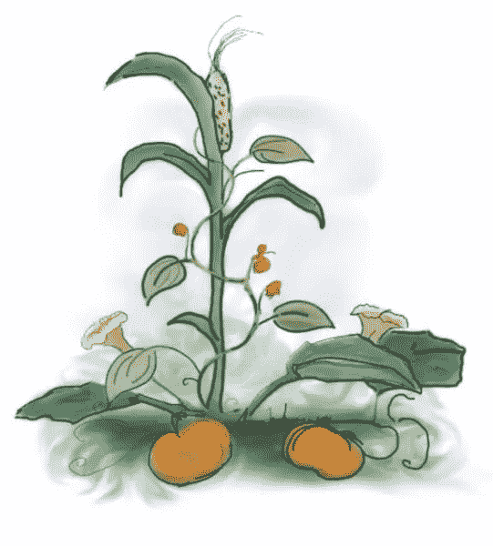
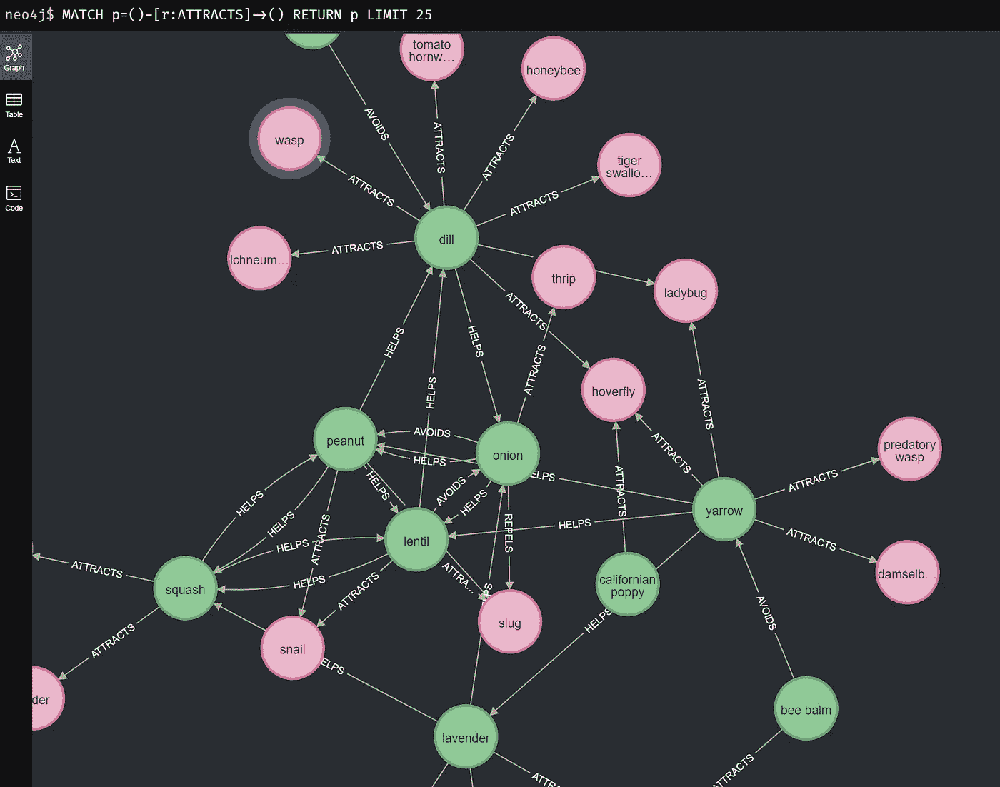
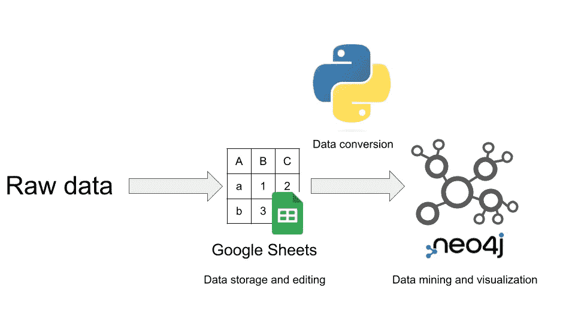
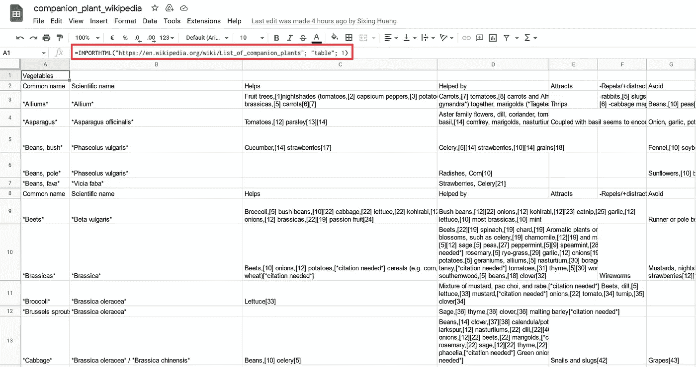
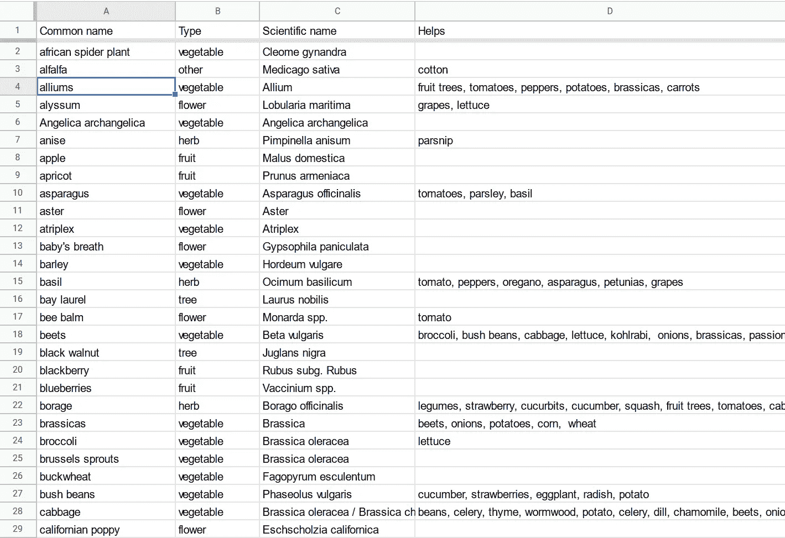
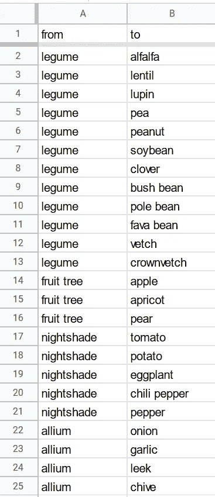
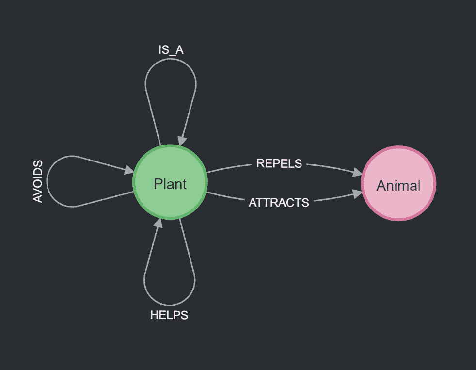
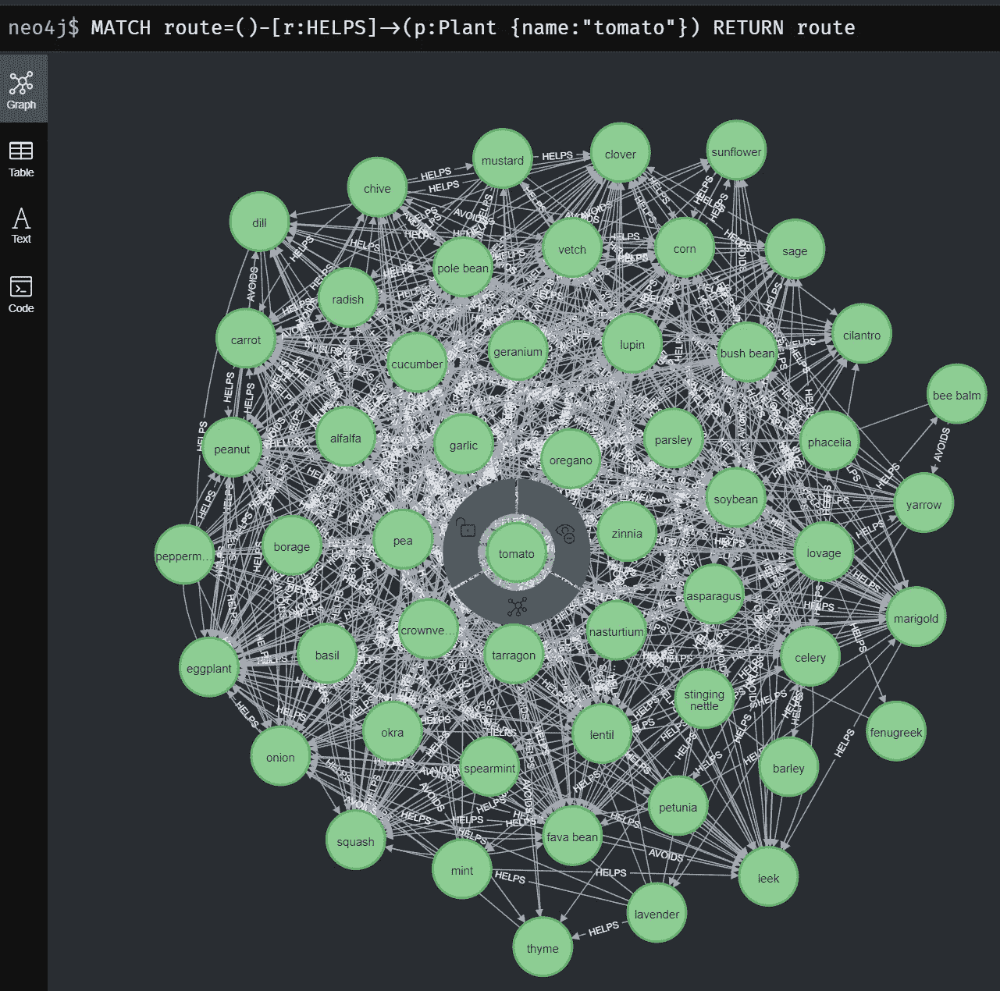

# 在 Google Sheets 和 Neo4j 中维护一个配套的植物知识图表

> 原文：<https://towardsdatascience.com/maintain-a-companion-plant-knowledge-graph-in-google-sheets-and-neo4j-4142c0a5065b>

## 将数据存储在表格中，并从图表中获得洞察力

[Anna Juchnowicz 的三姐妹同伴种植技术](https://upload.wikimedia.org/wikipedia/commons/8/84/Three_Sisters_companion_planting_technique.jpg)在知识共享署名‐共享相似 4.0 许可下使用( [CC BY‐ SA 4.0](https://creativecommons.org/licenses/by-sa/4.0/deed.en)

尽管[有足够 100 亿人吃的食物](https://www.researchgate.net/publication/241746569_We_Already_Grow_Enough_Food_for_10_Billion_People_and_Still_Can%27t_End_Hunger)， [10%的世界人口仍然经常饿着肚子睡觉](https://www.actionagainsthunger.org/world-hunger-facts-statistics)。气候变化、新冠肺炎和乌克兰战争加剧了粮食危机。虽然养活世界人口(2022 年为 80 亿)已经够困难了，但为未来人口(2050 年为 98 亿)生产和分配足够的食物将更具挑战性，特别是当表土、农业知识和土壤生物多样性的损失继续对我们不利的时候。

面对大规模的粮食危机和气候变化，我们需要改革我们目前不可持续的农业。在水培和[水培](https://medium.com/the-diy-diaries/how-to-build-a-solar-aquaponics-with-plastic-bottles-16efa1a65e2c)这几种替代方案中，老友记种植确实值得我们关注。这是一种在附近种植不同植物的农业实践，这些植物通过提供养分、吸引有益昆虫或抑制害虫而相互支持。与单一种植相比，配套种植更高产，也更环保。一个众所周知的例子是[三姐妹](https://en.wikipedia.org/wiki/Three_Sisters_%28agriculture%29):西葫芦、玉米和豆类(标题图)。豆类用它们的共生细菌固定氮。南瓜用它宽大的叶子保护土壤免受恶劣天气的影响，用它的毛发驱赶害虫。玉米是豆子攀爬的天然棚架。它们一起可以保护土壤免受侵蚀并提高生产力。

人类已经实践了几千年的同伴种植，并积累了关于这个主题的广泛知识。这些知识被编成表格，比如维基百科上的[这个](https://en.wikipedia.org/wiki/List_of_companion_plants)。使用 Google Sheets 等工具可以很容易地修改和维护表格。但是对于像伴生植物数据这样的关系丰富的数据，表格并不是我进行可视化分析的首选。相比之下，网络图(图 1)可以很容易地显示植物之间错综复杂的联系。我们还可以执行图形查询和基于图形的算法来获得对数据的新见解。

图一。伙伴植物和动物在 Neo4j 中可视化为图形。图片作者。

但是像 Neo4j 这样的图形数据库中的数据编辑并不像在表格中那么简单。虽然 graph app**[**Neo4j Commander**将数据编辑带入了 Neo4j 平台](https://medium.com/p/e94c7311dfab)，但其用户体验与我们从 Google Sheets 中所能得到的还是相差甚远。我们能否通过一个真实的来源，既能轻松编辑数据，又能轻松绘制图表？**

****

**图一。此项目中的数据流。原始数据首先被接收到 Google Sheets 中。经过处理后，数据由 Jupyter 笔记本转换成 Neo4j 图形。图片作者。**

**在这篇文章中，我想向你展示我的解决方案。我把维基百科上的伴生植物数据存储在谷歌工作表中。这是我唯一的真理来源。然后，我使用 Neo4j Desktop 创建一个本地知识图。Python Jupyter 笔记本作为桥梁。笔记本从 Google Sheets 下载并格式化数据。然后在 Neo4j 中删除旧数据并导入新数据(图 1)。然后我们将对 Cypher 和 Python 中的知识图进行一些数据挖掘。例如，我将使用 Neo4j 的图形数据科学(GDS)库中的度中心性算法来计算我们可以在马铃薯周围种植的最大的互助植物集。**

**本文的代码存放在我的 GitHub 存储库中。**

**<https://github.com/dgg32/companion_plants_2>  

这个项目中的数据来自维基百科，受[知识共享署名共享许可](https://www.google.com.hk/url?sa=t&rct=j&q=&esrc=s&source=web&cd=&cad=rja&uact=8&ved=2ahUKEwjhpfWUn-T5AhUcl1YBHU1FC_AQFnoECBkQAw&url=https%3A%2F%2Fen.wikipedia.org%2Fwiki%2FWikipedia%3AReusing_Wikipedia_content&usg=AOvVaw2Ef9JwbupF4y-KQhpl9CUS)保护。谷歌表单在这里。

<https://docs.google.com/spreadsheets/d/1U4K93EeOU6V4SZ9AgI3wOeV4kgdW9TmKSY_pIypDA-A/edit#gid=0>  

# 0.准备

首先，在您的 Neo4j 桌面中创建一个名为“companion plants”的 Neo4j 项目。打开其`import`文件夹("……"➡️"打开文件夹"➡️"导入)。复制看似随机的数据库字符串(dbms-xxxxxx)，在 config.yaml 中设置为`neo4j_project_id`的值，另外在`config.yaml`中填写其他细节。

此外，您需要在`Plugins`选项卡中启用 GDS 库。

# 1.将配套工厂数据集加载到 Google Sheets 中

我的表格是基于维基百科 上的 [*伴生植物列表。数据被分成五个表:蔬菜、水果、草药、鲜花和其他。然后，我使用`IMPORTHTML`函数将数据提取到五个谷歌表单中，并将它们合并到一个主表中。*](https://en.wikipedia.org/wiki/List_of_companion_plants)

图二。IMPORTHTML 函数从 Wikipedia 中检索数据，并填充 Google Sheets 中的表。该图显示了五个原始数据表中的一个。图片作者。

之后，我手动整理数据。我首先纠正了几个错别字，清除了一些类似“几乎所有东西”的模糊术语，添加了许多数据条目，并对同义词进行了规范化(左图 3)。最后，我为分类法构建了一个表(图 3 右侧)。

图 3。Google Sheets 中两个手动管理的表格。左图:伴生植物。右:分类学。图片作者。

为了简单起见，我将 Google Sheets 设置为一般可访问，这样`pandas`库就可以在我的脚本中轻松加载数据。而且因为数据在公共领域，所以对于这个项目来说是可以的。但是如果你的项目数据是保密的，你最好在 Google Sheets 中设置一个更严格的访问策略，在你的 Python 脚本中使用`gsheets`库。

# 2.蟒蛇桥

中间件由三个文件组成:一个 Jupyter 笔记本、一个`config.yaml`和一个包含所有 Neo4j 命令的文本文件。`Config.yaml`包含本地 Neo4j 凭证和其他用户数据。Python Jupyter 笔记本连接了 Google Sheets 和我的 Neo4j 数据库。

来自 Google Sheets 的数据可以用`pandas` 中的`read_csv`函数直接读取(清单 1)。

清单 1。通过 pandas read_csv 从 Google Sheets 加载数据。

然后，脚本遍历表中的单元格，并拆分逗号分隔的内容。它们大多是植物和动物的名字。该脚本将复数形式单数化，解析同义词，并将伞形分类群具体化(“豆科”变成“灌木豆”、“苜蓿”等等)(清单 2)。它还将节点和关系存储在变量中，如`nodes_plant`和`plant_plant_help`。

清单 2。名称规范化。

之后，脚本将这些变量写入 TSV 文件。例如，下面的代码为工厂节点创建文件。

清单 3。将节点和关系写入 TSV 文件。

然后，该脚本连接到本地 Neo4j 实例，并清除所有约束和旧内容。

清单 4。连接到 Neo4j 并删除数据库。

然后它将所有新生成的 TSV 文件复制到我的项目的`import`文件夹中。

清单 5。文件传输到导入文件夹。

最后，脚本执行`neo4j_command.txt`文件中的导入命令。这些命令将 TSV 文件导入知识图并创建相应的约束。

清单 6。Neo4j 命令的执行。

清单 7。Neo4j 命令。

知识图有如下简单的模式。它代表了各种植物和动物之间的支持和对抗关系。

图 4。知识图的模式。图片作者。

# 3.伴生植物知识图

一旦数据加载完毕，我们就可以开始探索知识图了。图中有 162 个植物节点、71 个动物节点和 2182 个关系。在这些关系中，我们观察到 1455 个`HELPS`和 404 个`AVOIDS`关系。

## 3.1 哪些植物是西红柿的好伴侣？

如果我们想种西红柿，让我们来看看哪些植物是好伙伴。

清单 8。获取番茄的伴生植物的 Cypher 查询。

图 5。番茄的伴生植物。图片作者。

事实证明，许多植物可以帮助我们种植西红柿。例如，罗勒、琉璃苣、大蒜和金盏花都可以驱除害虫，而细香葱、薄荷和欧芹可以让番茄更健康。但是我们应该避免卷心菜、茴香和核桃树。

## 3.2 最避免的植物

正如上面的例子所示，有一些对抗性的组合，我们最好避免一起生长。例如，核桃合成了一种叫做[胡桃醌的](https://www.thespruce.com/companion-plants-for-tomatoes-1403289)[化感](https://en.wikipedia.org/wiki/Allelopathy)化合物，可以抑制番茄的生长。在这里，让我们看看哪些植物是数据集中最避免的。

清单 9。创建最避免的植物列表的 Cypher 查询。

根据维基百科，第一名应该是亚麻。然而，该数据条目已被标记为“需要引用”，我无法在其他任何地方验证该信息。相反，亚麻可以促进西红柿和土豆，因为它可以击退科罗拉多马铃薯甲虫。为了安全起见，我清除了它的回避关系。然后茴香成为第一名。茴香的根分泌抑制甚至杀死许多花园植物的物质。事实上，莳萝是唯一能长在茴香旁边的东西。除此之外，自己种[ [1](https://www.fpconservatory.org/wp-content/uploads/2018/11/3-Companion-Planting-PDF.pdf) ]。

## 3.3 计算马铃薯的最大无规避支持植物网络

让我们假设我们想在一大片地里种土豆。我们想在那里种植最具生物多样性的植物。但是有一个限制，在社区中不允许有“回避”关系。换句话说，该组中不应有任何对抗性植物对。请注意，可以有多个这样的最佳列表。

我谷歌了一下，但找不到任何解决办法。所以我自己用 Python 开发了两个算法。这两种算法都是从能够促进马铃薯生长的植物列表开始的。

清单 10。获取马铃薯伴生植物的代码。

这个最初的列表包含苜蓿、芸苔、大蒜、洛伐他汀等等。

对于每一株植物，我计算它与其他植物有多少避免关系(清单 11 中的第 12–19 行)。

在第一轮中，大蒜和名单上的其他 13 种植物长得不好。它也是回避关系最多的植物。因此，我将大蒜从支持植物列表中删除(清单 11 中的第 24–29 行)。然后，算法重复这个过程(清单 11 中的第 8–29 行),直到再也找不到避免关系。如果有多于一个的植物具有相同的避免量，代码会随机删除其中的一个(清单 11 中的第 25–27 行)。

清单 11。从支持植物列表中连续删除最避免的植物的代码。

在我的一次运行中，这个算法依次删除了大蒜、韭菜、细香葱、洋葱等等。最终的清单包含以下 22 种植物:紫花苜蓿、罗勒、卷心菜、胡萝卜、三叶草、玉米、皇冠草、死荨麻、亚麻、山葵、扁豆、川芎、羽扇豆、金盏花、薄荷、豌豆、花生、菜豆、大豆、龙蒿、野豌豆和蓍草。

第二个算法使用来自 GDS 的度中心性来决定在每次迭代中移除哪个植物。度中心性算法用于查找图中的流行节点。在我们的例子中，我用它来寻找最避免的植物。该算法测量来自每个节点的传入或传出(或两者)关系的数量，并将该度量存储在 pandas 数据帧的“score”列中。它的实现不同于“while”循环中的第一个。

清单 12。通过 GDS 的度中心性，从支持植物列表中连续删除最避免的植物的代码。

在每次迭代中，该算法首先将支持植物及其回避关系投影到一个[图形对象](https://neo4j.com/docs/graph-data-science-client/current/graph-object/)(清单 12 中的第 14–17 行)。然后，它计算每个植物的度中心性分数(清单 12 中的第 19 行)，获取最“流行”的一个(清单 12 中的第 20–26 行)，并将其从支持植物列表中删除。当有多个植物具有相同的度中心性得分时，代码会随机删除其中一个。该算法不断重复，直到所有的度中心性分数都为 0(清单 12 中的第 34–35 行)。

每次运行该算法时，都会发现一组新的 22 株植物。但是一些植物，如蓍草和死荨麻，将总是在集合中，因为它们在子图中没有任何避免关系。两种算法都有效。你可以通过证明任何两种植物之间没有必然的联系来验证这些结果。

清单 13。验证两个伙伴工厂列表的 Cypher 查询。

但是度中心性方法用了 0.4 秒，而我的第一个算法用了 2.6 秒。

# 结论

本文向您展示了我如何用 Google Sheets 和 Neo4j 将复杂的植物关系编码成知识图。植物之间的共栖、共生和化感关系是复杂而令人敬畏的。我们可以在同伴种植中很好地利用这些知识。通过配套种植，我们不仅能减少化肥和农药的使用，还能让植物更有活力、味道更好。最后，它还可以帮助我们减少灌溉量。面对当前史无前例的全球干旱，后一点尤其重要。

表格和图表的结合具有两者的优点。本质上，本文中的工作流将关系数据库与图形数据库结合在一起。我们可以在表格中轻松地编辑数据，并在图表中轻松地分析它们。我在这个项目中使用了 Google Sheets。但是对于其他大型项目，我们可以使用 PostgreSQL 甚至雪花或者 BigQuery。一旦数据加载到 Neo4j 这样的图形平台上，我们就可以使用图形查询和算法来检查数据，并通过 Cypher 或 Python 获得有趣的结果。你可以阅读由[托马兹·布拉坦尼克](https://neo4j.com/blog/contributor/tomaz-bratanic/)撰写的[本](https://neo4j.com/developer-blog/using-neo4j-graph-data-science-in-python-to-improve-machine-learning-models/)和[本](https://neo4j.com/developer-blog/get-started-with-neo4j-gds-python-client/)来学习更多关于在 Python 中使用 GDS 的知识。Python 桥还允许我们控制哪个子集的数据流向图。当您的完整数据集太大而不适合小型 Neo4j 实例时，这尤其有价值，您可以只选择和导入相关的子集。或者当我们在一个团队中工作时，我们可以根据每个团队成员的请求或访问级别来切片然后交付数据。事实上，阿斯利康制药公司已经在他们的内部知识图应用程序中构建了一个类似的数据流。

通过将配套的植物表编码成知识图，我已经使这一宝贵的农业知识可供所有人搜索和扩展。但是也有改进的余地。你能提出一个更好的算法来计算土豆的最大无规避支持植物集吗？我鼓励你验证这个知识图表中的信息，甚至制作你自己的版本。

<https://dgg32.medium.com/membership> **