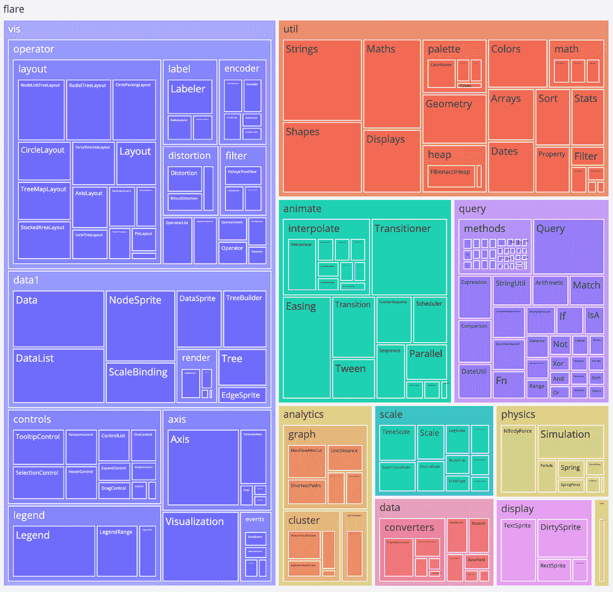

# 如何用 Python 制作树形图

> 原文：<https://towardsdatascience.com/make-a-treemap-in-python-426cee6ee9b8>

## 使用 Plotly 制作一个带有滑块的树形图来调整深度



完整的最终树形图—滚动到底部进行交互式可视化(图片由作者提供)

**简介**

树形图是一种用于显示分层数据的可视化方式。传统的树形图由嵌套的矩形组成，然而，也有由嵌套的圆形组成的圆形树形图。总的来说，任何适合嵌套的形状都可以使用。树形图最适合用来显示与其父节点大小成比例的节点。

**数据集**

正在使用的数据集是 flare.json，它包含有关 flare 类的分层数据。该数据包含每个节点的名称、子节点以及每个节点的值，这些值将用作树图中节点的大小。

在这里下载:[https://github . com/kruthik 109/Data-Visualization/blob/main/Advanced-Visualizations/flare . JSON](https://github.com/kruthik109/Data-Visualization/blob/main/Advanced-Visualizations/flare.json)(博斯托克，2021)

**系统要求**

本文中的 treemap 将使用 Python 中的 Plotly 库构建，因为它易于使用，并且能够添加交互式功能，如控制深度的滑块和工具提示。需要的库是 json、anytree、ipywidgetsm、plotly 和 pandas 库。我使用 Google Colab 来实现我的可视化，因为它简化了库导入过程。

```
import json
!pip install anytree
from anytree import PostOrderIter
from anytree.importer import DictImporter
import ipywidgets as widgets
import plotly.graph_objs as go
import pandas as pd
```

**第一步:导入数据**

数据被格式化为 JSON 文件。为了便于使用，用 JSON 库导入文件。

```
with open(‘flare.json’) as f:
   js_data = json.loads(f.read())
```

JSON 格式很难处理，所以使用 anytree 库中的 DictImporter 来简化这个过程。该库通过直接访问子节点、父节点和遍历命令，以与树相同的方式转换要访问的数据。

```
#imports dictionary in a tree form
importer = DictImporter()
root = importer.import_(js_data)
```

**步骤 2:计算所有节点的大小**

在 flare 数据中，只有叶节点附有值。要获得每个节点的大小，请将每个对应叶节点的值相加。下面的递归算法使用 DFS 的一种改变形式，它从叶节点开始，递归地将子节点值添加到父节点。

```
def format(node):
   for i in node.children: #check if node as attribute value
      if hasattr(i, ‘value’) == False:
          format(i) #check if node parent as attribute value
      if hasattr(i.parent, ‘value’):
         i.parent.value += i.value #if node parent doesn’t have a value set to same val as child
      elif hasattr(i.parent, ‘value’)== False:
         i.parent.value = i.value #insert step 3 code hereformat(root)
```

**第三步:树形图的格式参数**

为了在 Plotly 中制作树形图，所使用的参数必须是列表或数据帧格式。在下面的代码中，创建了三个列表，一个用于大小、名称、父节点和级别，这将在步骤 5 中进一步讨论。这段代码将被插入到格式函数的末尾

```
size = []
name = []
parent = []
level = []#append parent to parent list
parent.append(i.parent.name)
#append node name to name list
name.append(i.name)
#append node size to size list
size.append(c)
#get the level of each node by taking the length of its ancestors
#used for step 5
level.append(len(i.ancestors))
```

在 format 函数中，根节点的数据不会被追加到列表中，因为它不是子节点，所以我们在 format 函数之外添加这些值。

```
#append attributes for root
level.append(0)
name.append(root.name)
parent.append(“”)
size.append(root.value)
```

**第四步:创建树形图**

使用上面的列表，创建树形图。Plotly 中的 treemap 函数有两个必需的参数，即标签和双亲。标签列表对应于为每个节点显示的文本。父列表用于确定当前节点将嵌套在哪个节点中。值列表是可选的，用于为每个节点指定大小。尺寸列表包含每个节点的尺寸，如果没有给出，尺寸将由 Plotly 自动确定。

```
#create plotly figure
fig = plotly.graph_objs.Figure()
fig.add_trace(plotly.graph_objs.Treemap(
   labels = name,
   parents = parent,
   values = size
))#show figure
fig.show()
```

**第五步:添加滑块(可选)**

Plotly 中的树形图有许多级别，根据数据的深度和复杂性，树形图可能会变得难以解释。这个问题的解决方案是添加一个滑块，这将允许用户控制可视化中显示的深度以提高可读性。上面创建的代码，加上一些额外的东西，可以很容易地修改成包含一个滑块。

**步骤 5a:创建深度参数**

首先，如第四步所示，确定每个节点深度的 level 参数将用于控制滑块改变时显示哪些节点。anytree 库提供的 node.ancestor 功能简化了这个过程。如果使用 Python 中的传统节点类，可以进行遍历来计算每个节点的祖先的数量。

**步骤 5b:用参数**创建数据帧

第二步是创建一个数据框，将第三步中创建的列表作为列。这是下一步创建新的树形图所需要的。

```
#create DataFrame
df = pd.DataFrame()
df[‘parent’] = parent
df[‘name’] = name
df[‘value’]= size
df[‘level’] = level
```

**步骤 5c:用滑块值创建树形图的函数**

使用第四步中创建的 DataFrame，创建一个函数来创建树形图和滑块。除了使用数据框中的列而不是列表之外，树状图的制作方式与第四步中的类似。使用一个简单的 DataFrame filter 命令将滑块合并到树形图中。第一个文件服务器正在检查该级别中的哪些节点小于当前滑块值。第二个过滤器是相应列的名称。

```
#create figure and slider
def update(sliderVal):
   fig = plotly.graph_objs.Figure()
   fig.add_trace(plotly.graph_objs.Treemap(
      labels = df[df[‘level’]<sliderVal][‘name’],
      values = df[df[‘level’]<sliderVal][‘value’],
      parents = df[df[‘level’]<sliderVal][‘parent’]))
```

将根部颜色更新为浅灰色，以提高清晰度，因为原始颜色是白色。然后调整节点大小，使其与带有 branchvalues 的父节点成比例。更改布局以适应所需的空间。我把高度和宽度调整为 900 乘 900。

```
fig.update_traces(root_color=”#f1f1f1", branchvalues =’total’, width = 900, height = 900)
```

显示调整后的图。

```
fig.show()
```

**步骤 5d:创建 Widget 并连接更新功能**

将微件连接到更新功能，并将滑块的范围从最小深度设置为最大深度。

```
widgets.interact(update, sliderVal = (0, 5))
```

**最终输出**

作者可视化

将鼠标悬停在上面可视化效果中的节点上，以查看它们的值。单击一个节点以放大并查看其子节点的更详细视图。使用滑块控制要在可视化中显示的节点深度。目前，滑块处于最大值，因此向下滑动将减少细节。

**结论**

用 Plotly 制作的树形图可以清晰地显示分层数据。查看者能够看到节点与其父节点成比例的大小，这对于比较非常有用。树形图只是可用于分层数据的一种可视化形式。请继续关注我的下一篇文章，我将讨论更多类型的分层数据可视化。

完整代码可以在这里找到:[https://github . com/kruthik 109/Data-Visualization/blob/main/Advanced-Visualizations/enclosure _ diagram . ipynb](https://github.com/kruthik109/Data-Visualization/blob/main/Advanced-Visualizations/enclosure_diagram.ipynb)

**引文**

博斯托克，M. (2021，10 月 27 日)。具有 Flare 类层次结构的 JSON 文件。[https://gist . github . com/MBO stock/1044242 # file-readme-flare-imports-JSON。许可证:gpl-3.0](https://gist.github.com/mbostock/1044242#file-readme-flare-imports-json.)