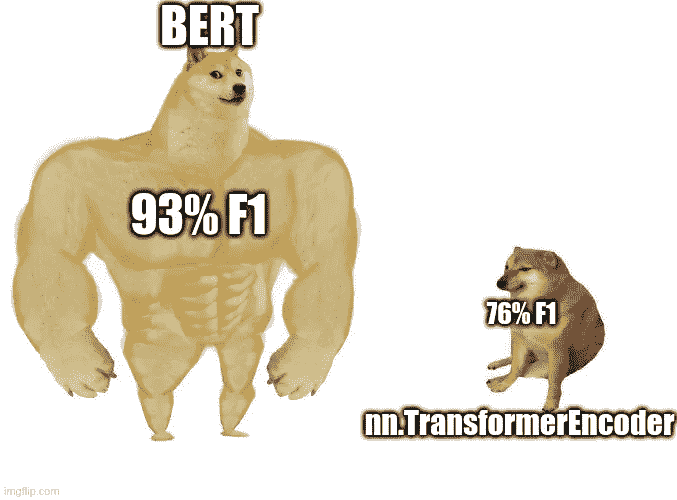
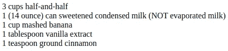
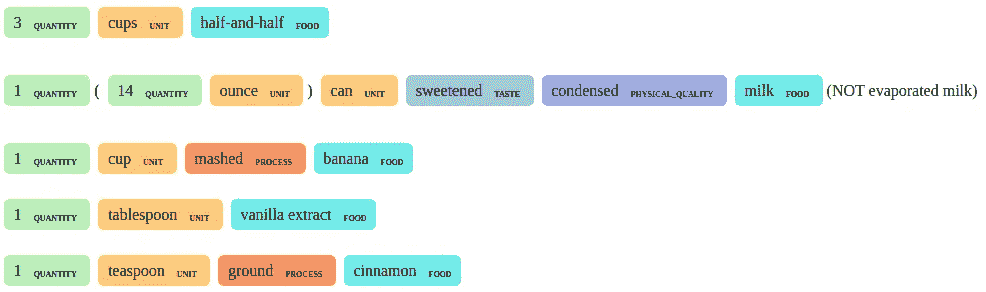
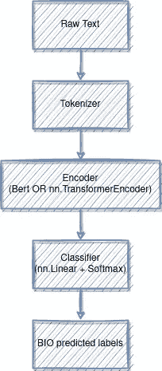
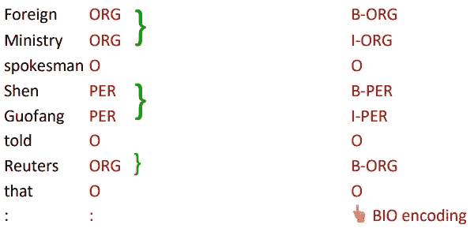
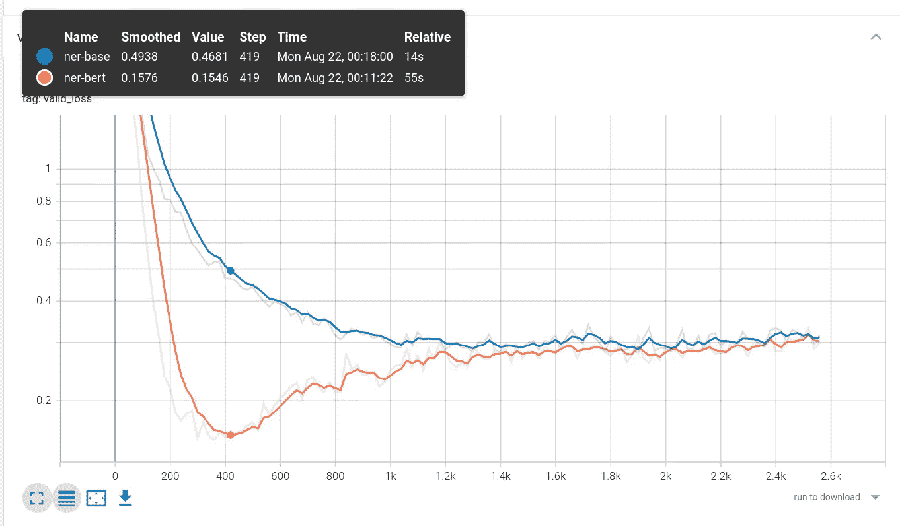
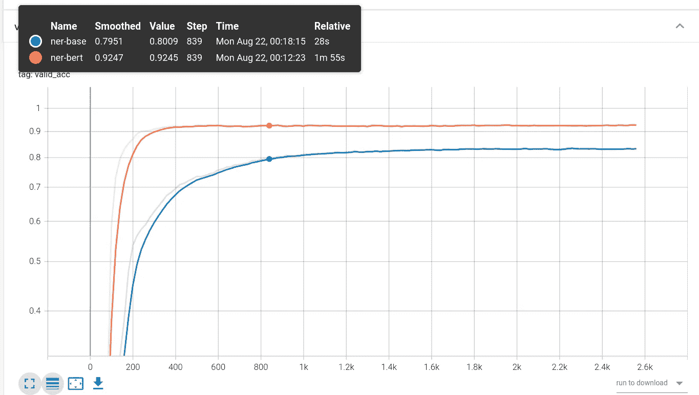

# 通过微调 Bert 充分利用您的小型 NER 数据集

> 原文：<https://towardsdatascience.com/make-the-most-of-your-small-ner-data-set-by-fine-tuning-bert-98a2c8b544f7>

## 利用大型语言模型来提高模型的性能



作者图片

在小数据集上训练 NER 模型可能是一件痛苦的事情。当只对几百个样本进行训练时，很难建立一个模型来很好地概括非平凡的 NER 任务。这类问题我们将在本帖中尝试解决。

首先，我们将定义任务。然后，我们将描述模型架构的不同变化，然后比较预训练模型与从头开始训练的模型之间的结果。

# 问题是

我们将解决一个应用于食谱数据集的 NER(命名实体识别)问题。这项任务的目标是从原始文本中提取标记实体形式的结构化信息。



原始文本



标记文本

我们的目标是给原始文本的每个实体分配正确的标签。

我们将使用的数据集很小，大约有 700 个句子。这是这项任务的主要挑战，也是预训练模型可以大放异彩的地方，因为对它们进行微调可以将预训练步骤中学习到的表示重新用于手头的任务。

# 模特们

## 建筑:

我们模型的基本架构是:



模型架构(图片由作者提供)

## 标记方案:

上面提到的生物标签是一种在从原始文本生成的标记序列上编码标签的方法，如下所述:



来源:https://x-wei.github.io/notes/xcs224n-lecture3.html

每个{LABEL}实体的起始标记被标记为 B-{LABEL}，同一实体的每个其他标记被标记为 I-{LABEL}。所有其他令牌都标记为 o。

## 实施:

我们将为伯特使用拥抱脸变形金刚库。我们可以像插入任何其他火炬层一样插入预训练模型，因为它是 nn.Module 的一个实例。

在模型的 __init__ 中，我们可以这样做->

```
from transformers import BertConfig, BertModelclass BertNerModel(BaseModel):
    def __init__(
        self,
        ...
        dropout=0.2,
        bert_path=None,
        ...
    ):
        super().__init__()

        ... self.bert = BertModel(config=CONFIG)

        ...

        if bert_path:
            state_dict = torch.load(bert_path)
            self.bert.load_state_dict(state_dict)

        self.do = nn.Dropout(p=dropout)

        self.out_linear = nn.Linear(CONFIG.hidden_size, n_classes)
```

其中 CONFIG 是 BertConfig 的实例，从 JSON 文件初始化。

然后，在向前的方法中，我们做:

```
def forward(self, x):

    mask = (x != self.pad_idx).int()
    x = self.bert(
        x, attention_mask=mask, encoder_attention_mask=mask
    ).last_hidden_state
    # [batch, Seq_len, CONFIG.hidden_size]

    x = self.do(x)

    out = self.out_linear(x)

    return out
```

我们首先为填充标记生成一个掩码，然后将输入提供给 BERT 模型。我们从 BERT 的输出中提取最后一个隐藏层，然后通过线性分类器层来产生每个类的分数。

作为比较，我们也将使用 nn.TransformerEncoder 从头开始训练一个模型。你可以在这里找到所有的。

# 结果呢

我们使用 Tensorboard 跟踪损失指标:



验证损失(橙色:BERT，蓝色:nn。变压器编码器)



令牌级精度(橙色:BERT，蓝色:nn。变压器编码器)

我们可以看到，基于微调 BERT 的模型比从零开始训练的模型概括得更好。以下 F1 分数进一步证实了这一点:

## 验证集的 F1 分数:

BERT 初始化: **92.9%**

nn。变压器编码器: **76.3%**

## 在 3080 RTX GPU 上的推理速度(批量大小为 1):

BERT 初始化:43 句/秒

nn。TransformerEncoder: 303 句/秒

# 结论

通过使用预先训练的模型，我们能够获得额外的 **16% F1** 积分。由于拥抱脸的变形金刚库和 PyTorch，这很容易做到，但代价是推理速度较慢。然而，我们仍然可以使用权重量化或模型提取来缓解推理延迟问题，同时保持 F1 的大部分性能。

您可以在这个库中找到重现所有这些结果的代码:[https://github.com/CVxTz/ner_playground](https://github.com/CVxTz/ner_playground)

数据集:[https://github.com/taisti/TASTEset/tree/main/data](https://github.com/taisti/TASTEset/tree/main/data)(麻省理工学院许可)

感谢阅读！