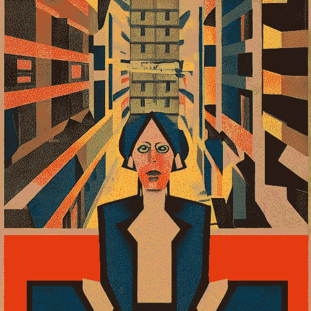
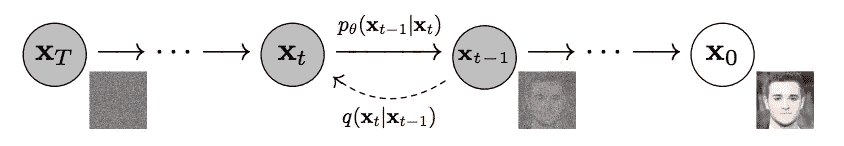
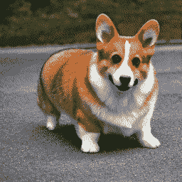
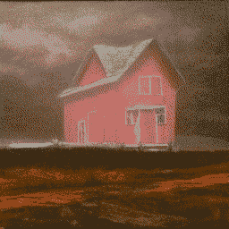
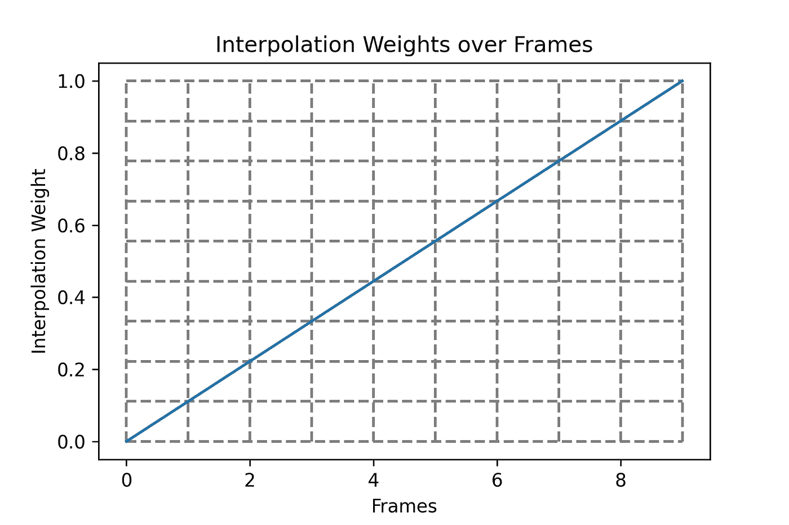
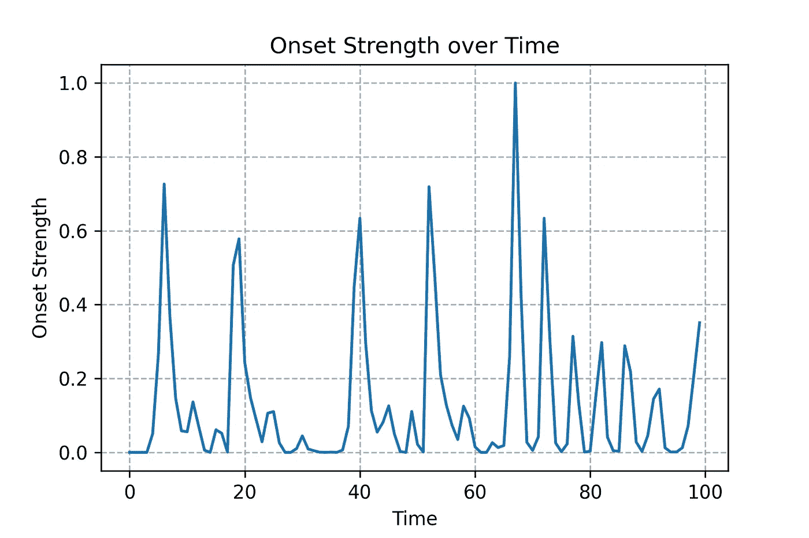
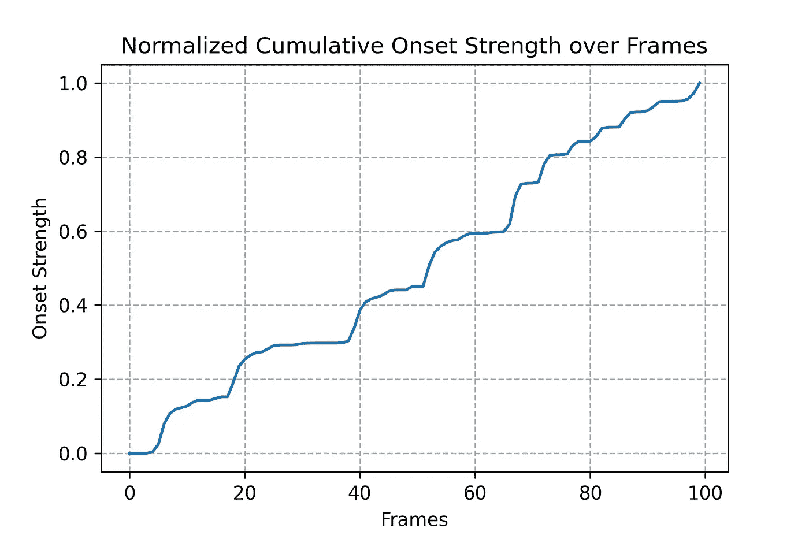
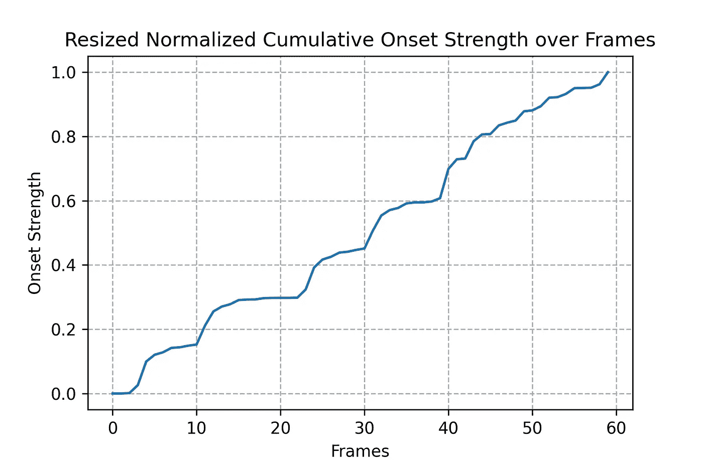
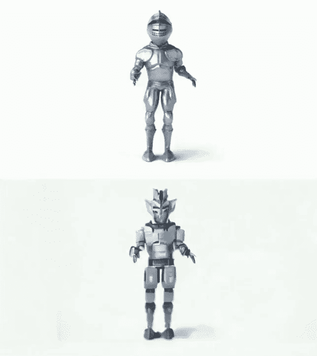

# 用稳定的扩散动画让你的艺术动起来

> 原文：<https://towardsdatascience.com/make-your-art-move-with-stable-diffusion-animations-80de62eec633>

## 介绍 Giffusion，这是一个简单的 web UI，用于创建具有稳定扩散的动画 gif 和视频



作者图片

随着稳定的传播，互联网变得热闹起来——它正在慢慢成为创造美丽视觉效果的必备工具。如果你想让你的视觉效果更上一层楼，那么用稳定扩散制作的动画是个不错的选择。

您不再需要花费数小时来创建传统动画，通过稳定的扩散，您可以立即让您的视觉效果栩栩如生。所以，让我们打开这个神奇的工具，看看如何使用它来创建令人惊叹的动画！

在这篇文章中，我将介绍一些用于创建稳定扩散动画的技术。

# 一些背景信息

在事情开始之前，我们需要熟悉一些概念。

第一个是扩散模型如何工作。简单来说，这些模型把噪音变成图像。在训练过程中，这些模型学习反转一个*去噪* *过程*，该过程通过一个[调度函数](https://huggingface.co/docs/diffusers/v0.10.2/en/api/schedulers#what-is-a-scheduler)以固定的步数逐渐将噪声添加到图像中，直到图像与随机噪声无法区分。

一旦经过训练，我们就可以通过传入图像整形噪声张量来使用该模型生成图像，并通过使其迭代通过该模型来将其去噪到图像中。



正向和反向扩散过程([来源](https://arxiv.org/pdf/2006.11239.pdf))

上图中，密度函数 ***q*** 指的是正向去噪过程。这意味着，前向过程基于时间步长***t-1****处的样本和时间步长**处的噪声调度函数的值来估计时间步长****t****处的噪声样本***

**密度函数**重复该过程，直到创建图像。****

**我们需要掌握的下一个概念是潜在扩散。这就是稳定扩散模型的动力。**

**在普通扩散模型中，正向和反向过程对与图像张量具有相同形状的噪声张量进行操作。潜在扩散使用 VAE 模型，在执行正向和反向过程之前，首先将图像编码成潜在代码。**

**这使得该过程更快，因为该模型在低维潜在代码上操作，而不是在完整的图像成形张量上操作。**

**关于稳定扩散的另一件事是，它是文本引导的。这意味着图像生成过程由剪辑编码器产生的文本嵌入来指导。来自文本嵌入的信息通过交叉注意被结合到扩散过程中。**

**现在我们已经讨论过了，让我们继续制作一些动画。**

# **在两个图像之间过渡**

****

**作者图片**

**我们可以制作的最基本的动画是两幅图像之间的过渡。在上面的动画中，我们在提示`a picture of a corgi`和`a picture of a lion`之间创建了一个过渡。为了创建这个转换，我们需要定义几个值。**

1.  **图像之间要生成的帧数。`num_frames`**
2.  **动画的帧速率，以每秒帧数定义。`fps`**

**帧数将让我们知道我们期望在两帧之间生成多少个点，而帧速率将决定动画移动的速度。**

**我们已经介绍过潜在扩散是通过在图像的潜在代码上运行扩散过程来工作的。为了生成新的图像，我们创建一个与我们的潜在代码形状相同的噪声张量，并通过我们的模型将其与我们的剪辑文本一起嵌入。这将导致一个潜在的代码，我们可以传递到我们的解码器模型来创建图像。**

**这里有一些伪代码来演示这一点。**

```
**seed = 42
latent = torch.randn(
            (1, self.pipe.unet.in_channels, height // 8, width // 8),
            device=self.pipe.device,
            generator=generator.manual_seed(),
        )
text_embedding = get_text_embedding(["a photo of a corgi"])
output_latent = diffuse(text_embedding, latent)
image = decode_latent(latent)**
```

**文本嵌入和潜在都是张量。我们将为我们的开始和结束帧创建这些张量，并使用*插值*来填充帧之间的内容。插值是一种在两个已知数据点之间创建新数据点的方法。**

**为了在开始帧和结束帧之间创建指定数量的帧，我们将使用[球形线性插值](https://minibatchai.com/sampling/2022/04/24/Slerp.html)，因为[考虑了潜在空间的形状。](https://github.com/soumith/dcgan.torch/issues/14)你可以把球面线性插值想象成沿着两个单位法向量之间的一个角度生成向量。**

**插值函数接受两个张量和一个插值权重，插值权重决定了结果张量与起始值和结束值的接近程度。插值权重为 0.1 将产生更类似于起始张量的插值张量，而插值权重为 0.9 将产生更类似于结束张量的张量。**

```
**import numpy as np

def slerp(t, v0, v1, DOT_THRESHOLD=0.9995):
    """helper function to spherically interpolate two arrays v1 v2"""
    # from https://gist.github.com/nateraw/c989468b74c616ebbc6474aa8cdd9e53

    if not isinstance(v0, np.ndarray):
        inputs_are_torch = True
        input_device = v0.device
        v0 = v0.cpu().numpy()
        v1 = v1.cpu().numpy()

    dot = np.sum(v0 * v1 / (np.linalg.norm(v0) * np.linalg.norm(v1)))
    if np.abs(dot) > DOT_THRESHOLD:
        v2 = (1 - t) * v0 + t * v1
    else:
        theta_0 = np.arccos(dot)
        sin_theta_0 = np.sin(theta_0)
        theta_t = theta_0 * t
        sin_theta_t = np.sin(theta_t)
        s0 = np.sin(theta_0 - theta_t) / sin_theta_0
        s1 = sin_theta_t / sin_theta_0
        v2 = s0 * v0 + s1 * v1

    if inputs_are_torch:
        v2 = torch.from_numpy(v2).to(input_device)

    return v2

start_seed = 42
latent_start = torch.randn(
    (1, 4, 64, 64),
    generator=generator.manual_seed(start_seed),
)

end_seed = 43
latent_end = torch.randn(
    (1, 4, 64, 64),
    generator=generator.manual_seed(start_seed),
)

num_frames = 60
schedule = np.linspace(0, 1, num_frames)

in_between_latents = []
for t in range(schedule):
    in_between_latents.append(slerp(float(t), start_latent, end_latent))**
```

**我们也将同样的插值应用到文本嵌入中。**

```
**start_text_embedding = get_text_embedding(["a picture of a corgi"])
end_text_embedding = get_text_embedding(["a picture of a lion"])

for t in range(schedule):
    in_between_latents.append(slerp(float(t), start_text_embedding, end_text_embedding))**
```

**这导致生成的图像之间的平滑过渡。**

# **保留动画中的主题**

**你可能已经注意到，在早期的动画中，我们的柯基在动画过程中发生了巨大的变化。如果我们试图在我们的动画中创建一个焦点，这可能是非常不可取的。**

**为了避免这一点，我们可以使用[可组合扩散](https://energy-based-model.github.io/Compositional-Visual-Generation-with-Composable-Diffusion-Models/)。这种技术允许以保留单个组件的方式组合提示。**

**为了做到这一点，Composable Diffusion 根据分隔符分割输入提示，比如`|`**

```
**'a red house | a house in a lightning storm'**
```

**该提示将基于分隔符被分成两个提示，并被馈入具有相同潜在成形噪声张量的扩散模型。由该模型产生的结果潜在值将被平均为单个张量，并被发送到解码器模型。**

****

**作者图片**

**请注意，上面动画中的房子在整个动画过程中变化不大。这是因为提示符的各个组成部分是通过组合来组合的。**

**这种方法的伪代码:**

```
**prompt = ['a red house | a house in a lightning storm']
prompts = prompt.split('|')

text_embeddings = [get_text_embedding(prompt) for prompt in prompts]
latent_noise_tensor = torch.randn(
    (1, 4, 64, 64),
    generator=generator.manual_seed(start_seed),
)

output_latents = [diffuse(text_embedding, latent_noise_tensor) for text_embedding in text_embeddings]
final_latent = mean(output_latents)

image = decode_latent(final_latent)**
```

# **音频反应动画**

**到目前为止，我们已经讨论了如何使用球形线性插值在图像之间进行过渡。这种类型的插值在各个帧上产生彼此等距的点。**

****

**作者图片**

**请注意，X 方向上的每一步如何导致 Y 方向上的等量移动。**

**当尝试创建音频反应动画时，我们希望当有特定类型的音频事件(如鼓声)时，在我们的视觉效果中产生戏剧性的变化，否则保持我们的变化相对恒定。**

**要产生这样的变化，我们需要创建一个插值权重表，当帧包含音频事件时，它会快速变化，而当帧不包含音频事件时，它会保持相对恒定。**

**使用像`librosa`这样的音频分析库可以帮助我们检测这些音频事件。**

```
**import librosa

audio_input = "my_audio_file.mp3"

audio_array, sr = librosa.load(audio_input) 

onset_env = librosa.onset.onset_strength(audio_array, sr=sr)
onset_env = librosa.util.normalize(onset_env)**
```

**这个片段加载到一个音频文件中，并提取一个开始强度包络，向您显示音频事件发生的位置。此外，我们对包络进行了归一化，以便将值限制在 0.0 和 1.0 之间**

****

**作者图片**

**图表中的峰值对应于一段时间内音频文件中的事件。直接使用这个数组作为我们的插值权重调度将导致两个提示之间的非常抖动的运动，因为我们随着时间的推移不断地在 0.0-1.0 之间振荡。这无疑是有趣的，但对于更复杂的音频，它可能最终看起来非常嘈杂。我们希望能够驱动从一帧到下一帧的转换，这样我们就可以清楚地看到提示之间的转换。我们需要一个从 0.0 到 1.0 的单调递增函数**

**使用该数组的归一化累积和将产生我们需要的效果。**

```
**import numpy as np

cumulative = np.cumsum(onset_env)
cumulative = cumulative / max(cumulative)**
```

****

**作者图片**

**当我们从起点移动到终点时，插值时间表会随着时间的推移而增加。我们需要调整这个数组的大小，以匹配我们想要生成的帧数。**

```
**import numpy as np

def resize(onset_env):
    x = np.linspace(0, len(onset_env), len(onset_env))
    resized_schedule = np.linspace(0, len(onset_env), num_frames)
    return np.interp(resized_schedule, x, onset_env)

resized = resize(cumulative, num_frames)** 
```

****

**作者图片**

**现在，当我们在之间插值时，我们在音频开始事件期间获得快速过渡，否则获得平滑过渡。我们可以通过将音频信号分解为打击乐和谐波分量，并基于这些分量之一构建插值权重，来进一步改善转场。**

**作者图片**

# **使用初始视频输入创建动画**

**到目前为止，我们一直使用噪声张量作为输入来创建动画。但是也有可能需要利用现有的视频作为我们动画的基础。**

**稳定扩散通过图像到图像的转换支持这一工作流程。**

**图像到图像的工作流程不是使用随机采样的噪声张量，而是首先将初始图像(或视频帧)编码成潜在代码。我们将噪声添加到这个潜在代码中，并将其用作我们的输入噪声张量，同时运行稍微修改的扩散过程。**

**我们通过引入一个新的参数来修改扩散过程；实力。**

**“强度”参数控制在扩散过程中保留多少原始图像内容，其范围在 0.0 和 1.0 之间。较低的值(高达 0.5)倾向于更多地保留原始图像内容，而较高的值会改变图像语义的一致性。**

****

**作者图片**

**那么强度参数到底在做什么呢？**

**去噪过程是迭代的，并且基于调度器运行固定数量的步骤。这意味着，在这个迭代过程中，我们可以在任何点自由地引入噪声张量。强度参数控制我们在这个过程中多晚引入噪声张量。**

**假设我们正在运行 50 个推理步骤的去噪过程。如果我们将强度值设置为 **0.8** ，我们将为初始潜像添加 40 步的噪声，然后对图像进行 40 步的降噪处理。**

**较高的值意味着运行更多步骤的去噪过程，导致原始图像语义消失。值越小，去噪步骤越少，保留的原始图像越多。**

# ****临别赠言****

**如果你对应用这些技术感兴趣，试试我过去几周一直在做的这个项目， [Giffusion](https://github.com/dn6/giffusion) 。**

**Giffusion 应用了我在这篇文章中描述的所有技术，并提供了一个简单的 WebUI，您可以在 Google Colab 中运行它来创建具有稳定扩散的动画 gif 和视频。**

**如果你对我在这篇文章中是如何制作动画感到好奇，你可以看看我的 [Comet 项目，里面有所有的提示、参数和生成的动画](https://www.comet.com/team-comet-ml/giffusion/view/CzxqbNrydKqHCaYhNEnbyrpnz/panels?utm_source=tds&utm_medium=social&utm_campaign=stable_diffusion)。**

**所以，你有它！通过稳定的扩散，您可以创建令人惊叹的动画，并使您的项目栩栩如生。现在你知道了这个神奇工具的力量，是时候激发你的创造力，做一些漂亮的东西了！**

# **参考**

1.  **[机器学习的扩散模型介绍](https://www.assemblyai.com/blog/diffusion-models-for-machine-learning-introduction/)**
2.  **[用扩散器稳定扩散](https://huggingface.co/blog/stable_diffusion#how-does-stable-diffusion-work)**
3.  **[可组合扩散](https://energy-based-model.github.io/Compositional-Visual-Generation-with-Composable-Diffusion-Models/)**
4.  **[针对音频反应的稳定扩散视频](https://github.com/nateraw/stable-diffusion-videos)**
5.  **[图像到图像的工作原理](http://How img2img Diffusion Works)**
6.  **[Giffusion:生成稳定扩散动画的项目](https://github.com/DN6/giffusion)**
7.  **[带有我的所有提示和生成图像的彗星项目](https://www.comet.com/team-comet-ml/giffusion/view/CzxqbNrydKqHCaYhNEnbyrpnz/panels?utm_source=tds&utm_medium=social&utm_campaign=stable_diffusion)**