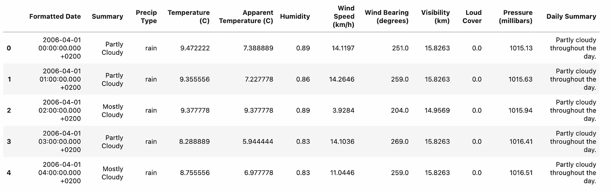
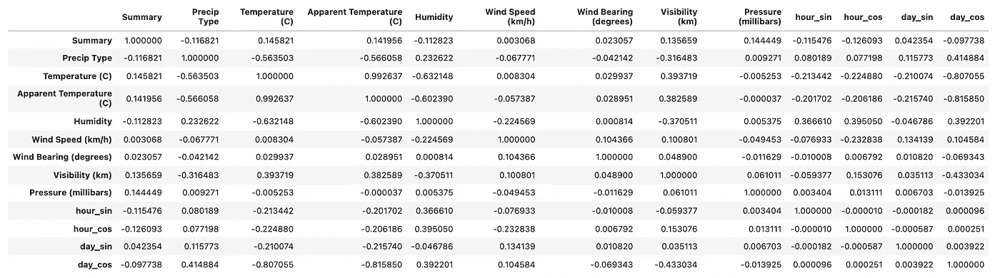

# 使用日期时间功能使您的机器学习模型更好地工作

> 原文：<https://towardsdatascience.com/make-your-machine-learning-model-work-better-with-datetime-features-eb21de397fe8>

## 特征工程，机器学习

# 使用日期时间功能使您的机器学习模型更好地工作

## 解释如何从日期和时间中提取新要素的现成教程


在 [Unsplash](https://unsplash.com?utm_source=medium&utm_medium=referral) 上拍摄的 [ThisisEngineering RAEng](https://unsplash.com/@thisisengineering?utm_source=medium&utm_medium=referral)

毫无疑问，特征工程是构建机器学习模型的最重要的方面之一。研究表明，一个好的模特和一个优秀的模特之间的差别可以通过你设计你的特征的方式来实现。

为了提高模型的准确性，您需要解决数据(不完整或不一致)和模型构建过程中的问题。当精度与您期望的不相似时，您可以使用不同的参数重新训练，或者设计与问题更相关的新功能。

在这篇文章中，我将通过一个实际的例子来讨论如何**从日期时间变量**中提取新的特征来增加机器学习模型的准确性。

文章组织如下:

*   从日期提取特征
*   时间特征提取
*   实际例子

# 1 从日期提取特征

有些数据集提供了日期或日期时间字段，在为机器学习模型构建输入要素时通常会将其删除(显然，除非您正在处理时间序列😃).

相反，DateTime 可用于提取新要素，这些新要素可添加到数据集的其他可用要素中。

日期由一天、一个月和一年组成。从这三个部分中，至少可以提取四个不同的特征:

*   一年中的某一天、一月中的某一天或一周中的某一天
*   一年中的月份
*   季节
*   年

在所有情况下，除了年份，所考虑的特征应分为两部分:正弦和余弦，以保证周期性，例如 1 月 1 日接近 12 月 31 日。

## 1.1 一年中的某一天、一月中的某一天或一周中的某一天

一年中的某一天是指 1 到 365(或 366)之间的数字。当您有一个细粒度的精细数据集，并且在几天内有一个平衡的分布时，可以使用这个特性，否则，使用这个特性可能是危险的，因为它可能会产生过度拟合。

在 Python 中，一年中的某一天可以按如下方式计算:

```
import **numpy** as npcurrent_date = "2022-01-25 17:21:22"
cdate = datetime.strptime(current_date, '%Y-%m-%d %H:%M:%S')**day_sin** = np.sin(2 * np.pi * cdate.timetuple().tm_yday/365.0)
**day_cos** = np.cos(2 * np.pi * cdate.timetuple().tm_yday/365.0)
```

对于数据集中更稀疏的日期值，我建议您利用一天作为一个月中的某一天或一周中的某一天。

## 一年的 1.2 个月

一年中的月份是指 1 到 12 之间的数字。如果您的 Pandas 数据帧中有一个 DateTime 列，则一年中的月份可以提取如下:

```
df['month_sin'] = np.sin(2 * np.pi * df['date_time'].dt.month/12.0)
df['month_cos'] = np.cos(2 * np.pi * df['date_time'].dt.month/12.0)
```

## 1.3 季节

季节是一个分类变量，它包括以下值:*春天*、*夏天*、*秋天、*和*冬天*。关于前面的特征，不计算季节的周期性。

在 Python 中，可以提取季节，如 Stackoverflow 上这个[有趣的帖子中所解释的。](https://stackoverflow.com/questions/16139306/determine-season-given-timestamp-in-python-using-datetime)

或者，季节可以被视为一个数字特征。在这种情况下，你应该注意周期性，所以你应该计算正弦和余弦。

## 1.4 年

**通常，当您必须预测未来的值时，年份作为输入特征不是很有用。**然而，为了完整起见，我描述了如何利用它作为输入特性。

如果数据集包含多个年份，则可以使用年份。根据您的需要，它可以是分类变量，也可以是数值变量。

如果您的 Pandas 数据帧中有一个 DateTime 列，则年份可以提取如下:

```
df['year'] = df['date_time'].dt.year
```


[克雷格·迈莱赫兰](https://unsplash.com/@crrrrraig?utm_source=medium&utm_medium=referral)在 [Unsplash](https://unsplash.com?utm_source=medium&utm_medium=referral) 上拍照

# 2 时间特征提取

可以从 DateTime 列中提取时间特征。

根据数据集的粒度，可以提取不同级别的时间要素(小时、分钟、秒……)。然而，最常见的时间特性是以小时为基础的。请始终记住，时间特征应分为正弦和余弦，以反映数据的周期性(例如，23:59 接近 0:01)。

在 Python 中，给定一个日期时间变量，可以按如下方式提取一个小时:

```
import **numpy** as np**hour_sin** = np.sin(2 * np.pi * cdate.hour/24.0)
**hour_cos** = np.cos(2 * np.pi * cdate.hour/24.0)
```

# 3 一个实例

这个例子利用了 Kaggle 上的[天气数据集](https://www.kaggle.com/muthuj7/weather-dataset)，该数据集有 [CC0: Public Domain](https://creativecommons.org/publicdomain/zero/1.0/) 许可。

本例的目标是构建一个多类分类器，该分类器根据输入要素预测天气状况(由数据集的列摘要给出)。我计算了两种情况下的准确性:有和没有 DateTime 特性。

## 3.1 加载数据集

该数据集可在 Kaggle 上获得。我把它作为一个熊猫的数据框打开:

```
import **pandas** as pddf = **pd.read_csv**('../input/weather-dataset/weatherHistory.csv')
```



作者图片

该数据集包含 96，453 条记录和 12 列。

## 3.2 探索性数据分析

现在，我去掉对预测没有太大影响的变量。我注意到*隔音罩*对于所有行都是一样的，所以我可以将其移除。

```
df['Loud Cover'].**value_counts**()
```

它给出了以下输出:

```
0.0    96453
Name: Loud Cover, dtype: int64
```

我还可以删除*每日摘要*列，因为它只包含文本。

```
df.**drop**(['Daily Summary','Loud Cover'],axis=1,inplace=True)
```

最后，我处理缺失值:

```
df.**isnull()**.**sum()**
```

它给出了以下输出:

```
Formatted Date                0
Summary                       0
Precip Type                 517
Temperature (C)               0
Apparent Temperature (C)      0
Humidity                      0
Wind Speed (km/h)             0
Wind Bearing (degrees)        0
Visibility (km)               0
Pressure (millibars)          0
```

*预测类型*列包含一些缺失值。我放下了。

```
df.**dropna**(inplace=True)
```

## 3.3 数据清理

首先，我将分类数据转换成数字数据:

```
from sklearn.preprocessing import **LabelEncoder**le = LabelEncoder()
df['Precip Type']=le.fit_transform(df['Precip Type'])
df['Summary']=le.fit_transform(df['Summary'])
```

然后，我标准化输入特征:

```
from sklearn.preprocessing import **StandardScaler**scaler = StandardScaler()
df[df.columns[2:]] = scaler.fit_transform(df[df.columns[2:]])
```

我从第二个第三列开始，因为我没有标准化前两列(DateTime 和 Summary)。

## 3.4 特征工程

现在，我准备提取一年中的某一天和某一小时。我定义了一个函数，在给定日期的情况下，提取天数和小时数的正弦和余弦值:

```
import **numpy** as np
from **datetime** import datetimedef **discretize_date**(current_date, t):
    current_date = current_date[:-10]
    cdate = datetime.strptime(current_date, '%Y-%m-%d %H:%M:%S')if t == 'hour_sin':
        return np.sin(2 * np.pi * cdate.hour/24.0)
    if t == 'hour_cos':
        return np.cos(2 * np.pi * cdate.hour/24.0)
    if t == 'day_sin':
        return np.sin(2 * np.pi * cdate.timetuple().tm_yday/365.0)
    if t == 'day_cos':
        return np.cos(2 * np.pi * cdate.timetuple().tm_yday/365.0)
```

现在，我提取新的特征:

```
date_types = ['hour_sin', 'hour_cos', 'day_sin', 'day_cos']
for dt in date_types:
    df[dt] = df['Formatted Date'].apply(lambda x : discretize_date(x, dt))df.drop(['Formatted Date'],axis=1,inplace=True)
```

我计算特征之间的相关性，以检查是否有一些特征高度相关。在这种情况下，两个功能中的一个可能会被删除。

```
df.corr()
```



作者图片

表观温度和温度高度相关，因此我可以降低表观温度:

```
df.**drop**(['Apparent Temperature (C)'],axis=1,inplace=True)
```

## 3.5 列车测试拆分

我将数据分成 X 和 y 两部分，然后分成训练集和测试集:

```
from sklearn.model_selection import train_test_splitX = df.iloc[:,1:]
y=df.iloc[:,0] 

X_train,X_test,y_train,y_test = **train_test_split**(X,y,test_size=0.3,random_state=1)
```

## 3.6 模型培训和评估

我测试了两个模型，一个有 DateTime 特性，另一个没有。首先，我用日期时间特征训练模型:

```
from sklearn.ensemble import RandomForestClassifiermodel = **RandomForestClassifier**(max_depth=32,n_estimators=120,random_state=1)
model.**fit**(X_train,y_train)
y_pred = **model.predict**(X_test)
```

我计算的准确度是:

```
from sklearn.metrics import **accuracy_score****accuracy_score**(y_test, y_pred)
```

它给出了以下输出:

```
0.6695389319342622
```

现在，我在没有日期时间功能的情况下训练模型:

```
model = **RandomForestClassifier**(max_depth=32,n_estimators=120,random_state=1)
model.**fit**(X_train[X_train.columns[:-4]],y_train)y_pred = model.**predict**(X_test[X_test.columns[:-4]])
```

我计算精确度:

```
accuracy_score(y_test, y_pred)
```

它给出了以下输出:

```
0.5827108161634411
```

请注意具有日期时间功能的模型如何优于另一个模型。

你可以在我的 [Kaggle 简介](https://www.kaggle.com/alod83/using-datetime-for-weather-prediction)中获得本教程的完整代码。

# 摘要

恭喜你！您刚刚学习了如何从机器学习模型中提取日期时间特征！本文中描述的实际例子证明了日期时间特性的存在可以提高机器学习模型的性能。

我留给你一个挑战性的问题:

> 日期时间特性会引入过度拟合吗？

敬请关注…

你可以通过阅读[哈希尔·帕特尔](https://medium.com/u/8bd9949e2d6?source=post_page-----eb21de397fe8--------------------------------)的这篇有趣的文章来了解更多关于特征工程的概念，这篇文章题为什么是[特征工程——机器学习的重要性、工具和技术](/what-is-feature-engineering-importance-tools-and-techniques-for-machine-learning-2080b0269f10)。

如果你已经走了这么远来阅读，对我来说今天已经很多了。谢谢！你可以在[这篇文章](https://alod83.medium.com/which-topics-would-you-like-to-read-c68314dc6813)中读到更多关于我的内容。

# 相关文章

[](/a-machine-learning-model-is-no-longer-a-black-box-thanks-to-shap-9f6ae3adaedc)  [](https://medium.com/geekculture/why-overfitting-makes-machine-learning-algorithms-perform-worse-7414ce71031a)  [](/getting-started-with-comet-ml-549d44aff0c9) 