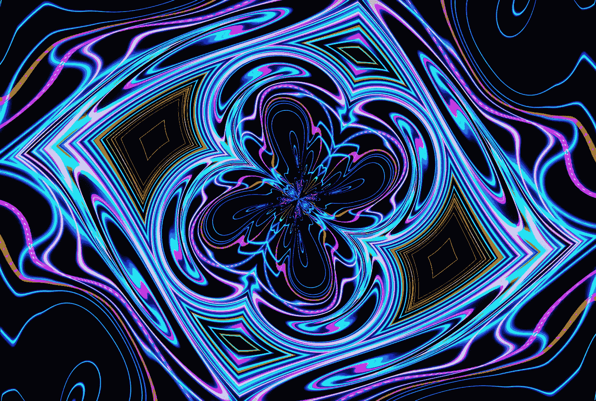
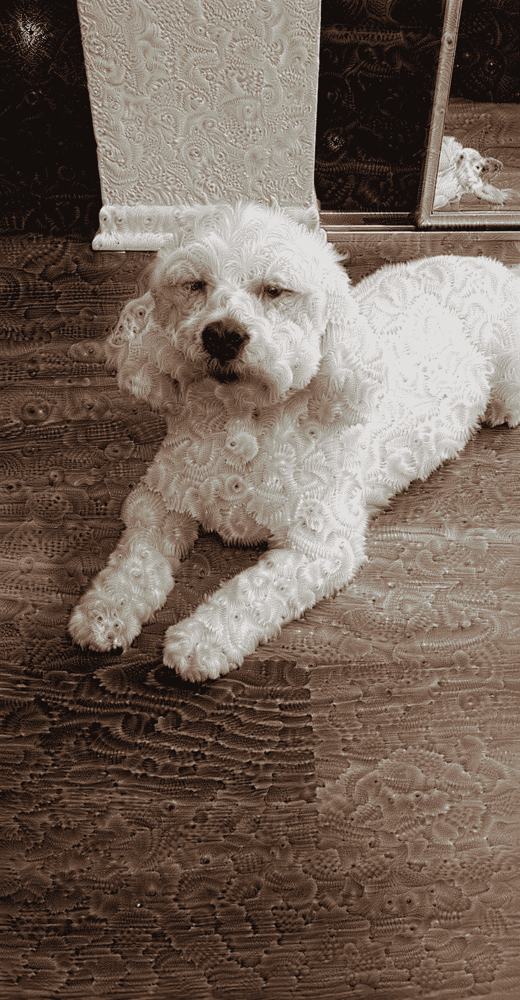
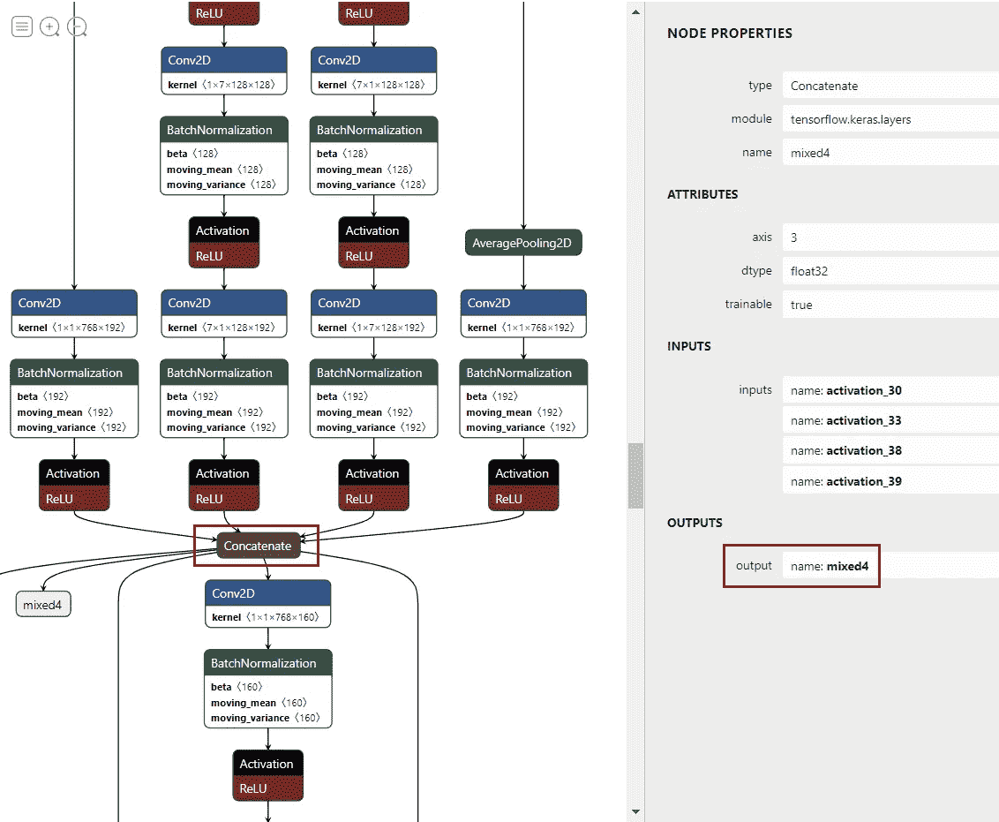
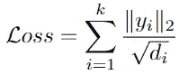
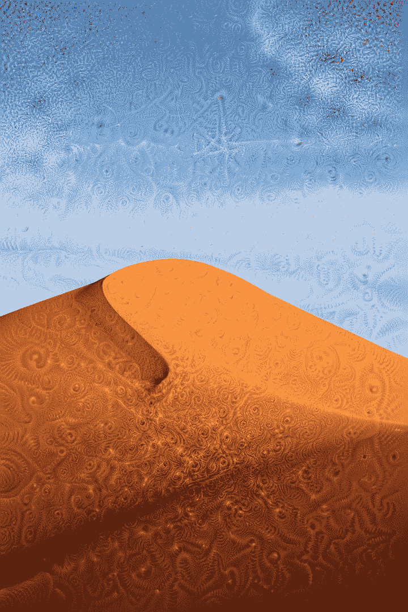
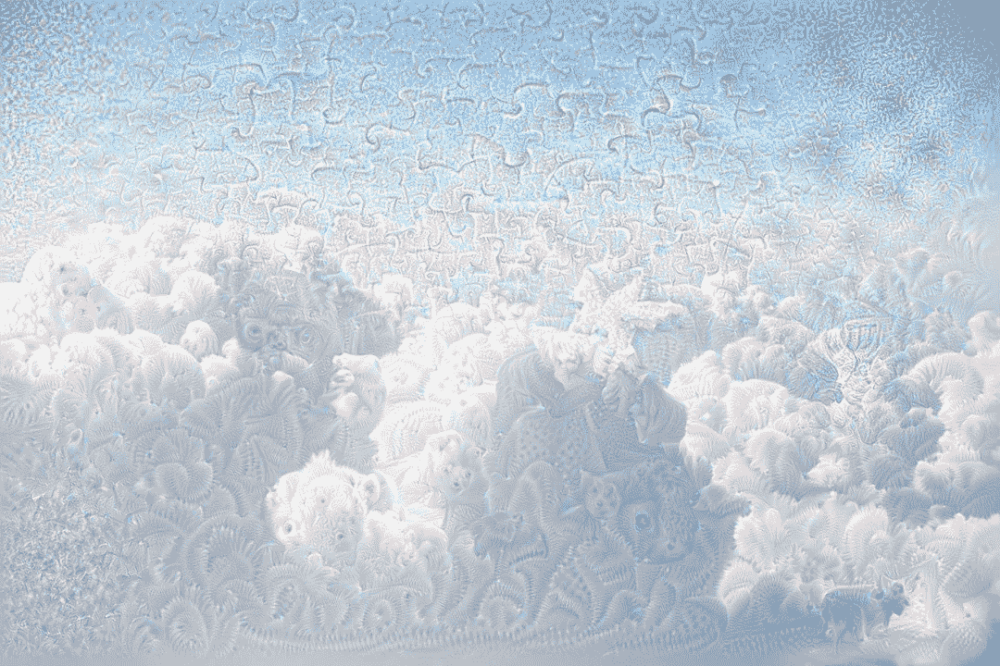
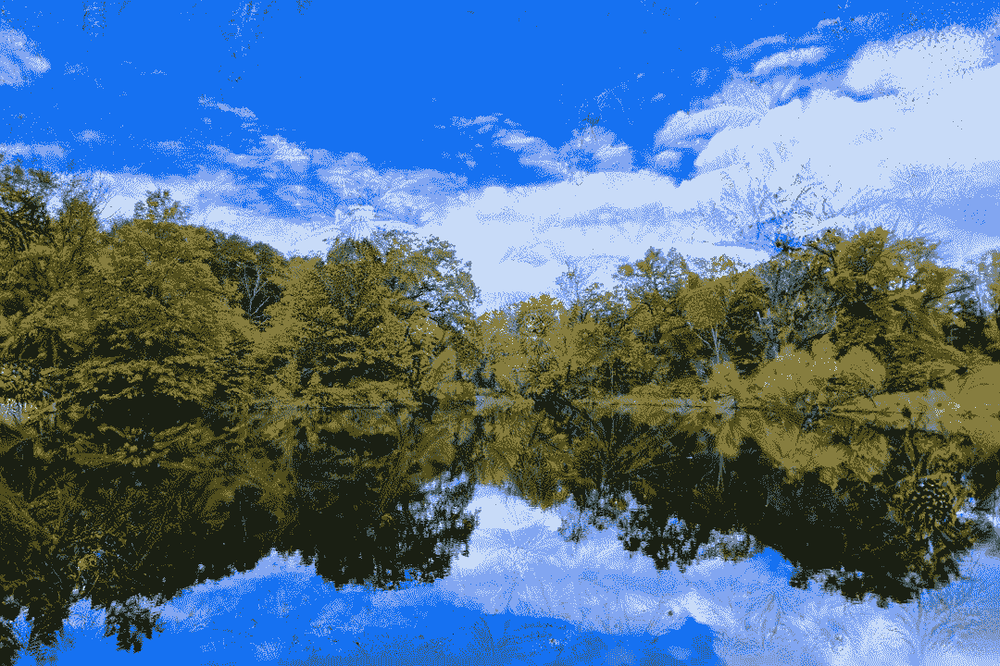

# 让你的神经网络产生幻觉

> 原文：<https://towardsdatascience.com/make-your-neural-network-hallucinate-a587ceeb4dbe>

## 来自谷歌人工智能的深度梦想项目教程



照片由[飞:D](https://unsplash.com/@flyd2069?utm_source=unsplash&utm_medium=referral&utm_content=creditCopyText) 在 [Unsplash](https://unsplash.com/s/photos/illusion?utm_source=unsplash&utm_medium=referral&utm_content=creditCopyText)

在这个项目中，我们将采用一个输入图像，并使用生成模型对其应用一些幻觉效果。本教程基于谷歌人工智能和 [Keras 的实现](https://keras.io/examples/generative/deep_dream/)的这篇[博客文章。它需要对机器学习和深度神经网络有一些基本的了解。](https://ai.googleblog.com/2015/06/inceptionism-going-deeper-into-neural.html)

级别:中级—高级

> 最后提供了所有代码参考。作者修改了原始代码，并添加了一些额外的实现来适应本教程。



等等，我的狗怎么了？或者是我？—作者图片

(不用担心！在本教程的剩余部分，我将不再在我的狗身上测试这个模型。)

# 概观

对于高级功能，如使用指导图像控制梦境，请参见**继续**进一步会话。

**为了完成这项任务，我们将:**

*   处理输入图像
*   通过预先训练的图像分类模型输入该图像
*   取一些隐藏层的输出并“放大”激活信号
*   用这些放大的神经元重新构建一个新的图像

最大的技术挑战是“放大”激活信号。由于该模型已经被训练来检测和分类图像，我们可以有把握地假设，激活隐藏层可以捕捉有关图像的重要信息:形状，边缘，上下文，…

这意味着模型可以“看到”我们看不到的东西。我们能做的就是把这些信号“放大”到原始的画面，在一个迭代的过程中再次馈入模型。随着我们的图像获得更多的“隐藏上下文”，该模型可以接收这些新信号，甚至发现上下文，从而创建一个反馈循环。

**这一步的程序是:**

*   创建一个新模型，从一些隐藏的图层中提取特征
*   通过模型输入图像
*   根据这些特征计算激活信号
*   使用这些信号增强输入图像
*   重复第二步

我将使用 TensorFlow/Keras 来完成这项任务。与 PyTorch 相比，TF 的一个优势(在本文发表时)是可以很容易地获得 Keras 隐藏层的输出。因此，构建一个新的模型来提取特征成为一个琐碎的任务。

一般来说，精通这两种框架并了解哪一种最适合您的项目是有利的。

# 履行

## 属国

本教程在 Python3 上运行。我使用 [Anaconda for Windows](https://www.anaconda.com/products/distribution) 来管理和安装所有的依赖项。

## 预处理和后处理

我们应用了在训练中使用的相同的预处理。

*   预处理:加载并归一化输入图像到[-1，1]之间
*   后处理:将范围[-1，1]转换为[0，255]，并将数据类型转换为 uint8

## 定义模型

我们将使用 InceptionV3 作为基线模型。

对于这项任务，我们将构建一个新的模型，从我们的基线模型输出一些隐藏层的激活。

> 我怎么知道选择哪几层？

**方法 1:** 使用 TF 中的`summary()`方法获得图层名称列表。

```
>>> feature_extractor.summary()
Model: "model"
__________________________________________________________________________________________________
 Layer (type)                   Output Shape         Param #     Connected to
==================================================================================================
 input_1 (InputLayer)           [(None, None, None,  0           []
                                 3)]conv2d (Conv2D)                (None, None, None,   864         ['input_1[0][0]']
                                32)batch_normalization (BatchNorm  (None, None, None,   96         ['conv2d[0][0]']
 alization)                     32)activation (Activation)        (None, None, None,   0           ['batch_normalization[0][0]']
...
```

**方法二:**用 [Netron](https://netron.app/) 可视化(这是我比较喜欢的方法):

*   保存模型

```
>>>feature_extractor.save('extractor.h5')
```

*   用 Netron 加载并检查模型。
*   在这个模型中有一些“交通路口”，看起来它们应该包含有用的信号，让我们使用这些。



识别“良好”的输出图层-按作者分类的图像

*   网络的每一层都在不同的抽象层次上学习图像。通常，第一层对边缘、颜色和形状等基本特征更敏感。而更深的层可能包含更多关于对象、上下文等的信息

## 定义损失函数

这就是事情变得有趣的地方。我们将使用以下损失函数:



其中`y_i’s`是特征提取器模型的激活输出，`d_i's`是这些输出的大小(尺寸的乘积)。

**为什么要用这个损失函数？**

*   我们想捕捉神经元最“活跃”的地方
*   特征图的范数对应于来自这些层的信号
*   大的损失值意味着特征映射在图像中检测到许多“隐藏的上下文”
*   我们根据输出大小进行归一化，以便所有选择的层对损耗的贡献相等

## 定义更新规则

在一个典型的深度学习问题中，我们会使用梯度下降来最小化目标损失。然而，这里的情况并非如此:

*   最小化损失函数意味着最小化输出激活的范数。这不是我们的真正目标。
*   激活信号是我们想要注入到我们图像中的东西(模型看到的东西，但是我们看不到)
*   所以我们想保持模型的权重不变。我们将仅使用激活信号来增强我们的输入图像。

**→梯度上升！**

## 把所有的放在一起

Google 在原始博客中建议，我们应该迭代地将我们的算法应用于图像输入，并在每次迭代后应用一些缩放。

以下是一些结果:


Fernando Paredes Murillo 在 [Unsplash](https://unsplash.com/s/photos/desert?utm_source=unsplash&utm_medium=referral&utm_content=creditCopyText) 上拍摄的照片



作者的幻觉


由[弗拉基米尔·阿尼奇耶夫](https://unsplash.com/@anikeevxo?utm_source=unsplash&utm_medium=referral&utm_content=creditCopyText)在 [Unsplash](https://unsplash.com/s/photos/cloud?utm_source=unsplash&utm_medium=referral&utm_content=creditCopyText) 拍摄的照片



被作者强化的梦

# 更进一步

为了控制模型如何做梦，我们可以

*   修改变量:渐变步长、缩放步长数、每次缩放的比例以及每步的迭代次数
*   为特征提取选择一组不同的层:同样，我们可以利用 Netron 并挑选出一些候选层
*   修改损失函数:归一化范数是从模型中捕捉隐藏信号的最佳函数吗？
*   为我们的梦想使用向导图像

## 使用向导图像

除了依赖激活信号，我们还可以使用一个引导图像作为我们迭代的“GPS”。在每一步，来自引导图像的隐藏信号也被注入到我们的图像中。

为了完成这项任务，我们需要做出以下改变:

*   加载指南图像
*   将两个图像的大小调整到相同的分辨率

*   修改损失函数:我们将改为计算图像之间激活的点积。
*   基本原理:模型可以在两幅图像中“看到”我们肉眼看不到的东西。高损耗意味着来自引导图像的强信号增强了点积。因此，随着梯度上升，我们正在添加额外的“抽象”从指南图像到我们的原始图像。

示例结果:


作者图片



因热带梦幻而增强——作者图片

# 结论

这个项目是机器学习中生成模型的一个很好的例子。我们不是修改权重以最小化损失，而是使用梯度来增强输入图像以最大化该损失。随着我们反复重复这个过程，图像可以逐渐从模型中获得额外的信号，这些信号以前是我们看不到的。

希望你能从本教程中获得乐趣，并创作出一些美丽的仲夏夜之梦。

# 资源

谷歌人工智能的博客文章:

[](https://ai.googleblog.com/2015/06/inceptionism-going-deeper-into-neural.html)  

TensorFlow 教程:

[](https://www.tensorflow.org/tutorials/generative/deepdream)  

Keras 深梦:

[](https://keras.io/examples/generative/deep_dream/)  

如果你愿意支持 Thu，你可以考虑注册成为一名中等会员。每月支付 5 美元，你就可以无限制地阅读媒体上的故事。如果你使用他的推荐链接，Thu 也会得到一小笔佣金。

[](https://medium.com/@tdinh15/membership) 