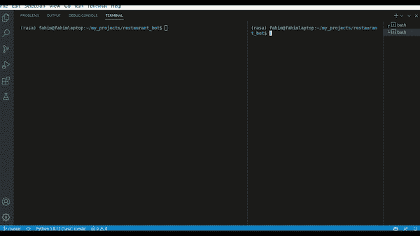
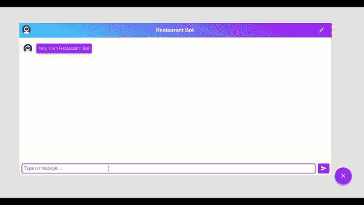

# 制作一个聊天机器人来搜索附近的餐馆

> 原文：<https://towardsdatascience.com/making-a-chat-bot-to-search-for-eating-places-nearby-64df233ce48a>


雅各布·卡普斯纳克在 [Unsplash](https://unsplash.com?utm_source=medium&utm_medium=referral) 上的照片

## 我们使用 Rasa 框架和 FOURSQUARE Places API 来制作一个搜索餐馆和咖啡馆的聊天机器人

饿吗？想找家餐馆吗？在这个示例项目中，我们制作了一个简单的聊天机器人，可以帮助您做到这一点。

我们将使用 Rasa 制作聊天机器人。它是一个用于制作基于任务的对话聊天机器人的开源框架。Rasa 使用机器学习模型来理解用户输入，并保持对话。

使用 FOURSQUARE Places API，我们可以在任何地点搜索感兴趣的地方。

结合这两者，我们得到了我们项目的聊天机器人。所以让我们开始吧。

# 目录:

1.  [**入门**](#8f1d)
2.  [**获取四方位置 API**](#7a14)
3.  [**生成 NLU 训练数据**](#5626)
4.  [**自定义动作**](#8266)
5.  [**域，规则和故事**](#c123)
6.  [**聊天机器人-UI**](#b292)

*文章中用到的所有代码都可以在* [*GitHub 资源库*](https://github.com/AhmedFahim-git/restaurant_bot) *中找到。*

# 入门指南

首先，我们需要创建一个安装 Rasa 的虚拟环境。如果我们安装了 Anaconda，我们可以使用下面列出的命令。我们应该确保使用 Python 版本 3.7 或 3.8。这个命令列表还会安装一些我们需要的额外的库。

```
# This command creates the virtual environment
conda create --name env_name python=3.8# This command activates the virtual environment
conda activate env_name# This command installs pip in the virtual environment
conda install pip# And this command installs Rasa in the virtual environment
pip install rasa# We also need to install some additional libraries for the project, which may be done using the command given below.conda install pandas
pip install python-dotenv
pip install geopy
pip install word2number
```

我们也可以在 [Rasa 开源](https://rasa.com/docs/rasa/installation)上找到安装说明。

我们将在这个项目中使用的库是:

*   [**请求**](https://docs.python-requests.org/en/latest/) :是一个处理 HTTP 请求的简单库。
*   [**geopy**](https://geopy.readthedocs.io/en/stable/) :这是一个简单的 Python 接口，用于许多地理编码 web 服务，如 Google Maps、nomim、MapBox 等。
*   [**熊猫**](https://pandas.pydata.org/) :它是一个数据操作库，特别针对表格数据
*   [**word2number**](https://pypi.org/project/word2number/) :用于将数字字如“五”或“五十五”转换成相应的数字。
*   [**-python-dotenv**](https://pypi.org/project/python-dotenv/):用于从项目根目录下的. env 文件中读入环境变量。稍后当我们讨论 FOURSQUARE API 时会有更多的介绍。

一切就绪后，我们现在准备初始化我们的 Rasa 项目。首先激活虚拟环境(我的命名为 rasa)，然后制作一个空目录并移入其中，最后输入命令`rasa init`。Rasa 会在过程中要求一些提示；我们可以接受默认值。


Rasa 入门(图片由作者提供)

在这个阶段，我们应该有一个目录，其结构如下所示。

```
.
├── actions
│   ├── actions.py
│   ├── __init__.py
│   └── __pycache__
│       ├── actions.cpython-38.pyc
│       └── __init__.cpython-38.pyc
├── config.yml
├── credentials.yml
├── data
│   ├── nlu.yml
│   ├── rules.yml
│   └── stories.yml
├── domain.yml
├── endpoints.yml
├── models
│   └── 20220210-173055-ambitious-agate.tar.gz
└── tests
    └── test_stories.yml5 directories, 13 files
```

重要的文件和目录有:

*   **。/actions/** 目录:该目录下的主要文件有:
    - **actions.py** 文件:Rasa 允许聊天机器人运行自定义 Python 代码，称为自定义‘自定义动作’。这些在这个文件中定义。
    - **__init__。py** 文件:这个文件告诉 Python 把目录当作一个包
*   **config.yml** 文件:这是配置文件；它定义了模型的各个部分、它们之间的关系以及它们的参数。
*   **credentials.yml** 文件:包含了连接到 slack、脸书等各种渠道的凭证。
*   **。/data/** 目录:包含训练数据的目录。有关培训数据格式的详细信息可在处找到[。它包含三个文件:
    - **nlu.yml** 文件:它包含可能的用户输入的标记样本。
    - **stories.yml** 文件:这包含了机器人和用户之间的对话示例。
    - **rules.yml** 文件:它包含应该总是遵循相同路径的用户-机器人对话的小段。](https://rasa.com/docs/rasa/training-data-format)
*   **domain.yml** 文件:这个文件定义了 bot 的环境，它看到什么，它知道什么，以及用什么来响应。
*   **endpoints.yml** 文件:它定义了机器人可以用于各种内部任务的各种端点。
*   **。/models/** 目录:包含训练好的模型。默认情况下，推理过程中使用最新的模型。
*   **。/tests/** 目录:它包含 test_stories.yml 文件，该文件包含用于评估 bot 性能的示例用户-bot 对话。

对于这个项目，我们将在数据文件夹的三个文件中添加训练数据。我们将在 actions 文件夹的 actions.py 文件中编写一些自定义操作。我们还需要修改 domain.yml 文件。

完成基本的设置后，是时候设置下一个组件了，FOURSQUARE API。

# 获取 FOURSQUARE Places API

要使用任何一个 FOURSQUARE APIs，首先我们需要在 [FOURSQUARE](https://foursquare.com/developers/signup) 上创建一个开发者账户。然后我们创建一个[新项目](https://foursquare.com/developers/projects)并生成一个新的 API 密匙。我们可以在 FOURSQUARE 网站上找到这个过程。

  

我们需要对 API 密钥保密，所以通常的做法是将其作为环境变量来检索。为此，我们创建一个名为'的文件。env '(是的，。env 是项目根目录中的文件名，而不仅仅是扩展名。的内容。env 文件将类似于如下所示。

```
API_KEY=replace_this_with_your_api_key
```

之后，我们可以使用 python-dotenv 库检索这个值，如下所示。确保包括。env 在。gitignore 文件。

```
from dotenv import dotenv_valuesAPI_KEY = dotenv_values()["API_KEY"]
```

FOURSQUARE 有许多 API，但我们将只在项目中使用 Places API 的搜索端点。我们可以在下面给出的页面中试用 API。

  

FOURSQUARE 支持许多不同类别的名胜古迹。在我们的例子中，我们希望将搜索范围限制在餐馆和咖啡馆。为此，我们需要在 categories 参数中传递相关的类别 ID。类别 id 及其相应类别名称的完整列表在[这里](https://developer.foursquare.com/docs/categories)给出。

# 生成 NLU 数据

**NLU** 代表 **N** 自然 **L** 语言 **U** 理解，nlu.yml 文件将包含用户输入的标签示例，模型将使用这些示例来理解用户输入。模型需要从用户输入中学习两件事:

*   用户所说的，叫做意图
*   以及从用户输入中提取的信息，称为实体。

关于如何写训练数据的细节可以在[这里](https://rasa.com/docs/rasa/training-data-format)和[这里](https://rasa.com/docs/rasa/nlu-training-data)找到。

在我们的聊天机器人中，我们将在 API 调用中指定三个参数:ll(纬度、经度)、半径和类别。使用 categories 参数而不是 query 参数有三个好处:

*   从用户输入中提取查询字符串很麻烦
*   确保结果与我们的用例相关
*   我们可以在我们这边执行数据验证，而不依赖于 API

为了填充这三个参数，我们需要从用户输入中提取三个实体:

*   place_type:这将被映射到 category 参数。
*   地址:这将被映射到 ll 参数。
*   半径:这将被映射到半径参数。

Rasa 有一个叫做 Forms 的有用特性，可以从用户输入中提取所需的信息。关于如何使用表格的详细信息可以在[这里](https://rasa.com/docs/rasa/forms/)找到。

下面是 nlu.yml 文件的一个示例。完整的数据可以在 [Github](https://github.com/AhmedFahim-git/restaurant_bot/blob/master/data/nlu.yml) 上找到。

```
version: "3.0"
nlu:- intent: greet
  examples: |
  - hey
  - hello
  - hi
  - hello there- intent: goodbye
  examples: |
  - bye
  - goodbye
  - have a nice day- intent: mood_great
  examples: |
  - perfect
  - great
  - amazing
  - feeling like a king- intent: mood_unhappy
  examples: |
  - my day was horrible
  - I am sad
  - I don't feel very well 
  - sad- intent: giving_place_type
  examples: |
  - I want to look for [restaurants](place_type)
  - I would like to make a search for [restaurants](place_type)
  - Look for [both restaurants and coffee houses](place_type)
  - Search for them [both](place_type)- intent: giving_address
  examples: |
  - I live in [Scarborough](address), [Toronto](address), [ON](address), [Canada](address)
  - [317 Dundas St W](address), [Toronto](address), [ON M5T 1G4](address), [Canada](address)
  - [Dhaka](address), [Bangladesh](address)
  - [London](address)- intent: giving_radius
  examples: |
  - [20](radius)
  - [ninety one](radius)
  - [fifty](radius) kilometers
  - Search within [15](radius) km
```

# 自定义操作

定制操作是 Rasa 灵活性背后的主要动力。它们使机器人能够根据用户输入在对话期间运行定制的 python 代码。

要使用自定义操作，我们需要做四件事:

*   在 actions 文件夹的 actions.py 文件中编写 python 代码。关于如何编写自定义函数的详细信息可以在 [Rasa 操作服务器文档](https://rasa.com/docs/action-server/)中找到。
*   通过在 domain.yml 文件中列出自定义操作，让 bot 知道这些操作。
*   取消对 endpoints.yml 文件中以下行的注释。

```
action_endpoint: url: "http://localhost:5055/webhook"
```

*   最后，当我们想要使用定制动作时，我们需要在单独的终端中运行命令`rasa run actions`。

我们将在以下任务中使用自定义操作:

*   地址验证:我们将用户的位置提取为一个地名列表，如['纽约'，'美国']。然后我们使用。join()字符串运算符来生成完整的地址字符串。然后，我们使用 geopy Nominatim 对地址进行地理编码，即将地址映射到一个准确的位置。如果地址无效，则不返回任何结果。如果返回一个结果，我们还存储纬度和经度值，以便传递给 API 调用。

</things-to-do-with-latitude-longitude-data-using-geopy-python-1d356ed1ae30>  

*   半径验证:半径应该是一个数字或一个可以转换成数字的单词，如“六”。我们使用 word2number Python 库来检查这种情况。
*   发出 API 调用:我们使用 Python 请求库发出 get 请求。用于授权的 API 密钥在头中传递，而参数作为 url 的一部分传递。该调用返回一个 json 对象，我们解析该对象以获得所需的值。

这些功能可以在 [Github](https://github.com/AhmedFahim-git/restaurant_bot/blob/master/actions/actions.py) 页面中找到。

# 领域、规则和故事

domain.yml 文件描述了聊天机器人的环境。它包含所有意图、实体、动作、响应、插槽以及表单的列表。可以在[这里](https://rasa.com/docs/rasa/domain)找到该文件中包含的内容和形式的详细信息。

到目前为止，我们所做的一切都必须列在这个文件中，聊天机器人才能知道它们。而且，我们还需要做槽和 bot 响应。这个项目的 domain.yml 文件可以在[这里](https://github.com/AhmedFahim-git/restaurant_bot/blob/master/domain.yml)找到。

rules.yml 文件描述了应该总是以相同方式进行的简短对话。“激活表单”和“提交表单”是我们项目中的两个主要规则。关于编写规则的详细信息可以在这里找到[。](https://rasa.com/docs/rasa/rules)

故事是用户与机器人互动的例子。它们帮助模型响应用户输入，即使是长时间的对话。关于如何为 Rasa 写故事的细节可以在[这里](https://rasa.com/docs/rasa/stories)找到。

现在我们从命令行运行命令`rasa train`。

# 聊天机器人用户界面

测试聊天机器人最简单的方法是在一个终端使用命令`rasa shell`，在另一个终端运行命令`rasa run actions`。



从终端与聊天机器人互动(图片由作者提供)

这是可行的，但是我们可以通过使用下面显示的聊天机器人 UI 来获得一个更好的界面。

<https://elysian01.github.io/Rasa-Chatbot-UI/>  

首先，我们下载文件，提取其内容，然后在 web 浏览器中打开 index.html 文件。关于如何修改聊天机器人设计的说明可以在[网站](https://elysian01.github.io/Rasa-Chatbot-UI/)上找到。

将所有这些放在一起，在一个终端中我们运行下面的命令。

```
rasa run actions
```

然后在另一个终端中，我们运行下面的命令:

```
rasa run --enable-api --cors='*'
```

最后，我们运行 index.html 文件。



使用聊天机器人用户界面在浏览器中与聊天机器人互动(图片由作者提供)

# 结论

我们结束了。我们刚刚制作了一个聊天机器人，可以搜索附近的餐馆和咖啡馆。

对于进一步的工作，我们可以:

*   我们可以添加另一个功能，可以帮助查找场馆的细节。
*   我们还可以尝试部署应用程序，并使其为生产做好准备。

目前就这些。感谢您的阅读。

<https://rasa.com/>  <https://developer.foursquare.com/>  <https://github.com/AhmedFahim-git/simple_chatbot> 