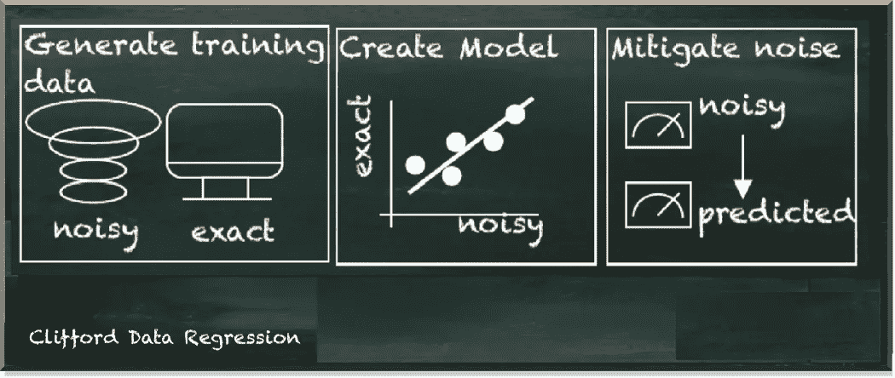
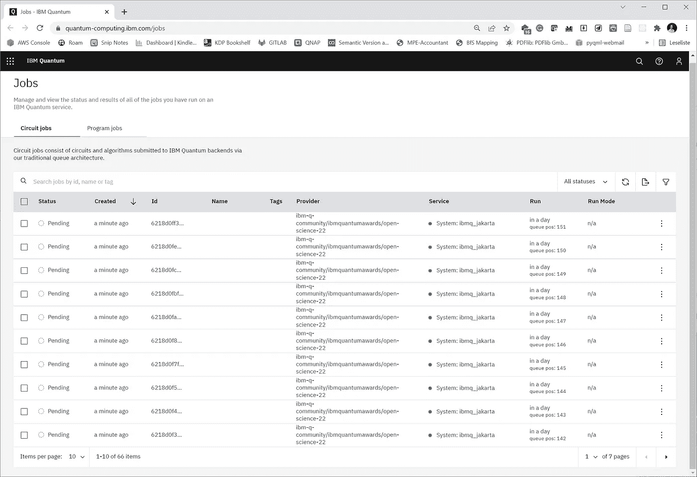

# 让 CDR 准备好与真正的量子计算机一起工作

> 原文：<https://towardsdatascience.com/making-cdr-ready-to-work-with-a-real-quantum-computer-fcdf270a6730>

## 做程序员没坏处

量子机器学习要不要入门？看看 [**动手用 Python 学习量子机器**](https://www.pyqml.com/page?ref=medium_cdrwork&dest=/) **。**

克利福德数据回归(CDR)是一种很有前途的量子误差缓解方法。在[之前的帖子](/practical-error-mitigation-on-a-real-quantum-computer-41a99dddf740)中，我们有效地改编了来自开源库 Mitiq 的代码。因此，我们只需进行微小的调整，就可以连接到 IBM 量子云，并降低真实量子计算机的噪音。



作者图片

然而，完成该方法需要一整天的时间。它不需要这么长时间，因为它需要这么多的计算时间。但这需要很长时间，因为我们提交给 IBM cloud 的量子电路已经等待了很长时间才能执行。

IBM 免费提供他们的量子设备。但是，当然，这些是共享设备。当您将一个量子电路发送到 IBM cloud 上的一个量子系统时，在最终执行之前，它会与来自其他用户的作业一起进入一个队列。根据排队作业的数量，可能需要几个小时才能运行作业。

在我们执行 CDR 的过程中，我们向 IBM cloud 提交了 11 个电路。问题是我们没有马上把它们都发出去。但我们总是等到一项工作完成后，再发送下一项。结果，我们的等待时间大大增加了。

幸运的是，IBM 允许我们同时发送多个电路。这将大大减少我们的总等待时间。

在[上一篇](/practical-error-mitigation-on-a-real-quantum-computer-41a99dddf740)的代码中，我们使用了从 mitiq 导入的`execute_with_cdr`方法。我们用一个定制的执行器作为参数来调用它——`real_jakarta`执行器。这个执行器是一个函数，它接受量子电路，运行它，并返回感兴趣的可观察对象的期望值。

让我们简单看一下`execute_with_cdr`函数的代码，你可以在这里找到[。在第 155 行，我们调用执行器的`evaluate`函数，并将一列电路和可观察值作为参数传递。](https://github.com/unitaryfund/mitiq/blob/master/mitiq/cdr/cdr.py)

电路列表是训练电路加上我们要计算其期望值的原始电路。CDR 方法建立在从数据中学习如何减轻噪声的基础上。我们看到，我们可以指定我们想要在更近的检查中使用的训练电路的数量。默认值为`10`。所以，我们用 11 个电路的列表调用`evaluate`函数。

执行器(参见代码[这里的](https://github.com/unitaryfund/mitiq/blob/master/mitiq/executor/executor.py))循环遍历列表，通过调用我们提供的函数来“执行”每个电路。

让我们简单回顾一下所提供的函数，看看我们是如何执行一个电路的。

```
*# ...*mapped_circuit **=** transpile(circ, backend**=**jakarta)
qobj **=** assemble(mapped_circuit, backend**=**jakarta, shots**=**shots)*# execute the circuit*
job **=** jakarta.run(qobj)counts **=** job.result().get_counts()*# ...*
```

首先，我们在真实的量子设备(Jakarta)上传输、组装和运行电路。然后，我们在执行器内部直接获得的结果，因此也是在循环内部。这就是问题所在，因为`result()`是一种屏蔽方法。它不返回任何内容，但会一直等到作业完成。因此，只要我们的电路在队列中等待，它就会等待。因此，整个循环无法继续。但是它在提交下一个电路执行之前等待结果。

为了防止代码等待，我们必须在使用结果之前将所有电路提交给 IBM cloud。因此，我们需要把`execute_with_cdr`功能拆开。

第一步，我们准备训练电路。我们将这个与代码的其余部分分开，因为我们在执行之前和之后都需要这些电路。

我们剥离了这个函数，只包含生成训练电路所需的部分。但是我们接手的那些部分保持不变(见[原函数](https://github.com/unitaryfund/mitiq/blob/master/mitiq/cdr/cdr.py))。

现在，让我们使用这个函数来创建电路列表。出于这个目的，我们首先重用以前帖子中的一些东西，比如创建量子电路的`get_circuit()`函数，我们的目标是计算它的可观测期望值。此外，我们定义了这个可观察值(`obs`)和无噪声模拟器(`sim`)。

一旦我们准备好电路，我们就像最初的 Mitiq 代码一样重新组织它们。

我们将想要运行的电路存储在`to_run`变量中。因此，现在让我们创建一个函数，将这些电路一次性提交给 IBM cloud(不等待结果)。

`submit_to_jakarta`函数接受`to_run`列表、可观察值、每条电路的运行次数(`shots`)以及我们想要运行电路的`backend`。在这个函数中，我们声明了另一个函数`submit_executor`。这是我们作为执行器使用的回调函数。在这个函数的实现中，我们只准备电路(transpile 和 assemble)并发送到`backend`后端。执行程序不返回结果，而是返回一个`job`。这是提交给给定后端的量子电路的本地引用。`submit_to_jakarta`函数收集所有的`jobs`并返回它们。

在我们使用这个函数之前，我们需要连接到我们的帐户并获得一个允许我们访问后端(这里是`jakarta`)的提供者(您需要使用不同的参数值来连接到`ibmq_quito`)。[这篇文章](/how-to-run-code-on-a-real-quantum-computer-c1fc61ff5b4)更详细地解释了如何做到这一点。

让我们看看调用这个函数时会发生什么。

输出是一个作业对象列表。前往你的 IBM 量子控制台。当您在“最近的工作”中点击“查看全部”时，您会看到这些工作已经到达 IBM，它们正在等待处理。您还可以看到大致的执行时间。在我的情况下，他们今天根本不会运行，因为有超过 140 个其他电路在排队等候。



如果我需要更多的动力来推动我们今天所做的事情，这就是了。

至少，等待这些作业运行给了我足够的时间来完成这篇文章。

当然，在我们等待结果的时候，你不会想让你的电脑一直开着。所以，我们需要坚持这些工作。幸运的是，每个作业都有一个 id，我们可以用它在以后取回。如果您使用 Jupyter 笔记本，您可以简单地将 id 打印到单元格的输出中，并将它们保存在笔记本旁边。

```
'6218d0f147f37310a6377ee0',
'6218d0f3a2eeaa7a80ad27c8',
'6218d0f48c4ac898e4687d1c',
'6218d0f5a2eeaa782fad27c9',
'6218d0f7f0b807c602db65b0',
'6218d0f8a16487a0ade6eb39',
'6218d0fa3895be83e73e214f',
'6218d0fbf0b8079824db65b1',
'6218d0fc5ac21f18a4473086',
'6218d0fe976d9fc87220be83',
'6218d0ff3f99d49bef399494',
```

我们看到 11 个作业 id 的列表。

您可以使用它们通过`jakarta.retrieve_job("JOB_ID")`功能获得一个新的作业对象。所以，让我们把这些放入一个数组，我们可以使用它。这里，我使用以前运行的 id。

我们可以很容易地将 id 列表映射到实际作业列表。

```
[<qiskit.providers.ibmq.job.ibmqjob.IBMQJob at 0x7f5c154f7b50>,
 <qiskit.providers.ibmq.job.ibmqjob.IBMQJob at 0x7f5c7c5c61c0>,
 <qiskit.providers.ibmq.job.ibmqjob.IBMQJob at 0x7f5c154513a0>,
 <qiskit.providers.ibmq.job.ibmqjob.IBMQJob at 0x7f5c151c2370>,
 <qiskit.providers.ibmq.job.ibmqjob.IBMQJob at 0x7f5c422d01c0>,
 <qiskit.providers.ibmq.job.ibmqjob.IBMQJob at 0x7f5c14b50fd0>,
 <qiskit.providers.ibmq.job.ibmqjob.IBMQJob at 0x7f5c18978520>,
 <qiskit.providers.ibmq.job.ibmqjob.IBMQJob at 0x7f5c14e90400>,
 <qiskit.providers.ibmq.job.ibmqjob.IBMQJob at 0x7f5c14e909a0>,
 <qiskit.providers.ibmq.job.ibmqjob.IBMQJob at 0x7f5c14e90d00>,
 <qiskit.providers.ibmq.job.ibmqjob.IBMQJob at 0x7f5c14e90ac0>]
```

一旦这些工作完成，我们就可以获得它们的结果，而无需进一步等待。

```
Result(backend_name='ibmq_jakarta', backend_version='1.0.28', qobj_id='471fdd0a-c273-4ea4-aded-28f0ed4b0ed7', job_id='6216307c89a5f0ba67accdc8', success=True, results=[ExperimentResult(shots=1024, success=True, meas_level=2, data=ExperimentResultData(counts={'0x0': 238, '0x1': 41, '0x2': 49, '0x3': 696}), header=QobjExperimentHeader(qubit_labels=[['q', 0], ['q', 1], ['q', 2], ['q', 3], ['q', 4], ['q', 5], ['q', 6]], n_qubits=7, qreg_sizes=[['q', 7]], clbit_labels=[['meas', 0], ['meas', 1]], memory_slots=2, creg_sizes=[['meas', 2]], name='circuit-3333', global_phase=4.71238898038469, metadata={}))], date=2022-02-23 13:17:22+00:00, status=Successful completion, status=QobjHeader(backend_name='ibmq_jakarta', backend_version='1.0.28'), execution_id='ec06e180-94aa-11ec-ac54-bc97e15b08d0', time_taken=5.931757688522339, error=None, client_version={'qiskit': '0.33.0'})
```

因此，让我们编写另一个处理作业结果的函数。它需要工作和可观察的事物。同样，我们在这个函数中定义了一个执行实际工作的执行器。

```
[0.9172392848406065,
 0.5629408486360803,
 0.4802712135216911,
 0.8463795975997012,
 0.8463795975997012,
 0.7204068202825363,
 0.6259272372946627,
 0.7322167681560205,
 0.7400900667383433,
 0.7440267160295047,
 0.1417193744818105]
```

当我们处理作业时，我们会收到一个期望值列表。类似于 Mitiq 的原始函数，我们需要将这些与我们从模拟器中获得的无噪声测量值结合起来。因此，让我们也执行这些步骤，以获得减少误差的测量。

```
1.0135726520354982
```

因此，让我们来计算理想值(无噪声)和未优化的测量值。当我们创建要运行的电路列表时，第一个是未修改的电路。我们也可以用这个来计算未优化的测量。

最后，我们可以计算并打印缓解的关键性能指标。

```
Error (unmitigated): 0.06987552491811488
Error (mitigated with CDR): 0.026457842276776833
Relative error (unmitigated): 0.07078763708873381
Relative error (mitigated with CDR): 0.026803206694106713
Error reduction with CDR: 62.1%.
```

结果显示误差减少了 60%以上。尽管这不如我们在以前的帖子中实现的模拟测量的缓解效果好，但相对于未缓解的结果来说，这是一个不错的改进。

量子机器学习要不要入门？看看 [**动手量子机器学习用 Python**](https://www.pyqml.com/page?ref=medium_cdrwork&dest=/) **。**


在这里免费获得前三章。