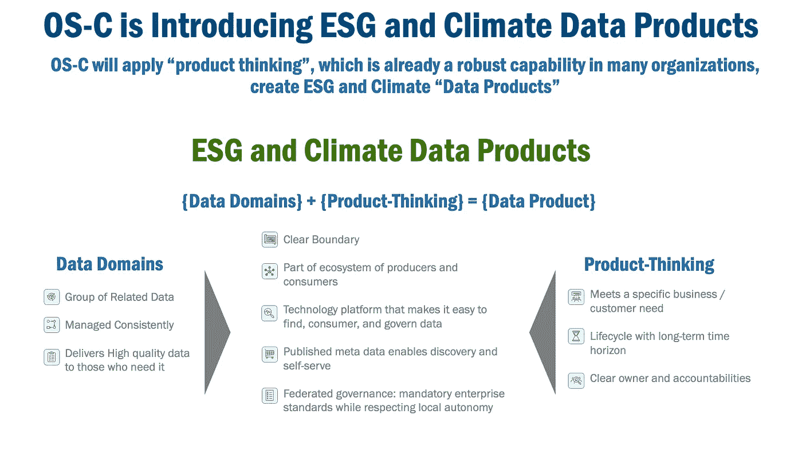
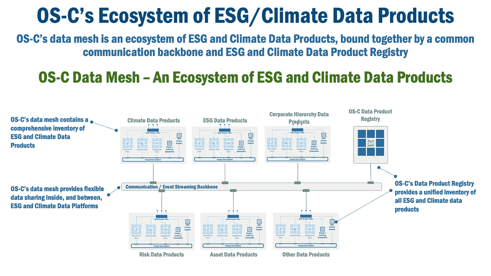
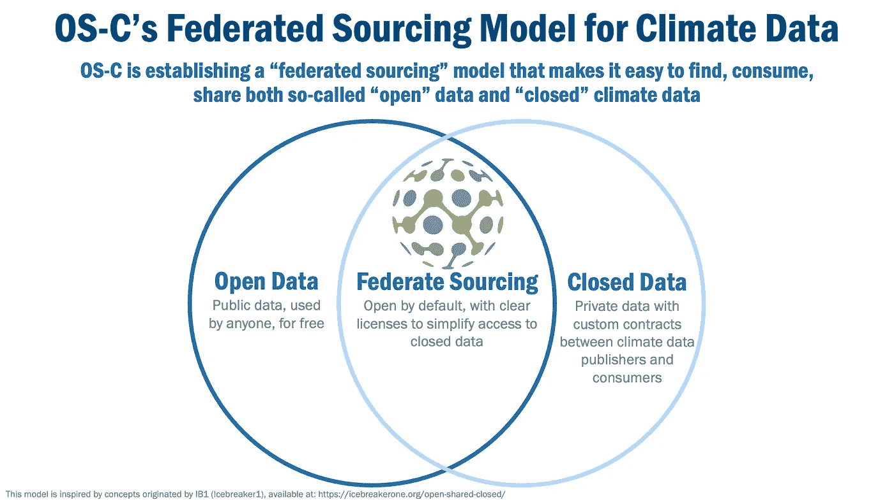
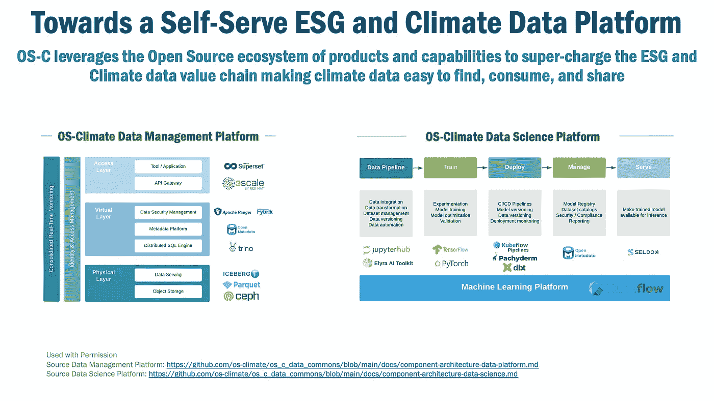
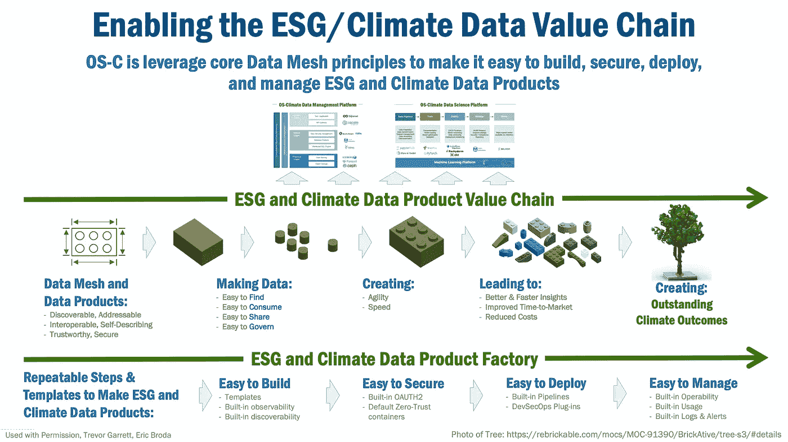
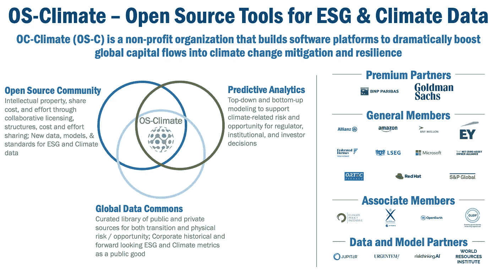

# 数据网格:使气候数据易于查找、使用和共享

> 原文：<https://towardsdatascience.com/making-climate-data-easy-to-find-use-and-share-5190a0926407>

准确、可用和一致的可互操作气候数据对于解决我们的全球气候危机至关重要。这是 OS-Climate 如何使用数据网格使气候数据更容易查找、使用、共享和管理。

卡塔丽娜·若昂在 [Unsplash](https://unsplash.com/s/photos/dead--tree?utm_source=unsplash&utm_medium=referral&utm_content=creditCopyText) 上的照片

# OS-Climate 正在应对气候和 ESG 数据挑战

OS-Climate (OS-C)正在应用开源功能来帮助组织有效地利用 ESG 数据。结合开源分析工具，企业、金融机构、政府和民间社会可以利用这些数据提高物理风险和弹性、转型分析以及投资组合与净零和适应目标的一致性等领域的透明度和洞察力。OS-C 的愿景是大幅推动全球资本流入气候变化缓解和复原领域。

OS-C 的使命是帮助组织确定他们是否在与巴黎协议目标和 ESG 价值观一致的公司中运营、投资或合作。为了做到这一点，OS-C 正在构建开源工具的技术基础，以组织和提供气候和 ESG 数据。

但道路上有一个根本性的潜在障碍:可信的气候 ESG 数据极难发现、消费、分享和管理。

为了克服这一障碍，OS-C 开始采用“数据网格”原则，目标是让 ESG 和气候数据更容易查找、使用、共享和管理。

这篇文章描述了 OS-C 的数据网格之旅。

# 可信的气候数据很难找到、消费、分享和管理

ESG 和气候数据是 OS-C 的基础促成因素。但是这些数据几乎每时每刻、每天每年都在变化:

*   随着基础设施被用来获取排放数据，以及越来越多的公司选择发布其排放数据，ESG 和气候数据的数量正在激增。
*   随着更多不同数据的出现，ESG 和气候数据的可变性呈指数级增长。
*   ESG 和气候数据的价值正在急剧增加，因为监管机构和投资者都要求访问这些数据。

这种情况因为一个根本性的挑战而变得复杂:ESG 和气候数据很难发现、消费、共享和管理。ESG 和气候数据是:

*   分布在数千个数据源中，很难找到。
*   无结构，难以理解和消费。
*   不一致，难以共享、比较和汇总。

*图 1，目标:使 ESG 和气候数据易于查找和使用*

OS-C 的目标是克服这些障碍，使 ESG 和气候数据易于查找、消费、共享和管理。为了实现这一目标，OS-C:

*   创建一个数据产品生态系统(也称为数据网)，使 ESG 和气候易于查找、理解和信任。
*   建立一个符合数据网格原则的联合来源和治理模型，将公共数据或任何人都可以使用的“开放”数据，以及在气候数据生产者和消费者之间强加定制合同的私人数据结合起来。
*   设计一个符合数据网格原则的“自助式”数据平台，以释放 ESG 和气候数据。

# OS-Climate:建立环境、社会和治理/气候数据产品生态系统

数据网格现在正成为解决大型企业大规模数据挑战的一种现代方法。但是，使数据网格对企业如此有价值的原则也使它成为解决 OS-C 及其生态系统合作伙伴正在应对的数据挑战的理想方法。

但是什么是“数据网格”呢？首先也是最重要的一本书是扎马克·德赫加尼(Zhamak Dehghani)的《数据网格，提供大规模的数据驱动价值》(Data Mesh)。这里有许多很棒的文章[这里](/data-mesh-architecture-patterns-98cc1014f251)(模式)、这里(架构)、这里(原则)和这里(经验教训)，它们将提供关于数据网格更详细的技术信息。

出于我们的目的，我们将数据网格定义为一个交互“数据产品”的生态系统。简单地说，数据产品是将数据视为产品的一种方式。每个数据产品:

*   有一个清晰的边界，
*   参与生产者和消费者的生态系统，
*   使用一个平台来简化数据的查找、消费、共享和管理，
*   发布元数据，实现自助服务和发现，
*   遵守一套明确的治理标准，同时尊重地方自主权。

*图 2，OS-C 正在介绍 ESG 和气候数据产品*

我们应用数据网格原理的原因基于以下基本原理。

首先，应用数据网格原则将使 ESG 和气候数据产品更易于查找、消费、共享和管理:

*   数据网格定义了数据域，即可信的 ESG 和气候数据的公认边界和位置，这为在高度分散和多样化的 ESG 和气候数据环境中**查找数据**提供了至关重要的第一步。
*   数据网格识别数据域的所有者，这将使个人或团体能够提出如何**使数据可消费**。
*   Data Mesh 实施了一种“自助式”模型，其中通过标准且一致的机制(例如，通过 API 或其他通用/开放方法)访问数据域**，从而简化了组织内部和组织之间的数据共享**。
*   Data Mesh 提供了一个“联合”治理模型，该模型为数据所有者提供了最有效地尊重地区需求和多样化监管要求的本地自主权，同时**还使数据的治理和可信度更容易联合**。

其次，通过应用这些原则，OS-C 可以建立一个数据产品的生态系统(也称为数据网格)，其中每个气候数据产品都是可发现的、可寻址的、可互操作的、自描述的、可信赖的、安全的。

OS-Climate 的 ESG 和气候数据产品生态系统将使用开源组件实现数据网格功能，包括:

*   使**查找数据变得容易的数据目录，**
*   使**访问数据变得容易的通用通信服务，**
*   具有明确界限和所有者的分布式“数据产品”，以实现**快速决策**，以及，
*   每个数据产品中的 API 使得**访问和共享数据变得容易。**

*图 3，OS-C 的 ESG 和气候数据产品生态系统*

借助这些数据网格功能，数据产品将使环境、社会和气候数据更易于查找、消费、共享和管理，这将带来更好、更快的洞察，缩短环境、社会和气候数据的上市时间，降低环境、社会和气候数据可用性和可访问性的成本和开销。

# 操作系统环境:建立联合采购模型

为了与数据网格联合治理原则保持一致，OS-C 正在建立一个“联合采购”模型，该模型结合了公共数据或任何人都可以使用的“开放”数据，以及在气候数据生产者和消费者之间强加定制合同的私有数据。

*图 4，OS-C 的气候数据联合采购模型*

OS-C 的联合采购模式将努力创建“共享”数据，我们在其中建立了有限使用的优先许可，从而使 ESG 和气候数据更易于消费和共享。我们预见到一种“气候数据即服务”的能力，这种能力默认是开放的，但有访问和使用封闭数据的明确许可。这种方法是仿照 [IB1](https://icebreakerone.org/) (破冰船 1)建立的[惯例](https://icebreakerone.org/open-shared-closed/)。

# OS-Climate:创建自助式 ESG 和气候平台

OS-C 正在建立一个“自助式”平台，使 ESG 和气候数据易于查找、消费和共享。

*图 5，走向自助式 ESG 和气候数据平台*

OS-Climate 预见了一个开源产品的生态系统，该生态系统提供“从模型到微服务”的能力，涵盖各种关键群体，包括商业领袖、数据科学家、开发人员和运营人员。流行的开源工具被集成到 OS-C 的 ESG 和气候数据价值链中，包括 Spark、Kafka、Jupyter、Trino 和 Prometheus 等等。

OS-C 的目标是让价值链的每个元素都以“自助”的方式构建，从而为全球 ESG 和气候数据社群提供本地自主权和控制权。

*图 6，数据网格——支持 ESG/气候数据价值链*

为了支持这些功能，OS-C 将投资一个“ESG/气候数据产品工厂”,该工厂拥有可重复的模板和流程，可以轻松构建、保护、部署和管理数据产品。

值得注意的是，OS-Climate 正在将这些数据产品开发为公共产品，这些产品不是为了与商业数据提供商的数据产品竞争，而是为了支持商业提供商的商业创新，如 OS-Climate 成员 S&P 全球和伦敦证券交易所集团

# 总结想法

气候变化是一场危机，影响着这个奇妙星球上的每一个人。OS-Climate 正在采取几个步骤，使组织、政府和非政府组织更容易发挥作用，帮助解决这场危机。

OS-Climate 是实践和行动的共同体。他们欢迎来自数据工程师、数据科学家、软件工程师、分析师、主题专家、产品领导和项目经理的贡献，无论贡献大小。加入我们来构建、发展和改进 OS-Climate，以实现更好的气候成果！[联系 OS-Climate](https://os-climate.org/contact-us/) 或点击[此处](https://github.com/os-climate/OS-Climate-Community-Hub#readme)了解更多信息。

***

# 关于操作系统-气候

OS-Climate (OS-C)是一个非盈利、非竞争性的组织，其大胆的使命是使用开源工具来统一解决气候变化(我们时代的重大挑战之一)所需的 ESG 和气候数据。

OS-C 的愿景是根据所有相关醋酸领域和基于科学的方法学的最佳奖学金，将全球最佳可用数据、建模、计算和数据科学聚合到一个人工智能增强的物理经济模型中，该模型的功能类似于操作系统，能够在未来与过去截然不同的世界中为气候综合投资提供强大的应用。

OS-C 的目标是迅速加快全球投资从相对 GHG 密集型和易受气候影响的公司、技术和基础设施向财务上可持续和高影响力的缓解、复原和适应项目的转移，特别是在发展中国家，以及设计更好的政策，有效地让资本市场参与应对气候变化。

*图 7，OS-Climate——用于 ESG 和气候数据的开源工具*

OS-C 平台将加速基于情景的预测分析工具的开发，以管理与气候相关的风险，并加速投资产品的开发，以资助各个地区、部门和资产类别的气候解决方案。OS-C 开源实践和行动社区——使用 Linux Foundation 的高度发展的许可、结构化协作和社区管理工具——将服务于利益相关者社区，并使优先数据和建模需求方面的工作协调一致，将共享资源集中在执行这些优先事项上，并加快采用。

OS-C 是由跨越银行、资产管理公司和技术供应商的国际贡献者团体发起的。OS-C 正在使用开源技术开发满足巴黎协议气候目标所需的数据和工具。更多关于 OS-Climate 及其使命、愿景和路线图的信息可以在[这里](https://os-climate.org/)找到。

下面列出了其他操作系统环境资源:

*   [通过开源和数据网格架构释放气候相关数据](https://www.youtube.com/watch?v=H2V2yLRDpQE)(文森特·卡尔代拉/埃里克·厄兰森，ODSC 西部，2021 年 11 月 17 日)
*   [通过开源气候数据平台为气候融资行动提供动力](https://events.experiences.redhat.com/widget/redhat/sum22/SessionCatalog22/session/1641324147890001jDFt)(文森特·卡尔代拉/埃里克·厄兰森，2022 年红帽峰会)

***

*Eric Broda 是 OS-Climate 的一名架构师，也是 Broda Group Software 的总裁，Broda Group Software 是一家致力于帮助企业加速数据网格之旅的精品咨询公司。*

*除非另有说明，本文中的所有图片均由 Eric Broda(本文作者)创作或经许可使用。图像中使用的图标是普通的 PowerPoint 图标，不受版权保护。*

*本文表达的观点仅代表我个人，并不代表我的客户的观点。*