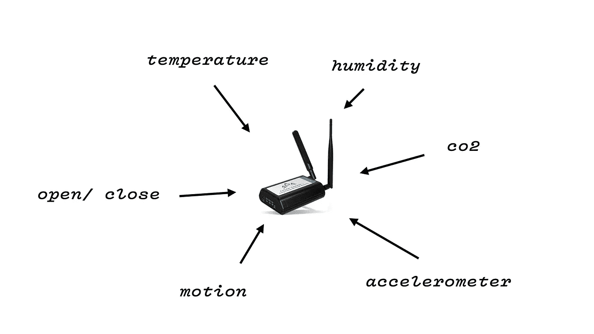
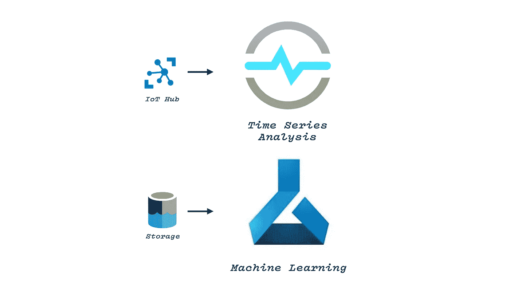

# 根据实时传感器数据做出决策

> 原文：<https://towardsdatascience.com/making-decisions-from-live-sensor-data-1febf8db9464>

## 物联网发展

## 如何在 Azure 中为实时数据分析设计可扩展的物联网架构

照片由 [DeepMind](https://unsplash.com/@deepmind?utm_source=medium&utm_medium=referral) 在 [Unsplash](https://unsplash.com?utm_source=medium&utm_medium=referral) 上拍摄

利用数据来洞察问题可能很困难。无论是您拥有的数据量、您可以收集数据的速度，还是数据本身的质量，成为数据驱动都有许多障碍。然而，还有另一个问题，也许是更基本的问题:你根本没有收集到做决定所需的信息。这个可能很难修复。

你经营一家工厂，你想知道你的生产线什么时候会出现故障。你在一家商店工作，想知道大楼里的人流量。你想知道你公寓的温度，这样你就可以相应地调节暖气。这有时是很难得到的数据！然而，有一个解决方案:有针对性地部署物联网(IoT)传感器，旨在收集做出决策所需的特定信息。

这篇文章就是关于这样做的实用性。我们将主要关注能够处理来自众多传感器的实时数据的软件堆栈的创建和部署。这个架构将必须能够分析数据，做出人工智能/人工智能预测，并最终可视化一切。这将集中在 Azure 技术上，尽管我确信有亚马逊(或其他云服务)的等价物。首先，我们将花一点时间预先讨论硬件考虑事项。

这篇文章讲述了我为了解如何管理和使用物联网设备而经历的旅程。该解决方案可能并不完美，但我希望它能让您在构建自己的架构时有所考虑。

*本文基于我最近在东北数据科学会议*上发表的演讲“从任何事物中获得洞察力”

# 五金器具

所以，如果我们想把传感器放在现实世界的某个地方，我们会有一些限制。天真地，我认为一个好的 Arduino 或 Raspberry Pi 是我所需要的。然而，现实世界有其他想法。以下是现实世界部署的一些考虑:(一)便宜吗？(ii)您如何为其供电？(iii)您如何将其连接到互联网？㈣安全吗？

一个树莓派可能看起来符合这些类别中的大部分！我花了很长时间开发一个电池供电、支持 3G、装满传感器的系统。但是，事实是这些大多是开发设备。要让工厂、政府大楼、学校等舒适地容纳一大群人是很困难的。它是 IP67 等级的吗？即使在一种情况下，是否防尘？耐摔？你确定电池安全吗？(事实上，锂离子电池相当危险！).坦率地说，一个有电缆和传感器的电路板会让人紧张——他们想知道这是不是合法的？挑战不胜枚举！带试验板的 Raspberry Pi 和生产就绪系统之间的差距是巨大的。当你跨过那道鸿沟时，你可能会意外地发现自己进入了硬件行业。我很晚才知道这个。

这里的解决方案是找到一个生产就绪的传感器设置。我了解了传感器制造商蒙尼特公司。他们提供了一个集线器，通过 3G sim 卡连接到 Azure。理想—我们不需要连接一个公司的 WiFi(把陌生的设备连接到 WiFi 会让网络安全的人很紧张！)该集线器还连接到一组传感器，从温度/湿度到二氧化碳和加速度计。

Monnit 设备有各种各样的传感器可用于与集线器通信。图片作者。

这些传感器具有超长的电池寿命，Monnit 声称(我的测试也支持这一点)，它们可以在不充电的情况下持续多年。理想——没有烦人的电缆挂在周围，也不需要人们不断给它们充电！重要的是，它们很便宜，符合工业标准。谈到物联网数据收集，这些是我首选的硬件。

因此，例如，我们可以将加速度计连接到工业锯上来测量振动(一个很好的故障指示器)，并让传感器将振动发送到 Monnit hub，mon nit hub 又将数据放入 Azure 进行分析。

# 软件

硬件决定后，我们需要整理软件。我们的软件解决方案需要考虑多个方面，而使用 1 Raspberry Pi 的较小项目可能不会考虑这些方面:(I)我们如何处理多个设备及其设置，(ii)我们如何处理和存储传入的实时数据，以及(iii)如何使其可扩展，确保它可以与 1 或 1，000 个传感器一起工作。

为此，我们将完全留在 Azure 生态系统中。让我们先来看看我们的架构:

提议的系统架构。图片作者。

我们将这个过程分成三个独立的部分。这样做的目的是有一个通用的“中间”层，清洁的传感器数据和其他实时数据最终可以到达该层。对于在这里访问它的用户来说，它现在应该是“通用的”——他们不需要关心硬件本身。我们可以进出其他传感器或 API 调用，访问数据的人不会受到影响。

让我们浏览一下架构，并解释这些服务是什么以及为什么选择它们。

## 流式数据输入

*   [物联网中枢](https://azure.microsoft.com/en-gb/products/iot-hub/):这是 Azure 为物联网设备管理提供的服务。在这里，我可以注册设备并控制它们的固件。它还允许我向设备发送信息，并接收信息。在这种情况下，我收到的信息是来自传感器的数据。
*   [功能](https://azure.microsoft.com/en-gb/products/functions/):微软将其描述为“功能即服务”(为什么现在什么都是服务了？).函数是无服务器的计算，允许你编写由一个动作触发的代码，而不需要处理它将以任何方式运行的硬件。留在 Azure 栈中的好处是你不必硬编码文件路径(通常)。通常，你可以将它指向另一个 Azure 服务，并告诉该函数在该服务被使用时触发。例如，当物联网中心收到消息时，或者当文件被放入存储时，可以触发功能。此外，它们非常便宜——一些粗略的数学计算表明，2 亿次函数调用可能花费 35 美元左右。
    在这个架构中，我们使用了一个函数来清理一些特别杂乱的数据(稍后会详细介绍)

## 通用事件处理

*   [Event Hub](https://azure.microsoft.com/en-gb/products/event-hubs/) :这是(非常松散的)，没有设备管理的物联网 Hub。我们希望有地方存放所有的数据。某个通用的地方，其他开发人员可以调用它来访问我们收集的信息，不管它来自什么物联网设备，甚至完全来自另一个来源(即调用 API 来获取实时天气数据)。
    已经被清理并落在这里的事件现在可以进行分析了。

## 现场/历史

*   [流媒体分析](https://azure.microsoft.com/en-gb/products/stream-analytics/):微软的命名惯例有时会非常字面化。流分析(SA)是一个处理流数据分析的平台。如果你看看微软为物联网设置提供的大多数架构图，SA 通常直接连接到物联网 Hub。然而，我们发现这很难做到。该服务使用一种类似 SQL 的语言，这种语言非常严格，我们发现在 s a 中清理数据和执行分析是不可能的。有人建议我们开始将一个 SA 实例通过管道传输到另一个，但这很快变得非常昂贵。因此，在 SA 执行分析之前，清理由函数完成。
    SA 使用的语言非常适合执行窗口和聚合等操作。你可以快速形成移动平均线，并为下一阶段准备数据:可视化
*   [Power BI](https://powerbi.microsoft.com/en-au/) :到目前为止，一切都是现场发生的:SA 由 Event Hub 触发，由 Functions 活动触发，Functions 活动正在观察物联网 Hub 的输出。我们将继续让 Power Bi 实时绘制数据。Power Bi 是模型优先的 Bi 解决方案，而不是可视化优先的 Bi 解决方案。我认识的一位非常聪明的 Bi 开发人员曾经说过这句话，我听得一清二楚，现在我还在不停地重复这句话。我认为 Power Bi 有一个非常强大的建模引擎和一个强大的查询语言(DAX)。最后，这也是非常好的观想。
    台式机上的 Power Bi 有一些刷新限制，但有一个仅在线的仪表盘版本是真正实时的。您可以将流分析直接指向这个实时仪表盘，从而简化集成。在上图中，我们定期将数据存入存储器。这在传统的电力商业智能中显露出来。

这种设置允许我们处理实时数据和历史数据。它允许我们从同一系统访问物联网数据和其他实时来源。拥有物联网中心让我们能够进行设备管理。最后，Azure 工具具有很好的可扩展性——函数调用既便宜又快速，你可以在物联网中心免费获得成千上万条消息，Power Bi 将能够处理巨大的数据集。

# 获得洞察力

到目前为止，我们的解决方案可以处理实时数据，并通过流分析对其进行深入分析。然而，下一步是用 Azure 让我们访问的机器学习堆栈进行更深入的数据分析。

Azure 机器学习，或时间序列分析，是将数据科学应用于物联网数据的好选择。图片作者。

我觉得有趣的两项服务是:

*   [时间序列分析](https://azure.microsoft.com/en-gb/products/time-series-insights/):同样，微软的命名惯例非常字面化。时间序列分析(TSA)正如它所说的那样:它允许您将预先构建的标准时间序列分析技术应用于时间序列数据。事实上，您可以直接将其指向 IoT Hub 的一个实例。我在这里的保留来自于使用流分析:关于集成到物联网中心是多么容易的承诺，我最终需要增加功能。这一点也会如此吗？
*   [Azure 机器学习](https://azure.microsoft.com/en-us/products/machine-learning/) : Azure 的机器学习服务棒极了。它是我开发机器学习的首选工具。它具有大量的功能(模型跟踪、管道和几乎所有现代 ML 平台的功能)，是实现机器学习模型的好选择。您可以将它指向存储，并使用它对我们刚刚收集的历史数据执行分析。结果可能会在 Power Bi 中浮出水面

正如我在开始时说的，这也是我正在进行的一段旅程。这个末端部分，尖锐的分析部分，是最不发达的。然而，Azure 为探索提供了很多选择。

# 结论

很难洞察你想要理解的每一个过程。有时候，你根本没有数据来做你想做的决定。然而，在某些情况下，您可以部署廉价、灵活、非侵入性的物联网设备来执行高度有针对性的数据收集。这些数据可以用来帮助你做出正确的决定。

本文的大部分内容都在讨论我构建的软件栈，它用来处理从各种不同传感器收集的实时数据。它非常关注 Azure 技术。它利用物联网中心来处理设备和数据登陆，利用功能来清理一切，利用流分析来获得一些见解，并利用 Bi 来实现实时数据可视化。

展望未来，Azure 提供了两个(可能不止这些！)有趣的工具来自动化决策，并从我们收集的数据中获得更多知识:时间序列分析和机器学习。展望未来，我期待着玩这些更多！

我希望你喜欢这篇文章，并且对创建你自己的架构有用！

*安德鲁·布朗斯*

请在 Medium 上订阅我，以跟踪任何令人兴奋的未来文章！也可以在这里联系: [LinkedIn](https://www.linkedin.com/in/andrew-blance/) | [Twitter](https://twitter.com/andrewblance)