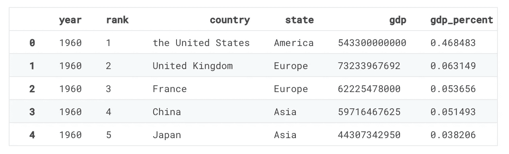
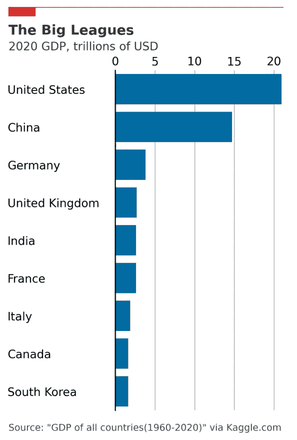
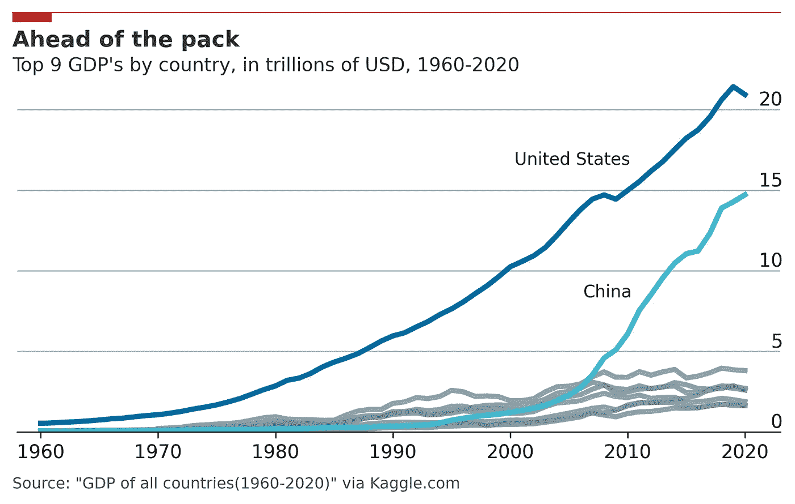
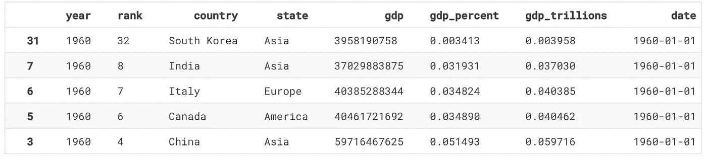
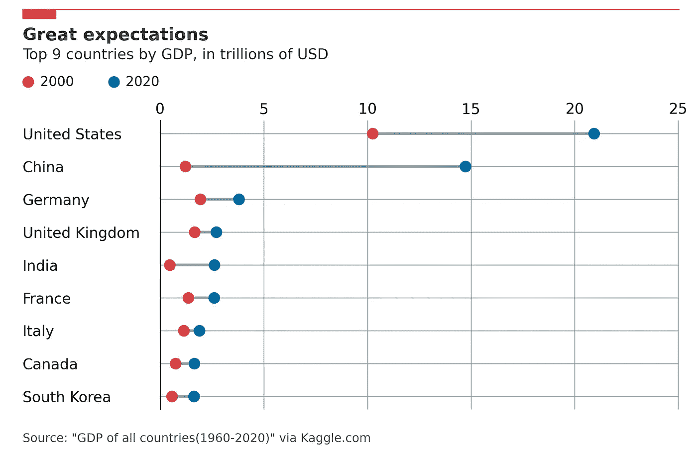

# 在 Matplotlib 中制作经济学家风格的绘图

> 原文：<https://towardsdatascience.com/making-economist-style-plots-in-matplotlib-e7de6d679739>


作者照片

# 在 Matplotlib 中制作经济学家风格的绘图

## 推动 Matplotlib 制作精美易读的剧情

> 你可以在 [Deepnote](https://deepnote.com/workspace/datafantic-3bd1a992-4cfb-4c56-aaaf-931ce087ce8c/project/2022-07-Making-Economist-Style-Plots-in-Matplotlib-ab77d77a-f145-413e-8ae3-02ac8ab9d883/%2FMaking%20Economist%20Style%20Plots%20in%20Matplotlib.ipynb) 上找到这篇文章的 Jupyter 笔记本。

如果你喜欢数据可视化，你可能已经在他们的网站或杂志上看到过《经济学人》的[的图表。几十年来，它们以简单有效的可视化著称，以简单的方式传达有用的信息。在过去的几年里，我一直被他们的形象所鼓舞。无论我是在 Kindle 上、在网上还是在移动设备上看到它们，它们总是引人入胜，而且能让人理解。这是所有数据科学家在他们自己的可视化中应该追求的东西。](https://www.economist.com/)

2018 年 10 月，《经济学人》为他们的数据可视化发布了一个专门的博客，名为[图形细节](https://www.economist.com/graphic-detail)。如果你浏览他们的文章，你会发现他们的风格在不同的图表类型中保持一致。这并不是因为他们是一个尽可能快的制造可视化的工厂。相反，这种一致的风格旨在简化它们的可视化，并尽可能快地向读者提供关键信息。

作为一名专注于 Python 的数据科学家，在我的日常工作中，我几乎只使用 [Matplotlib](https://matplotlib.org/) 进行数据可视化。我喜欢它，因为它是难以置信的可定制的。每一个元素都在你的掌控之中。虽然我肯定《经济学人》的数据记者使用 Matplotlib 进行探索工作或实体模型(或 R 的 ggplot)，但我非常怀疑他们只使用 Matplotlib 进行生产可视化。

然而，我非常喜欢将尽可能多的工作流程放在一个地方。这种想法启发我用 100% Python 和 Matplotlib 重新创建了几个经济学家的图表类型。这个项目我有两个目标。首先，我想举例说明如何在 Matplotlib 中执行出色的图表设计。其次，我想展示一个编程绘图库可以用来创建生产绘图。

请注意，我不会为此制作可重用的函数或库。相反，如果您感兴趣，我希望您可以复制任何您可能想要的代码，并自己重用它。

我将重现《经济学人》常用的三种图表类型:条形图、折线图和哑铃图。但在此之前，让我们先来分解一下经济学家的可视化的关键要素。

> 请注意，这样做只是为了教育和信息的目的。

# 《经济学家》的风格

为了了解《经济学人》的可视化风格，我们可以使用他们 2017 年的视觉风格指南。这里是[环节](https://design-system.economist.com/documents/CHARTstyleguide_20170505.pdf)。让我们来分析一下《经济学人》风格的常见元素。

# 标题和副标题

图表通常都有标题和副标题。标题通常是文字游戏，比如食品价格上涨的“不开心的一餐”。副标题将是图表内容的简单陈述。它们总是位于左上方，与图表内容的左边缘齐平。标题总是加粗，比副标题大。

# 网格线

仅显示水平网格线。次要网格线根本不会显示。网格线的间距符合数据的逻辑，易于理解。

# 轴和刻度标签

仅显示了水平轴。除此之外，图表数据周围没有其他边界框。在 x 轴上，刻度(标签旁边的小线条)仅在需要显示哪些数据连接到哪个刻度标签时显示。y 轴上没有刻度，只有主要的网格线。y 轴刻度标签位于图表区内主要网格线的顶部。

水平条形图是一个例外。在这种情况下，显示了 y 轴，但没有 x 轴。y 轴刻度标签位于数字的正上方。

# 颜色；色彩；色调

《经济学人》使用两个图表调色板，一个用于网络，一个用于印刷。我们将把重点放在网络上。主色“经济红”(#E3120B)用于顶行和标签框。样式指南中的灰色(#758D99)似乎用于网格线。用于绘图的颜色有:

*   红色，#DB444B
*   蓝色，#006BA2
*   青色，#3EBCD2
*   绿色，#379A8B
*   黄色，#EBB434
*   橄榄，#B4BA39
*   紫色，#9A607F
*   金色，#D1B07C

风格指南中有更多的调色板用于不同的用途，但这是主要的调色板。每种图表类型的颜色顺序都是不同的，下面我将尝试重现这一点。所有地块将使用白色背景的网络样式。

# 其他文体要点

一条“经济学人红色”的水平线贯穿图表的整个顶部。一个水平的矩形，他们称之为标签，位于左上角。数据源以 75%的不透明度显示在左下角。

我们可以在下面的章节中讨论特定于图表的样式。

# 条形图

让我们按照《经济学人》的风格制作一个条形图！下面是《经济学人》中条形图的一个[例子。我们将使用来自 Kaggle 数据集的按国家分列的 2020 年 GDP 值(](https://www.economist.com/graphic-detail/2021/11/09/the-gender-gap-in-academic-research-widened-during-first-wave-of-the-pandemic)[链接](https://www.kaggle.com/holoong9291/gdp-of-all-countries19602020/version/3))。该图表的目的是按 GDP 值显示排名前 5 位的国家。

《经济学人》通常只使用一个垂直条形图，其中一个或两个分类变量是随着时间进行比较的。对于我们正在处理的数据，水平条形图更合适。这是因为国家名称比较长，如果不旋转的话，它们在 x 轴上不太合适。这将使它们更难阅读。解决方案是将数据推过一些，并将标签放在 y 轴上。

让我们导入`pandas`和`matplotlib`并读入我们的数据。

```
import pandas as pd
import numpy as np
import matplotlib.pyplot as plt# This makes out plots higher resolution, which makes them easier to see while building
plt.rcParams['figure.dpi'] = 100gdp = pd.read_csv('data/gdp_1960_2020.csv')
gdp.head()
```



这里的 GDP 数据很长。为了便于阅读，我们可以将 GDP 除以 1 万亿。

```
gdp['gdp_trillions'] = gdp['gdp'] / 1_000_000_000_000
```

现在，我们只能过滤到 2020 年，并抓住底部 9。我们这样做，而不是按降序排序，因为 Matplotlib 是从下到上绘制的，所以我们实际上希望数据的顺序相反。

```
gdp[gdp['year'] == 2020].sort_values(by='gdp_trillions').tail(9)
```

现在我们可以构建我们的图表了。代码在这里有注释。

以及由此产生的图:



作者照片

哇，代码真多！那里有很多东西，值得花时间一行一行地去理解，用评论来理解。

现在让我们继续看折线图。

# 折线图

折线图可能是《经济学人》中最具标志性的图表。下面是《经济学人》的一个折线图例子。

我们将使用与上述相同的国内生产总值数据，创建一个按国内生产总值排名前 9 名的国家的时间序列图。为了突出中国所走的道路，我们只会用醒目的颜色显示美国和中国，其他 7 个为灰色。

首先，我们可以从前面的代码中得到我们想要过滤的国家的名称。

```
countries = gdp[gdp['year'] == 2020].sort_values(by='gdp_trillions')[-9:]['country'].valuescountries# Output
array(['South Korea', 'Canada', 'Italy', 'France', 'India',
       'United Kingdom', 'Germany', 'China', 'United States'],
      dtype=object)
```

Matplotlib 在时间序列的日期时间方面做得很好，所以我们可以将日期列转换为熊猫日期时间序列。

```
gdp['date'] = pd.to_datetime(gdp['year'], format='%Y')
```

我们的数据已经准备好了，开始密谋吧！



作者照片

这次会有更多的代码。通常情况下，《经济学人》的图表更为方形，尤其是印刷版。我决定把它做得更宽，以便更适合一篇文章本身。

# 哑铃图

最后一个图表，我们做一个哑铃图。这些图表用于显示分类变量的差异，通常是随着时间的推移。这里有一个来自经济学家的哑铃图的例子。

我们将再次使用 GDP 数据。这次是为了显示前 9 个国家从 1960 年到 2020 年的 GDP 差异。

```
gdp_dumbbell = gdp[(gdp['country'].isin(countries)) & ((gdp['year'] == 1960) | (gdp['year'] == 2020))].sort_values(by='gdp')gdp_dumbbell.head(5)
```



作者照片



作者照片

# 结论

虽然我们已经看到在 Matplotlib 中重现经济学人的图表风格是可能的，但这肯定不容易。对于每个图，都需要几十行代码，每个图都经过几次反复试验才得到上面看到的结果。

正如您在代码中看到的，Matplotlib 中数据的绘制相当简单。然而，对齐文本、行和标签需要手动输入非常具体的自定义位置。这是上面代码中值得改进的一点。

这是一次很棒的经历，在这个过程中我学到了一些关于 Matplotlib 的东西。该库的定制能力继续让我惊叹。也许在将来，我会在 Matplotlib 中构建一个更具重现性的方法来创建打印质量图表。

> 感谢阅读。我主要在 datafantic.com 的[写文章，所以一定要看看我写的更多文章。](https://datafantic.com)
> 
> 如果你喜欢媒体，并且想直接支持我的文章，你可以使用我的[推荐链接](https://robertritz.com/membership)注册成为媒体会员。

**参考文献**

1.  [所有国家的 GDP(1960-2020)通过 Kaggle.com。在 GPL v2 许可下发布。](https://www.kaggle.com/holoong9291/gdp-of-all-countries19602020/version/3)