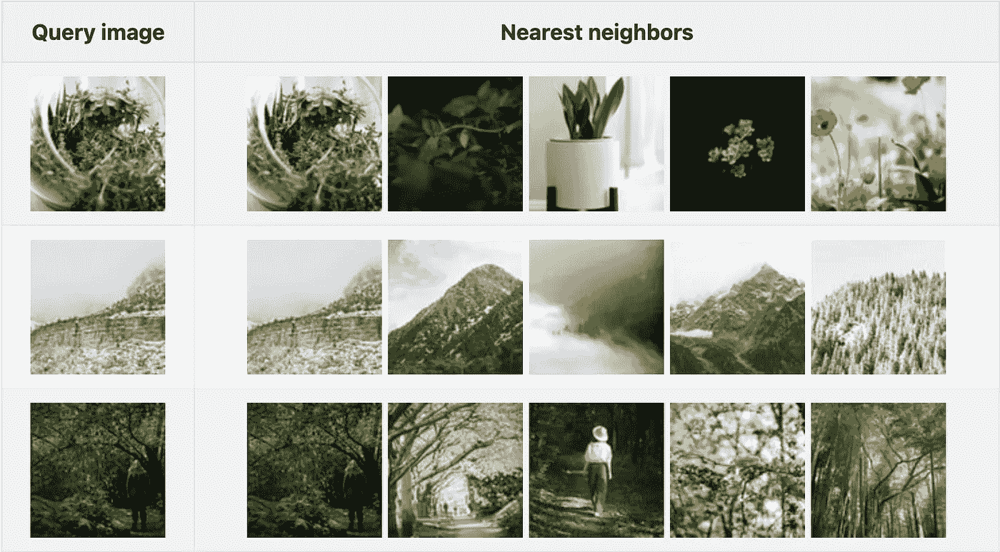
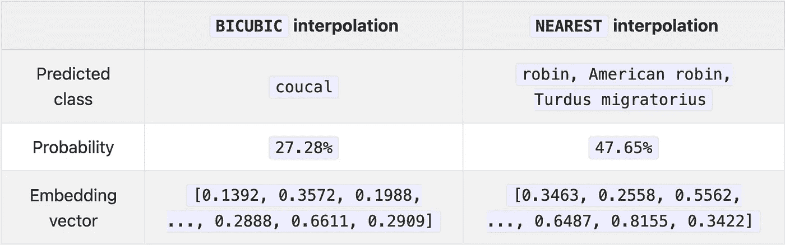

# 让应用程序开发人员更容易使用机器学习

> 原文：<https://towardsdatascience.com/making-machine-learning-more-accessible-for-application-developers-9765f90c6b22>

## [Towhee](https://github.com/towhee-io/towhee) 可以帮助加速机器学习应用的开发


[许海波](https://unsplash.com/photos/w7ZyuGYNpRQ)在 [Unsplash](https://unsplash.com) 上拍照

# 介绍

试图手工制作算法来理解人类生成的内容通常是不成功的。例如，计算机很难仅仅通过分析图像的低级像素来“掌握”图像的语义内容，例如汽车、猫、大衣等。[颜色直方图](https://en.wikipedia.org/wiki/Color_histogram)和[特征检测器](https://en.wikipedia.org/wiki/Scale-invariant_feature_transform)在一定程度上发挥了作用，但对于大多数应用来说，它们很少足够精确。

在过去的十年里，大数据和深度学习的结合从根本上改变了我们处理计算机视觉、自然语言处理和其他机器学习(ML)应用的方式；从垃圾邮件检测到逼真的文本到视频合成，各种任务都取得了令人难以置信的进步，某些任务的准确性指标达到了超人的水平。这些改进的一个主要积极副作用是增加了*嵌入向量*的使用，即通过在深度神经网络中获取中间结果而生成的模型工件。OpenAI 的[文档页面](https://beta.openai.com/docs/guides/embeddings)给出了一个很好的概述:

> *嵌入是一种特殊的数据表示格式，可以很容易地被机器学习模型和算法利用。嵌入是一段文本的语义的信息密集表示。每个嵌入是浮点数的向量，使得向量空间中两个嵌入之间的距离与原始格式的两个输入之间的语义相似性相关。例如，如果两个文本相似，那么它们的矢量表示也应该相似。*

下表显示了三个查询图像以及它们在嵌入空间中对应的前五个图像(我使用了 [Unsplash Lite](https://frankzliu.com/blog/making-machine-learning-more-accessible-for-application-developers) 的前 1000 个图像作为数据集):



作者图片

你在上面看到的这些结果是基于 [ResNet50](https://arxiv.org/abs/1512.03385) 的*图像嵌入模型*生成的，这是一个众所周知的纯卷积图像分类模型。嵌入不仅限于图像，还可以为各种不同类型的非结构化数据生成，包括图像、音频、时序数据和分子结构。将多种不同类型的数据嵌入同一个空间的模型，也就是通常所说的*多模态嵌入模型*，也已经存在，并且正在越来越多的应用中使用。

正如我们将在接下来的两节中看到的，生成这些高质量的嵌入可能很困难，尤其是在大规模的情况下。

# 训练嵌入任务的新模型

理论上，训练一个新的 ML 模型并使用它生成嵌入听起来很容易:采用最新的和最好的预建模型，由最新的架构支持，并用一些数据训练它。很简单，对吧？

没那么快。从表面上看，使用最新的模型架构来实现最先进的结果似乎很容易。然而，这与事实相去甚远。让我们来看看一些与训练嵌入模型相关的常见陷阱(这些也适用于一般的机器学习模型):

1.  *没有足够的数据*:在没有足够数据的情况下，从头开始训练一个新的嵌入模型，容易出现*过拟合*的现象。在实践中，只有最大的全球性组织有足够的数据来从头开始培训一个新的模型是值得的；其他人必须依靠 [*微调*](https://docs.towhee.io/fine-tune/train-operators/quick-start/) ，这是一个过程，在这个过程中，具有大量数据的已经训练好的模型然后使用较小的数据集进行提取。
2.  *差超参数选择* : [超参数](https://en.wikipedia.org/wiki/Hyperparameter_(machine_learning))为常量，用于控制训练过程，如模型学习的快慢或单批训练使用多少数据。微调模型时，选择一组适当的超参数极其重要，因为某些值的微小变化可能会导致非常不同的结果。[该领域的最新研究](https://arxiv.org/abs/2110.00476)还显示，使用改进的训练程序从头开始训练相同的模型，ImageNet-1k 的准确性提高了 5%以上(这是一个很大的进步)。
3.  *高估自我监督模型*:术语*自我监督*指的是一种训练程序，其中输入数据的“基本面”是通过利用数据本身来学习的，而不需要标签。一般来说，自监督方法非常适合预训练(即，在用较小的标记数据集对模型进行微调之前，用大量未标记数据以自监督方式训练模型)，但直接使用自监督嵌入可能会导致次优性能。

解决上述所有三个问题的一个常见方法是，首先使用大量数据训练一个自我监督的模型，然后根据标记的数据对模型进行微调。这已经证明[对 NLP](https://arxiv.org/abs/1810.04805) 很有效，但是[对 CV](https://arxiv.org/abs/2003.14323) 还没那么有效。

# 使用嵌入模型有其自身的缺陷

这些只是与训练嵌入模型相关联的许多常见错误中的一些。这样做的直接结果是，许多寻求使用嵌入的开发人员直接使用学术数据集上预先训练的模型，如 [ImageNet](https://image-net.org/) (用于图像分类)和 [SQuAD](https://rajpurkar.github.io/SQuAD-explorer/) (用于问题回答)。尽管目前有大量的预训练模型可用，但为了提取最大的嵌入性能，应该避免几个陷阱:

1.  *训练和推理数据不匹配*:使用由其他组织训练的现成模型已经成为一种流行的方式来开发 ML 应用程序，而不需要数千个 GPU/TPU 小时。理解特定嵌入模型的局限性以及它如何影响应用程序的性能是极其重要的；如果不了解模型的训练数据和方法，很容易误解结果。例如，一个被训练来嵌入音乐的模型在应用于语音时会表现不佳，反之亦然。
2.  *层选择不当*:使用全监督神经网络作为嵌入模型时，特征一般取自激活的倒数第二层(正式名称为*倒数第二层*)。然而，这可能导致次优性能，具体取决于应用。例如，当使用为图像分类而训练的模型来嵌入徽标和/或品牌的图像时，使用较早的激活可能会导致性能提高。这是因为较好地保留了对非复杂图像分类至关重要的低级特征(边缘和拐角)。
3.  *不同的推理条件*:训练和推理条件必须*完全*相同，以从嵌入模型中提取最大性能。实际上，情况往往并非如此。例如，来自`[torchvision](https://pytorch.org/vision/stable/index.html)`的标准`resnet50`模型在使用双三次插值与最近邻插值进行下采样时会产生两种完全不同的结果(见下文)。


照片由 [Patrice Bouchard](https://unsplash.com/photos/CcmxhowdIFc) 在 [Unsplash](https://unsplash.com) 上拍摄



作者图片

# 部署嵌入模型

一旦您跨越了与培训和验证模型相关的所有障碍，扩展和部署它就成为了下一个关键步骤。同样，嵌入模型部署说起来容易做起来难。 *MLOps* 是与 DevOps 相邻的一个油田，专门用于此目的。

1.  *选择正确的硬件*:与大多数其他 ML 模型类似，嵌入式模型可以在各种不同类型的硬件上运行，从标准的日常 CPU 到可编程逻辑(FPGAs)。完整的[研究论文](https://www.jaewoong.org/pubs/fpt16-accelerating-bnn.pdf)分析了成本与效率之间的权衡，强调了大多数组织在这方面面临的困难。
2.  *模型部署平台*:有很多 MLOps 和分布式计算平台可用(包括很多开源的)。弄清楚这些如何适合您的应用程序本身就是一个挑战。
3.  *嵌入向量的存储*:随着应用程序的扩展，您需要为您的嵌入向量找到一个可扩展的、更持久的存储解决方案。这就是 [*矢量数据库*](https://frankzliu.com/blog/a-gentle-introduction-to-vector-databases) 的用武之地。

# 我自己学着做！

我为你的热情喝彩！需要记住几个关键的事情:

**ML 与软件工程非常不同**:传统的机器学习源于统计学，这是一门与软件工程非常不同的数学分支。正则化和特征选择等重要的机器学习概念都有很强的数学基础。虽然用于训练和推理的现代库( [PyTorch](https://pytorch.org) 和 [Tensorflow](https://www.tensorflow.org/) 是两个众所周知的库)已经使得训练和生产嵌入模型变得非常容易，但是理解不同的超参数和训练方法如何影响嵌入模型的性能仍然非常重要。

**学习使用 PyTorch 或 Tensorflow 可能并不直观**:如前所述，这些库大大加快了现代 ML 模型的训练、验证和部署。对于经验丰富的 ML 开发人员或熟悉 HDL 的程序员来说，构建新模型或实现现有模型可能非常直观，但对于大多数软件开发人员来说，潜在的概念可能很难理解。还有选择哪个框架的问题，因为这两个框架使用的执行引擎有相当多的差异(个人推荐 PyTorch)。

**找到一个适合你的代码库的 MLOps 平台需要时间**:这里有一个 MLOps 平台和工具的[精选列表](https://github.com/kelvins/awesome-mlops)。有数百个不同的选项可供选择，评估每个选项的利弊本身就是一个长达数年的研究项目。

说了这么多，我想把我上面的陈述修改为:我为你的热情鼓掌，*但是我不建议学习 ML 和 MLOps* 。这是一个相当漫长而乏味的过程，会占用最重要的事情的时间:开发一个用户会喜欢的可靠的应用程序。

# 用 Towhee 加速数据科学

[Towhee](https://towhee.io) 是一个[开源项目](https://github.com/towhee-io/towhee)，它帮助软件工程师开发和部署应用程序，这些应用程序仅用几行代码就利用了嵌入式技术。Towhee 为软件开发人员提供了开发他们自己的 ML 应用程序的自由和灵活性，而不必深入嵌入模型和机器学习。

**一个简单的例子**

一个`Pipeline`是由几个子任务组成的单个嵌入生成任务(在 Towhee 中也称为`Operators`)。通过在`Pipeline`中抽象出整个任务，Towhee 帮助用户避免了上面提到的许多嵌入生成陷阱。

```
>>> from towhee import pipeline
>>> embedding_pipeline = pipeline('image-embedding-resnet50')
>>> embedding = embedding_pipeline('https://docs.towhee.io/img/logo.png')
```

在上面的示例中，图像解码、图像变换、特征提取和嵌入归一化是编译到单个管道中的四个子步骤——您无需担心模型和推理细节。Towhee 为各种任务提供了预构建的嵌入管道，包括音频/音乐嵌入、图像嵌入、人脸嵌入等等。有关管道的完整列表，请随时访问我们的 [Towhee hub](https://towhee.io/pipelines) 。

**方法链接 API**

Towhee 还提供了一个名为`DataCollection`的 Pythonic 非结构化数据处理框架。简而言之，`DataCollection`是一个方法链 API，它允许开发者在真实世界的数据上快速构建嵌入和其他 ML 模型的原型。在下面的例子中，我们使用`DataCollection`通过`resnet50`嵌入模型计算嵌入。

对于这个例子，我们将构建一个“应用程序”，让我们用一个数字`3`来过滤质数:

```
>>> from towhee.functional import DataCollection 
>>> def is_prime(x):
...     if x <= 1:
...         return False
...     for i in range(2, int(x/2)+1):
...         if not x % i:
...             return False
...     return True
... 
>>> dc = (
...     DataCollection.range(100)
...         .filter(is_prime) # stage 1, find prime
...         .filter(lambda x: x%10 == 3) # stage 2, find primes that ends with '3'
...         .map(str) # stage 3, convert to string
... ) 
...
>>> dc.to_list()
```

`DataCollection`可用于开发整个应用程序，只需一行代码。下一节将展示如何使用`DataCollection`开发一个反向图像搜索应用程序——继续阅读了解更多。

**Towhee 培训师**

如上所述，完全或自我监督的训练模型通常擅长于一般的任务。然而，你有时会想要创建一个嵌入模型，它擅长于一些非常具体的事情，例如区分猫和狗。Towhee 专门为此提供了一个培训/微调框架:

```
>>> from towhee.trainer.training_config import TrainingConfig
>>> training_config = TrainingConfig( 
...     batch_size=2, 
...     epoch_num=2, 
...     output_dir='quick_start_output' 
... )
```

您还需要指定一个数据集进行训练:

```
>>> train_data = dataset('train', size=20, transform=my_data_transformer)
>>> eval_data = dataset('eval', size=10, transform=my_data_transformer)
```

一切就绪后，从现有运营商那里培训新的嵌入模型是小菜一碟:

```
>>> op.train( 
...     training_config, 
...     train_dataset=train_data, 
...     eval_dataset=eval_data 
... )
```

一旦完成，您就可以在应用程序中使用相同的操作符，而无需更改其余的代码。


作者图片

# 一个示例应用程序:反向图像搜索

为了演示如何使用 Towhee，让我们快速构建一个小型的[反向图像搜索](https://en.wikipedia.org/wiki/Reverse_image_search)应用程序。反向图像搜索是一个众所周知的。让我们开始吧:

```
>>> import towhee
>>> from towhee.functional import DataCollection
```

对于这个示例应用程序，我们将使用一个小数据集和 10 个查询图像(此处的[可用](https://drive.google.com/file/d/1bg1RtUjeZlOfV2BiA2nf7sn5Jec9b-9I/view?usp=sharing))。使用`DataCollection`，我们可以加载数据集和查询图像:

```
>>> dataset = DataCollection.from_glob('./image_dataset/dataset/*.JPEG').unstream() 
>>> query = DataCollection.from_glob('./image_dataset/query/*.JPEG').unstream()
```

下一步是计算整个数据集集合的嵌入:

```
>>> dc_data = ( 
... dataset.image_decode.cv2() 
...     .image_embedding.timm(model_name='resnet50') 
... ) 
...
```

这一步创建嵌入向量的本地集合—数据集中的每个图像一个。这样，我们现在可以查询最近的邻居:

```
>>> result = ( 
...     query.image_decode.cv2() # decode all images in the query set 
...         .image_embedding.timm(model_name='resnet50') # compute embeddings using the `resnet50` embedding model 
...         .towhee.search_vectors(data=dc_data, cal='L2', topk=5) # search the dataset 
...         .map(lambda x: x.ids) # acquire IDs (file paths) of similar results 
...         .select_from(dataset) # get the result image 
...     )
...
```

我们还提供了一种使用 [Ray](https://github.com/ray-project/ray) 部署应用程序的方法。只需指定`query.set_engine('ray')`就可以了！

# 结束语

最后一点:我们并不认为 [Towhee](https://github.com/towhee-io/towhee) 是一个成熟的端到端模型服务或 MLOps 平台，这也不是我们的目标。相反，我们的目标是加速需要嵌入和其他 ML 任务的应用程序的开发。有了 Towhee，我们希望能够在您的本地机器上实现嵌入模型和管道的快速原型化(`Pipeline` + `Trainer`)，允许仅用几行代码(`DataCollection`)开发一个以 ML 为中心的应用程序，并允许轻松快速地部署到您自己的集群中(通过 [Ray](https://github.com/ray-project/ray) )。

我们一直在寻找人们加入我们的开源社区——如果你对此感兴趣，请随时通过 [Slack](https://slack.towhee.io) 和 [Twitter](https://twitter.com/towheeio) 与我们联系。

这就是所有的人——希望这篇文章是有益的。如果您有任何问题、意见或顾虑，请在下面留下您的评论。敬请关注更多内容！

*原载于 2022 年 4 月 9 日*[*https://frankzliu.com*](https://frankzliu.com/blog/making-machine-learning-more-accessible-for-application-developers)*。*