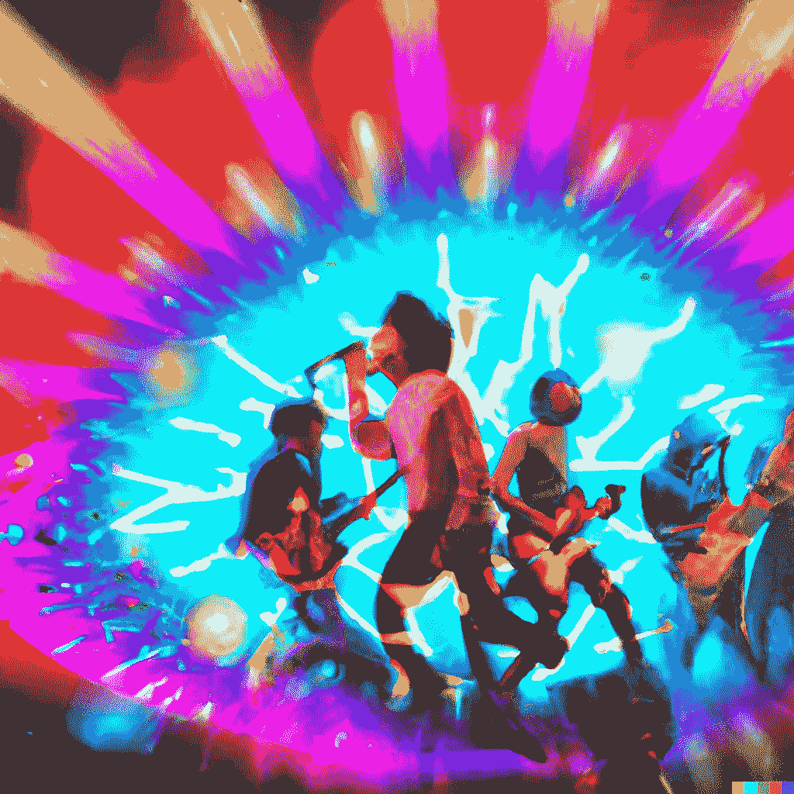
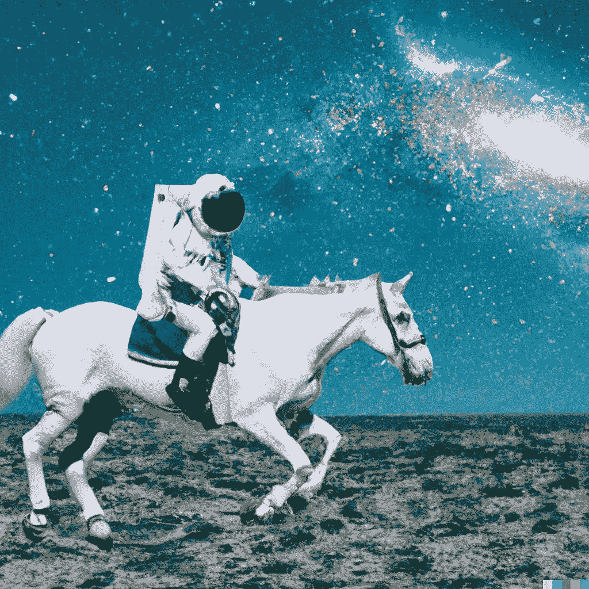
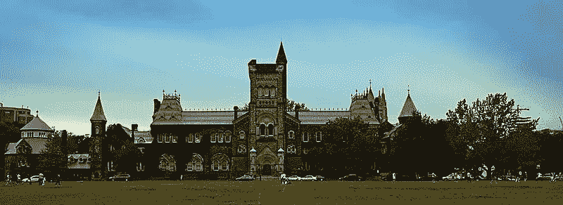
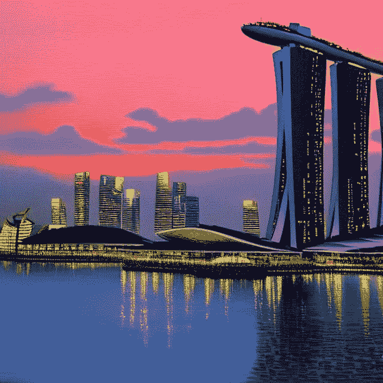
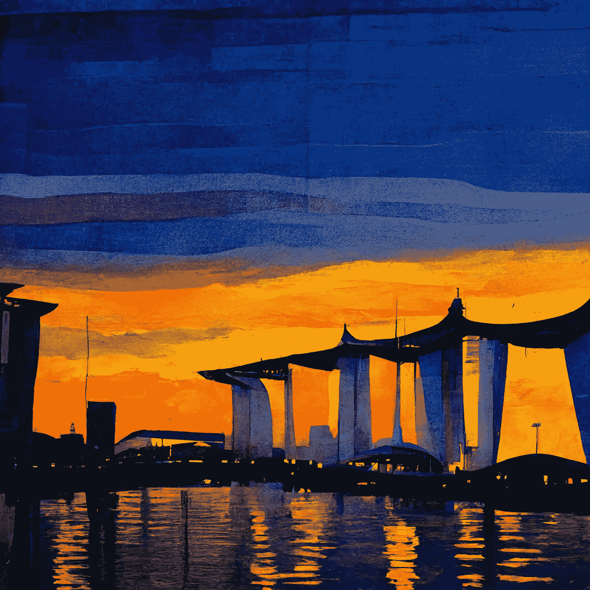
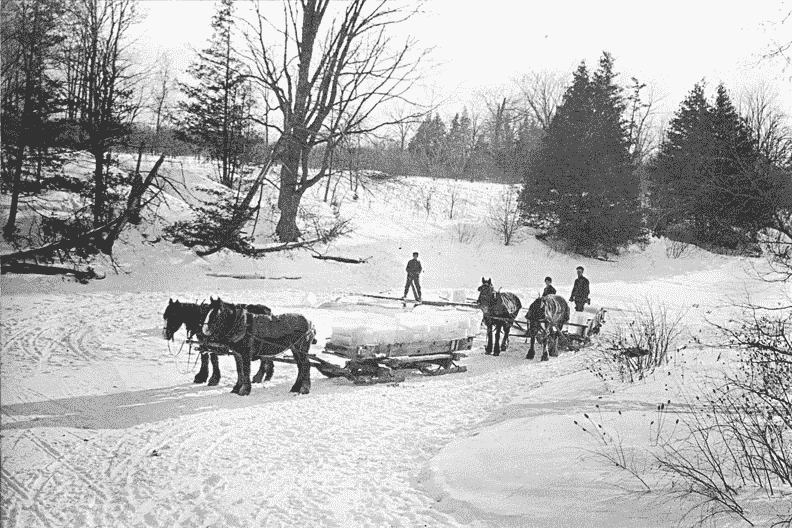
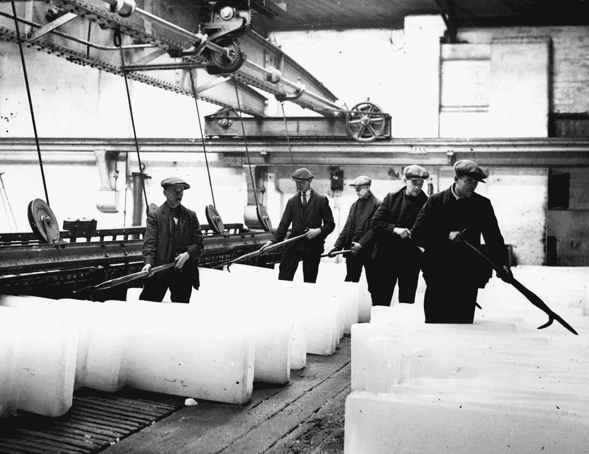

# 用文字制作图片

> 原文：<https://towardsdatascience.com/making-pictures-with-words-9aac0b97b356>

## 人工智能文本到图像生成器的崛起

当我第一次听这首歌的时候，我还很年轻。我觉得这是一首有趣又朗朗上口的歌，就像一首顺口溜，尽管我不知道这首歌是关于什么的。但这没什么，我只是一个小男孩，听着收音机，看着录像机上的录像。我真的没有太注意标题或歌词。

Dall-E 2 使用文本提示创建的图像“视频杀死了电台明星，在用迷幻灯光演唱 80 年代流行歌曲风格的乐队中演奏”

很久以后，我才意识到歌词的真正含义。

> 视频杀了电台明星
> 视频杀了电台明星
> 
> 在我的脑海里，在我的车里
> 我们不能倒带，我们已经走得太远
> 画面传来，伤透了你的心
> 归咎于录像机
> 
> *视频杀了电台明星(道恩斯/伍利/霍恩)*

这首歌是塑料时代专辑的一部分，该专辑的主题是怀旧和对现代技术影响的焦虑。虽然这张专辑发行于 40 多年前(1980 年)，但这些主题仍然真实而清晰。

# 生成图像

当[抖音开始在他们的应用程序中推出](https://techcrunch.com/2022/08/15/tiktok-in-app-text-to-image-ai-generator/)时，你就知道一项技术已经进入了大联盟。仅在本周，我就阅读了几份人工智能文本到图像生成器的前 10 名名单。这项技术炙手可热，模型和创业公司一夜之间如雨后春笋般涌现。每隔一周或一个月，整个思维方式都会被推翻，昨天令人兴奋的技术已经是旧闻了。

最知名的文本到图像 AI 模型当然是 2021 年 1 月发布的 [OpenAI 的 Dall-E](https://openai.com/blog/dall-e/) 。OpenAI 在 2021 年 12 月发布了另一款机型 GLIDE(没事，后面我再说首字母缩写)而之后没多久， [Dall-E 2](https://openai.com/dall-e-2/) 在 2022 年 4 月公布。至少可以说，发布的速度非常快。

图片由 Dall-E 2 创建，使用文本提示“一名宇航员以逼真的风格租用一匹马”

谷歌备受期待的 [Imagen](https://imagen.research.google) 于 2022 年 6 月发布，尽管它尚未发布，但大量媒体报道已经开始称赞它如何完全超越了王者 Dall-E 2 。

在这股浪潮中， [Meta(脸书)于 2022 年 7 月发布了他们的文本到图像工具，Make-A-Scene](https://hypebeast.com/2022/7/meta-make-a-scene-ai-artwork-tool) 。Make-a-Scene 与中的其他场景稍有不同，因为它允许用户根据自己的选择用一个简单的草图来补充文本提示。

就连微软也赶了上来，宣布推出[女娲-Infinity](https://nuwa-infinity.microsoft.com/#/) ，这是一种人工智能模型，可以从任何给定的文本、图像或视频输入中生成高质量的图像和视频。

是的，视频。

然而，大公司并没有垄断文本到图像的淘金热。在同一个领域有很多小型创业公司。 [Midjourney](https://www.midjourney.com/home/) 是一家小型创业/研究实验室(不到 10 人)，拥有一批使用其工具创作艺术作品的用户。它于 2022 年 7 月公开测试。

睡前咖啡是另一个流行的工具，来自澳大利亚。该公司于 2019 年 11 月作为[神经风格转移](https://en.wikipedia.org/wiki/Neural_style_transfer)应用程序成立，但当较新的人工智能模型在 2021 年年中登场时，他们很快转向图像生成。如今，它自称已经在其平台上创作了超过 500 万件艺术品。

小型人工智能文本到图像初创公司的新宠必须是[稳定性人工智能](https://stability.ai)。所以[滔滔不绝的报道](https://www.nasdaq.com/articles/stability.ai-debuted-most-provocative-open-source-text-to-image-model-ark-says)已经写在上面，他们炒作泛滥。资金也越来越多——一家投资公司表达了对一项交易的初步兴趣，该交易对总部位于伦敦的初创公司 Stability AI 的估值为 5 亿美元。Stability AI 的首席执行官兼创始人艾玛德·莫斯塔克表示:“我们已经谈成了大规模交易，因此与大多数亏损的大公司相比，我们在门口就能盈利。”

它于 2022 年 8 月进行了公开测试，并与它赞助的由慕尼黑路德维希·马克西米利安大学开发的新的强大的稳定扩散文本到图像人工智能模型密切相关。Stability AI 也比其他小型创业公司更进了一步，不仅拥有自己强大的人工智能模型，还迈出了大胆的一步，将该模型作为开源软件发布。

新的稳定扩散模型也不是唯一的开源模型。

6 月 6 日，[拥抱脸](https://huggingface.co)，一家托管开源人工智能项目和应用的公司，突然看到其托管的人工智能文本到图像应用 [Dall-E mini](https://huggingface.co/spaces/dalle-mini/dalle-mini) 的流量激增。顾名思义，Dall-E mini 是对 Dall-E 模型的一种改进。

这个应用程序很简单——它只是用文本提示创建了 9 张图片。它之所以广受欢迎，是因为它是可用的，而且是免费的，不像它最初的同名游戏 Dall-E，需要一个等待名单才能加入测试版。Dall-E mini 很快就达到了每天 50，000 张图片，最终迫使创作者将该应用程序从拥抱脸中移除。当 OpenAI 开始注意到并对 Dall-E 这个名字的使用感到不舒服时，它甚至不得不改变它的名字(改为 [Craiyon](https://www.craiyon.com) )。

另一个流行的开源文本到图像是 [VQGAN+CLIP](https://colab.research.google.com/github/justinjohn0306/VQGAN-CLIP/blob/main/VQGAN%2BCLIP(Updated).ipynb) ，这样命名是因为它结合了两种不同的人工智能模型(VQGAN 和 CLIP)来创建一个强大的文本到图像模型。大约在 2021 年 4 月，瑞安·默多克将剪辑与一个名为比根的图像生成技术结合起来。后来，凯瑟琳·克劳森和其他一些人用 VQGAN 取代了 BigGAN，并把它放在了一个 Google Colab 笔记本上。剩下的就是开源历史了。

截至今天，在 [Replicate](https://replicate.com) 中，一家 AI 模型托管公司(拥有出色的 API)拥有 32 个开源文本到图像模型，包括稳定扩散、各种 GAN+CLIP 模型，当然还有 Dall-E mini。

有很多模型。

# 它是如何工作的

人工智能行业充满了令人惊讶的难以破译的首字母缩写词和行话，而 tex-to-image 子行业也一样模糊，如果不是更模糊的话。如果你涉水通过技术，你会在不同的时间听到甘斯，剪辑，变压器和扩散模型。技术术语可能令人难以置信(自然，它们毕竟是重大研究成果)，但我会尽可能简单地解释它。让我们从技术组件开始，然后从那里继续。我不会试图解释神经网络，因为这是已知的。如果你不确定它们是什么，想要一本[快速入门](/how-to-build-a-simple-artificial-neural-network-with-go-ac2e8c49ae37)，我不久前写了一篇关于它的文章。

## 变压器

变压器是一个神经网络。斯坦福大学的研究人员在 2021 年 8 月的一篇论文[中将变形金刚*基金会模型*称为](https://arxiv.org/pdf/2108.07258.pdf)，因为他们看到它们正在推动人工智能的范式转变。

神经网络已经被用于分析复杂的数据类型，如图像、视频、音频和文本，并且不同类型的神经网络被设计用于不同类型的数据。例如，CNN(卷积神经网络)经常用于图像数据。

不幸的是，还没有一个真正好的用于语言和文本的神经网络，尽管 rnn(递归神经网络)也经常被使用(在 transformers 之前),尽管它们很难训练并且在处理长段落时有问题。

transformer 神经网络是由谷歌和多伦多大学的研究人员在 2017 年开发的，最初是为语言任务设计的。Transformers 易于训练，因为它可以有效地并行化，并且它有效地取代了 RNNs，成为最终用于许多事情的主要神经网络。

多伦多大学([维基媒体](https://commons.wikimedia.org/wiki/File:University_of_Toronto.jpg)中的知识共享)

今天最著名的变形金刚之一是 OpenAI 的 GPT-3，它是一个巨大的模型，在 45 TB 的文本数据上进行训练，几乎包括整个公共网络。

虽然它最初是为自然语言处理(即语言和文本)而设计的，但它已经用于许多其他事情，包括文本到图像生成器。如你所见，变形金刚无处不在。事实上，这里的其他技术要么完全是变压器，要么将变压器作为模型的一部分。

## 夹子

[CLIP(对比语言-图像预训练)](https://openai.com/blog/clip/)是一个神经网络，它识别图片中的对象，并提供文本片段来描述它们。这听起来像你的老式图像分类器，但它比那更强大。如果对标记数据进行训练，您习惯的图像分类器可以识别图片中的对象，如果对象不符合任何类别，则不会被识别。

另一方面，CLIP 不是使用带标签的图像数据集训练的，而是来自互联网上的 4 亿张图像及其文本描述。因此，它不按类别识别，而是从单词列表中提供图像的文本片段。

CLIP 还创建了一种图像-文本字典，允许图像和文本之间的翻译，这对于文本到图像的人工智能模型非常有帮助。CLIP 本身使用两种不同的转换器作为编码器——图像编码器是视觉转换器，而文本转换器是 GPT-2。

## VQGAN

VQGAN(矢量量化生成对抗网络)是另一种类型的神经网络，由海德堡大学的研究人员在 2020 年首次开发。它由一个获取一组图像来学习特征的 [GAN(生成对抗网络)](https://wiki.pathmind.com/generative-adversarial-network-gan)和一个获取序列来学习远程交互的转换器组成。

GANs 是一种有趣的机器学习技术，它让两个神经网络相互竞争，这是一场永无止境的争霸赛。其中一个神经网络称为生成器，另一个称为鉴别器。生成器生成模拟真实数据的数据，而鉴别器尝试从生成的数据中识别真实数据。本质上，GANs 创建它们自己的训练数据，生成器和鉴别器之间的反馈回路产生越来越好的结果。

## 巴特

[BART(双向自回归变压器)](https://arxiv.org/abs/1910.13461)是由脸书人工智能研究人员创建的神经网络，结合了谷歌的 BERT 和开放人工智能的 GPT 技术。

BERT(变压器的双向编码器表示)的定向方法适用于下游任务，如需要整个序列信息的分类，但不适用于生成数据仅依赖于先前生成的数据的生成任务。GPT 的单向自动回归方法对文本生成很好，但对需要整个序列信息的任务就不太好了。

巴特把伯特的编码器和 GPT 的解码器结合在一起，结合了两者的优点。这对于文本生成和文本理解都非常有用。

## 传播

[扩散](https://www.assemblyai.com/blog/diffusion-models-for-machine-learning-introduction/)是一种生成式机器学习技术，这意味着他们创建的数据看起来像他们接受训练的数据。例如，稳定扩散使用 3 个神经网络、自动编码器和 U-Net 以及 CLIP。

该模型的主要思想是，它获取一幅图像，并对其进行随机置乱，直到它变成纯粹的噪声。然后，它训练一个神经网络，一步一步地将其改变回类似原始图像的东西。这有效地从随机性中生成图像，当给定随机样本时，它甚至可以生成新的图像！

# 模型

在几个段落中塞进了大量的缩写词和技术！希望对这些技术的作用有一个更清晰的了解，让我们看看如何使用这些技术将模型放在一起。先从 OpenAI 的机型说起吧。

Dall-E 基本上是 GPT-3 的 120 亿参数版本，一个变形金刚模型，用文本-图像对的数据集训练。

GLIDE(用于生成和编辑的引导语言到图像扩散)是具有 35 亿个参数的剪辑引导扩散模型。

Dall-E 2 与 Dall-E 截然不同，更类似于 GLIDE。和 GLIDE 一样，比 Dall-E 小，只有 35 亿个参数。它还使用了一个扩散模型，由剪辑模型指导，然后用 6.5 亿个文本图像对进行优化、精炼和训练。它将从 Dall-E、CLIP 和 GLIDE 中学到的概念整合在一起。

VQGANs 擅长生成看起来彼此相似的图像，而 CLIP 则决定提示与图像的匹配程度。艺术家兼数学家凯瑟琳·克劳森(Katherine Crowson)受瑞安·默多克(Ryan Murdoch)的启发，将这两个模型结合在一起，这一想法首次出现在谷歌的 Colab 笔记本上。本质上，VQGAN 生成候选图像，并对它们进行剪辑排序，直到生成可接受的候选图像。这变得非常流行，有几个模型使用这种方法，并有自己的调整。例如，NightCafe 使用 VQGAN+CLIP 作为其人工智能文本到图像生成器的基础。

由 NightCafe 使用 VQGAN+剪辑创建，带有文本提示“新加坡滨海湾金沙日落油画，作者詹姆斯·格尼”

另一个使用 VQGAN+CLIP 的型号是我前面提到的 Dall-E mini。它基本上是 VQGAN + CLIP，但是使用 BART 对 VQGAN 的文本提示进行编码。

稳定扩散，顾名思义用的是扩散模型。事实上，扩散模型越来越多地被许多公司用作其人工智能模型的基础。例如，Midjourney 也使用扩散模型。稳定扩散是潜在扩散模型(LDM)的开源实现，在 256x256 图像上进行预训练，然后在 512x512 图像上进行微调，所有这些都来自 [LAION-5B](https://laion.ai/blog/laion-5b/) 数据库的子集。

这是当前技术和模型的快速浏览。

# 未来如此光明？

所有这些技术都很吸引人，但它们也会对现实世界产生影响。

2022 年 8 月，Jason Allen 凭借一件名为*Thétre D ' opéra Spatial*的作品赢得了[科罗拉多州博览会的数字艺术竞赛](https://coloradostatefair.com/wp-content/uploads/2022/08/2022-Fine-Arts-First-Second-Third.pdf)。然而，杰森·艾伦不是艺术家。这张图片是使用 Midjourney 创建的——它接受了艾伦的文本提示，并创建了一个令人惊叹的作品，为他赢得了第一个价格。

不出所料，它引发了对作弊、人工智能产生艺术的伦理的指责，并声称这本质上是一种高科技形式的抄袭。

最后是可以理解的。我自己也走了一半路程，在几分钟内完成了这件作品。如果你熟悉亨利·马蒂斯的作品，这应该会让你想起它。我只用了几分钟就想出了这个。

中途创作——“马蒂斯绘画风格的新加坡滨海湾金沙日落”

当然，新的艺术制作技术总是有争议的。当时的许多画家和艺术家都对照相机的发明感到愤怒。法国诗人兼艺术评论家夏尔·波德莱尔这样评价摄影:“T2 入侵了艺术的领地，成为了艺术最大的敌人”。然而今天，摄影是一种完全不同的艺术形式。

就在几个月前，有人在 MakeUseOf 杂志上写了一篇关于人工智能文本到图像生成器的文章，他用这句话结束了这篇文章。

> 就像人工智能写作工具一样，虽然最终产品看起来足够“真实”，就像是由人类制作的一样，但它仍然错过了一些东西。艺术家可以添加创意、情感和自我定义的风格，使艺术作品个性化和原创。也许几年后，人工智能也可以进化成那样，但艺术家的工作目前是安全的。
> 
> 【https://www.makeuseof.com/ai-text-to-art-generators/**(2022 年 6 月 11 日出版)**

*现在看来有点过时了。毕竟，如果一个人工智能模型能想出上面这些图片，艺术家和插画师的工作有多安全？就像艾伦在接受《纽约时报》采访时说的那样:“艺术已经死了，伙计。结束了。人工智能赢了。人类输了。”*

# *冰的故事*

*在我职业生涯的早期，我听过盖伊·川崎的一次演讲，他是苹果公司的传奇人物和传道者。他讲述了采冰行业的故事(克里斯托弗在迪士尼电影《冰雪奇缘》开始时所做的事情)，并谈到技术变革通常不是进化性的，而是革命性的。*

*在 19 世纪和 20 世纪早期，斯堪的纳维亚国家和北美有一个大型的采冰工业。大块的冰块从湖泊和河流中切割下来，储存在冰库中，然后运送到温暖国家或夏季的家庭和企业。在 19 世纪 90 年代的巅峰时期，美国冰贸易雇佣了大约 90，000 人，并将冰出口到远至香港、东南亚、菲律宾和波斯湾。*

**

*[19 世纪 90 年代，加拿大安大略省多伦多市的切冰工人(公共领域)](https://en.wikipedia.org/wiki/Ice_cutting#/media/File:Cutting_Ice_on_the_river.jpg)*

*然而，在 20 世纪早期，事情发生了迅速的变化。生产人造冰的冰工厂开始取代天然冰贸易，加上暖冬期间天然冰的稀缺、对天然冰污染的担忧以及来自冰工厂的低成本竞争，促使其最终消亡。在第一次世界大战后的几年里，整个冰贸易崩溃了，随之而来的还有工业和采冰工作。*

*第二个变化发生在制冰厂开始接管天然冰贸易的时候。1913 年，第一台家用电冰箱 DOMELRE(家用电冰箱)发明并出售。它是革命性的，也是成功的，甚至包括自动温度控制和引入冰块冷冻托盘等创新。到 1944 年，85%的美国家庭拥有冰箱。正如制冰厂取代了冰贸易一样，家用冰箱取代了家庭从制冰厂购买冰的需求。*

**

*[格里姆斯比冰厂的冰厂工人](https://www.sutori.com/en/item/1901-the-ice-factory-produces-about-305-tonnes-of-ice-per-day-equivalent-to)*

*不幸的是，没有一家冰贸易公司从收获和销售冰转向经营冰厂，同样，也没有一家冰厂公司转向制造冰箱。冰收割机没有成为冰厂工人，冰厂工人没有成为冰箱厂工人。*

*正如摄影改变了绘画行业，照片编辑改变了艺术和摄影行业，人工智能文本到图像生成器形式的生成艺术也将改变艺术和插图行业。没有人真正知道当前的艺术家和插画师有多擅长曲线跳跃。*

# *下一跳？*

*transformer 模型是为了解决 2017 年的一个自然语言处理问题而创建的。2020 年，OpenAI 发布了非常受欢迎的 GPT-3 模型，使用了变形金刚模型。这在 2021 年发展成用于软件代码生成的 Codex(现在用于 Github Copilot)，也发展成用于文本到图像生成的 Dall-E (2021)和 Dall-E 2 (2022)模型。*

*文本到图像似乎不太可能是最后的领域。有视频、音频和[音乐(有人想唱歌吗？)](https://www.discovermagazine.com/technology/the-ai-popstar-learning-to-sing-like-a-human)前方还有更多。我们正处于激动人心的时代，但也有一些可怕的时代。*

*视频杀死了电台明星，也许人工智能正在杀死艺术家和插画师。下一个是谁？*