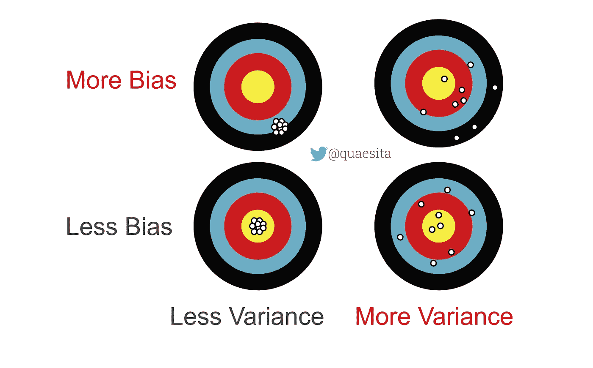

# 理解偏差和差异！

> 原文：<https://towardsdatascience.com/making-sense-of-bias-and-variance-a5e639f6bd86>

## 关于两个基本数据科学概念的初级入门书

# 什么是偏见？

取决于你从哪里听到这个词。我半开玩笑地列出了各种偏见用法的清单，供你娱乐，但在本文中，我们将重点关注一种特殊的偏见——统计偏见——我将在 [*时刻*](http://bit.ly/quaesita_lemur) 解释它。

# 打靶

带上你的弓和箭！或者水枪。或者飞镖。或者[猫炮](https://imgur.com/gallery/fdiPyeF)。如果你是一个优秀的射手，你正在瞄准靶心，那么当你完成后，你的目标会是什么样子？类似这样的？

你对[猫炮](https://imgur.com/gallery/fdiPyeF)的异议已被正式记录。

没错。

现在想象你的目标有偏差。你的目标会是什么样子？

点，到处都是点？没有。这就是我们所说的高 [*方差*](http://bit.ly/quaesita_variance) ，而不是高偏差。

相反，偏见看起来是这样的:

这一系列图像是作者创作的。

有偏结果*系统地偏离标记*，但如果方差较低，仍可能紧密地聚集在一起。

> 在[统计](http://bit.ly/quaesita_statistics)中，偏差完全是关于系统的不平衡，而方差衡量的是数据的分布程度。

[方差](http://bit.ly/quaesita_variance)是指数据中有更多的分布。不带偏见的高方差是一种快乐的无能，这种无能是公平分布的。这就是为什么当我玩飞镖的时候，你不想 T21 站在我 20 码以内的任何方向。这足以让你希望我是有偏见的(在镖靶的大方向上)。

正如您从该图中看到的，最差的可能结果是那些具有高方差*和*高偏差的结果，而最佳组合是使它们都保持较低的结果。

如果你来到这里是因为你对机器学习中一个叫做*偏差-方差权衡*的概念感到好奇，那么最重要的是要明白，最好的[机器学习模型](http://bit.ly/quaesita_emperorm)有 ***无偏差和无方差*** 。如果你正在训练一个[模型](http://bit.ly/quaesita_emperorm)，并且你设法让你的偏差和方差都下降了，那就没有必要谈论权衡:如果你成为了一个更好的射手，你就成为了一个更好的射手。(大概是多加练习— [数据](http://bit.ly/quaesita_hist)！—为了到达那里。)

但是如果你不能在不破坏另一个的情况下改善其中一个呢？如果收紧射击意味着偏离目标呢？为什么会这样？为什么这很重要？为什么大多数自认为理解偏差-方差权衡的人实际上完全误解了它？

我将在这个关于偏差和方差的迷你系列中回答这些问题和更多问题——请自行点击*跟随*按钮，以免错过。

你的[高斯-马尔科夫](http://bit.ly/quaesita_gistlist)作者。差异太大了！

# 延伸阅读:横着走

如果你已经对方差有了充分的了解，我建议阅读我的平行文章，这篇文章使用冠状病毒案例研究来告诉你其他类型的偏差:*采样偏差、选择偏差、信息偏差、报告偏差、*和*确认偏差。*

# 延伸阅读:更深入

你们中的一些人可能希望更深入，尤其是如果你热衷于理解偏差-方差权衡的话。在这种情况下，请继续关注本系列的其余部分……尽管它将变得更加专业。但我会支持你。在你等待下一期文章的时候，你可以通过链接到我温和的自我介绍来获得所有你需要的背景知识，以便理解它。

想知道你是否应该跳过背景阅读？这里有一个核心概念的清单，我假设您在本系列的其余部分已经理解了:

*   **人口**
*   **样品**
*   **观察**
*   **参数**
*   **统计**
*   **估计**
*   **估计器**
*   **预计需求**

如果他们中的任何一个不熟悉，这里是我的方便的词汇指南来帮助你。

如果你对机器学习中的偏差-方差权衡感兴趣——这也是本迷你系列正在构建的——稍微熟悉一下 ML/AI 的这些基础知识会有所帮助，我在这里[谈到了这些:](http://bit.ly/quaesita_emperor)

*   **ML/AI 的意义是什么**
*   **车型**
*   **损失函数**

此外，您应该知道其中每一个的定义，我已经在这里[和](http://bit.ly/quaesita_distributions)[分别解释了](http://bit.ly/quaesita_lemur)和:

*   **预期值**
*   **随机变量**
*   **分配**
*   **概率**
*   **的意思是**
*   **差异**

放心吧！这些概念比大多数人想象的要简单得多，我的向导会带你慢慢了解它们。快乐学习！

</stats-gist-list-an-irreverent-statisticians-guide-to-jargon-be8173df090d>  

# 喜欢作者？与凯西·科兹尔科夫联系

让我们做朋友吧！你可以在 [Twitter](https://twitter.com/quaesita) 、 [YouTube](https://www.youtube.com/channel/UCbOX--VOebPe-MMRkatFRxw) 、 [Substack](http://decision.substack.com) 、 [LinkedIn](https://www.linkedin.com/in/kozyrkov/) 上找到我。有兴趣让我在你的活动上发言吗？使用[表格](http://bit.ly/makecassietalk)取得联系。