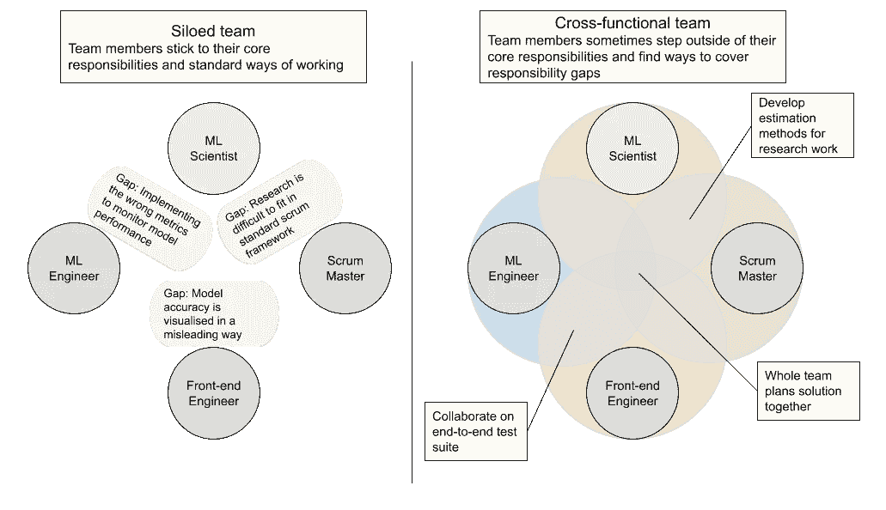

# 充分利用数据科学团队

> 原文：<https://towardsdatascience.com/making-the-most-of-data-science-teams-cc91371d4fd6>

## 作为技术领导者的经验教训

充分利用数据科学团队中的技能(由 [Brooke Cagle](https://unsplash.com/@brookecagle?utm_source=medium&utm_medium=referral) 在 [Unsplash](https://unsplash.com?utm_source=medium&utm_medium=referral) 上拍摄)

数据科学团队有各种各样的[结构](https://medium.datadriveninvestor.com/how-to-structure-a-data-science-team-key-models-and-roles-to-consider-6f00e4e32a21)，但鉴于他们的专业，数据科学家通常在*跨职能*团队中工作。跨职能团队由组织内不同工作职能的人组成(例如软件工程师、数据科学家和 scrum masters)。

跨职能团队理想地负责整个价值流，这带来了能够以高度的自主性和速度工作的好处。例如，一个跨职能团队可以拥有一个完整的预测性维护解决方案，包括数据管道、机器学习模型和用户界面。

也就是说，充分利用跨职能团队可能会很棘手。促进团队间的知识共享更加困难，协调不同的工作方式也是一项挑战。

凭借多年的技术领导经验，我想分享一下我对如何成为优秀的数据科学技术领导的看法——不仅仅是技术技能。

# 1.了解团队中的技能

跨职能团队的领导者面临的一个共同挑战是，他们往往在特定的职能领域更强。例如，以我作为数据科学家的背景，我的优势在于模型的设计和原型制作，而不是软件工程和部署。在计划和设定目标时，这很容易导致偏见和错误的假设。

为了最大限度地发挥团队的潜力，任何领导者都必须了解每个团队成员的个人动机、技能和抱负。在科技公司，这通常与管理职位有关。然而，在我看来，如果你对团队成员的需求和兴趣视而不见，你就不会充分利用他们的技能和潜力。

我建议定期与团队成员联系，并询问以下问题

*   在我们目前的项目中，你最感兴趣的是什么？一般什么样的工作让你兴奋？
*   你想成长的技能是什么？

# 2.没有跨职能就没有跨职能团队

仅仅让不同职能的团队成员在一个团队中并不能使它成为跨职能的。如果你坚持严格的角色定义，你最终会在角色之间产生技能/责任差距。

工作职能之间的潜在差距以及跨职能团队如何弥补这些差距(图片由作者创建)

根据我的经验，对于团队领导来说，找出这样的差距并扩大职能之间的重叠来解决它们是至关重要的。例如，一个 ML 工程师应该对团队在他们的产品中运行的模型有一个基本的理解。这些交互也有助于 ML 科学家在早期理解非功能性需求(比如运行时性能)。

我认为在团队中跨越职能的最佳方式是设定以结果为导向的目标，这些目标跨越多个职能，不仅鼓励，而且要求协作。

以结果为导向的目标示例:

*   “可以在用户界面中看到占位符模型的预测”
*   “模型保持应用于新(相似)数据集的预测准确性”

填补空缺的另一个好方法是找到那些想要拓展核心技能之外的团队成员(见第 1 点)。

# 3.极度的所有权和信任

> “领导者必须拥有他或她的世界中的一切。没有其他人可以责怪。领导者必须承认错误，承认失败，承担责任，并制定取胜计划。”乔科·威林克和叶小开·巴宾的《极端所有权》

应用于数据科学团队，“极端所有权方法”意味着领导者应对团队、整个解决方案及其交付负责。如果你没有 DevOPS 方面的背景，并且 CI/CD 管道的问题拖慢了团队的进度，你不能只责怪你的工程师。如果团队成员筋疲力尽，不要只是等待他们的直线经理来解决(或者更糟，让他们离开)。

任何领导者都应该将解决影响团队或交付的问题视为自己的责任——即使这不是他们职责的一部分。

重要的是，极端所有权并不意味着微观管理！使用极端所有权作为技术领导的关键是与团队成员建立信任。对团队成员的技能有了很好的理解，你应该能够预测他们在工作任务或项目时需要多少支持。此外，他们还应该有[心理安全感](https://medium.com/@Harri_Kaloudis/psychological-safety-at-work-what-do-psychologically-safe-work-teams-look-like-5585ab0f2df4)来提出和谈论不舒服的问题，或者在遇到困难时向你寻求帮助。

# 4.超越你的核心技能

技术领导通常拥有团队中的技术决策，设定技术方向，并向更广泛的组织代表团队的需求。如果你处于这样一个角色(而不是一个管理角色)，你很可能不得不在你的核心能力之外发展你的技术技能来承担这些责任。

当然，你不应该期望拥有和更专业的同事一样的技术深度。然而，如果你不扩展你的技能，你可能会成为一个协调者而不是领导者；安排会议和联系同事，而不是积极参与。

通常很难抽出时间来学习和发展。典型的建议是将个人发展目标分成可管理的部分。过去，它帮助我做到了以下几点:

1.  提高理论理解:向同事寻求资源，如书籍、博客、在线讲座
2.  提高你的代码审查技能:向资深同事学习。当他们审查拉动式请求时，他们会对什么进行评论，为什么？
3.  了解代码库:向不熟悉的代码库中添加小的错误修复或特性

# 结论

专注于技术领导角色的技术责任很有吸引力，但希望这篇文章能强调该角色的其他一些方面:了解同事的需求，拓展你的技能，并在团队中发展健康的工作文化。