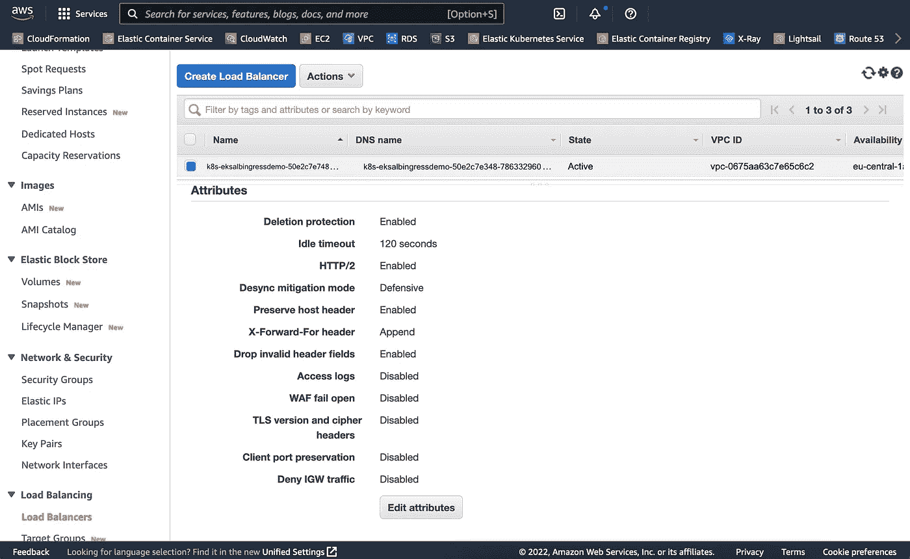
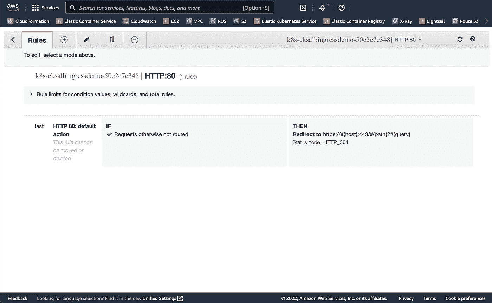
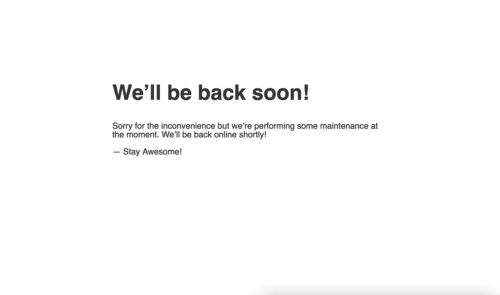

# 像专业人士一样管理您的 AWS EKS 负载平衡器

> 原文：<https://towardsdatascience.com/manage-your-aws-eks-load-balancer-like-a-pro-7ca599e081ca>

## AWS 负载平衡器高级提示和技巧

在 [Unsplash](https://unsplash.com/s/photos/orchestra?utm_source=unsplash&utm_medium=referral&utm_content=creditCopyText) 上由[Manuel n Geli](https://unsplash.com/@gwundrig?utm_source=unsplash&utm_medium=referral&utm_content=creditCopyText)拍摄的照片

我的[上一篇文章](https://meysam.io/how-to-set-up-ingress-controller-in-aws-eks-d745d9107307)描述了在 AWS 管理的 Kubernetes 集群(EKS)中设置入口控制器。在本文中，我想强调一些高级特性，否则这些特性可能会被忽略，但会显著影响集群内部的自动化水平。

你在下面看到的提示和技巧是为了遵守软件工程的基本原则之一 [DRY](https://en.wikipedia.org/wiki/Don%27t_repeat_yourself) 而设计的。

# 什么是入口“控制器”？

Kubernetes 的设计和开发使用了一组“控制器”，负责将*当前状态*带到由集群内的配置和资源[源](https://kubernetes.io/docs/concepts/architecture/controller/)定义的*期望状态*。

作为一个实际的例子，如果您将您的 Nginx 部署扩展到 2 个副本，负责的控制器将与运行在 worker 节点上的 Kubelet 对话，以加速 Nginx 映像的两个副本，根据需要放大或缩小。

当涉及到将您的逻辑添加到 Kubernetes 工作负载时，这为您打开了一个无限可能的世界。

我们今天将深入探讨的可能性之一是入口“控制器”，它负责将到达您的集群的流量**路由到具有[配置规则](https://kubernetes.io/docs/reference/kubernetes-api/service-resources/ingress-v1/)的适当服务。**

# Kubernetes 中的运算符是什么？

在我们进入主要讨论之前，定义一个操作符是至关重要的，但是如果您已经知道这个模式，您可以安全地跳过这一部分。

Kubernetes 集群中的[操作符是一组自定义资源定义和一个“控制器”，它将负责将 CRD 的*当前状态*带到*期望状态*，与上面定义的其他](https://kubernetes.io/docs/concepts/extend-kubernetes/operator/) [Kubernetes 控制器](https://kubernetes.io/docs/concepts/architecture/controller/)的行为非常相似。

作为一个虚拟示例，假设您在集群中定义了以下 CRD。

这可能不是这个星球上最好的三明治。尽管如此，一旦您的控制器被部署到集群中，对端点上的 Kubernetes api-server 的每个 API 调用，然后通过应用上面的 YAML 文件，您将在集群中拥有一个汉堡三明治。

如果您有兴趣了解更多信息，请进入[文档](https://kubernetes.io/docs/concepts/extend-kubernetes/operator/)获取完整参考。

# 为什么在这里了解运营商很重要？

Kubernetes 不附带任何入口控制器[ [来源](https://kubernetes.io/docs/concepts/services-networking/ingress-controllers/) ]。但是它允许社区编写他们的入口控制器，这些控制器可能有也可能没有一组 CRDs 因此，了解操作符模式非常重要！

AWS 负载平衡器控制器是 Operator 模式的一个实现，它监听集群内部的入口资源，在创建这些资源时，将执行一系列 API 调用来创建正确的`TargetGroupBinding`资源。

> `TargetGroupBinding`填补了 Kubernetes 工作负载和 AWS 基础设施之间的空白，因为 AWS 设计和构建了其负载平衡器的方式&位于这些负载平衡器的上游。如果你想了解更多，这里有参考指南的链接。

目标组和`TargetGroupBindings`之间是一一对应的。

> 目标组是位于 AWS 应用程序负载平衡器[ [source](https://docs.aws.amazon.com/elasticloadbalancing/latest/application/load-balancer-target-groups.html) ]后面的一个或多个 EC2 实例的组。

你可以在下面看到一个`TargetGroupBinding`资源的例子。

TargetGroupBinding 是 AWS 管理的 Kubernetes 中[目标组](https://docs.aws.amazon.com/elasticloadbalancing/latest/application/load-balancer-target-groups.html)的映射。

这不是您通常自己创建/管理的资源，而是在您创建/修改入口资源时由 [AWS 负载平衡器控制器](https://kubernetes-sigs.github.io/aws-load-balancer-controller/v2.4/)维护的资源。

了解了这一点，当您试图创建一个带有入口的服务来接收来自互联网的流量时，您应该记住一个重要的注意事项。您的服务资源应该是 NodePort 类型，以便入口控制器能够创建`TargetGroupBindings`。这在 AWS 的世界中是有意义的，因为如果服务只作为`ClusterIP`公开，AWS 负载平衡器就不能与之对话，因为它只公开在集群内部，实际上甚至从主机工作节点本身都无法访问。

你可以通过下面的链接阅读我上一篇文章中的讨论，或者阅读参考指南来理解设计和配置。

  

既然我们已经介绍了基础知识和先决条件，现在是时候谈谈控制器和 CRD 了，这就是你想要如何配置你的 [AWS 负载平衡器](https://aws.amazon.com/elasticloadbalancing/)。

# IngressClass 的作用是什么？

IngressClass 是将管理入口资源的责任委派给指定控制器的资源。为了澄清这一说法，让我们来看一些代码。

如果您遵循[安装指南](https://kubernetes-sigs.github.io/aws-load-balancer-controller/v2.4/deploy/installation/)，这个`*IngressClass*`将会为您创建。

正如你从上面看到的，两个基本属性在`spec`部分下面。`controller`是决定谁/什么将通过这个 IngressClass 处理入口资源，而`parameters`是传递给同一个控制器以定制其行为的可选键值。

> 拥有`parameters`允许拥有具有不同风格的相同`controller`，定制为不同地处理不同的入口资源。

简单地说，如果我创建一个入口资源，并将`ingressClassName`设置为`aws-alb`，名为`ingress.k8s.aws/alb`的控制器将做它必须做的事情，以便将传入的流量路由到上游的 Kubernetes 服务。

我们在接下来的讨论中需要的关键信息放在`spec.parameters.kind`下面。这个属性的值是`IngressClassParams`，这是一个 CRD，AWS 负载平衡器控制器将使用它来为您创建最终的负载平衡器。

照片由[乔丹·怀特菲尔德](https://unsplash.com/@whitfieldjordan?utm_source=unsplash&utm_medium=referral&utm_content=creditCopyText)在 [Unsplash](https://unsplash.com/s/photos/piano?utm_source=unsplash&utm_medium=referral&utm_content=creditCopyText) 上拍摄

# IngressClassParams 是你最好的朋友

[AWS 负载平衡器控制器](https://kubernetes-sigs.github.io/aws-load-balancer-controller/v2.4/)有自己的一套 CRD。您应该知道的最重要的 CRD 名为`IngressClassParams`，它有一系列有益的可配置属性，这些属性会影响如何创建/配置最终的 [AWS 负载平衡器](https://aws.amazon.com/elasticloadbalancing/)。

这些属性允许您定义和定制您的 AWS 负载平衡器，它将充当您的应用程序的前沿。

> 注意:我在本文中说的是[应用负载均衡器](https://docs.aws.amazon.com/elasticloadbalancing/latest/application/introduction.html)。如果您需要使用[网络负载平衡器](https://docs.aws.amazon.com/elasticloadbalancing/latest/network/introduction.html)，您可以使用相同的控制器，但一定要检查[此链接](https://kubernetes-sigs.github.io/aws-load-balancer-controller/v2.4/guide/service/nlb/)以获取相应的信息。

现在，我们来介绍一下`IngressClassParams`[来源](https://kubernetes-sigs.github.io/aws-load-balancer-controller/v2.4/guide/ingress/ingress_class/)提供的规范 API。没有一个好的例子是最好的，所以让我们用下面的例子来支持这个论点。

将影响如何创建负载平衡器的属性。

如果您打开 AWS 控制台，上述配置将导致以下负载平衡器。

截图由作者取自 AWS 控制台。

当在生产级别的环境中工作时，这些属性中的一些是至关重要的，而其他的只是好的。我们将在下面深入探讨每一个问题。

您可以在`IngressClassParams`资源上指定以下属性。

*   `**spec.group.name**`:这种“分组”使得在一个负载均衡器后面有多个入口资源成为可能。如果在`IngressClassParams`级别没有提供，那么另一种方法是注释你的每一个入口资源 [source](https://kubernetes-sigs.github.io/aws-load-balancer-controller/v2.4/guide/ingress/annotations/#group.name) 。如果你没有为入口资源“分组”，AWS 将为每个入口资源创建一个负载平衡器，这[将花费大量的成本](https://aws.amazon.com/elasticloadbalancing/pricing/)。
*   `**spec.scheme**`:由于 AWS 中可能有*内部*和*面向互联网的*负载平衡器，您可以在此指定您的选择。区别是显而易见的，一个只对您的内部资源可用，另一个在公共互联网上公开。
*   `**spec.loadBalancerAttributes**`:最有价值的规范之一将为您提供足够的灵活性来根据您的需求定制您的负载平衡器。这个规范就是本文的全部内容，所以我们将再次讨论它。
*   `**spec.ipAddressType**`:您可以选择`ipv4`和`dualstack`。以防有一天世界用完了 IPv4！

# 负载平衡器属性

参考上一节中从 AWS 控制台截取的屏幕截图，从**属性**部分可以看到，您在这里修改了相当多的属性。所有这些属性都在[相应的网页](https://docs.aws.amazon.com/elasticloadbalancing/latest/application/application-load-balancers.html#load-balancer-attributes)上有适当的记录。所以，一定要去查一下，全面了解。

简单介绍一下，下面是从`IngressClassParams`资源配置的属性。

*   `**deletion_protection.enabled**`:移除最后一个入口资源是否会终止负载平衡器。您可能想要关闭它，因为每个新的负载平衡器都将获得一个新的 DNS 名称，所以您必须在 AWS DNS 条目中或之外重新配置您的 DNS 记录。
*   `**idle_timeout.timeout_seconds**`:这是负载均衡器在自身和连接两端(用户&上游服务器)之间保持两个通信通道打开的秒数。对于文件上传和类似的大型操作，您可能希望增加这个数量，并对您的客户端进行编程，以便在这个数量之前至少发送一个字节[ [source](https://docs.aws.amazon.com/elasticloadbalancing/latest/application/application-load-balancers.html#connection-idle-timeout) ]。
*   `**routing.http.drop_invalid_header_fields.enabled**` : [根据 IANA](https://www.iana.org/assignments/http-fields/http-fields.xhtml) ，HTTP 头名应该符合字母数字和连字符。如果您希望负载平衡器丢弃不对应的标头，请启用此配置。
*   `**routing.http2.enabled**`:顾名思义，这将为您的负载平衡器打开 HTTP/2 协议。默认为`true`。
*   `**routing.http.preserve_host_header.enabled**`:如果设置为`true`，负载均衡器会将 HTTP 请求的主机头传递给上游服务器。不过，这不会改变`[X-FORWARDED](https://docs.aws.amazon.com/elasticloadbalancing/latest/application/x-forwarded-headers.html)` [标题](https://docs.aws.amazon.com/elasticloadbalancing/latest/application/x-forwarded-headers.html)的行为。
*   `**access_logs.s3.enabled**`:这将打开记录负载平衡器对 S3 的访问日志。

每个入口组只需指定一次这些设置。如果您使用 Helm 安装入口控制器，您可以在安装过程中将它们设置为值。作为一个实用的指南，这里有一个你将使用的样本`values.yaml`文件，把它传给 Helm 安装。

AWS 入口控制器舵安装的 values.yml

> 如果您没有将任何 IngressClass 注释为`default`，也没有在您的入口资源中指定任何`ingressClassName`，就好像您根本没有任何入口，因为没有控制器会拾取它！

创建此类入口类后，由此类控制的任何入口都将归入同一个`group.name`下，并有效地位于单个负载平衡器之后，从而节省您的成本并为您提供对进入您集群的向内流量的更多管理&控制。

如果您没有在`IngressClassParams`中指定`group.name`，您将被要求如下注释每个入口。

现在我们已经介绍了 IngressClass，是时候讨论入口资源和通过指定正确的注释集来控制负载平衡器了。

# 入口注释

Kubernetes 集群中的入口资源没有任何特别之处。它们只是一个或多个规则的规范，必须被处理并发送到指定的服务。您指定主机和路径，相应的入口控制器将处理剩下的工作。

然而，让它们与众不同的是`metadata.annotations`，当它位于任何供应商或非供应商负载平衡器之后时，它可以对您想要如何定制入口进行更多的控制。

为了保持传统，让我们从另一个实际例子开始这一部分，并使用这个例子解释每个注释。

*   `**group.order**`:该整数指定当数据包到达负载均衡器时要匹配的规则的优先级。负载平衡器将从最低编号到最高编号评估规则。你通常希望你最常访问的网址在最上面，这样匹配你最常点击的规则就不会花太多时间。
*   与健康检查相关的注释非常简单明了，不言自明，所以我在这里就不多花时间了。
*   `**listen.ports**`:这将是您的负载平衡器中的最终[监听器](https://docs.aws.amazon.com/elasticloadbalancing/latest/application/load-balancer-listeners.html)。如果不指定此注释，默认情况下，AWS 负载平衡器控制器将在端口 80 上公开入口。您很可能希望处理安全端口 443(称为 HTTPS)上的每个流量，同时将所有内容从 HTTP(端口 80)重定向到它。本文的最后一部分就是关于这个重定向的！
*   `**target-type**`:默认值是`instance`，意味着负载均衡器会将流量发送到 EC2 的 exposed NodePort。另一个允许的值是`ip`，它将把流量发送到 Pod 的 IP，但是这个选项要求 VPC CNI 支持它[ [源](https://kubernetes-sigs.github.io/aws-load-balancer-controller/v2.4/guide/ingress/annotations/#target-type) ]。
*   `**success-codes**`:可以是单个值，如`200`，也可以是多个逗号分隔的值，如`200,300`，也可以是一系列值，如`200-300`。

上面讨论的注释是您需要为您创建的每个入口资源指定的注释。其他注释只需设置一次，负载均衡器就会选择它并将其用于所有入口资源。我将在下一节&最后一节讨论这些。

[OPPO Find X5 Pro](https://unsplash.com/@oppofindx5pro?utm_source=unsplash&utm_medium=referral&utm_content=creditCopyText) 在 [Unsplash](https://unsplash.com/s/photos/nature?utm_source=unsplash&utm_medium=referral&utm_content=creditCopyText) 上拍照

# 负载平衡器的一次性配置

## 将 HTTP 重定向到 HTTPS

正如在上一篇文章中提到的，仅仅通过部署 AWS 入口控制器不会得到任何负载平衡器。您将需要创建您的第一个入口资源，具有规范中指定的 Ingres class 或者是默认的 Ingres class，然后 AWS 将在一两分钟内提供您的负载平衡器。

安全最佳实践之一是配置负载平衡器，将非 HTTPS 流量重定向到安全的 HTTPS 流量。要使用 AWS 入口控制器做到这一点，您需要创建一个带有正确注释集的入口资源。

这个任务我们需要的注释是:`actions.${action-name}`。“action name”将是一个虚拟服务名，甚至不作为 Kubernetes 服务资源存在，但是为了填补 AWS 和 Kubernetes 之间的空白，需要在`spec.defaultBackend.service.name`下指定它。

这是 AWS EKS 内部的入口资源将 HTTP 流量重定向到 HTTPS 的最终效果。

在`actions.ssl-redirect`下指定的注释是一种特殊的注释，只有 AWS 入口控制器可以理解，尽管 JSON 格式看起来需要处理很多，但它是可读的，您可以了解它的作用。

这里要提到的重要一点是，`spec.defaultBackend.service.port.name`应该完全是`use-annotation`，如果你想让它像解释的那样工作，你不能在那里放任何东西。

这里需要再次提及的另一个重要问题是，集群中没有名为`ssl-redirect`的 Kubernetes 服务资源。我们之所以在这里指定这个名称，是因为要使用`kubectl`创建这个资源，我们必须填写所有必需的属性&规范，因为它将在发送到 api 服务器之前被验证，即使您通过了`--validate=false`，API 服务器本身也会向您反馈错误的规范。

最终，上述入口资源会将所有 HTTP 流量重定向到 HTTPS 端口，为了确保这一点，下面是它在 AWS 控制台中的样子。

这个负载均衡器目前只监听端口 80，所以让我们定义一个虚拟服务来重定向所有不需要的流量，以防所有其他规则与传入的数据包不匹配。

> 每个负载平衡器都有一个默认的后端规则，如果所有先前的规则都不匹配传入的数据包，该规则将确定将流量发送到哪里。这允许您将用户重定向到一个友好的页面，提醒他们没有这样的主机或路径，他们需要确保他们正在前往正确的地址。

## 默认后端的虚拟上游

这一部分非常简单明了，因为您可以根据自己的需要定制它。但是，我会尝试将所有没有特定规则的流量发送到一个友好的维护页面，如下所示。

我个人对哑上游的偏好(图片由作者提供)。

下面提供了该规则的代码和资源，包括前面的 SSL 重定向。

创建上述资源后，每个不是以您配置的入口规则为目的地的传入流量都将被发送到友好维护页面。

您还可以选择审核这些传入的数据包，以了解最常被请求的内容，并在发现任何可疑情况时采取相应的措施。

## 其他非关键但注释

作为最后一块拼图和一个奖励，这里列出了所有其他可能对您的工作负载有用的注释。

不要忘记，这些最后的注释在每个入口组中只被指定一次。如果您用不同的值设置多个，它将覆盖以前的值，并且您可能会得到意外的结果。

[本杰明·蔡尔德](https://unsplash.com/ja/@bchild311?utm_source=unsplash&utm_medium=referral&utm_content=creditCopyText)在 [Unsplash](https://unsplash.com/s/photos/meditation?utm_source=unsplash&utm_medium=referral&utm_content=creditCopyText) 上的照片

# 结论

如果您选择加入 AWS 中的托管 Kubernetes 集群，那么在拥有生产级集群时，请准备好应对一些严峻的挑战。

Kubernetes 是与云无关的，允许您将数据库、缓存、消息代理和其他所有东西作为自我管理的解决方案放在集群中。这为您提供了更高的性能，因为您的应用程序将受益于地理上的接近，但这也意味着您将花费更少的钱来购买 RDS、ElastiCache 和 AWS 提供的其他产品。我很确定他们不喜欢这种声音。

这意味着您将面临 Kubernetes 领域之外的挑战，以使您的集群在 AWS 基础设施中工作，为您提供学习和成长的机会。我建议你尽可能多带些，并且一定要享受旅程！

祝你今天休息愉快，[敬请期待](https://meysam.io)保重！

# 参考

*   [https://kubernetes-sigs . github . io/AWS-load-balancer-controller/v 2.4/](https://kubernetes-sigs.github.io/aws-load-balancer-controller/v2.4/)
*   [https://aws.amazon.com/elasticloadbalancing/](https://aws.amazon.com/elasticloadbalancing/)
*   [https://kubernetes.io/docs/](https://kubernetes.io/docs/)

如果你喜欢这篇文章，看看我的其他内容，你可能也会觉得有帮助。

         