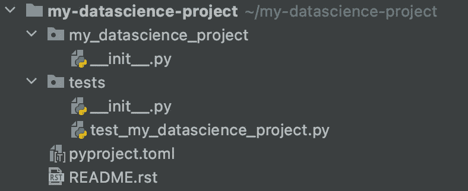
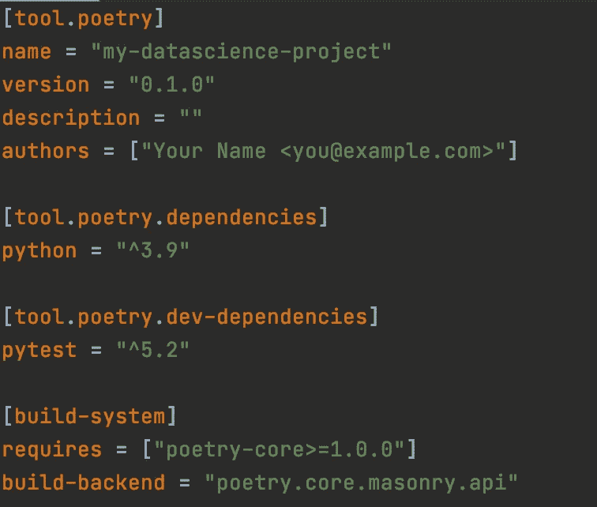
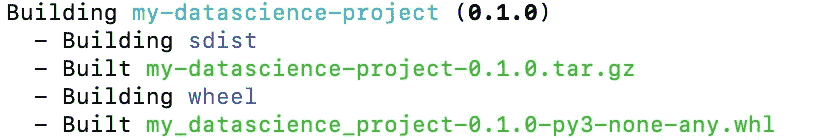
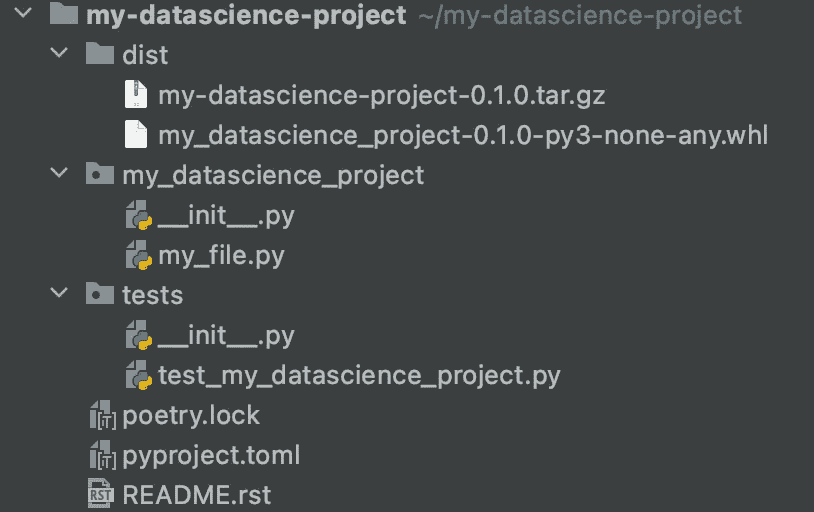

# 用诗歌管理数据科学项目

> 原文：<https://towardsdatascience.com/managing-data-science-projects-with-poetry-cd3ce2b7913b>

## **如何安装、设置和使用诗歌来管理你的数据科学项目**


照片由[Tru“Tru”kat sande](https://unsplash.com/@iamtru?utm_source=unsplash&utm_medium=referral&utm_content=creditCopyText)在 [Unsplash](http://localhost:3000/s/photos/poetry?utm_source=unsplash&utm_medium=referral&utm_content=creditCopyText) 拍摄

再现性是数据科学的一个重要方面。当我们谈论数据科学中的再现性时，我们指的是独立地**再现项目结果的能力，无论是在稍后的时间点由你自己还是由同事再现。**

拥有确保再现性的流程可以建立对输出的信任，并确保数据科学工作的质量。此外，它使得在过去工作的基础上进行构建变得更加容易。这可能意味着一个同事重新训练六个月前构建的模型，或者另一个团队成员基于先前的分析开发新的模型。

数据科学项目的再现性很大程度上取决于项目代码的组织和可用性，以便其他人可以独立运行。为了组织您的项目，使其可以由任何人在任何地方运行，您至少需要以下内容:

*   虚拟环境
*   一种跟踪项目依赖性的方法
*   标准文件夹结构
*   一种打包和发布代码的方法

近年来，Python 编程语言已经开始出现标准和最佳实践，尤其是在数据科学领域。诗歌是一个 python 库的例子，它为管理 python 项目提供了标准。诗歌的核心是为上面列出的每个领域提供简单的功能。

在下面的文章中，我将介绍如何安装、设置和使用诗歌来管理数据科学项目。

# 安装

诗歌为装置提供了一个脚本。这取决于您使用的操作系统。

对于 Mac OSX、Linux 或 bash，在 windows 上运行以下程序:

```
curl -sSL https://raw.githubusercontent.com/python-poetry/poetry/master/get-poetry.py | python -
```

对于 Windows，请使用:

```
(Invoke-WebRequest -Uri https://raw.githubusercontent.com/python-poetry/poetry/master/get-poetry.py -UseBasicParsing).Content | python -
```

该脚本将在您的系统上安装诗歌，并自动将相关文件目录添加到您的`$PATH`环境变量中。

如果您现在打开一个新的 shell 选项卡或窗口，并运行以下命令:

```
poetry --version
```

您应该会看到这个输出。


作者图片

# 创建项目

要创建带有诗歌的项目，请键入以下内容:

```
poetry new my-datascience-project
```

poems 将自动为您的项目创建一个目录，其框架结构如下所示。



诗歌目录结构。作者图片

# 安装软件包

除了生成默认的项目结构，poems 还会为你的项目创建一个虚拟环境和一个`.toml`文件。该文件存储和维护项目的依赖关系。它看起来会像这样。



诗歌。toml 文件。作者图片

> 如果你使用 Pycharm 进行开发，你可以安装一个支持 toml 语言的插件。

这个 toml 文件由 4 部分组成:

**tool . poetics**提供了一个区域来获取关于项目的信息，比如名称、版本和作者。

**tool . poem . dependencies**列出项目的所有依赖项。

**tool . poem . dev-dependencies**列出了项目开发所需的依赖项，这些依赖项不应该出现在部署到生产环境的任何版本中。

**构建系统**引用了诗歌已经被用来管理项目的事实。

要安装新的软件包，我们键入以下内容:

```
poetry add pandas
```

这将自动把这个包添加到您的依赖项列表中，并且还会生成一个 poetry.lock 文件。这个文件跟踪所有的包和你的项目中使用的确切版本。

要激活虚拟环境，我们键入`poetry shell`并键入`exit`来取消激活。

进入虚拟环境后，可以使用以下命令运行任何 python 脚本:

```
poetry run python my_script.py
```

# 构建并发布

有时我们可能想要打包我们的项目，以便它可以被其他用户或在其他项目中发布和安装。诗歌提供了一种非常简单的方式来构建和发布你的项目。

只需运行以下命令:

```
poetry build
```

这将给您以下消息。



作者图片

poems 添加了一个名为`dist`的新文件夹，并为项目创建了必要的源代码发行版和轮子。



运行诗歌构建后的目录结构。作者图片

运行命令`poetry publish`会将打包的项目上传到一个远程存储库，该存储库可以用 [config](https://python-poetry.org/docs/repositories/) 命令进行配置。

诗歌是用于依赖管理和虚拟环境的许多现代 python 工具之一。其他工具包括 [pipenv](https://pipenv.pypa.io/en/latest/) 、 [virtualenv](https://virtualenv.pypa.io/en/latest/) 和 [conda](https://docs.conda.io/en/latest/) 。然而，poem 努力封装更多代码可再现性所需的元素，包括一致的项目结构和发布代码的简单工具。

在本文中，我简要介绍了用于管理数据科学项目的诗歌。关于 Python 虚拟环境和数据科学代码可再现性的更多信息，请参见我之前的文章。

</a-data-scientists-guide-to-python-virtual-environments-858841922f14>  </a-recipe-for-organising-data-science-projects-50a1cc539c69>  

感谢阅读！