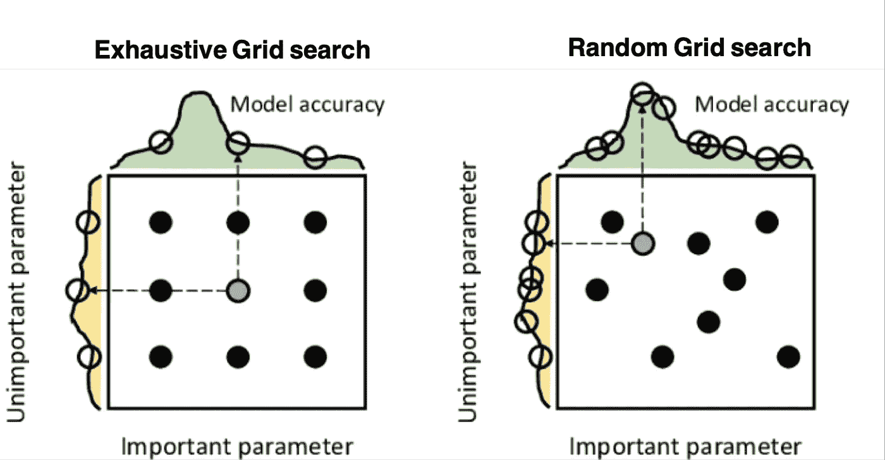
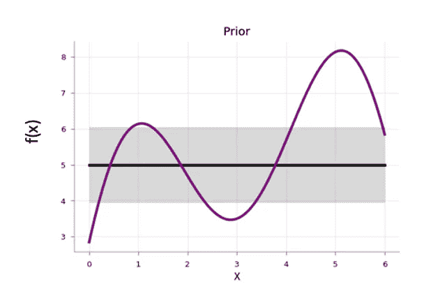
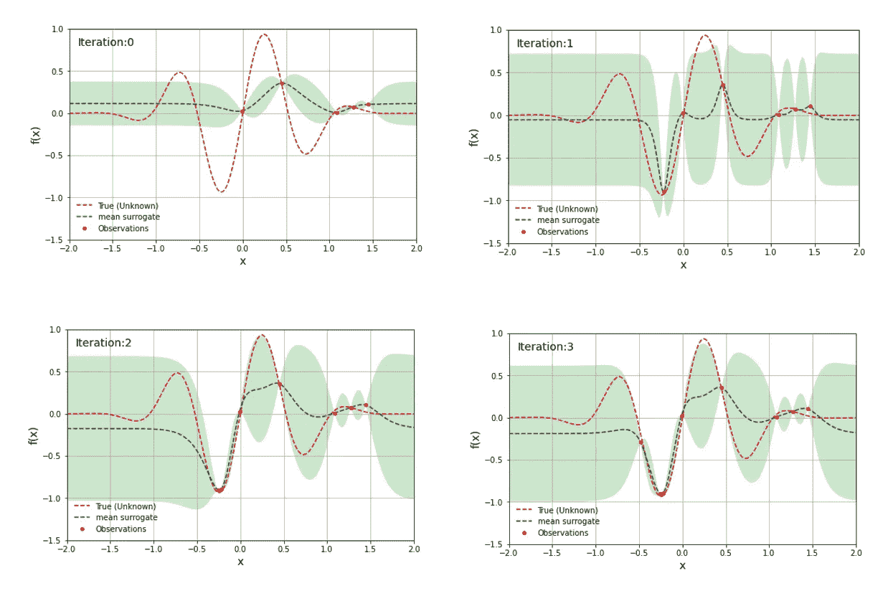
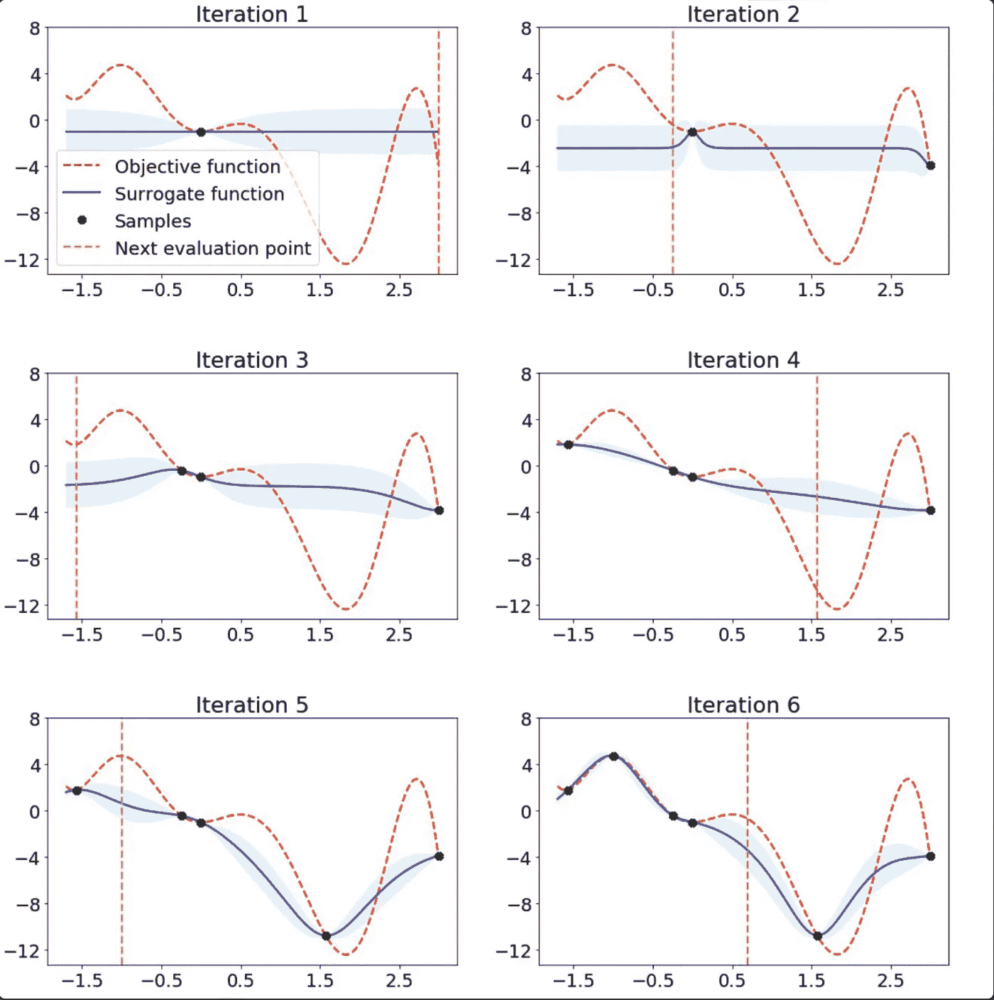
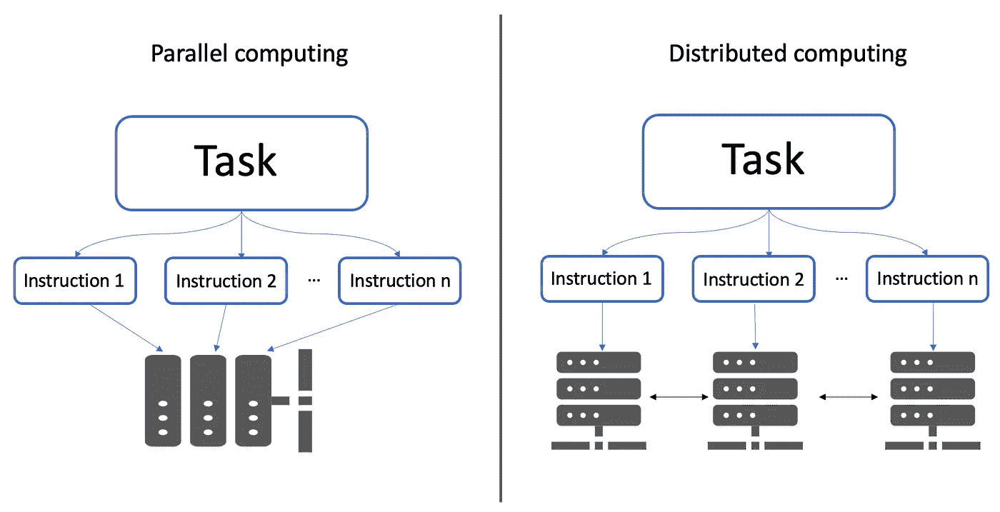
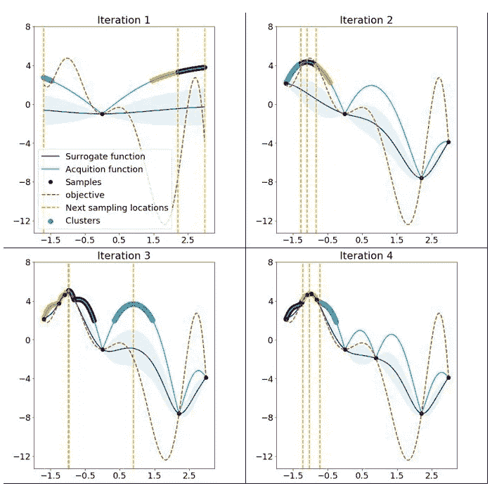
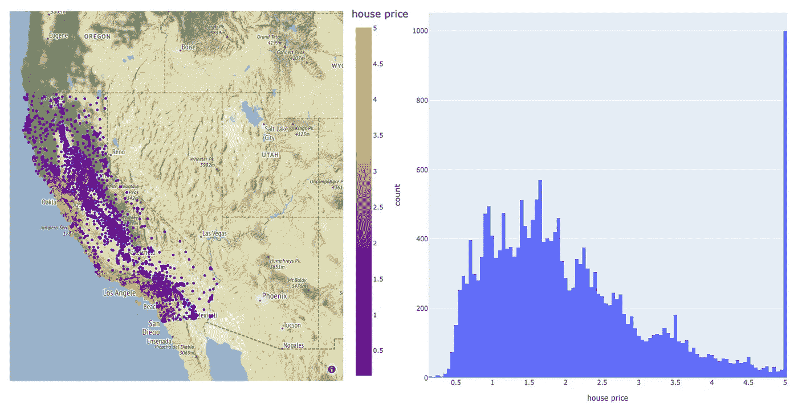

# Mango:用 Python 实现贝叶斯优化的新方法

> 原文：<https://towardsdatascience.com/mango-a-new-way-to-make-bayesian-optimisation-in-python-a1a09989c6d8>

## 你所需要知道的就是这个库，用于机器学习模型的可扩展超参数调整


由 [Unsplash](https://unsplash.com/s/photos/servers?utm_source=unsplash&utm_medium=referral&utm_content=creditCopyText) 上的 [Kvistholt 摄影](https://unsplash.com/@freeche?utm_source=unsplash&utm_medium=referral&utm_content=creditCopyText)拍摄

模型超参数(或模型设置)的优化可能是训练机器学习算法中最重要的步骤，因为它导致找到使模型损失函数最小化的最佳参数。这一步对于构建不容易过度拟合的通用模型也是必不可少的。

优化模型超参数的最著名技术是*穷举* *网格搜索*及其随机对应物:*随机网格搜索*。在第一种方法中，搜索空间被定义为跨越每个模型超参数的域的网格。通过在网格的每个点上训练模型来获得最佳超参数。虽然网格搜索很容易实现，但它在计算上变得很昂贵，尤其是当要优化的变量数量很大时。另一方面，andom 网格搜索是一种更快的优化方法，可以提供更好的结果。在随机网格搜索中，通过仅在网格空间的随机样本点上训练模型来获得最佳超参数。



两种网格搜索的比较。这九个点表示参数的选择。左侧和顶部的曲线表示作为每个搜索维度的函数的模型精度。该图摘自 Salgado Pilario 等人的《IEEE 工业电子学汇刊》, 68，6171–6180(2021 年)。

长期以来，数据科学家广泛使用这两种网格搜索算法来寻找最佳模型超参数。然而，这些方法通常发现模型超参数的损失函数远离全局最小值。

历史在 2013 年发生了改变，当时 James Bergstra 和他的合作者发表了一篇论文，其中他们探索了一种贝叶斯优化技术，以找到图像分类神经网络的最佳超参数。他们将结果与随机网格搜索得到的结果进行了比较。很明显，贝叶斯方法优于随机网格搜索:


LFW 数据集(左)和 PubFig83 数据集(右)上的验证错误。TPE 代表 Tree Parzen Estimator，这是一种用于贝叶斯优化的算法。该图摘自 Bergstra 等人的《机器学习研究进展》，28，115–123(2013)。

但是为什么贝叶斯优化比任何网格搜索算法都好呢？因为这是*引导的*方法之一，它执行模型超参数的智能搜索，而不是通过试错法找到它们。

在这篇博客中，我们将剖析贝叶斯优化方法，并通过一个名为 [*芒果*](https://github.com/ARM-software/mango) 的相对较新的 Python 包来探索其实现之一。

# 简而言之，贝叶斯优化

在解释 *Mango* 做什么之前，我们需要了解贝叶斯优化是如何工作的。如果您对这个算法有很好的理解，您可以安全地跳过这一部分。

贝叶斯优化有 4 个组成部分:

*   **目标函数**:这是您想要最小化或最大化的真实函数。例如，它可以是回归问题中的均方根误差(RMSE)或分类中的对数损失。在机器学习模型的优化中，目标函数取决于模型超参数。这就是为什么目标函数也被称为黑盒函数，因为它的形状是未知的。
*   **搜索域或搜索空间**:这对应于每个模型超参数可能具有的值。作为用户，您需要指定您的模型的搜索空间。例如，随机森林回归模型的搜索域可能是:

```
param_space = {**'max_depth'**: range(3, 10),
               **'min_samples_split'**: range(20, 2000),
               **'min_samples_leaf'**: range(2, 20),
               **'max_features'**: [**"sqrt"**, **"log2"**, **"auto"**],
               **'n_estimators'**: range(100, 500)
               }
```

贝叶斯优化使用定义的搜索空间来采样在目标函数中评估的点。

*   **代理模型**:评估目标函数是非常昂贵的，所以在实践中，我们只在少数地方知道目标函数的真实值，然而，我们需要知道其他地方的值。这是它进入代理模型的时候，代理模型是一种建模目标函数的工具。替代模型的常见选择是所谓的高斯过程(GP ),因为它能够提供不确定性估计。解释高斯过程超出了这篇博文的范围，但是我鼓励你阅读这篇出色的文章，它有大量的图片来帮助你建立这种概率方法背后的直觉。

在贝叶斯优化的开始，代理模型从先验函数开始，该先验函数沿着搜索空间以均匀的不确定性分布:



代理模型之前。阴影区域是它的不确定性，而黑线是它的平均值。紫色线代表一维目标函数。图片复制自博文[探索贝叶斯优化](https://distill.pub/2020/bayesian-optimization/)，Apoorv Agnihotri 和 Nipun Batra，2020。

每次在目标函数中评估来自搜索空间的样本点时，代理模型在该点的不确定性变为零。经过多次迭代后，代理模型将类似于目标函数:



简单一维目标函数的代理模型。作者制作的图像。

然而，贝叶斯优化的目标不是对目标函数建模。相反，是在尽可能少的迭代次数中找到最佳模型超参数。为此，有必要使用采集功能。

*   **获取函数**:该函数在贝叶斯优化中引入，用于指导搜索。获取函数用于评估一个点是否期望基于当前代理模型进行评估。一个简单的采集函数是对代理函数的均值最大化的点进行采样。

贝叶斯优化代码的步骤是:

```
Select a surrogate model for modeling the objective function and define its priorfor i = 1, 2,..., number of iterations:
    Given a set of evaluations in the objective, use Bayes 
       to obtain the posterior.
    Use an acquisition function (which is a function of the    
       posterior) to decide the next sampling point.
    Add newly sampled data to the set of observations.
```

下图显示了简单一维函数的贝叶斯优化:



一维函数的贝叶斯优化。图片摘自 ARM research 的博客文章:[AutoML 的可扩展超参数调优](https://community.arm.com/arm-research/b/articles/posts/scalable-hyperparameter-tuning-for-automl)。

如果你有兴趣阅读更多关于贝叶斯优化的内容，我推荐你阅读这篇伟大的文章:

[](https://distill.pub/2020/bayesian-optimization/)  

几个 Python 包使用贝叶斯优化来获得机器学习模型的最佳超参数。一些例子有:[远视](http://hyperopt.github.io/)；[Optuna](https://optuna.org/)；[贝叶斯优化](https://github.com/fmfn/BayesianOptimization)；[Scikit-optimize(skopt)](https://scikit-optimize.github.io/stable/index.html)；[GPyOpt](https://sheffieldml.github.io/GPyOpt/)； [pyGPGO](https://pygpgo.readthedocs.io/en/latest/) 和 [*芒果*](https://github.com/ARM-software/mango) 。这个列表很长，我没有提到其他库。对于其他软件包的一个很好的总结，你可以阅读这篇博文:

[](/10-hyperparameter-optimization-frameworks-8bc87bc8b7e3)  

现在，让我们一起深入*芒果*！

# 芒果:为什么这么特别？

近年来，数据量大幅增长。这对于需要机器学习管道可扩展的数据科学家来说是一个挑战。分布式计算可能会解决这个问题。

分布式计算是指一组计算机在相互通信的同时执行一个共同的任务。这不同于并行计算，在并行计算中，一个任务被分成多个子任务，这些子任务被分配给同一计算机系统上的不同处理器。



并行计算与分布式计算。作者制作的图像。

虽然有相当多的 Python 库使用贝叶斯优化来调优模型超参数，**但是它们都不支持任何分布式计算框架上的调度。**开发*芒果*的作者的动机是创建一个能够在分布式计算环境中工作的优化算法，同时保持贝叶斯优化的能力。

Mango 的架构在分布式计算环境中运行良好的秘密是什么？Mango 采用模块化设计，优化器与调度器分离。这种设计可以轻松扩展使用大量数据的机器学习管道。然而，这种架构在优化方法方面带来了挑战，因为传统的贝叶斯优化算法是顺序的，这意味着采集函数仅提供单个下一点来评估搜索。

*Mango* 使用两种方法并行化贝叶斯优化:一种叫做*的方法批量高斯过程土匪*和 k-means 聚类。在这篇博客中，我们不会解释批量高斯过程。如果你有兴趣了解更多关于这种方法的信息，你可以阅读[的这篇论文](https://jmlr.org/papers/volume15/desautels14a/desautels14a.pdf)。

关于聚类方法，使用 k-means 聚类来横向扩展贝叶斯优化过程是由 IBM 的一组研究人员在 2018 年提出的(参见[本文](https://arxiv.org/pdf/1806.01159.pdf)了解技术细节)。这种方法由从搜索域采样的聚类点组成，这些点在采集函数中产生高值(见下图)。一开始，这些聚类在参数搜索空间中彼此远离。当替代函数中的最佳区域被发现时，参数空间中的距离减小。k-means 聚类方法横向扩展优化，因为每个聚类用于作为单独的过程运行贝叶斯优化。这种并行化导致更快地找到最佳模型超参数。



Mango 使用聚类方法来扩展贝叶斯优化方法。采集函数上的彩色区域是从搜索空间中具有高采集函数值的采样点构建的聚类。在开始时，聚类被彼此分开，但是它们的距离被缩短，因为代理函数类似于目标。图片来自博文:[ARM research 的 AutoML](https://community.arm.com/arm-research/b/articles/posts/scalable-hyperparameter-tuning-for-automl) 可扩展超参数调优。

除了在分布式计算框架上工作的能力之外， *Mango* 还兼容 scikit-learn API。这意味着您可以将超参数搜索空间定义为一个 Python 字典，其中的关键字是模型的参数名称，每个项目都可以用 scipy.stats 中实现的 70 多个发行版中的任何一个来定义。所有这些独特的特征使 *Mango* 成为想要大规模利用数据驱动解决方案的数据科学家的绝佳选择。

如果你有兴趣了解更多关于 *Mango* 的内部运作，你可以阅读[原文](https://arxiv.org/pdf/2005.11394.pdf)或者访问这个由库的作者写的漂亮的博客:

[](https://community.arm.com/arm-research/b/articles/posts/scalable-hyperparameter-tuning-for-automl)  

## 简单的例子

现在让我们来说明一下 *Mango* 在优化问题中是如何工作的。你首先需要创建一个 Python 环境，然后通过下面的命令安装*芒果*:

```
pip install arm-mango
```

对于这个例子，我们使用可以直接从 Scikit-learn 加载的加州住房数据集([更多信息请点击此链接](https://scikit-learn.org/stable/modules/generated/sklearn.datasets.fetch_california_housing.html)):

该数据集包含 20，640 个样本。每个样本有 8 个特征，包括房屋年龄，平均卧室数量等。California housing 数据集还包括每个样本的房价，单位为 100，000。房价分布如下图所示:



在左侧面板中，加利福尼亚数据集中房价的空间分布。右边是同一变量的直方图。作者制作的图像。

注意房价分布有点偏左。这意味着在目标中需要一些预处理。例如，我们可以通过对数或 Box-Cox 变换将目标的分布转换为正常形状。由于减少了目标的方差，这种预处理可能会提高模型的预测性能。我们将在超参数优化和建模过程中执行此步骤。现在，让我们将数据集分为训练集、验证集和测试集:

我们准备用*芒果*来优化机器学习模型。首先，我们定义搜索空间，Mango*和 Mango* 从中取值。在这个例子中，我们使用一种叫做[极端随机化树](https://link.springer.com/article/10.1007/s10994-006-6226-1)的算法，这是一种非常类似于随机森林的集成方法，除了选择最佳分割的方式，这是随机进行的。这种算法通常以略微增加偏差为代价来减少方差。如果你有兴趣了解更多关于极度随机化的树，你可以访问这个 [Scikit-learn 文档](https://scikit-learn.org/stable/modules/ensemble.html#extremely-randomized-trees)。

极端随机化树的搜索空间可以定义如下:

一旦定义了参数空间，我们就指定了目标函数。这里我们使用上面创建的训练和验证数据集；但是，如果要运行 k 重交叉验证策略，就需要在目标函数内部实现。

关于上述代码的重要说明:

目标函数旨在找到最小化均方根误差(RMSE)的最佳模型参数。

Scikit-learn 中回归问题的极端随机化树的实现称为*extractreesregressor。*

注意火车集合中的房价是对数变换的。因此，在验证集上做出的预测被转换回它们的原始规模。

优化模型的超参数所需的最后一步是实例化类*调谐器*，它负责运行*芒果*:

在配备 2.3 Ghz 四核英特尔酷睿 i7 处理器的 MacBook Pro 上，代码运行时间为 4.2 分钟。

最佳超参数和最佳 RMSE 分别为:

```
best parameters: {‘max_depth’: 9, ‘max_features’: ‘auto’, ‘min_samples_leaf’: 85, ‘min_samples_split’: 729}
best accuracy (RMSE): 0.7418871882901833
```

当在具有最佳模型参数的训练集上训练模型时，测试集上的 RMSE 是:

```
rmse on test: 0.7395178741584788
```

**免责声明:**运行这段代码时，您可能会得到不同的结果。

让我们简单回顾一下上面*代码中使用的*调音器*类。*该类有许多配置参数，但在本例中，我们只尝试了其中的两个:

*   `num_iteration`:这些是 *Mango* 用来寻找最优值的总迭代次数。
*   `initial_random`:该变量设置测试的随机样本数量。重要: ***芒果*将所有随机样本一起返回**。这非常有用，尤其是在优化需要并行运行的情况下。

有关配置*芒果*的其他参数的更多信息，您可以访问[此链接](https://github.com/ARM-software/mango#6-optional-configurations)。

这篇博客中的例子使用了一个小数据集。然而，在许多实际应用中，您可能会处理需要并行实现 *Mango* 的大型数据文件。如果你去[我的 GitHub 库](https://github.com/anamabo/medium-blogs/tree/main/mango)，你可以找到这里显示的完整代码以及大数据文件的实现。

*芒果*很百搭。您可以在广泛的机器和深度学习模型中使用它，这些模型需要并行实现或分布式计算环境来优化它们的超参数。因此，我鼓励你访问芒果的 GitHub 库。在那里，你会发现许多笔记本展示了在不同的计算环境中使用芒果的情况。

# 带回家的信息

在这篇博客中，我们回顾一下 *Mango* :一个大规模进行贝叶斯优化的 Python 库。该软件包将使您能够:

*   扩展您的模型超参数优化，甚至可以在分布式计算框架上运行。
*   轻松地将 scikit-learn 模型与 *Mango* 集成，以产生强大的机器学习管道。
*   使用 scipy.stats 中实现的任何概率分布函数来声明您的搜索空间。

所有这些特性使得 *Mango* 成为一个独特的 Python 库，它将拓宽你的数据科学工具包。

我希望你学到了新的东西。再次感谢你的阅读！