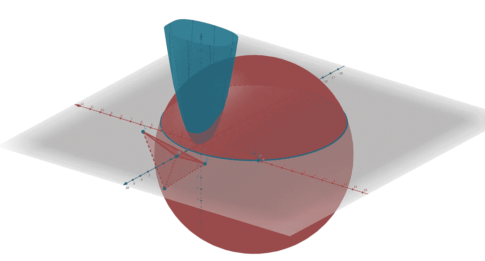
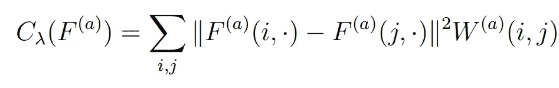
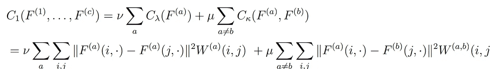
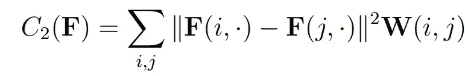
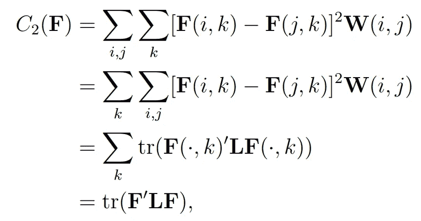
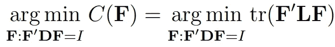
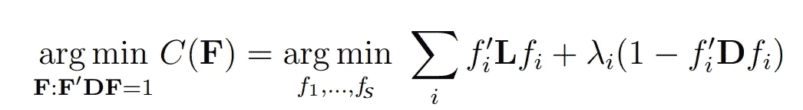
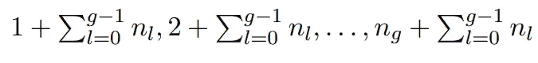

# 歧管对齐

> 原文：<https://towardsdatascience.com/manifold-alignment-c67fc3fc1a1c>

# 歧管对齐

## 多个数据集的统一

作者的 3D 艺术

单倍比对是一个寻找共同潜在空间的问题，在这个空间中，我们共同对多个数据集进行降维，以保持这些数据集之间的任何对应关系。在我们深入流形对齐的细节之前，让我们先了解什么是流形。

# 什么是流形？

n 维流形是具有极限、连续性和正确性的最一般的数学空间，并且允许与 n 维欧几里得空间存在连续的反函数。流形局部类似欧几里得空间，但它们可能不是欧几里得空间。本质上，流形是欧几里得空间的推广。

在拓扑学中，如果两个物体中的一个可以通过
变形成为另一个，而不需要切割或粘合，那么这两个物体就被认为具有相同的形状。形状与
相同的物体称为同胚。流形同胚于欧几里得空间。

# 流形对齐的问题

在信息革命的时代，我们看到物联网、信息物理系统、生物信息学和机器人领域产生了海量数据。这些数据越来越多模态化，即来自多个来源的一个以上的数据集描述相同的物理或生物过程。自然，这些数据集共享相似或相同的潜在语义结构。流形对齐的问题是关于对齐多个数据集以获得更有意义的表示。从各种模态获得的数据集可能具有不相交的特征，这使得对齐成为一个具有挑战性的问题。

## **问题陈述**

我们可以将流形对齐问题总结为联合降维，约束是由问题中各种数据集之间的对应关系激发的。

如果我们有大小为*n*t8】×p 的数据集 x 和大小为*m*t14】×t16】r 的数据集，它们的实例位于同一个流形 z 上，那么对齐的问题就是找到 *f* 和 *g* 使得*f(x*ᵢ【t24)接近 *g 在这种情况下，我们感兴趣的是映射 *f:* ℝᵖ *→* ℝᵏ和 *g:* ℝʳ *→* ℝᵏ的一些潜在维度 *k* 。我们用ℝ来表示实数集。*

只有当*f(x*ᵢ*)*=*g(y*ᵢ*)*时，每个样本点 *x* ᵢ 和 *y* ᵢ才可能有精确的对应关系，否则我们可以使用先验对应关系，如任何关于 *x* ᵢ *和 *y* ᵢ.的相似性信息【*f(x)；g(y)* 将是 X 和 Y 在新的潜在空间中的统一表示，而 *f(X)* 和 *g(Y)* 将是 X 和 Y 的新坐标*

## 解决问题的几个思路:

1.  通过将每个数据集的相似点映射到欧几里德空间中的相似位置，除了保留数据集之间的关系之外，还可以保留每个数据集中的单个结构。
2.  流形对齐算法可以是无监督的、半监督的或有监督的，这取决于有多少先验信息可用。完全对应允许监督算法，而不完全对应允许半监督或无监督。
3.  每个数据集的图拉普拉斯算子将是同一流形的离散近似。因此，这些拉普拉斯算子的对角线连接以及用对应关系填充的非对角线元素是该流形的近似。
4.  我们可以使用图嵌入算法来保持局部相似性，并且可以通过联合拉普拉斯算子来编码对应关系。因此，流形对齐可以简化为流形学习问题。

# 损失函数

在为流形对齐问题开发损失函数时，我们需要考虑两个因素。第一个是损失函数应该保持局部结构和对应信息。第二是在形成联合拉普拉斯算子之后，流形对齐应该等价于拉普拉斯特征映射。

如果我们有 *c* 数据集 *X* ⁽ ⁾、 *X* ⁽ ⁾、…、 *X* ⁽ᶜ⁾，那么我们可以为数据集内写一个损失项来反映局部相似性的保持，如

其中 *F* ⁽ᵃ⁾嵌入第 a 个数据集，即 *X* ⁽ᵃ⁾.的新坐标它表示如果第 I 行和第 j 行相似，即当 w 项大于时， *F* ⁽ᵃ⁾( *i* ，)和 *F* ⁽ᵃ⁾( *j* ，)应该彼此靠近放置。

对于数据集之间，损失项为

它定义了在⁽ᵃ⁾and 和⁽ᵇ⁾.之间保持通信的成本因此，我们可以有完整的损失函数为

拉普拉斯特征映射的损失函数可以使用联合相邻矩阵写成

其中 **F** 是所有数据集的矢量表示，而 **W** 是联合邻接矩阵。这就是说，如果当 *W(i，j)* 较大时， *X* ⁽ᵃ⁾和 *X* ⁽ᵇ⁾的*第 I 和第 j 行*相似，那么它们在潜在空间 **F** ( *i* ，)和 **F** ( *j* ，)中的位置应该接近。我们可以把它改写成

其中 **L** 是所有数据集的联合拉普拉斯算子

因此，流形对齐的优化问题变成

其中 *I* 是一个*s*×s 单位矩阵， *s* 是新空间的维数。

## 解的最优性

上述优化问题的最优解可以使用拉格朗日乘数来求解

其中**f**=【f₁，f₂，… fₛ】其中解为 *s* 最小非零特征向量和 *λ* 为拉格朗日乘子。

# 最终算法

给定 *c* 数据集 *X* ⁽ ⁾、 *X* ⁽ ⁾、…、 *X* ⁽ᶜ⁾都在相同的流形上，相似性函数 *S* 提供来自相同数据集的两个样本点关于沿流形的测地距离的相似性，以及一些对应信息——可以是来自不同数据集的样本点的相似性的形式(例如，皮尔逊相关、互信息等——只是一个想法，我们需要进一步探索),我们

1.  使用相似性函数 *S* 找到每个数据集的邻接矩阵 *W* ⁽ ⁾、 *W* ⁽ ⁾、…、*w*⁽ᶜ⁾——如果一个实例是另一个实例的 k-最近邻，则可能包括两个实例之间的权重。
2.  构造联合拉普拉斯 l。
3.  计算*s*Lf=*λ***D***f*的最小非零特征向量
4.  下面的 **F** 方程的行是 X⁽ᵍ⁾:的新坐标

稍后，我将提供一个使用玩具数据集的编码示例。在此期间，如果读者有任何问题，欢迎在评论中提问。

> *感谢您的阅读。如果你喜欢我的文章并想支持我的内容，我请求你通过*[*https://rahulbhadani.medium.com/membership*](https://rahulbhadani.medium.com/membership)*订阅 Medium。*

# 参考

1.  [*https://web . archive . org/web/20210506132703/http://www . math . LSA . umich . edu/~ jchw/womp talk-manifolds . pdf*](https://web.archive.org/web/20210506132703/http://www.math.lsa.umich.edu/~jchw/WOMPtalk-Manifolds.pdf)
2.  [https://www . math . Arizona . edu/~ glickenstein/research/layman fin/node 3 . html](https://www.math.arizona.edu/~glickenstein/research/laymanfin/node3.html)
3.  [*https://web . archive . org/web/20160909193617/http://OCW . MIT . edu/courses/mathematics/18-965-geometry-of-manifolds-fall-2004/lecture-notes/lesson 1 . pdf*](https://web.archive.org/web/20160909193617/http://ocw.mit.edu/courses/mathematics/18-965-geometry-of-manifolds-fall-2004/lecture-notes/lecture1.pdf)
4.  [*https://my . Vanderbilt . edu/Stacy fostad/files/2011/10/shape of space . pdf*](https://my.vanderbilt.edu/stacyfonstad/files/2011/10/ShapeOfSpace.pdf)
5.  [*https://people . csail . MIT . edu/pkrafft/papers/Wang-et-al-2010-manifold . pdf*](https://people.csail.mit.edu/pkrafft/papers/wang-et-al-2010-manifold.pdf)
6.  [https://sites.google.com/site/changwangnk/home/ma-html](https://sites.google.com/site/changwangnk/home/ma-html)