# 处理极坐标数据框中的值

> 原文：<https://towardsdatascience.com/manipulating-values-in-polars-dataframes-1087d88dd436>

## 了解如何使用 Polars 中的`various` 方法来操作数据帧


由[杰西卡·鲁斯切洛](https://unsplash.com/@jruscello?utm_source=medium&utm_medium=referral)在 [Unsplash](https://unsplash.com?utm_source=medium&utm_medium=referral) 上拍摄的照片

到目前为止，我已经谈论了如何使用 Polars 数据框架，以及为什么它是一个比 Pandas 更好的数据框架库。继续我们对 Polars 的探索，在本文中，我将向您展示如何操作 Polars 数据框架，特别是:

*   如何更改每一列/行的值
*   如何合计每一列/行的值
*   如何向现有数据框架添加新列/行

准备好了吗？我们走吧！

# 创建示例数据帧

让我们使用元组列表创建一个 Polars 数据帧:

```
import polars as plmatrix = [
    (1, 2, 3),
    (4, 5, 6),
    (7, 8, 9),
    (10, 11, 12),
    (13, 14, 15),
    (16, 17, 18)
]df = pl.DataFrame(matrix, columns=list('abc'))
df
```

数据帧看起来像这样:

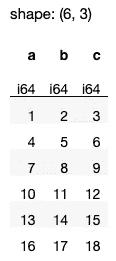

作者图片

让我们研究一些方法，您可以调用这些方法来操作数据帧中的值。

## 使用 apply()方法

`apply()`方法可用于:

*   数据帧中的单个列，或者
*   整个数据帧

## 应用于列

例如，假设您想要将' **a'** 列中的所有值乘以 2。您可以执行以下操作:

```
df.select(
    pl.col('a').**apply**(lambda x: x*2)
)
```

列' **a** 中的所有值现在将乘以 2:

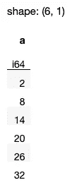

作者图片

在上面的 lambda 函数中，`x`将采用列 **a** 的单个值。当应用于一个列时，`apply()`方法逐个发送列的值。这为您提供了在决定如何更改值之前检查每个值的机会。例如，您可以只乘以那些大于或等于 5 的值:

```
df.select(
    pl.col('a').apply(**lambda x: x*2 if x>=5 else x**)
)
```

这将产生以下输出:

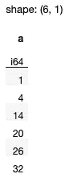

作者图片

> 一般来说，使用`*apply()*`方法实现逻辑比使用表达式实现逻辑要慢，并且占用更多内存。这是因为表达式可以并行化和优化，表达式中实现的逻辑是用 Rust 实现的，这比用 Python 实现(例如用 lambda 函数实现)要快。因此，尽可能使用表达式，而不是使用`apply()`函数。例如，早期的`apply()`方法也可以用一个表达式重写:

```
 pl.col('a').apply(lambda x: x*2)
    # rewritten as an expression
 **pl.col('a') * 2**
```

请注意，结果只包含一列。如果您希望其余的列也出现在结果中，请使用`select()`和`exclude()`方法:

```
**q = (
    df
    .lazy()
    .select(
        [
**            pl.col('a').apply(lambda x: x*2),
         **   pl.exclude('a')
        ]
    )
)****q.collect()**
```

现在结果包含了所有的列:

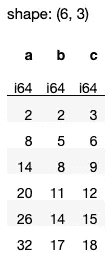

作者图片

如果您想将所有列乘以 2，使用`pl.col(‘*’)`选择所有列:

```
q = (
    df
    .lazy()
    .select(
 **pl.col('*').apply(lambda x: x*2)**
    )
)q.collect()
```

所有列现在将乘以 2:

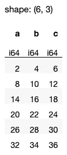

作者图片

如果要将列' **a'** 乘以 2，然后将结果存储为另一列，请使用`alias()`方法:

```
q = (
    df
    .lazy()
    .select(
        [
            pl.col('*'),
            pl.col('a').apply(lambda x: x*2)**.alias('x*2')**,
        ]
    )
)q.collect()
```

结果现在会有一个额外的列:

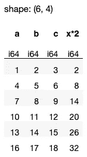

作者图片

## 使用 map()方法

另一个类似于`apply()`方法的功能是`map()`方法。与`apply()`方法不同的是，`map()`方法将一列的值作为单极性序列发送:

```
df.select(
    pl.col('a').**map**(lambda x: x*2)
)
```

在上面的 lambda 函数中，`x`是包含列 **a** 的值的 Polars 序列。上述语句产生以下输出:


作者图片

## 应用于行

注意到目前为止，数据帧中的*列*应用了`apply()`方法。如果您想应用于数据帧中的*行*该怎么办？在这种情况下，直接调用 dataframe 上的`apply()`方法。

为了理解它是如何工作的，我编写了一个`test`函数来打印出将`apply()`函数应用于 dataframe 时得到的值:

```
def test(x):
    print(x)
    return x

df.apply(test)
```

它返回以下内容:

```
(1, 2, 3)
(4, 5, 6)
(7, 8, 9)
(10, 11, 12)
(13, 14, 15)
(16, 17, 18)
```

这意味着`apply()`函数在应用于 dataframe 时，会将每一行的值作为一个元组发送给接收函数。这对于一些用例很有用。例如，假设您需要将一行中的所有数字除以 2，如果它们的和大于 10，那么您可以将 lambda 函数写成:

```
df.apply(lambda x: **tuple([i // 2 for i in x]) if sum(x) > 10 else x**)
```

结果会是这样的:

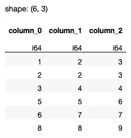

作者图片

如果想复制数据帧中的所有列，也可以使用`apply()`方法:

```
df.apply(lambda x: x*2)
```

数据帧现在有六列:

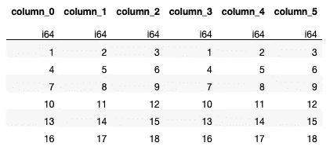

作者图片

> 注意`apply()`功能不能应用于 LazyFrame。

# 对数据帧中的值求和

通常，您需要按行或按列对数据帧中的所有值求和。

## 按列

合计每列值的最简单方法是在数据帧上使用`sum()`方法:

```
df.sum()
```


作者图片

要将上述结果附加到现有数据帧，使用`concat()`方法:

```
pl.**concat**([df, df.sum()])
```

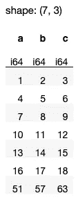

作者图片

## 按行

要合计每行所有列的值，使用`sum()`方法，并将`axis`参数设置为`1`:

```
df.sum(**axis=1**)
```

结果是一个 *Polars 系列*:

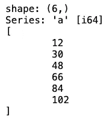

作者图片

> 将 Polars 系列视为数据帧中的一列

您也可以使用`select()`方法来选择您想要求和的列:

```
df.**select(pl.col('*'))**.sum(axis=1)
```

以下代码片段将系列作为新列添加到 dataframe 中:

```
df['sum'] = df.select(pl.col('*')).sum(axis=1)
df
```

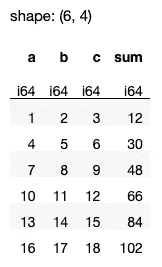

作者图片

如果您不想使用*方括号索引*(Polars 中不推荐使用)，请使用`select()`方法:

```
df.**select**(
    [
        pl.col('*'),
        df.select(pl.col('*')).sum(axis=1).alias('sum')
    ]
)
```

[](https://weimenglee.medium.com/membership)  

> 我将在即将到来的新加坡 ML 会议(2022 年 11 月 22-24 日)上主持一个关于 Polars 的研讨会。如果你想在 Polars 数据框架上快速起步，请在[https://ml conference . ai/machine-learning-advanced-development/using-Polars-for-data-analytics-workshop/](https://mlconference.ai/machine-learning-advanced-development/using-polars-for-data-analytics-workshop/)上注册我的研讨会。


# 摘要

我希望这篇文章为您使用 Polars 数据框架增加了一些弹药。以下是何时使用`apply()`和`map()`方法的快速总结:

*   对表达式调用`apply()`方法，将函数应用于数据帧中 ***列*** 中的 ***单个*** 值。
*   在表达式上调用`map()`函数，将函数应用于数据帧中的 ***列*** 。
*   在数据帧上调用`apply()`方法，将函数应用于数据帧中的 ***行* s** 。

保存这篇文章，并在下次使用 Polars 数据框时用作快速参考！