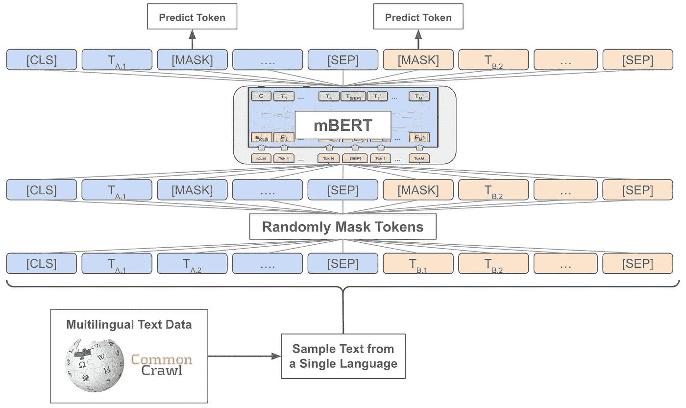
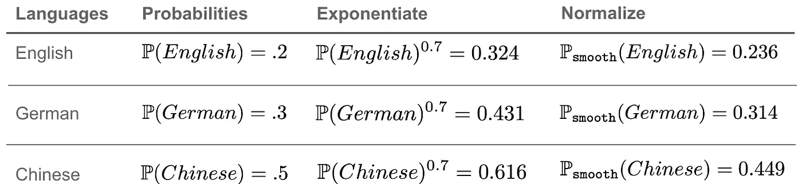
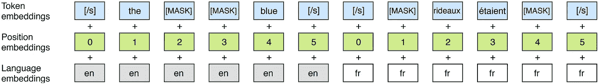
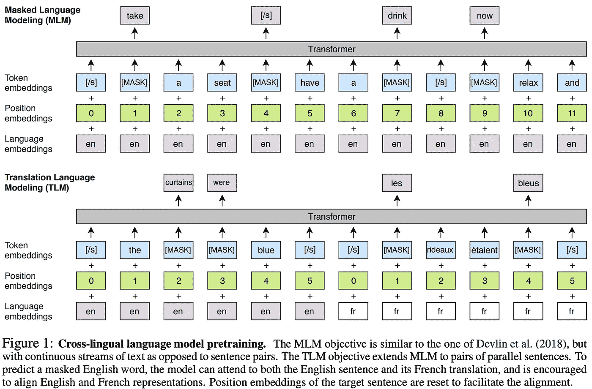
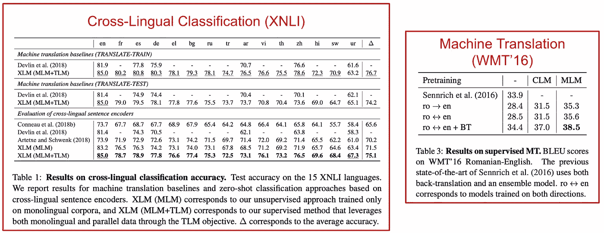
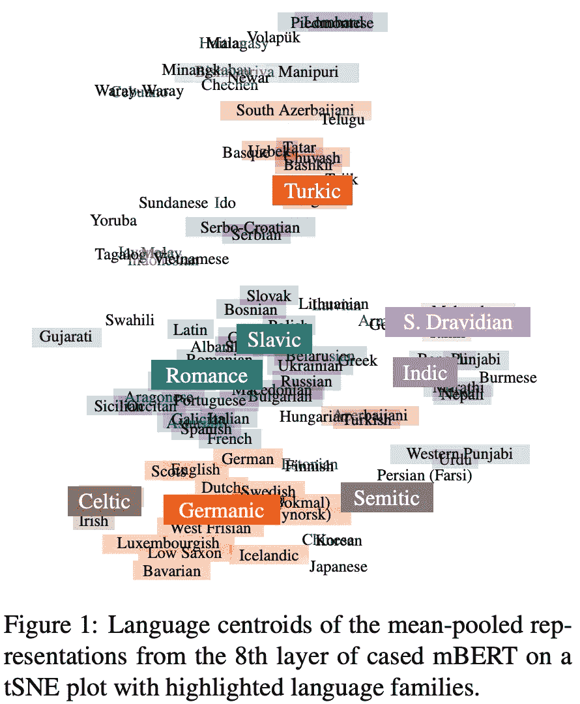
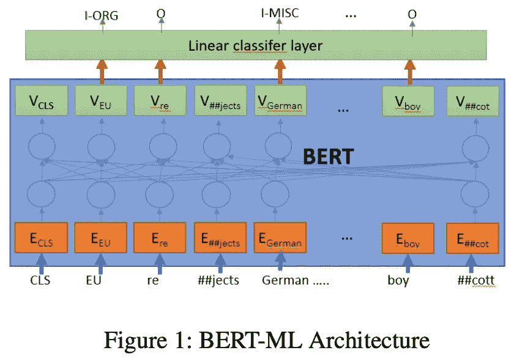
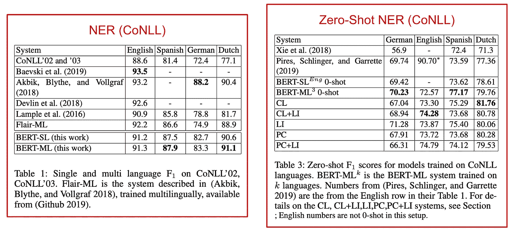
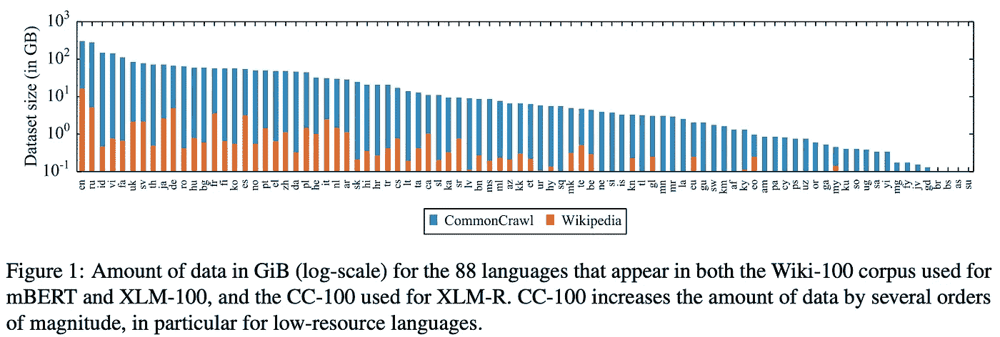
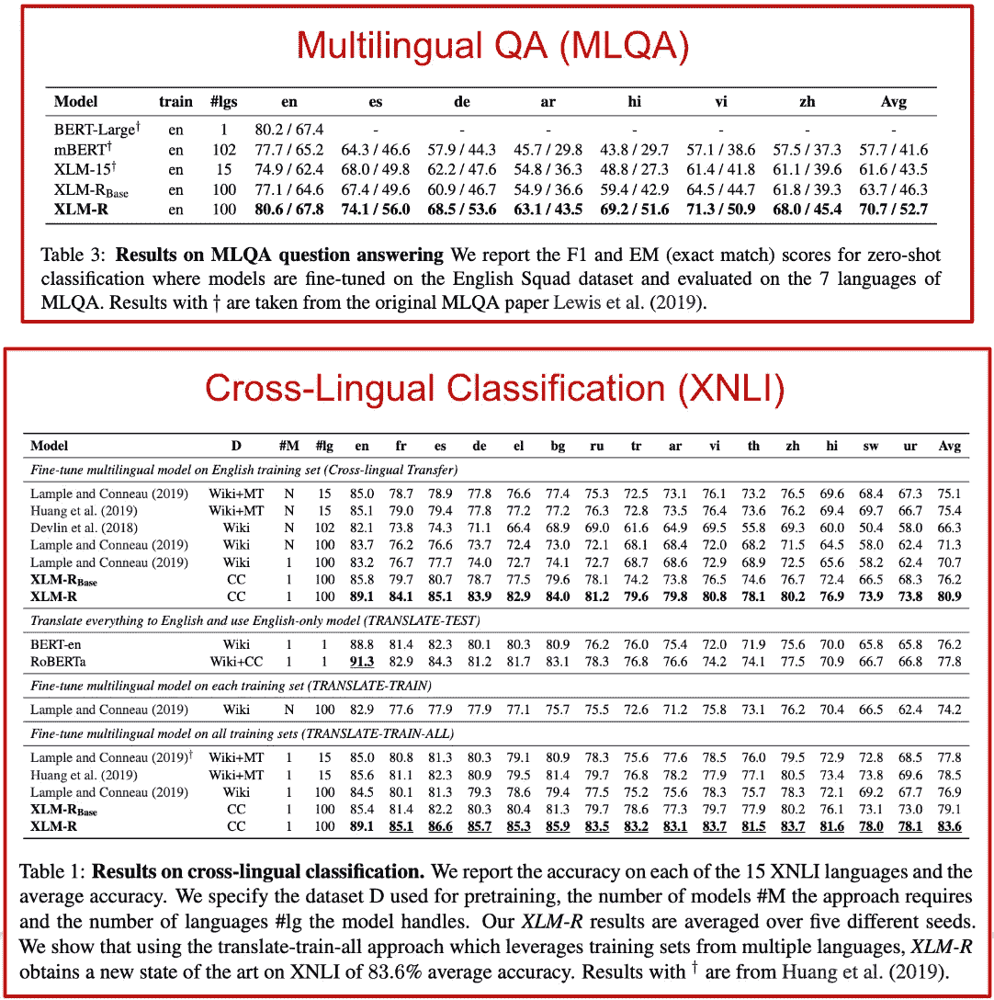

# 多种语言，一个深度学习模型

> 原文：<https://towardsdatascience.com/many-languages-one-deep-learning-model-69201d02dee1>

## 多语言理解比你想象的容易！

([来源](https://unsplash.com/photos/YPgTovTiUv4))

*我们如何让基于自然语言的深度学习系统理解多种语言的数据？*一种简单的方法是在每种期望的语言上训练一个单独的深度学习模型。但是，这种方法非常繁琐。*如果我们需要创建一个接收来自 100 多种不同语言的数据的系统，该怎么办？*承担训练 100 个深度学习模型的成本，对于大多数从业者来说是不可行的。

幸运的是，最近的深度学习研究表明，多语言理解可能比看起来更简单。在 BERT [1]出现后不久，研究人员意识到双向转换器模型能够同时从多种语言中学习。这种方法使多种语言的深度学习变得简单——只需训练一个模型来处理所有语言。

> “最近的发展表明，有可能建立通用的跨语言编码器，可以将任何句子编码到共享的嵌入空间中。”
> 
> *—来自【2】*

这些多语言模型几乎与 BERT 相同。然而，他们的自我监督预训练是在包含来自 100 多种语言的文本数据的多语言语料库上进行的。尽管对于训练这些多语言模型存在一些额外的考虑，但是总体方法与训练单语 BERT 模型惊人地相似。

多语言深度学习模型对于语言理解的主要好处有两个方面:

*   简单性:单一的模型(而不是每种语言的独立模型)更容易使用。
*   *归纳转移*:多种语言的联合训练使得跨语言模式的学习成为可能，这有利于模型性能(特别是在低资源语言上)。

对于深度学习实践者来说，这些模型非常有用，因为它们表现得惊人地好，并且不需要任何深入的语言理解。在这个概述的过程中，我将解释基于 BERT 的多语言模型的当前工作，包括对这种模型的行为/倾向的分析和对最近提出的模型的解释。

使用自我监督、屏蔽的语言建模目标对多语言 BERT 模型进行预训练(由作者创建)

# 多语言理解的基础

在自然语言处理(NLP)领域，大量的研究工作已经投入到制作通用(单语)句子表示(例如， [FastText](https://github.com/facebookresearch/fastText) 、 [Word2Vec](https://jalammar.github.io/illustrated-word2vec/) 、GloVe【8】等)中。).BERT [1]的出现——在我的[上一篇文章](https://cameronrwolfe.substack.com/p/language-understanding-with-bert)中解释过——彻底改变了这个领域，揭示了预先训练的双向变压器模型产生可微调的句子表示，以非常高的准确度解决语言理解任务。

除了单语方法，许多 NLP 研究人员已经研究了跨语言的单词或短语对齐问题[9，10]，机器翻译[11]和跨语言表示学习[12]。其核心是，这样的研究提出了这样一个问题:*有没有可能创建一个跨语言共享嵌入空间的通用句子编码器？*

朝着这个方向发展，最近的研究发现，伯特风格、预先训练的变形金刚可以产生有用的多语言句子表示。通过简单地使 BERT 的预训练语料库多语言化，这些模型获得了对许多语言的体面理解，并可以进行微调以解决跨语言任务(例如，对多种语言的句子进行分类)。第一种方法叫做多语言 BERT (mBERT ),实际上是与 BERT 同时提出的。

## 多语言 BERT (mBERT)

最初的 BERT 出版物[1]没有提到多语言学习。然而，BERT 的[公开版实际上包含了一个多语种版本的 BERT，名为(创造性地)](https://github.com/google-research/bert)[多语种 BERT (mBERT)](https://github.com/google-research/bert/blob/master/multilingual.md) 。

该模型与 BERT 几乎相同，唯一的区别是:

*   多种语言的联合预培训(详见下文)
*   跨语言使用共享的[令牌词汇表和嵌入空间](https://medium.com/@_init_/why-bert-has-3-embedding-layers-and-their-implementation-details-9c261108e28a)

简而言之， *mBERT 是一个单一的模型，它学习跨大量语言的统一表示*。

**预培训方法。** mBERT 接受了来自超过 [100 种语言](https://github.com/google-research/bert/blob/master/multilingual.md#list-of-languages)(而不仅仅是英语)的维基百科数据的预训练。为了构建预训练数据集，作者在维基百科上找到数据量最大的 100 种语言，然后将这些数据串联起来，形成多语言预训练数据集。mBERT 学习的所有语言都是基于大小为 110K 的单个[单词块](/wordpiece-subword-based-tokenization-algorithm-1fbd14394ed7)词汇嵌入的。

为每种语言分配一个概率，预训练更新从一种语言中抽取一部分文本数据，用于根据该概率进行的[自监督更新](https://cameronrwolfe.substack.com/i/76273144/training-bert)，允许 mBERT 在整个预训练过程中接触所有不同的语言。不出所料，预训练数据集中的某些语言自然代表性不足——它们的数据比其他语言少。为了减轻这种不平衡的影响，每种语言的概率被指数平滑如下:

1.  取每种语言的概率(例如，如果 21%的预训练语料库是英语，则英语具有 21%的概率)
2.  用因子 s 对这个概率取幂(例如，mBERT 使用 s=0.7，得到 0.21⁰.7 = 0.335)
3.  基于这些指数化的概率，重新归一化(即除以总和)每种语言的概率

这种平滑方法 *(i)* 略微降低了采样高资源语言的概率，而 *(ii)* 略微增加了采样低资源语言的概率。尽管平滑的量由 s 的选择来控制，但是这种技术确保了在预训练期间低资源语言不会被代表不足(反之亦然)；见下文。

语言概率的指数平滑

对于那些感兴趣的人来说，语言概率的指数平滑法受到了用于时间序列预测的类似技术的启发。

**mBERT 真的很有用。**在 [XNLI 数据集](https://github.com/facebookresearch/XNLI)上评估时，发现 mBERT 在解决跨语言任务方面相当有效。跨多种语言的联合预训练带来了显著的性能优势，其中低资源语言的分类任务得到了最大的提升。这些结果表明，多语言预训练有助于正向归纳迁移——同时训练多种语言实际上比训练每种语言的单独模型更好。

应当注意，许多用于多语言(和单语)理解的现有方法依赖于专门的语言学方法。mBERT(和 BERT)的提议极大地简化了日常实践者解决 NLP 任务的过程。

## 数据集

有几个数据集可用于多语言深度学习模型的下游评估。这些数据集既包括分类风格的问题，也包括更复杂的问题，如命名实体识别或问题回答。

**跨语言 NLI (XNLI)语料库。** [XNLI](https://github.com/facebookresearch/XNLI) 是流行的 [multiNLI](https://cims.nyu.edu/~sbowman/multinli/) 语料库的多语言版本，是目前最流行的评估多语言语言理解的数据集。multiNLI 数据集包含 433，000 对已经用文本蕴涵信息进行了注释的句子(即，句子是否相互矛盾，[相互蕴涵](https://www.merriam-webster.com/dictionary/entail)，或者是中性的)。multiNLI 数据集不同于其他自然语言推理数据集，因为它包含跨众多语音和文本体裁的句子。

XNLI 语料库是 multiNLI 的一个版本，已被翻译成 15 种不同的语言，由:

*   使用人类来翻译开发和测试集
*   机器翻译训练集

在 XNLI 数据集上进行训练的几种不同方法在文献中经常被报道，包括:

*   **翻译-训练:**对每种语言的训练集使用单独的模型进行训练和评估
*   **翻译-测试:**开发和测试集被翻译成英语，然后在训练集上微调单个英语模型并用于评估
*   **translate-train-all:** 在所有不同语言的训练集的机器翻译版本上微调单个多语言模型，然后使用每种不同语言进行评估。

也可以使用零测试设置来执行评估，在零测试设置中，某一语言被排除在训练集之外，但仍包括在评估中。

**其他数据集。**虽然 XNLI 非常受欢迎，但还有其他几个数据集用于评估多语言理解。例如，[命名实体识别](https://medium.com/mysuperai/what-is-named-entity-recognition-ner-and-how-can-i-use-it-2b68cf6f545d) (NER)的 CoNLL 数据集包含英语、荷兰语、西班牙语和德语的翻译。此外，对于问题回答， [MLQA 基准](https://github.com/facebookresearch/MLQA)采用了流行的[小队基准](https://rajpurkar.github.io/SQuAD-explorer/)用于英语，并将其扩展到西班牙语、德语、阿拉伯语、印地语、越南语和中文版本。最后，多语言模型仍然通常在 GLUE 基准上进行评估，以便更好地比较它们与单语模型的性能。最近还提出了更广泛的多语言基准，如 [XTREME](https://github.com/google-research/xtreme) 。

# 出版物

我现在将概述几个研究多语言 BERT 模型的出版物。这些出版物中的两个提出了对底层模型的潜在修改，而其他的分析模型行为并研究对更复杂应用的扩展(例如，命名实体识别)。

## 跨语言语言模型预训练[2]

XLM 的语言嵌入(摘自[2])

与 mBERT 的提议同时,[2]的作者开发了跨语言语言模型(XLM)。XLM 是第一个使用生成性和跨语言预训练相结合的思想来创建多语言、基于转换的语言理解模型的模型之一。XLM 与伯特共享相同的架构，除了额外的“语言”嵌入被添加到模型输入中的每个令牌；见上图。

与 mBERT 类似，XLM 有一个共享的标记化方法和跨所有不同语言的嵌入空间。由于这种共享的嵌入空间，不同语言之间共享的标记级模式很容易学习。

> “这极大地改善了共享相同字母表或锚标记(如数字或专有名词)的语言之间嵌入空格的对齐方式”
> 
> *—来自【2】*

与 mBERT 相反，作者考虑了 XLM 训练前数据的两个来源:

*   来自每种不同语言的无监督的原始文本数据(与 mBERT 预训练数据相同)。
*   不同语言的平行句子集(即一种语言的句子与另一种语言的相同句子成对出现)。

上面提到的第二种数据集类似于机器翻译数据集——它只包含成对的句子，其中每个句子都被翻译成了另一种语言。显然，获得这样的句子对比获得原始文本更困难，因为它需要翻译文本数据(通过机器或人工注释器)。

利用这两个数据来源，为 XLM 提出了几个不同的培训前任务:

*   **因果语言建模(CLM):** 给定一个序列中的一组单词，预测下一个单词(这是一个普通的语言建模任务)。
*   **蒙面语言建模(MLM):** 相同，自我监督 [MLM 任务](https://cameronrwolfe.substack.com/i/76273144/training-bert)在 BERT 内部使用。
*   **翻译语言建模(TLM):** 类似于 MLM，但是使用不同语言的两个平行句子作为输入(与单语输入相对)。

直观上，TLM 任务可以学习语言之间的对应关系。如果某个单词在一种语言中被屏蔽，该模型可以关注翻译句子的相应区域来预测被屏蔽的单词；见下文。

(来自[2])

因为 CLM 任务需要使用[单向自我关注](https://cameronrwolfe.substack.com/i/76273144/self-attention)，三个独立的 XLM 模型使用 CLM、MLM 和 MLM+TLM 进行预训练。当对下游任务进行评估时，这些 XLM 模型在跨语言检测和机器翻译基准上取得了最先进的结果。使用 MLM 或 MLM+TLM 预培训目标会产生最佳效果。

(来自[2])

用 CLM 训练的 XLM 模型也显示出在下游语言建模应用中产生困惑改进。XLM 最显著的成绩提高发生在低资源语言上，揭示了多语言预训练对这类语言产生积极的归纳迁移。

在零元迁移领域，XLM 在推广新语言方面表现出色。特别是，由于跨语言的共享词汇，XLM 可以利用语言之间的标记相似性来推理未明确包括在其训练集中的语言。

## 多语言 BERT 的语言中立性如何？[3]

随着 mBERT 的公开发布，许多研究人员对模型的行为和属性产生了疑问。*BERT 修改这么少怎么支持多种语言？从不同语言中学习到的表征是否对齐(即不同语言中的相似词有相似的表征)？通过更具体的调整来支持多种语言，可以提高 mBERT 的性能吗？*

为了解决这些问题，作者在[3]中采用了 mBERT 模型，并研究了它在三个下游任务中的行为:

*   **语言识别:**对句子的语言进行分类
*   **句子检索:**在不同语言的文本语料库中查找句子的翻译版本
*   **词语对齐:**计算同一句子翻译版本中对应词语的对齐度
*   **机器翻译质量评估:**在不访问参考译文的情况下计算(机器生成的)译文的质量(即，这是一项更加细致/困难的任务。有关更多信息，请参见[3]的第 4 节)

在对这些不同任务中的每一个进行微调之后，作者进行了广泛的分析，从而对模型的行为产生了深刻的见解。有趣的是，人们发现 mBERT 表示由语言中立和特定于语言的成分组成— *由 mBERT 产生的表示并不完全是语言中立的。*

例如，mBERT 能够以高准确度识别输入句子的语言。但是，当 mBERT 的表示居中/规范化时(基于语言中的所有其他表示)，模型:

*   在对源语言进行分类方面要差得多
*   更擅长执行句子检索

这一发现揭示了一些语言特有的信息清楚地包含在 mBERT 的表征中。因此，mBERT 学习的模式并不是所有语言都通用的。尽管尝试了多种改进的微调方法，作者在使 mBERT 的表示更加语言中立方面并不成功。因此，产生具有改进的语言中立性的模型是未来的工作。

(摘自[3])

尽管有这些发现，但作者观察到，语言相似的语言在 mBERT 的嵌入空间中聚集在一起(见上文)，并且 mBERT 擅长解决跨语言、单词级的语义任务(例如，单词对齐和句子检索)。尽管努力完成更复杂的任务，如机器翻译质量评估，mBERT 仍然能够在一定程度上捕捉跨语言的相似性。换句话说，mBERT 工作得很好，*但必须加以改进，才能直接应用于更大范围的跨语言任务。*

## 用 BERT 实现通用语命名实体识别[4]

如果你和我一样，关于这篇论文你会问的第一个问题是— *这个题目是什么，有什么含义？*首先，牛津语言对“通用语”的定义是:

> "母语不同的人之间作为共同语言使用的一种语言."

虽然标题有点花哨，但上面的定义实际上很好地概括了本文的目的— *找到一个可以跨多种语言同时执行命名实体识别的单一模型*。特别是，[4]的作者在多种语言的 NER 数据集上联合训练了一个 mBERT 模型(如下所示)。

NER 的 mBERT 建筑(摘自[4])

人们发现 mBERT 完全有能力解决这样的任务。该模型可以在不同语言的 NER 任务上联合训练，这产生了 NER 性能的改善，尤其是在低资源语言上。

作者还表明，mBERT 能够执行高精度的零炮 NER 推断。鉴于先前的姆伯特/XLM 模型可以以类似的方式进行零炮推断，这似乎并不令人惊讶。然而，NER 是一个复杂的令牌级任务，与分类任务相比很难解决。尽管它简单易用，但在这个复杂的领域中，mBERT 的表现还是令人惊讶的好。

(摘自[4])

试图分析 mBERT 令人印象深刻的零射击性能，作者表明 mBERT 的令牌嵌入在预训练后排列良好，这意味着不同语言中的相似单词/短语具有相似的嵌入。因此，即使某种语言被排除在微调过程之外，*嵌入空间中的这种对齐使得有用的信息能够被提取并用于推断*。在微调过程中，对齐性能似乎会下降，但这可以通过简单地冻结早期网络层来解决。

## 大规模无监督跨语言表征学习[6]

[6]中的作者提出了 XLM-罗伯塔(简称为 XLM-R)模型，这是一个基于罗伯塔的多语言 BERT 模型(即 BERT 的变体)[7]。然而，作者没有建立在公开可用的 mBERT 模型上，而是从头开始建立自己的模型，强调在预训练过程中做出不同的选择可以导致更好的多语言理解下游模型。

(摘自[6])

伯特[1]和 XLM [2]接受了维基百科数据的预训练，这些数据是跨多种语言聚合的。[6]中的作者声称，这种预训练数据集限制了模型性能。取而代之的是，他们使用[公共抓取](https://commoncrawl.org/)库——一个公开的网络抓取数据数据库——构建了一个多语言文本数据语料库。语料库包括来自 100 多种语言的数据，比基于维基百科的数据集大两个数量级；见上文。

类似于 mBERT，XLM-R 模型在这个更大的语料库上被预训练，根据指数平滑的语言概率使用语言采样。然而，作者确实对基础模型和训练方案做了一些改变:

*   共享令牌词汇表的大小从 110K 增加到 250K。
*   采用更通用的标记化方法来去除 mBERT 所需的特定于语言的预处理。
*   执行的预训练量显著增加(以前的模型显然训练不足！).

XLM-R 模型在多语言推理和问题回答任务上都明显优于 mBERT 和 XLM，确立了其作为多语言理解的首选模型的地位，并揭示了在源自普通爬行的较大语料库上进行预训练是非常有益的。同样，低资源任务的性能似乎从使用 XLM-R 中受益最大，但 XLM-R 在高资源语言上的表现也与单语模型有竞争力。

(摘自[6])

在消融实验中，XLM-R 使用不同数量的语言进行训练。作者揭示了一种现象，他们称之为多语制的*诅咒*。如果在保持模型容量/大小不变的情况下增加用于训练模型的语言数量，模型的性能最初会有所提高，但随后随着语言数量变得过大，性能会开始下降。虽然这个问题可以通过简单地增加模型大小来缓解，但它揭示了共同学习的语言的数量是使用这些多语言模型的从业者必须记住的一个考虑因素。

# 外卖食品

尽管多语言理解似乎是一项艰巨的任务，但最近的深度学习研究表明，当前的语言理解方法可以很好地处理这个问题。特别是，稍加修改的 BERT 版本可以通过多语言语料库进行联合预训练，然后进行微调，以惊人的准确度解决跨语言任务。

通过分析这些模型，已经表明:

*   单个多语言 BERT 模型可以学习/理解大量(即> 100 种)不同的语言。
*   多种语言的联合预训练产生了显著的性能优势(特别是对于缺乏大量训练数据的语言)。
*   以这种方式训练的多语言模型在高资源语言(例如，英语或德语)上仍然具有与单语模型竞争的性能
*   多语言 BERT 模型可以以零触发的方式推广到新的语言，因为它们跨语言高度一致、共享词汇/嵌入。

先前对多语言理解(以及一般的 NLP)的研究依赖于大量详细的语言理解。大多数任务通常使用复杂的、专门的架构来解决。有了(多语言)BERT，语言理解任务——甚至跨多种语言——可以用一个简单易懂的模型来解决。

**代码。**微调/使用这些模型比你想象的[计算成本更低](https://cameronrwolfe.substack.com/i/76273144/takeaways)！因此，我再次强调 BERT 模型对任何深度学习实践者的实用价值。如果你有兴趣尝试这些方法中的任何一种，我在这里推荐 XLM-R 链接[的代码示例。](https://github.com/facebookresearch/fairseq/tree/main/examples/xlmr)

**延伸阅读。**虽然我在这篇概述中涵盖了几篇论文，但我在研究过程中发现了许多其他真正有趣的论文。我最喜欢的一些是:

*   Xtreme:用于评估跨语言泛化的大规模多语言多任务基准——包含 40 种语言的多语言、多任务语言理解基准[ [论文](http://proceedings.mlr.press/v119/hu20b.html) ][ [代码](https://github.com/google-research/xtreme)
*   mT5:一个大规模多语言预训练文本到文本转换器——流行的 T5 转换器架构的多语言变体[ [论文](https://arxiv.org/abs/2010.11934) ][ [代码](https://github.com/google-research/multilingual-t5)
*   用于语音识别的无监督跨语言表征学习—多语言语音识别模型[ [论文](https://arxiv.org/abs/2006.13979)

## 结论

非常感谢你阅读这篇文章。如果你喜欢，请在 [twitter](https://twitter.com/cwolferesearch) 上关注我，或者订阅我的[深度(学习)焦点时事通讯](https://cameronrwolfe.substack.com/)，在那里我挑选了一个双周一次的深度学习研究主题，提供了对相关背景信息的理解，然后概述了一些关于该主题的热门论文。我是 [Cameron R. Wolfe](https://cameronrwolfe.me/) ，ale gion[的研究科学家，莱斯大学的博士生，研究深度学习的经验和理论基础。你也可以看看我在 medium 上的](https://www.alegion.com/)[其他著述](https://medium.com/@wolfecameron)！

## 文献学

[1] Devlin，Jacob 等，“Bert:用于语言理解的深度双向转换器的预训练”arXiv 预印本 arXiv:1810.04805 (2018)。

[2]兰普勒，纪尧姆和亚历克西斯·康诺。"跨语言语言模型预训练."arXiv 预印本 arXiv:1901.07291 (2019)。

[3]利博维克、Jindřich、鲁道夫·罗萨和亚历山大·弗雷泽。“多语伯特的语言中立性如何？."arXiv 预印本 arXiv:1911.03310 (2019)。

[4] Moon，Taesun，等.“用 bert 实现通用语命名实体识别”arXiv 预印本 arXiv:1912.01389 (2019)。

[5] Lample，Guillaume 等,“命名实体识别的神经结构”arXiv 预印本 arXiv:1603.01360 (2016)。

[6] Conneau，Alexis 等人，“无监督的跨语言表征学习的规模。”arXiv 预印本 arXiv:1911.02116 (2019)。

[7]刘，，等.“Roberta:一种稳健优化的 bert 预训练方法”arXiv 预印本 arXiv:1907.11692 (2019)。

[8]潘宁顿、杰弗里、理查德·索赫尔和克里斯托弗·曼宁。"手套:单词表示的全局向量."2014 年自然语言处理经验方法会议录(EMNLP)。2014.

[9] Mikolov，Tomas 等人，“单词和短语的分布式表示及其组合性”神经信息处理系统进展 26 (2013)。

[10] Ammar，Waleed 等人，“大规模多语言单词嵌入”arXiv 预印本 arXiv:1602.01925 (2016)。

[11] Johnson，Melvin 等，“谷歌的多语言神经机器翻译系统:实现零镜头翻译。”计算语言学协会汇刊 5(2017):339–351。

[12] Conneau，Alexis 等人，“XNLI:评估跨语言句子表征”arXiv 预印本 arXiv:1809.05053 (2018)。