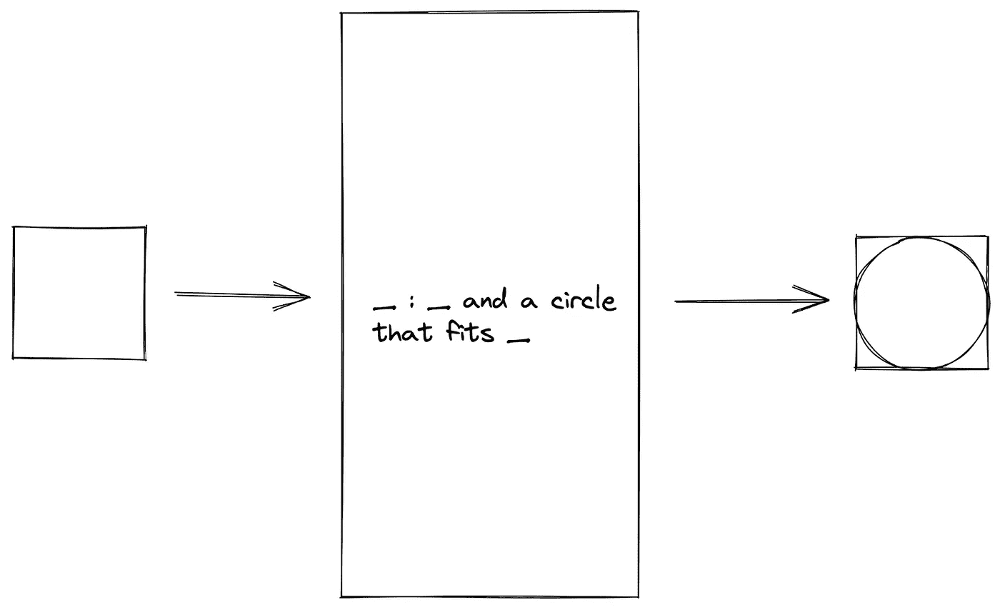
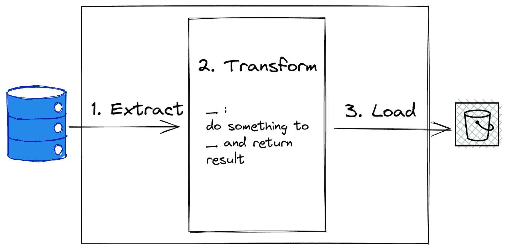
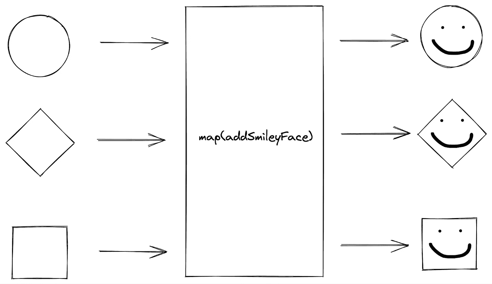
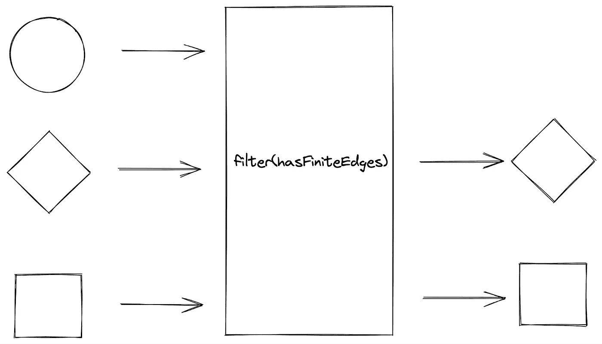
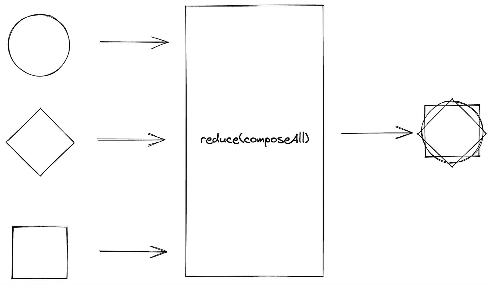

# 映射、过滤、归约-用于功能数据管道设计的高阶函数

> 原文：<https://towardsdatascience.com/map-filter-reduce-higher-order-functions-for-functional-data-pipeline-design-929935222475>

## 深入探讨高阶函数，以及如何使用它们为函数式数据管道设计数据转换

# 概述

在我上一篇关于“控制流”的[函数式编程特性的文章中，我提供了函数组合的概述，并讨论了高阶函数和递归作为“函数迭代”形式的使用。](/functional-control-flow-writing-programs-without-loops-ce07e6137bba)

在本帖中，我们将深入探讨高阶函数，以及它们如何用于设计函数式数据管道。

在此之前，我们先来看看典型的数据管道是什么样子的。

# 数据处理和数据管道设计模式

数据处理的经典方法是编写一个使用**数据管道**设计模式的程序。



数据管道设计模式(图片来自作者)

在典型的数据管道中，我们从源中读取数据，以某种期望的方式转换数据，并收集输出作为新数据。这就是通常所说的“提取、转换、加载”(ETL)过程。

*   **提取**:在数据提取阶段，从源系统中提取数据并验证其正确性。
*   **Transform** :在数据转换阶段，一系列的函数被应用到提取的数据，以便为装载到目标数据存储做准备。
*   **Load** :在数据加载阶段，数据被加载到目标数据存储中——它可以是平面文件(比如 CSV 或 Parquet)或数据仓库。

# 用于数据转换的高阶函数

下面是 S3 桶中从数据库源到平面文件的典型 ETL 过程的简化示意图:



ETL 过程的草图(图片由作者提供)

数据提取和数据加载阶段取决于程序外部的源数据和目标数据存储的状态，而数据转换阶段则取决于程序本身内部的输入数据和应用于数据的函数。因此，数据转换可以自然地表达为由一系列函数组成的函数操作，也称为**函数组合**。

对于支持函数作为一级对象的编程语言，函数组合可以用高阶函数的形式来表示。虽然我们可以编写自己的高阶函数，但有一些有用的内置高阶函数通常用于数据转换:

*   `map`
*   `filter`
*   `reduce`

本文的重点是探索这些内置的高阶函数，并讨论如何将它们用于设计功能性数据管道。

# `map`

`map`函数接受一个函数作为输入，将该函数应用于值集合中的每个元素，并返回一个新的函数输出值集合。



`map`功能示意图(图片由作者提供)

例如，当我们用一个`addSmile`操作映射一个形状集合时，我们通过将操作应用于形状来“映射”集合中的每个形状。使用`addSmile`操作映射形状的输出被合并到一个新的形状集合中，并在输入形状中添加了一个微笑。

关于 Python 和 Scala 中的`map`实现的详细讨论可以在[我之前的帖子](/functional-control-flow-writing-programs-without-loops-ce07e6137bba)中找到。

# `filter`

`filter`函数接受返回布尔值(也称为*谓词*)的函数作为输入，将该函数应用于值集合中的每个元素，并将从该函数返回`true`的元素作为新集合返回。

谓词应该接受一个与集合中的元素类型相同的参数，用该元素评估结果，并返回`true`到**将元素**保留在新集合中或`false`将其过滤掉。



`filter`功能示意图(图片由作者提供)

例如，当我们将`hasFiniteEdges`条件应用于形状集合时，我们根据集合中的每个形状是否满足`hasFiniteEdges`条件来“过滤”它。从`hasFiniteEdges`函数返回`true`的形状被合并到一个新的形状集合中，不满足条件的形状从集合中被过滤掉。

当我们查看 Python 内置函数`filter`的文档时，会发现`filter`函数接受一个谓词函数和一个 iterable 作为输入参数，并根据谓词函数返回 true [1]的 iterable 的元素构造一个迭代器。

在 Scala 中，包`scala.collections`中的每个集合类及其子集都包含由 ScalaDoc [2]上的以下函数签名定义的`filter`方法:

```
def filter(p: (A) => Boolean): Iterable[A]    // for collection classes
def filter(p: (A) => Boolean): Iterator[A]    // for iterators that access elements of a collection
```

函数签名的意思是，`filter`接受一个谓词输入参数`p`，该参数将类型`A`的一般输入转换为布尔值，并返回一个新的迭代器，该迭代器由满足谓词`p`的可迭代集合(类型`A`)的所有元素组成。

为了使用**函数方法**从现有的数字集合中创建一个新的偶数集合，可以使用`filter`函数通过对每个元素应用一个偶数谓词并将满足偶数谓词条件的元素收集到一个新的集合中来过滤掉集合中的奇数。

*   在 Python 中:

```
def isEven(x):
    return x % 2 == 0def main(args):
    collection = [1,2,3,4,5]
    evenNums = list(filter(isEven, collection))
    print(evenNums)
```

*   在 Scala 中:

```
object FilterEven { def isEven(x: Int): Int = {
    x % 2 == 0
  } def main(args: Array[String]) {
    val collection = List[1,2,3,4,5]
    val evenNums = collection.filter(isEven)
    println(evenNums)
  }}
```

在这两个实现中，`filter`函数接受一个应用于值集合中每个元素的输入谓词，并返回一个包含满足该谓词的元素的新集合。

# `reduce`

`reduce`函数接受一个*组合函数*(通常为二元运算)作为输入，将该函数应用于值集合中的连续元素，并返回一个累积结果。



`reduce`功能示意图(图片由作者提供)

例如，当我们将`composeAll`操作应用于形状集合时，我们通过使用`composeAll`操作将**部分结果**和迭代中的形状折叠成单个结果，并将合成结果用作下一次迭代的部分结果，从而将集合中的形状“缩减”成单个结果。在迭代结束时，使用`composeAll`操作减少形状的输出作为单个结果返回(形状的组合)。

当我们在`functools`库中查看 Python `reduce`函数的文档时，会发现`reduce`函数接受一个带有两个参数和一个 iterable(带有一个可选的初始值，可以在计算中放在 iterable 的项之前)的函数作为输入参数，并从左到右【3】将函数累积应用于 iterable **的项。**

在 Scala 中，包`scala.collections`中的每个集合类及其子集都包含由 ScalaDoc [2]上的以下函数签名定义的`reduce`方法:

```
def reduce(B >: A)(op: (B, B) => B): B
```

函数签名的意思是，`reduce`接受一个结果类型为`B`(类型为`A`的超类型)的二元运算符`op`，该运算符将集合中的两个元素转换为类型为`B`的值，并返回在集合中所有元素(类型为`A`)之间应用该运算符的结果。二元运算符`op`需要返回存储在集合中的相同数据类型`A`或类型`B`的超类型，以便`reduce`方法可以对操作的结果和集合中正在应用操作的下一个元素执行后续操作。

仔细观察`reduce`方法的 ScalaDoc，会发现以下操作条件:

1.  二元运算符必须是**关联的**。
2.  对元素执行操作的顺序可能是**不确定的**。

二元运算符的关联属性是一个必要条件，以确保在归约**过程中执行运算的顺序不会改变不同运行的结果**——只要被运算元素的顺序不变。

虽然关联属性对于从归约函数返回确定性结果是必要的(引用透明的必要条件)，但它不是充分条件，因为在*非交换二元运算符*的情况下，如减法和除法，运算的顺序会产生不同的结果。

如果我们想要*指定对集合的元素执行操作的顺序*该怎么办？

在 Scala 中，我们在集合类中有`reduceLeft`和`reduceRight`方法，它们分别以从左到右和从右到左的顺序对集合中的所有元素累积应用二元运算符。`reduceLeft`和`reduceRight`方法由 ScalaDoc [2]上的以下函数签名定义:

```
def reduceLeft[B >: A](op: (B, A) => B): B
def reduceRight[B >: A](op: (A, B) => B): B
```

与`reduce`的函数签名相比，`reduceLeft`和`reduceRight`方法的函数签名的主要区别在于:

1.  结果类型为`B`(类型为`A`的超类型)的二元运算符`op`获取部分结果(类型为`B`)和集合中的下一个元素**(类型为** `**A**` **)** ，并将它们简化为类型为`B`的值。
2.  二元运算中部分结果和集合中元素的顺序表示运算符沿着集合应用的**方向。**

为了使用**函数方法**获得数字集合的累积和，可使用`reduce`函数，通过在集合的连续数字之间应用加法运算符并执行运算，将数字集合缩减为单个值。

*   在 Python 中:

```
def main(args):
    from functools import reduce
    collection = [1,3,5,2,4]
    totalSum = reduce(lambda x,y: x + y, collection)
    print(totalSum)
```

*   在 Scala 中:

```
object SumNumbers { def main(args: Array[String]) {
    val collection = List[1,3,5,2,4]
    val totalSum = collection.reduce((x, y) => x + y)            
    println(totalSum)
  }} 
```

在这两个实现中，`reduce`函数接受一个二元运算符，该运算符应用于值集合中的连续元素之间，并返回一个结果。

使用二进制加法运算符对数字集合进行从左到右的归约(Scala 中的`reduceLeft`方法)的计算方式如下:

```
[1,3,5,2,4].reduceLeft((x, y) => x + y) // initialize var acc = null
(((1 + 3) + 5) + 2) + 4 // take first value, acc = 1
((4 + 5) + 2) + 4 // acc = 1 + 3 = 5
(9 + 2) + 4 // acc = 4 + 5 = 9
11 + 4 // acc = 9 + 2 = 11
15 // acc = 11 + 4 = 15 returned upon end of collection
```

类似地，从右到左归约(Scala 中的`reduceRight`方法)按以下方式计算:

```
[1,3,5,2,4].reduceRight((x, y) => x + y)// initialize var acc = null
1 + (3 + (5 + (2 + 4))) // take first value from right, acc = 4
1 + (3 + (5 + 6)) // acc = 4 + 2 = 6
1 + (3 + 11))// acc = 6 + 5 = 11
1 + 14 // acc = 11 + 3 = 14
15 // acc = 14 + 1 = 15 returned upon end of collection
```

由于加法运算符是*关联和交换的*，运算符应用的顺序不会影响结果，因此`reduce`方法可以安全地用于 Scala 实现中。

注意**递归模式**如何在归约过程中计算加法运算？`reduce`函数是函数式编程中`fold`的一个特例，指的是一族高阶函数，将递归数据结构中的元素递归组合成一个结果。

内置的收集方法`sum`、`product`、`min`和`max`是基于`reduce`函数[4]及其对应的二元运算符定义的:

*   总和:`+`
*   产品:`*`
*   最小:`math.Ordering.min`
*   麦克斯:`math.Ordering.max`

虽然`reduce`函数有助于使用关联二元运算符将值集合缩减为单个值，但使用这些内置集合方法代替`reduce`可以提高可读性，而无需为数据管道设计中的预期用例重新发明轮子。

# 把它们放在一起

总而言之，内置高阶函数在构建数据管道内的数据转换序列时非常有用:

1.  `map`用于将函数应用于集合中的所有元素
2.  `filter`用于根据布尔条件选择集合中的元素
3.  `reduce`通过在连续元素之间使用一个关联运算符，将元素集合简化为一个结果

当`map`和`filter`返回一个可以用后续高阶函数处理的新集合时，`reduce`返回一个累积值。因此，在设计具有功能组合的功能数据管道时，通常将`reduce`方法及其衍生方法作为最终转换步骤来实施。

# 下一步是什么

在本帖中，我们将了解:

1.  数据管道设计模式
2.  用于数据转换的高阶函数:映射、过滤、归约

在我们探索高阶函数的 map-filter-reduce 三元组时，我们简要地提到了与函数式编程相关的两个有趣的概念:

1.  `reduce`作为`fold`的特例
2.  集合类作为带有内置方法的数据容器

在本系列接下来的几篇文章中，我将详细阐述这些概念及其在设计函数式数据管道中的应用。

想要更多关于我作为数据专业人员的学习历程的幕后文章吗？查看我的网站:https://ongchinhwee.me ！

# 参考

[1] [内置函数— Python 3.10.2 文档](https://docs.python.org/3/library/functions.html#filter)

[2] [Scala 标准库 2 . 13 . 8—Scala . collections . iterable](https://www.scala-lang.org/api/2.13.8/scala/collection/Iterable.html)

[3] [functools —可调用对象上的高阶函数和操作— Python 3.10.2 文档](https://docs.python.org/3/library/functools.html#functools.reduce)

[4][trait iterable once ops—Scala/iterable once . Scala at v 2 . 13 . 8](https://github.com/scala/scala/blob/v2.13.8/src/library/scala/collection/IterableOnce.scala)

*原载于 2022 年 2 月 5 日*[*https://ongchinhwee . me*](https://ongchinhwee.me/learning-scala-functional-programming-features-control-flow/)*。*