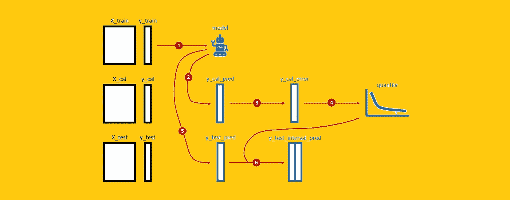
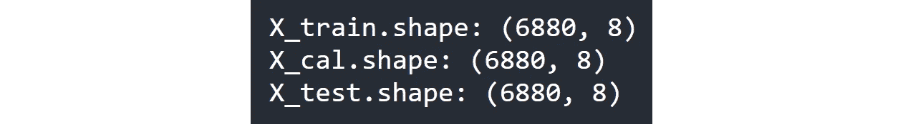
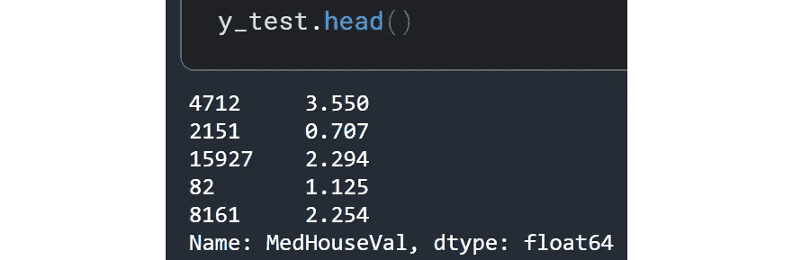
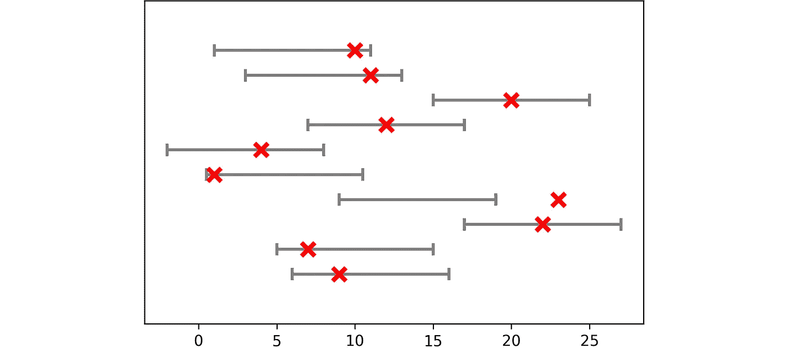
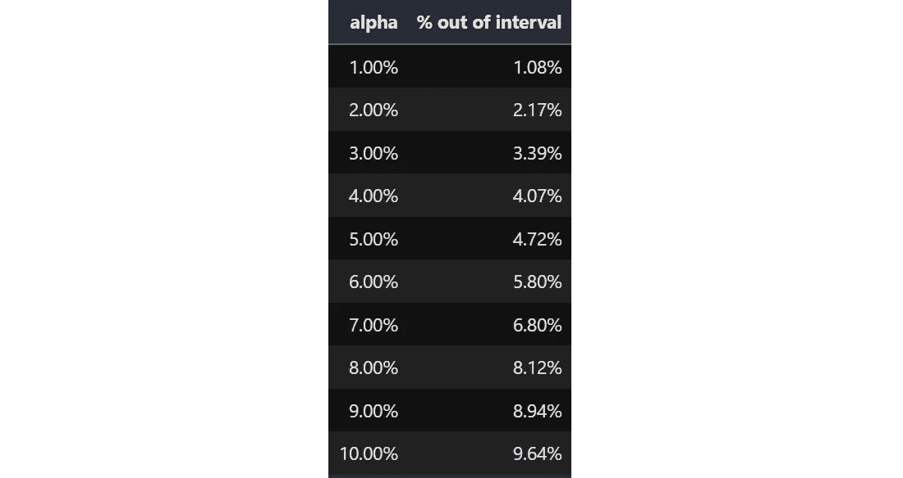
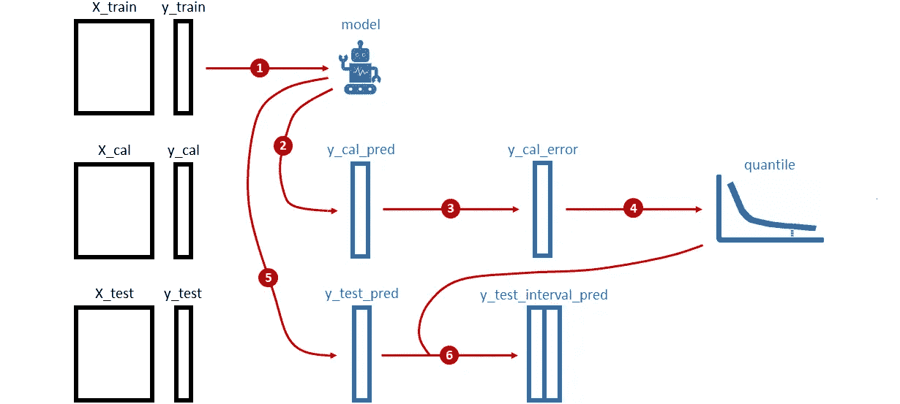
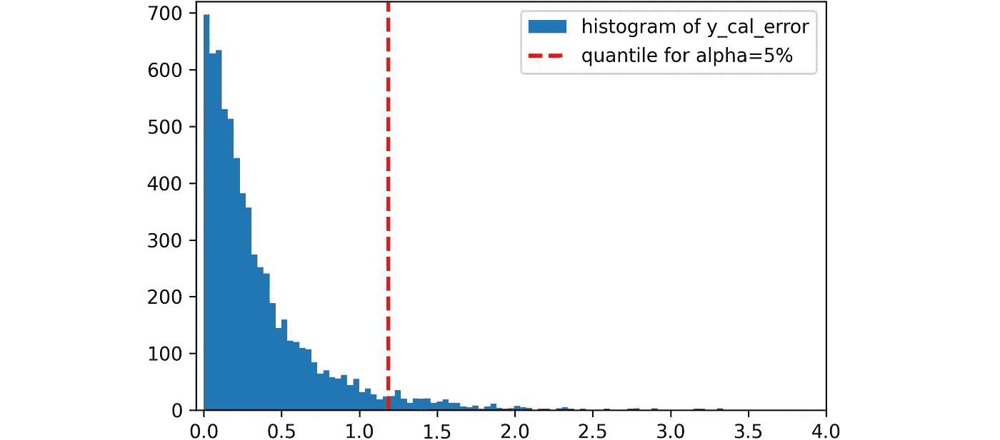
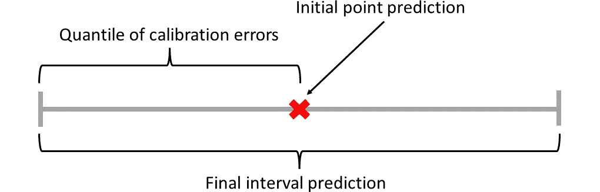
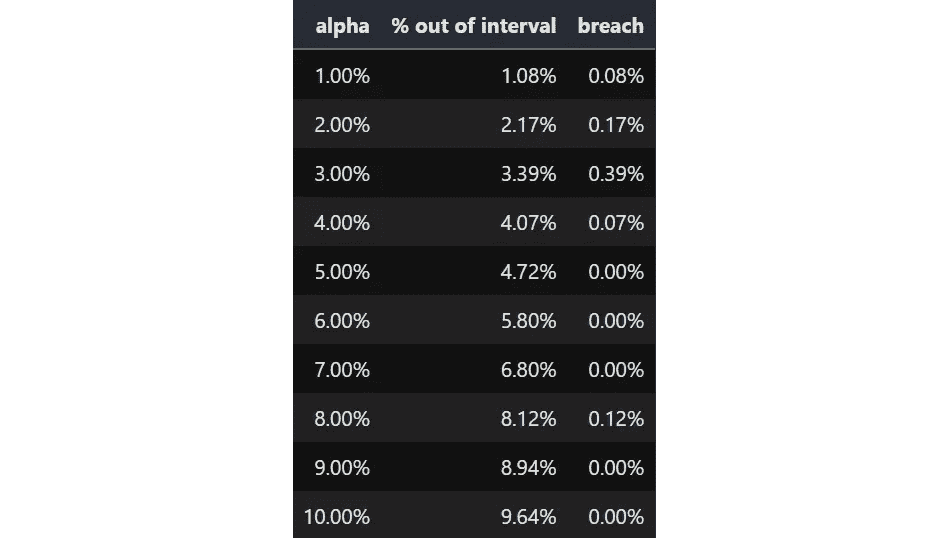
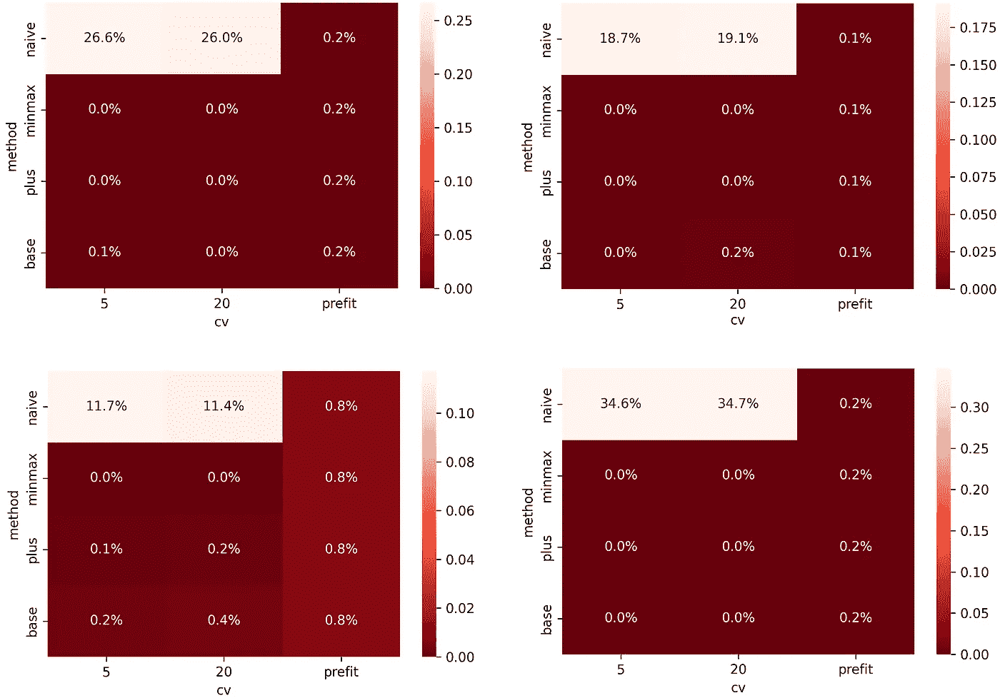

# “MAPIE”准确地解释了你希望别人如何向你解释

> 原文：<https://towardsdatascience.com/mapie-explained-exactly-how-you-wished-someone-explained-to-you-78fb8ce81ff3>

# “MAPIE”准确地解释了你希望别人如何向你解释

## 一个 Python 库，可以将任何模型的预测转化为置信区间



[图片由作者提供]

当您为数值目标变量构建预测模型时，Scikit-learn、XGBoost、LightGBM、CatBoost、Keras 等经典 Python 库会生成**点预测**。不幸的是，

> 点预测总是错的。

事实上，假设您有一个预测旧金山房屋销售价格的模型。该模型已经预测出一栋房子将以 746，632.15 美元的价格出售。这是实际价格的可能性有多大，精确到每一分钱？实际上，零。

知道房子将以 70 万美元到 80 万美元之间的价格出售，有 95%的把握，这要有用得多(也安全得多)。其中 95%的置信度大致意味着——如果我们可以观察所有可能的宇宙——在 95%的情况下，售价实际上在 70 万美元到 80 万美元之间。这被称为**区间预测**。

那么，**我们如何在 Python** 中从点预测得到区间预测呢？这就是 MAPIE 发挥作用的地方。

# 什么是 MAPIE，如何使用它

[MAPIE](https://github.com/scikit-learn-contrib/MAPIE) 是一个用于获取区间预测的 Python 库。名字代表“**模型不可知预测区间估计器**”，其中重要的部分是“模型不可知”。事实上，与分位数回归或贝叶斯推断等更传统的方法相反， **MAPIE 允许您保留您最喜欢的高度精确的模型**。

所以，我们来看看怎么用。为了在一些真实数据上测试 MAPIE，我将使用来自 [StatLib](http://lib.stat.cmu.edu/datasets/) 的加州住房数据集，该数据集可以在 Scikit-learn 中直接获得(在 [BSD 许可](https://github.com/scikit-learn/scikit-learn/blob/main/COPYING)下)。

```
from sklearn.datasets import fetch_california_housing
from sklearn.model_selection import train_test_split**# Get California housing dataset, and split it in 3 sets** X, y = fetch_california_housing(return_X_y=True, as_frame=True)X_train_and_cal, X_test, y_train_and_cal, y_test =
  train_test_split(X, y, test_size=1/3)X_train, X_cal, y_train, y_cal = train_test_split(
  X_train_and_cal, y_train_and_cal, test_size=1/2)
```

重要的是，我们有三组数据:

*   **训练数据**:预测模型学习的数据。
*   **校准数据**:MAPIE 校准间隔的数据。
*   **测试数据**:我们用来评估区间好坏的数据。

在我们的例子中，每个集合由 6，880 个观察值和 8 个特征组成。



数据帧的形状。[图片由作者提供]

目标变量是加州各区的房价中值，以几十万美元表示。



测试集的前 5 个房屋的值。[图片由作者提供]

所以第一栋房子值 35.5 万美元，第二栋房子值 7.07 万美元，以此类推。

现在我们已经准备好了数据，让我们对训练数据拟合预测模型(我将使用 Scikit-learn 的随机森林回归器),对校准数据拟合 MAPIE 回归器。

```
from sklearn.ensemble import RandomForestRegressor
from mapie.regression import MapieRegressor**# Fit model on training data** model = RandomForestRegressor().fit(X_train, y_train)**# Fit MAPIE on calibration data
# Important: calibration data must be different from training data!**
mapie = MapieRegressor(estimator=model, cv="prefit"
  ).fit(X_cal, y_cal)
```

在这一点上，我们可以最终使用 MAPIE 回归器的“预测”方法，它为观察值产生预测间隔(为了方便起见，我将它们存储到 Pandas 数据帧中):

```
import pandas as pd**# Get interval predictions on test data, with alpha=5%** y_test_pred_interval = pd.DataFrame(mapie.predict(X_test, alpha=.05)[1].reshape(-1,2), index=X_test.index, columns=["left", "right"])
```

每个区间由区间的左端和右端定义。例如，这些是测试集的前 5 个观察值的预测间隔:


测试集的前 5 次观察的预测间隔。[图片由作者提供]

# “阿尔法”的含义

如果您查看最后一段代码，您会注意到一个名为`alpha`的参数。如何解读这个参数？`alpha`是**公差**。它回答了这个问题:

> “我们愿意接受多少‘错误’？”

我所说的“错误”是指超出预测区间的观察结果。例如，如果`alpha`设置为 10%，这意味着我们预计不会有超过 10%的观测值超出 MAPIE 预测的区间。



alpha = 10%时的输出示例:10 次观察中有 1 次超出其预测区间。[图片由作者提供]

我们如何确保 MAPIE 预测的区间实际上与容差相匹配？这就是测试集存在的目的。统计`y_test`的观测值落在预测区间之外的次数并与`alpha`进行比较就足够了；

```
out_of_interval = ((y_test < y_test_pred_interval["left"]) | 
 (y_test > y_test_pred_interval["right"])
).sum() / len(y_test)
```

让我们对不同的`alpha`值重复此过程。这是结果:



将 alpha 与超出预测区间的观察值百分比进行比较。[图片由作者提供]

区间外观察值的百分比实际上非常接近`alpha`的相应值。这可能感觉像是魔术，但却出奇的简单！在下一段中，我将向您展示这是如何工作的。

# 引擎盖下的 MAPIE

MAPIE 背后的想法是从模型对一组数据(称为校准数据)产生的错误中学习。一旦我们知道我们应该期望什么样的误差(对于给定的容差)，将它加在点预测的两侧就足够了，以获得一个区间预测。

MAPIE 基本算法包括 6 个步骤:



MAPIE 算法。[图片由作者提供]

这些步骤是:

1.  根据训练数据拟合模型。
2.  对校准数据进行预测。
3.  计算模型对校准数据产生的绝对误差。
4.  从前一点得到的绝对误差分布中得到 1- `alpha`分位数。
5.  对测试数据进行预测。
6.  通过将点 4 获得的分位数与点 5 获得的预测值相减(相加)来计算区间的左(右)端。

我们可以用几行 Python 代码轻松再现该算法:

```
**# 1\. Fit model on training data** model = RandomForestRegressor().fit(X_train, y_train)**# 2\. Make prediction on calibration data** y_cal_pred = model.predict(X_cal)**# 3\. Compute absolute errors made by the model on calibration data** y_cal_error = np.abs(y_cal - y_cal_pred)**# 4\. Get 1-alpha quantile from the distribution of absolute errors
#    Note: this is a single number** quantile = y_cal_error.quantile(q=.95, interpolation='higher')**# 5\. Make prediction on test data** y_test_pred = model.predict(X_test)**# 6\. Compute left (right) end of the interval by
#    subtracting (adding) the quantile to the predictions** y_test_interval_pred_left = y_test_pred - quantile
y_test_interval_pred_right = y_test_pred + quantile
```

这是`y_cal_error`的直方图:



校准误差直方图和α= 5%的分位数。[图片由作者提供]

当`alpha`为 5%时，`quantile`等于 1.18。这意味着随机森林回归器产生的误差在 5%的情况下高于 1.18 亿美元(在 95%的情况下低于 1.18 亿美元)。此时，通过简单地将随机森林所做的预测加上和减去 118k $,就可以获得区间预测:



MAPIE 中点预测与区间预测的关系。[图片由作者提供]

就是这样。如果你已经理解了这段代码，那么**恭喜你:你已经掌握了 MAPIE** 背后的逻辑！

这个库还包含了这个基本算法的一些细微变化，我们将在下一段中看到。

# 其他模式

到目前为止，我们一直在“prefit”模式(`cv="prefit"`)下使用 MAPIE。“Prefit”意味着模型(在我们的例子中是一个随机森林)是预先拟合的。但是，根据我们选择的参数，还有其他的可能性。这是`MapieRegressor`的大致结构:

`MapieRegressor(estimator=model, cv=cv, method=method)`

因此，决定 MAPIE 行为的参数是`cv`和`method`。让我们分别来看:

*   `cv`:交叉验证的折叠次数(除非等于“prefit”，此时不进行交叉验证)；
*   `method`:“幼稚”、“贱”、“加”、“最大化”之一。该参数仅在`cv`不同于“前缀”时使用。“naive”类似于“prefit”，但校准数据与训练数据相吻合。“base”类似于“prefit”，但是预测误差是从交叉验证过程中获得的。“plus”类似于 base，但每个区间都是测试预测的分位数加上验证残差。“最小最大值”类似于“加号”，但是使用了来自交叉验证模型的最小和最大预测值。

这里就不深究各种方法的细节了。我们将在一些真实数据集上尝试它们，看看它们的表现如何。

**我们用来评估 MAPIE 输出质量的标准是与** `**alpha**`的正距离。的确，既然`alpha`被定义为我们愿意接受的错误百分比，那么问题就出在`% out of interval`大于`alpha`的时候。

因此，我们感兴趣的量是:

```
df["breach"] = (df["% out of interval"] — df["alpha"]).clip(lower=0)
```

在上面的示例中，这将是:



将 alpha 与超出区间的观察值百分比进行比较。[图片由作者提供]

因此，**列** `**breach**` **的简单平均值是 MAPIE** 预测的间隔有多差的指标:该数字越高，MAPIE 性能越差。

现在，让我们看看这种方法在不同的数据集上是如何变化的。除了上面引用的加州住房数据集，我还使用了来自 [Pycaret](https://github.com/pycaret/pycaret) 的“帕金森”、“钻石”和“交通”数据集，这是在[麻省理工学院许可](https://github.com/pycaret/pycaret/blob/master/LICENSE)下。



各种数据集的 MAPIE 与 alpha 的平均正偏差(越低越好)。左上:帕金森数据集(Pycaret)。右上:加州数据集(Scikit-learn)。左下角:钻石数据集(Pycaret)。右下角:交通数据集(Pycaret)[图片由作者提供]

请注意，当你使用`cv="prefit"`时，不使用`method`，这就是为什么列`prefit`总是不变的原因。

简而言之，**你要一直避开** `**method="naive"**` **，因为它的表现一直不好**。关于剩下的选项，`method="base"`、`method="plus"`和`method="minmax"`工作得很好，但是你应该考虑到它们是基于交叉验证的，所以如果你处理真正的大数据，它们需要更多的时间。

总的来说，`cv="prefit"`的性能几乎和其他选项一样好，而且速度更快。此外，它在现实生活中更方便，在现实生活中，您已经有一个拟合的模型，并希望从中“提取”区间预测。

# MAPIE 的弱点

我们都知道，直觉上，有些预测比其他的更难。这应该反映在间隔的宽度上。**有理由预期，预测越不确定，区间越大**。

但是 MAPIE，至少是它的基础版本，并不满足这个属性。事实上，为了获得区间，我们在预测中加入和减去了校准误差的分位数。但是分位数是一个数字，因此所有观测值的区间宽度是相同的。

因此，基本上，**这就像你只是估计一个与预测模型相关的区间，然后将它复制粘贴到所有的观察值上**。

当然，使用`method="plus"`或`method="minmax"`，输出间隔将不会有相同的确切宽度。但这只是一种“扰动”，最终的区间不会有实质性的不同。事实上，让我们来看看加州住房数据集的预测区间宽度的分布:


加州住房数据集上 method="plus "(左)和 method="minmax "(右)时预测区间宽度的分布。[图片由作者提供]

正如你所看到的，间隔的宽度没有太大的变化。采取“加”的方法(左):至少 75%的区间在 220k $和 223k $宽之间:它们的宽度几乎相同。

# 外卖食品

MAPIE 是一个 Python 库，用于将模型做出的点预测转化为区间预测。它是模型不可知的，因此您可以保留您最喜欢的 ML 模型，并且仍然具有强大的统计保证，即预测区间符合您设置的容差。

然而，你必须意识到，从根本上来说，间隔的宽度都是一样的。因此，与其为每个观察值估计一个时间间隔，不如只估计一个时间间隔，然后将该时间间隔应用于所有观察值。

如果你想知道如何预测与每次观察相关的风险的“定制”区间，你可以阅读我下面的文章“共形分位数回归”:

[](/how-to-predict-risk-proportional-intervals-with-conformal-quantile-regression-175775840dc4) [## 如何用“共形分位数回归”预测风险比例区间

### 这种算法-由斯坦福大学学者于 2019 年发表-结合了分位数回归和保形预测。这里…

towardsdatascience.com](/how-to-predict-risk-proportional-intervals-with-conformal-quantile-regression-175775840dc4) 

> *感谢您的阅读！我希望你喜欢这篇文章。如果你愿意，* [*在 Linkedin 上加我*](https://www.linkedin.com/in/samuelemazzanti/) *！*