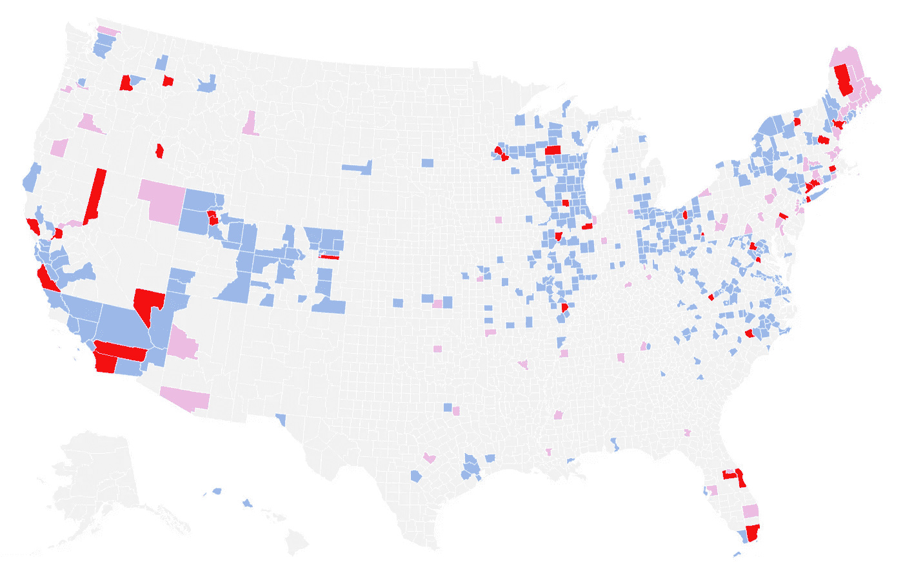

# 绘制新型冠状病毒污水覆盖率图

> 原文：<https://towardsdatascience.com/mapping-sars-cov-2-wastewater-coverage-48bff31e4e92>

## 数据工程创建美国县水测试繁荣图。包括 pandas set()操作。



作者图片

# 背景

废水(下水道)数据可用作新冠肺炎病例的早期预警。这是一项[开发良好的](https://www.science.org/content/article/pandemic-signals-sewer-what-virus-levels-wastewater-tell-us)技术，可以对废水中的新型冠状病毒 RNA 片段进行计数，将计数与同一区域先前的值进行比较，以检测增加/减少，甚至可以对 RNA 进行测序，以确定病毒变体。

美国两套最全面的废水追踪数据由 [CDC 国家废水监测系统(NWSS)](https://www.cdc.gov/healthywater/surveillance/wastewater-surveillance/wastewater-surveillance.html) 和 [Biobot Analytics](https://biobot.io) 汇编和保存。(在美国还有其他更本地化的数据源，如州或大学。)

但是看着原始的 CDC 和 Biobot 数据集可能会令人沮丧。它们具有不同的布局，使用联邦信息处理标准(FIPS)县代码而不是可读的名称，并且没有按照位置的逻辑顺序排列。很难看出它们是否包含您想要查找的县，也很难判断特定的县是在一个文件中还是在两个文件中(或者都不在)。而且它们一点也不直观:美国的哪些地区在数据中得到了很好的体现，哪些地区被遗漏了？

我最近完成了一个数据工程项目来回答这些问题。目标是:

*   在每个数据集中创建按字母顺序排列的县列表。
*   创建按字母顺序排列的县列表，这些县与两个源重叠并跨越两个源-交叉点和联合点。
*   制作美国的互动地图，显示每个县的废水数据集。使用颜色编码快速查看数据稀疏的区域。

由于数据集和县覆盖范围经常变化，我将每周重新运行此代码并更新地图。

# 数据工程

这个项目的 [Python/pandas 代码](https://github.com/ChuckConnell/covid19_wbe/blob/main/make_county_ww_lists.py)直观上很简单:删除除 FIPS 县代码之外的所有关于水测试的信息；添加可读的州县名称；使用 Python set()操作创建县列表；并输出一个包含该信息的文件，该文件将成为地图的输入。当然，大多数应该简单的编程项目都有一两个缺点，这一个也不例外。

为了删除我们不关心的许多列数据，pandas 提供了两个选项:列出要删除的字段或要保留的字段。在这种情况下，后者要容易得多。

```
NwssDF = NwssDF[["county_fips"]]  # don't need any other columnsBiobotDF = BiobotDF[["fipscode"]]  # don't need any other columns
```

NWSS 数据集有一个棘手的问题。county_fips 字段有时包含不止一个 fips 代码，例如`"['08013', '08123']"`。在关系数据库术语中，这违反了第一范式。就我们的目的而言，这种格式使得不可能将文件与任何其他由 FIPS 代码键入的数据相结合。

修复方法是分解这些行，使每一行只有一个 FIPS 代码，然后清除周围的字符。

```
NwssDF["county_fips"] = NwssDF["county_fips"].str.split(",")

NwssDF = NwssDF.explode("county_fips") NwssDF["county_fips"] = NwssDF["county_fips"].str.strip("[]' ") 
```

Biobot 数据集还包含一个问题，即它抑制了 FIPS 代码中的前导零。所以数据中有`9001`为费尔菲尔德 CT，而不是正确的`09001`。Biobot 已经承诺解决这个问题，但在此之前，这个代码解决了这个问题。

```
BiobotDF.loc[BiobotDF["fipscode"].str.len() == 4, "fipscode"] = \
"0" + BiobotDF["fipscode"] 
```

使用 FIPS 代码连接/合并包含可读字符串`STATE | COUNTY | FIPS`的字段，这在县列表和地图上非常有用。如何做到这一点的细节在源代码和我最近关于 [FIPS 代码和县名](/the-ultimate-state-county-fips-tool-1e4c54dc9dff)的文章中。

使用 Python set()操作获取各种县集:

```
all_counties = set(AllCountiesDF["STATE_COUNTY_FIPS"])
biobot_counties = set(BiobotDF["STATE_COUNTY_FIPS"])
nwss_counties = set(NwssDF["STATE_COUNTY_FIPS"])biobot_nwss_union = biobot_counties.union(nwss_counties)biobot_nwss_intersection = \ biobot_counties.intersection(nwss_counties)biobot_only = biobot_counties.difference(nwss_counties)nwss_only = nwss_counties.difference(biobot_counties)missing_counties = all_counties.difference(biobot_nwss_union)
```

使用 sorted()函数将集合写入输出文件，该函数将集合转换为按字母顺序排列的列表，并使用*运算符分隔列表以进行打印。比如:

```
with open(BIOBOT_LIST_FILE, 'w') as f:
    print(*sorted(biobot_counties), file=f, sep="\n")
```

从而产生可读的县文件: [NWSS](https://github.com/ChuckConnell/covid19_wbe/blob/main/nwss_counties.txt) 、[生物机器人](https://github.com/ChuckConnell/covid19_wbe/blob/main/biobot_counties.txt)、[仅 NWSS](https://github.com/ChuckConnell/covid19_wbe/blob/main/nwss_only_counties.txt)、[仅生物机器人](https://github.com/ChuckConnell/covid19_wbe/blob/main/biobot_only_counties.txt)、[交集](https://github.com/ChuckConnell/covid19_wbe/blob/main/biobot_and_nwss_counties.txt)、[联合](https://github.com/ChuckConnell/covid19_wbe/blob/main/biobot_or_nwss_counties.txt)、[缺失](https://github.com/ChuckConnell/covid19_wbe/blob/main/missing_counties.txt)(不在 NWSS 或生物机器人)。

最后，创建一个数据帧和输出文件，它将被[输入到地图](https://github.com/ChuckConnell/covid19_wbe/blob/main/wbe_coverage_map.tsv)。

```
MapDF = AllCountiesDF # copy of DF with all US countiesMapDF["WBE_WHO"] = "none" # default for "who has wastewater data"MapDF.loc[MapDF["STATE_COUNTY_FIPS"].isin(biobot_only), 
"WBE_WHO"] = "biobot"  # Biobot onlyMapDF.loc[MapDF["STATE_COUNTY_FIPS"].isin(nwss_only), 
"WBE_WHO"] = "nwss"  # NWSS onlyMapDF.loc[MapDF["STATE_COUNTY_FIPS"].isin(biobot_nwss_intersection), 
"WBE_WHO"] = "biobot-nwss"  # bothMapDF = MapDF.rename(columns={"CountyFIPS":"FIPS"}) 
# to match Flourish naming

MapDF.to_csv(MAP_FILE, encoding='utf-8', sep='\t', index=False)
```

# 制作地图

制作地图的大部分工作是由 fluore 软件完成的，该软件提供了一个非编程接口来创建可视化效果，包括地图。Flourish 已经有了美国各县的几何图形，用颜色代码填充区域的简单设置，以及当用户悬停在某个区域上时自动弹出的窗口。

下面是如何创建我制作的同样的地图，你可以随意修改…

1.  在[https://fluid . studio](https://flourish.studio)创建一个帐户。
2.  创建新的可视化效果。向下滚动到美国各县，并选择它作为您的起点。在左上角给你的地图命名。
3.  转到预览/点层，并禁用它。如果需要，您也可以删除数据/点处的所有相关数据。
4.  转到数据/区域，删除名称、标签、值和组的现有列条目。您将为这些分配新的值。
5.  在数据/区域中，删除除几何图形和 FIPS 之外的所有列。现在，您的地图已缩减为仅包含县轮廓，可以接收废水数据了。
6.  将上传选项更改为上传数据并合并。上传/合并您在上面创建(或复制)的地图数据文件。确保现有数据和传入数据的合并列都是 FIPS。
7.  在数据/区域中，设置几何=几何列(可能是 A)；name = STATE _ COUNTY _ FIPS 列(大概是 C)；和值= the 世卫组织列(可能是 D)。
8.  在预览/区域中，设置比例类型=分类。选择调色板。(我使用了带有十六进制颜色值的自定义覆盖，但这不是必需的。)
9.  在预览/页脚中，设置数据源名称和 URL。
10.  在“导出和发布”中，您可以将地图发布到 fluorescent 服务器上并获取其公共 URL，和/或下载 PNG 或 JPG 格式的图像文件。

# 未来的工作

这项工作的两个有价值的扩展是:

*   在美国添加更多的县。看到整个国家的地图都充满了废水追踪，这将是一件很棒的事情，水测试结果将成为未来新冠肺炎病例的可靠预测器，以及它们将在哪里发生。疾控中心正在积极开展这项工作，覆盖的县的数量逐月增加。
*   添加更多来自全球的国家。有两个项目(引用如下)正在跟踪国际废水测试，它们覆盖的国家数量正在稳步增加。然而，这项工作的一个重要组成部分是为所有国际测试结果创建一个单一、统一的数据集，以便于分析和可视化。

# 欲了解更多信息

https://biobot.io/data/[(生物机器人数据)](https://biobot.io/data/)

[https://Data . CDC . gov/Public-Health-supervision/NWSS-Public-新型冠状病毒-废水-数据/2ew6-ywp6](https://data.cdc.gov/Public-Health-Surveillance/NWSS-Public-SARS-CoV-2-Wastewater-Data/2ew6-ywp6) (疾控中心 NWSS 数据)

[https://ucmerced . maps . ArcGIS . com/apps/dashboards/c 778145 ea 5 bb 4 daeb 58d 31 afee 389082](https://ucmerced.maps.arcgis.com/apps/dashboards/c778145ea5bb4daeb58d31afee389082)和 https://sphere.waterpathogens.org/map(国际废水地图)

https://twitter.com/COVIDPoops19(关于加州大学默塞德分校废水的热门推特消息)

[https://help.flourish.studio/category/10-flourish-basics](https://help.flourish.studio/category/10-flourish-basics)(蓬勃发展入门)