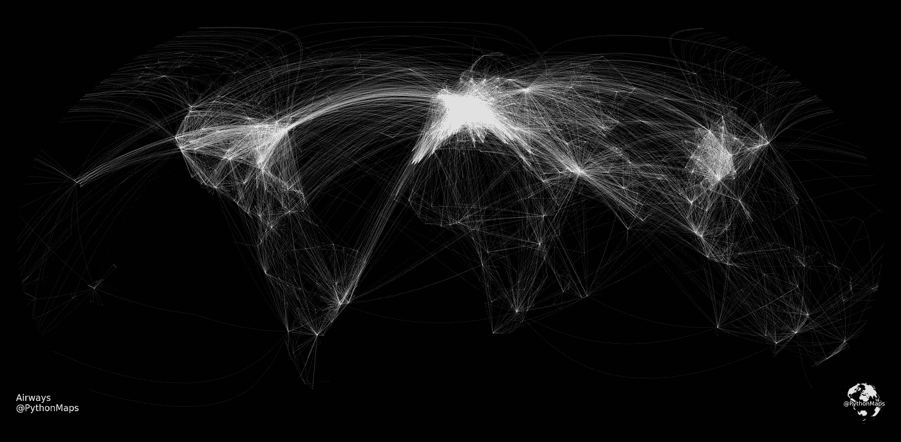
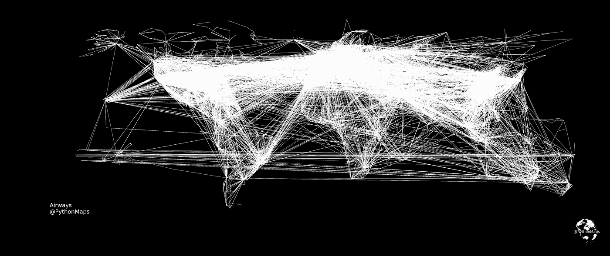
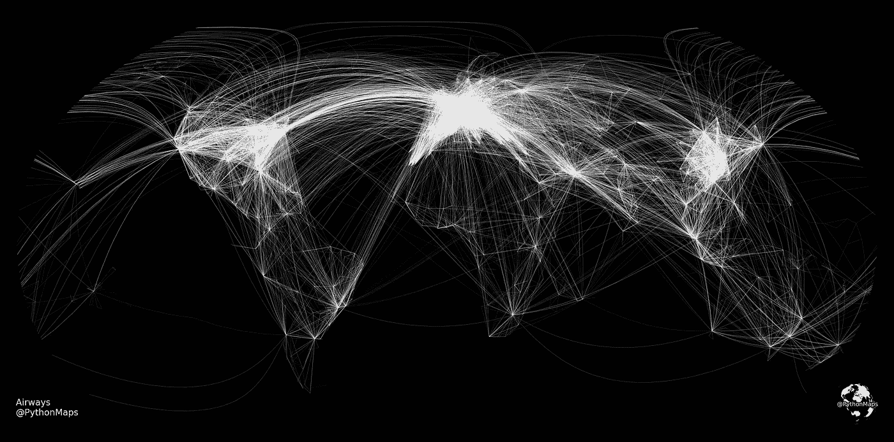

# 用 Python 绘制世界飞行路线

> 原文：<https://towardsdatascience.com/mapping-the-worlds-flight-paths-with-python-232b9f7271e5>

## 用 Python 可视化连接世界各大洲的飞行路线

图片作者。

由于 covid 航空旅行在过去两年中明显减少，但它正显示出恢复昔日辉煌的迹象。2019 年，据估计，飞机运送的乘客总数达到 45 亿，创下历史新高。尽管如此，这些飞机的航线可能与大多数人的想法相去甚远，但想象和了解热门航线在哪里、涉及哪些国家以及国际旅游枢纽在哪里是很有趣的。在本教程中，我将解释如何使用开源数据和 Python 生成显示世界航线的醒目地图。这是一个数据操作和数据可视化的练习，你应该对像`Pandas`、`GeoPandas`、`Matplotlib` 和`Shapely`这样的库有更好的理解。

## 数据探索

数据来自于 [openflights](https://openflights.org/data.html) 数据库，并且可以在[数据库内容许可](https://opendatacommons.org/licenses/dbcl/1-0/)下获得。简而言之，这意味着欢迎你按照自己的意愿使用这些数据，当且仅当你*和*都承认来源*和*并以免费许可的方式许可任何可供公众使用的衍生作品。

这种观想是一种数据操作的练习。openflights 数据库(这个数据库可能有点牵强)在一个文件中提供了一个机场列表，在另一个文件中提供了每个机场之间的航线数量明细。因此，数据集不包含每条路线的具体坐标，这是我们需要自己推导的。在一个理想的世界中，我们将拥有由一年中飞行的每架飞机的位置更新组成的飞行数据，并且我们可以构建该数据的 2D 直方图来展示飞行路径。不幸的是，这个数据很难得到，所以我们不得不凑合着用一个机场列表和每个机场之间的航线数量。我们的目标是创建一个描述每条路线的线串地理数据框架。我们据此做出的假设是，飞机直接从一个机场飞到另一个机场。

第一个数据集是机场数据。该数据包含机场及其位置的列表以及一些其他信息。总共有 7608 个独特的机场。重要的是要注意机场`iata`，它是每个机场的唯一标识符，以后将用于在路线中链接机场。

可以将数据绘制成散点图，以显示世界上机场的位置，或者至少是包含在该数据集中的机场的位置。像往常一样，在全球范围内，这张地图很大程度上只是成为了人口密度的一个代理，但看到世界机场的分布仍然很有趣。

根据 openflights 数据库的世界机场位置。图片作者。

第二个数据集是包含路由列表的 csv。这些航线采用`iata`对的形式，连接源机场和目的地机场。

## 数据操作

我们想要操作我们的数据，以便我们有一个`Linestrings`的`DataFrame`来连接每条路线的源机场和目的地机场。我们将采用的为每条路线创建`LineStrings`的方法如下。

1.  创建一个重复的机场`DataFrame`，将一个标记为来源，一个标记为目的地。
2.  使用路线来源`iata`代码将来源`DataFrame`与路线合并。
3.  使用路线目的地`iata`代码将目的地`DataFrame`与路线合并。
4.  使用现在合并到路线`DataFrame`中的源机场和目的地机场的纬度和经度值创建一个代表该路线的`LineString`。

下面我们复制了最初的机场`DataFrame`，并给其中一个机场的列标上了`_source`和`_destination`。

这两个`DataFrames`然后与路线`DataFrame`合并，以给出具有目的地和源机场的纬度/经度值的`DataFrame`。注意下面显示的列，每条路线有四列，`lat_source`、`long_source`、`lat_destination`和`long_destination`。

然后使用`shapely.geometry.LineString`方法，用这些值为每条路线生成一个带有`LineStrings`的`GeoDataFrame`。这需要一个纬度和经度对的列表，并创建一条连接这些点的线。

## 数据可视化

这些数据现在可以绘制成航线图。不幸的是，不可能简单地按原样绘制数据，因为在绘制线条时需要考虑地球的曲率。下面的地图显示了每个机场之间的直线，这是不正确的。

不考虑地球曲率的世界飞行路线。图片作者。

`Cartopy`可用于操纵线条的绘制方式。`transform=ccrs.Geodetic()`方法转换`LineStrings`来解释地球的曲率。我还将投影更改为罗宾逊投影，因为这是绘制全球数据集的更现实的方法之一，说明了地球不是平的这一事实。我还把`alpha`的值降低到 0.1，让它看起来更清晰一点。

瞧。世界飞行路线。图片作者。

# 结论

我们有它，一个美丽的地图显示了如何产生引人注目的数据可视化显示世界航线。这是计划展示如何使用 Python 使地理空间数据看起来令人惊叹的许多文章中的第一篇，请订阅以便您不会错过它们。我也喜欢反馈，所以请让我知道你会如何做不同或建议改变，使它看起来更棒。我每周都会在我的推特账户上发布数据可视化，看看地理空间数据可视化是不是你的菜【https://twitter.com/PythonMaps 

medium 提供的额外收入确实有助于这个项目继续进行，所以如果你是一个粉丝，想取消你的帐户，然后用我的推荐重新注册，那就太好了。[https://pythonmaps.medium.com/membership](https://pythonmaps.medium.com/membership)