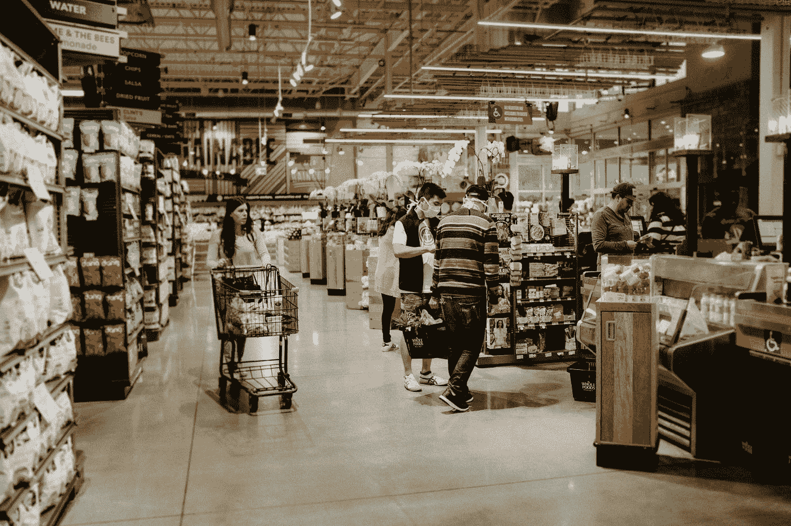
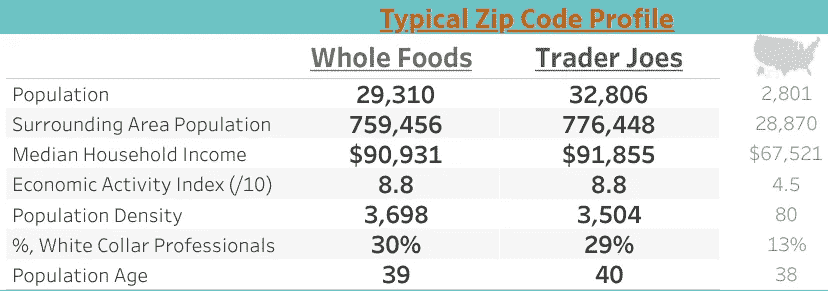
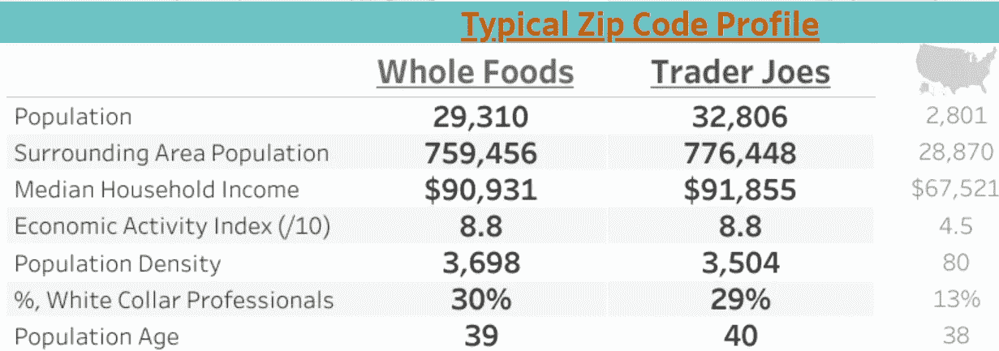
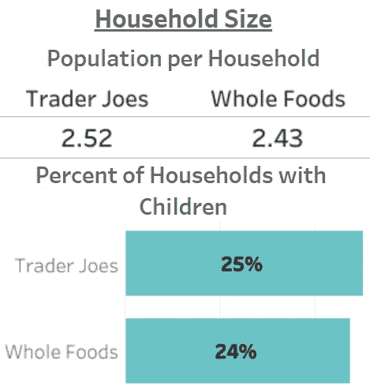
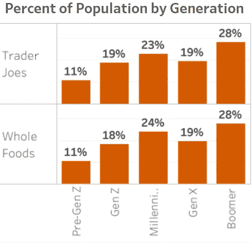
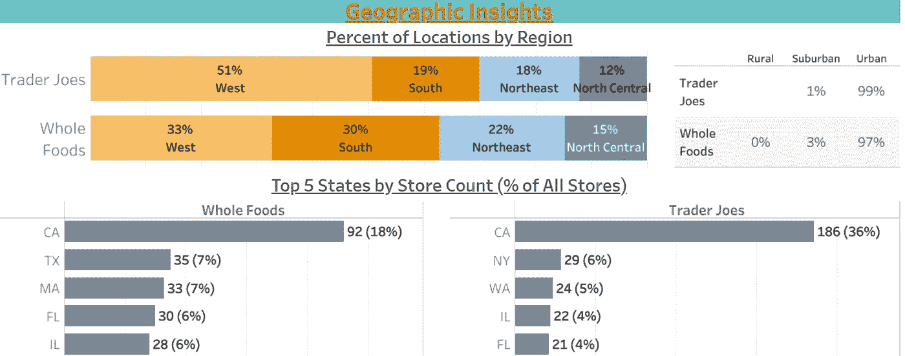
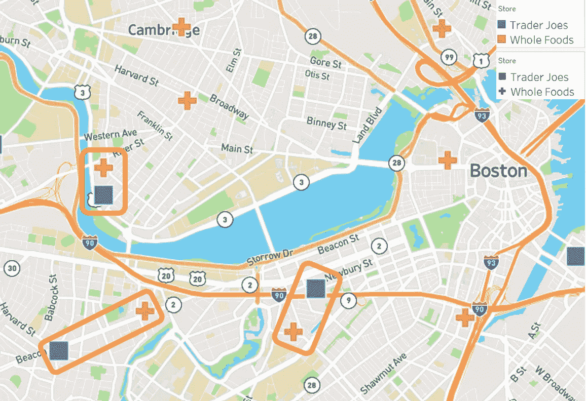

# 描绘你最喜欢的高端连锁杂货店

> 原文：<https://towardsdatascience.com/mapping-your-favorite-high-end-grocery-chains-5fe3d234cfd4>

# 描绘你最喜欢的高端连锁杂货店

## 全食超市 vs. Trader Joes:他们的选址策略有多大不同？

布里塔尼·伯恩斯在 [Unsplash](https://unsplash.com?utm_source=medium&utm_medium=referral) 拍摄的照片

多年来，我在 Trader Joes 购物，喜欢他们低成本、自有品牌的销售方式。我不想要 14 种不同大小、价格和成本的花生酱。我想要一种成分干净的。交易者 Joes 比周围任何人提供的都好。

我也“避开”全食超市，因为它是不适合我的高端、昂贵的连锁店。在我看来，尽管这两家商店在很多方面很相似，但它们服务于两种不同的受众。然后我查看了数据，注意到他们选择商店的地点有显著的相似之处。事实上，他们的“典型”商店邮政编码几乎没有明显的区别。请亲自查看下面的数据。

商店邮政编码的中值。右手边是全国基准。作者图片

即使我知道这是一个相似的观众，我没有意识到这是相似的。看看这两家商店的人口、收入和年龄有多接近，以及它们与全国基准相比如何。

那么，知道了以上，数据能告诉我们这两个品牌的位置是什么呢？更重要的是，数据*不能*告诉我们什么，我们在哪里可以依靠我们的知识和直觉得出比数据本身更好的结论？

*想自己对比数据？* [*查看本交互可视化*](https://jordanbean.com/compare-brands-1) *。*

# 数据告诉我们的是

数据告诉我们，这两个品牌都位于人口和收入高的城市和郊区——这并不是一个惊人的见解或意外。让我们更仔细地看看典型的邮政编码人口统计。

典型(中值)邮政编码概况；图片作者。

一个典型的邮政编码地区的人口大约是全国基准的 10 倍。周围地区的人口(距邮政编码中心约 10 英里)几乎是基准的 30 倍，人口密度也比基准高出许多倍。这表明这些地点位于人口稠密的城市地区及其周围。典型的家庭收入比国家基准高出 35%——这也不足为奇。

*经济活动指数*是一项定制措施，旨在了解通常会吸引客流量的区域中其他企业的存在(如零售机构、健身房、餐馆等)。).接近 10 的数字表明一个地区有更多的经济活动，而接近 0 的数字表明该地区有更少的消费企业(想想一个更农村或住宅区)。两家公司都位于经济高度活跃的地区。这符合我(有限的)经验——它们通常位于购物中心或繁华的商业区。

“白领”工作(专业、管理、科学等)的就业百分比。)是全国基准的两倍多，这可能也与收入有关。典型年龄符合国家基准。

典型的家庭规模；作者图片

在这些企业经营的邮政编码区，大约有四分之一的家庭有孩子，两者的平均家庭规模都在 2.5 左右。与全国 28%的有孩子家庭(每户 2.7 人)相比，这些数字略低于平均水平。虽然范围很广，但我们可以说它们的位置稍微有利于没有孩子或只有一个孩子的两人家庭。

逐代人口；作者图片

就一代人而言，千禧一代的比例高于全国基准(约 20%)——这与早期关于家庭规模的调查结果一致。不是所有的千禧一代都到了做父母的年龄，也不是所有的千禧一代都选择在这个阶段做父母，所以看到更高比例的千禧一代和更小的家庭规模似乎是合适的。

全食超市和贸易商在热图上的位置；作者图片

最后，我们开始看到两个品牌在地理位置上的差异。如果我们仔细观察，我们可以看到全食超市在东北部和中西部(主要在芝加哥周围)的商店(暗红色)更集中，而 Trader Joes 往往在南加州更集中。

事实上，数据证明了这一点。这是在分析的数据中两个商店之间唯一真正的区别 Trader Joes 大约有一半的位置在西部地区，相比之下 Whole Foods 只有大约 33%。Whole Foods 的商店更多地分布在美国各地，而 Trader Joes 的商店更多地集中在西部(或者更恰当地说，在加利福尼亚州，占西部地区商店的大约 70%)。

# 数据没有告诉我们的是

在之前的分析中，我们研究了 [Target 和沃尔玛](https://jordanbean.medium.com/comparing-location-strategies-walmart-vs-target-d2bb00c9c7b3)以及它们的位置对其战略的影响。差异是清晰而明显的——目标位于周围客户群更富裕的城市及其周边的高密度区域。沃尔玛位于更多的郊区和农村地区，密度较低，收入低于平均水平。这些商店针对不同地区的不同顾客。

在没有更好了解的情况下，数据可能表明全食超市和 Trader Joes 瞄准了同一地理概况内的相同客户，有时在该国略有不同的地区。毕竟，数据清楚地表明了这两个品牌之间的相似之处。

在这里，我们可以开始深入思考这种情况，进一步理解它们之间的区别。我们可以用自己的经验、知识和直觉来补充数据，并得出比数据或自己的经验更好的结论。

在我看来——在没有数据支持的情况下——我会说，在相同的人口统计中，Trader Joes 的目标客户是想要健康食品的价格敏感型客户，而 Whole Foods 的目标客户是愿意为优质食材付费的健康敏感型客户。这两个客户群可以存在于同一个地点及其周围——事实上，他们经常没有重叠，我想你可以将这些商店定位在彼此靠近的地方，而不会互相蚕食。

以马萨诸塞州波士顿为例，虽然全食超市的数量越来越多，但该市 Trader Joes 的四个地点中有三个离全食超市很近，这表明地理距离并不总是限制靠近另一家类似企业。换句话说，了解你的目标客户——以及你的竞争对手——超越产品系列和人口统计资料，可以让你找到另一个类似的企业，同时两者都取得成功。

波士顿市中心 Trader Joes 和 Whole Foods 的位置；作者图片

位置数据(包括人口统计和附近的兴趣点)可以让我们清楚地了解谁住在一个地区，以及哪些其他类型的企业将该地区称为家。

然而，位置智能只是选址这个复杂等式的一部分。企业投入大量的时间、精力和资源来选择合适的地点。数据可以也应该成为讨论的一部分。不仅仅是孤立的数据——人口、收入、年龄等单一数据点。—但数据在上下文中(它与地方和国家基准相比如何？)和有方向的数据(它如何符合你的策略？根据你的产品和公司，谁是你的目标人群？我们能找到他们居住的地区吗？)将信息从数据转换为见解。

数据很少能帮你做决定，这个例子也不例外。然而，它可以将你的搜索范围从较大的地理区域缩小到较小的地理区域，从而更有效地利用你的时间和资源，此外还可以描绘出一个网站或地区的更完整的画面(你的竞争对手在哪里？附近还有哪些其他类型的企业，尤其是那些与您的企业互补的企业，比如距离餐馆仅几步之遥的冰淇淋店？).

*有兴趣谈论位置数据&情报？在 jordan@jordanbean.com 给我发邮件或者在 LinkedIn 上联系我。*

*想自己下载数据？全食商店* [*的数据在这里*](https://www.kaggle.com/datadote/whole-foods-store-locations-april-2021) *，* [*的交易员 Joes 在这里*](https://www.kaggle.com/evansimpson/trader-joes-locations) *，还有美国人口普查局的人口统计数据。*