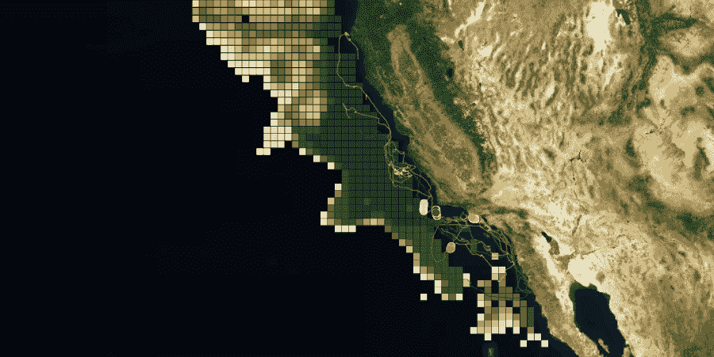
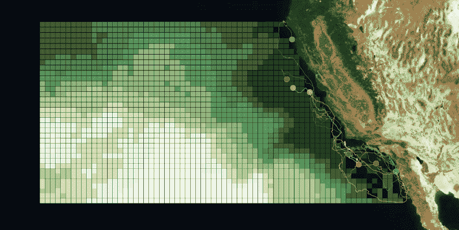
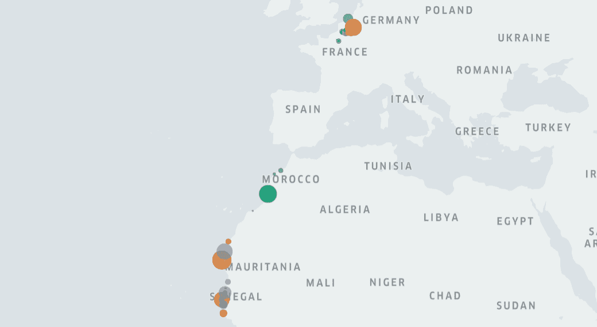
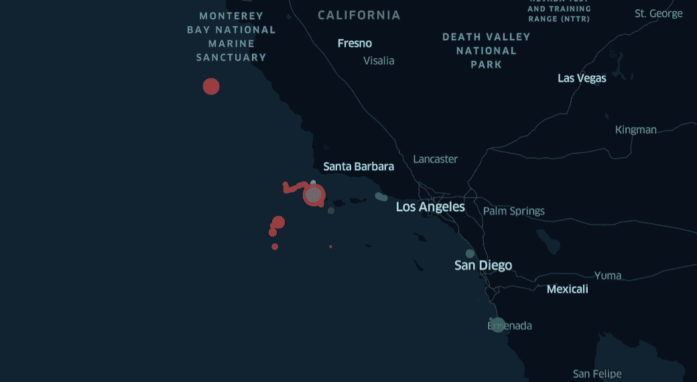

# 具有实时浮游植物热点的野生动物监测系统

> 原文：<https://towardsdatascience.com/marine-wildlife-monitoring-system-with-real-time-phytoplankton-hotspots-9b361dbd2d13>

## “海洋野生动物跟踪器”v0.2 版简介

图片由作者提供。蓝鲸的运动和十月浮游生物热点[1]

**“海洋野生动物跟踪器”**是由 [GIS4 野生动物运动分析](https://www.gis4-wildlife.com/)开发的地理框架，将于 2022 年 4 月在海洋保护项目中实施。由于 Argos 卫星的实时反馈，该框架能够以接近实时的方式检索野生动物跟踪数据集。野生动物的运动可以显示为动画，它可以包括直接来自数据库的历史数据集，该数据库具有无限的存储空间(由于 Movebank 而免费)。此外，它还与哥白尼海洋服务中心有联系，可以检索海洋生物地球化学和物理变量的数据集。其目的是为海洋科学家提供一种工具，支持海洋野生动物的保护、海洋保护区(MPAs)的评估和轨迹的运动分析(这要归功于后端移动的熊猫)

*GIS4 野生动物运动分析*提供个人定制平台。用户可以包括他们自己的分析算法和他们自己的补充数据集，如特殊位置或限制。“海洋野生动物追踪器”产品的特别之处在于，它有一个**报警系统**，可以向用户的个人手机警告海洋野生动物面临的威胁。此外，该框架可以作为 web 地图嵌入，并可以显示野生动物跟踪期间的实时运动。

查看使用海洋野生动物追踪工具制作的在线网络地图产品:

> [一月份大鲸鱼迁徙和浮游植物热点](https://gis4-wildlife.github.io/PhytoplanktonGallery-BlueCloud/root/index_January_hotspot.html)

“海洋野生动物追踪器”使用凭据工作，并提供对用户数据集的安全访问。一旦在海洋保护项目中实施，该软件只需要根据用户对可视化和警报系统配置的反馈进行维护。

## 蓝色经济模式的解决方案

GIS4 野生动物的蓝色经济模式旨在向更多用户开放平台。一旦该软件在 2022 年进行测试，那么它将被部署到网上，供更广泛的社区使用。该平台旨在与专注于保护的机构合作，帮助其保持在线。我们的愿景是在全球范围内实现这一目标。

图片由作者提供。2018 年浮游植物的年度变化和蓝鲸的运动轨迹[1]

## 请继续关注进展

如果你愿意跟踪“海洋野生动物跟踪 v0.2 Pro”的进展，你可以订阅时事通讯。它将概述该平台是如何开发和实施的。

查看简讯: [**GIS4 野生动物简讯**](https://www.gis4-wildlife.com/blog)

图片由作者提供。野生动物追踪者肖像。

## 代码

后端分析已经发表在地理空间数据科学的短文中，这些短文提供了一些特定情况下的编码工作流。该解决方案不仅适用于海洋动物，也适用于鸟类等不同物种。在这里查看一些关于产品如何在后台工作的代码:

**黑背海鸥迁徙期间寻找筑巢地**

本文是理解*停止检测算法*如何工作以及如何配置其参数的关键。

  

GBIF.org(2021 年 3 月 15 日)*全球定位系统追踪北海南部海岸繁殖的小黑背鸥和银鸥*[https://doi.org/10.15468/dl.6vsh8k](https://doi.org/10.15468/dl.6vsh8k)

**在蓝鲸的活动中发现觅食点**

本文可能有助于在您自己的工作流程中自动化*停止检测算法*。它使得算法参数的配置更容易，并帮助用户做更多的测试。

 [## 蓝鲸 GPS 追踪中的停止检测—移动熊猫 0.6

towardsdatascience.com](/stop-detection-in-blue-whales-gps-tracking-movingpandas-0-6-55a4b893a592) 

Irvine LM、Palacios DM、Lagerquist BA、Mate BR、Follett TM (2019)数据来自美国加利福尼亚附近的*蓝鲸和长须鲸的摄食行为，以及对猎物斑块的影响。* Movebank 数据仓库。DOI: 10.5441/001/1.47h576f2

**可视化阿德利企鹅在南极洲的活动**

这篇文章支持动物追踪数据集在两极的可视化:南极和北极。它给出了关于将空间数据投影到正投影坐标参考系统的说明。

  

> 在这张网络地图中查看[阿德利企鹅的动向](https://gis-move-analytics.github.io/wildlife-tracker/root/moves-penguins-demo.html)

该实验可视化显示了动物运动期间的*停止检测算法*。这有助于理解冰冻海洋上的觅食活动。

> 检查阿德利企鹅动作中的[停止检测](https://gis-move-analytics.github.io/wildlife-tracker/root/foraging-penguins-demo.html)

**按年份过滤巨头鲸迁徙路线**

本文介绍了如何根据 GPS 轨迹创建线串几何。然后，它给出了按年份过滤的鲸鱼迁徙路线。

  

> 查看本网络地图中的[巨头鲸迁徙路线](https://gis-move-analytics.github.io/wildlife-tracker/root/azores-demo.html)

**发现决定不迁徙的巨头鲸的觅食活动**

本文旨在利用*停止检测算法*发现觅食活动，并参考 Silva 等人(2013)。算法的使用是实验性的，结果的验证需要海洋科学家的批判性观点。但是，该分析与研究杂志的结论相吻合，所以这篇文章展示了可以用来洞察鲸鱼迁徙的其他方法。

  

> [在网络地图中停止探测巨头鲸的迁徙](https://gis-move-analytics.github.io/wildlife-tracker/root/azores-II-demo.html)

## 结论

GIS4 wildlife 提供了一个地理框架“海洋野生动物跟踪器”,旨在支持海洋保护、海洋保护区评估和运动分析。这一想法是在基于赞助的蓝色经济模式下工作，其愿景是向海洋科学界开放。

关于代码使用的文章展示了与出版的研究期刊的结论相匹配的内容。它们主要代表使用*停止检测算法*的教程和实验，结果的验证需要海洋科学家、生物学家、鸟类学家等的批判性观点。代码文章旨在提供有关“海洋野生动物跟踪器 v0.2 Pro”如何使用以及它如何支持野生动物跟踪项目中的研究和洞察力发现的可见性。

成为这个鼓舞人心的项目的一部分，支持海洋保护。如果你需要进一步的交流，请在这篇文章中留言或者在我们的网站上直接交流。

## 数据许可证

本文中可视化的数据集在 attribute 4.0 International([CC BY 4.0](https://creativecommons.org/licenses/by/4.0/))和 [CC0 1.0 Universal](https://creativecommons.org/publicdomain/zero/1.0/legalcode) 下获得许可。

## 参考

[1] Irvine LM、Palacios DM、Lagerquist BA、Mate BR、Follett TM (2019)来自美国加利福尼亚州附近*的蓝鲸和长须鲸摄食行为的数据，以及对猎物斑块的影响。* Movebank 数据仓库。DOI: 10.5441/001/1.47h576f2

[1] Sauzede R .、H. Claustre、J. Uitz、C. Jamet、G. Dall'Olmo、F. D'Ortenzio、b .根蒂利、A. Poteau 和 C. Schmechtig，2016:一种基于神经网络的方法，用于合并海洋颜色和 Argo 数据，以将表面生物光学特性扩展到深度:颗粒后向散射系数的检索，J. Geophys。海洋资源，121，doi:10.1002/2015JC011408。从[蓝云虚拟实验室](https://www.blue-cloud.org/vlabs/zoo-and-phytoplankton-eov-products)获取的浮游植物产品

环境署-WCMC 和自然保护联盟(2022 年)，[受保护的星球](https://www.protectedplanet.net/en/thematic-areas/wdpa?tab=WDPA):世界保护区数据库(WDPA)和其他有效的区域保护措施世界数据库(补充)