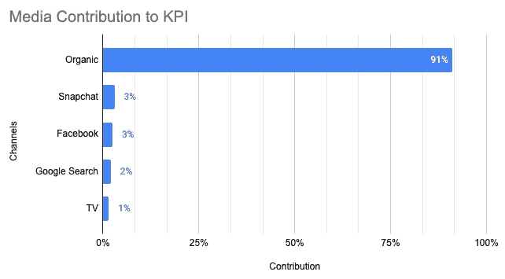
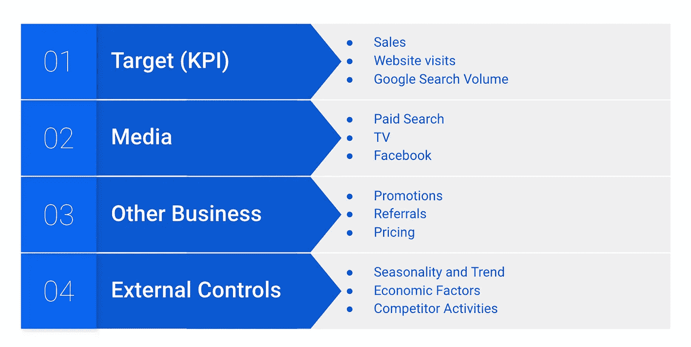
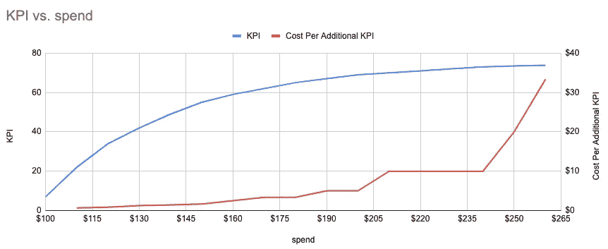
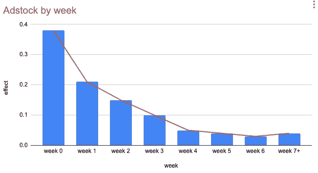
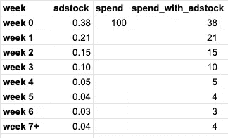
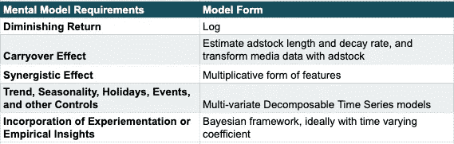
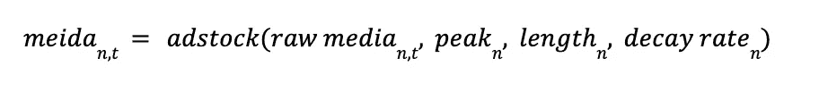
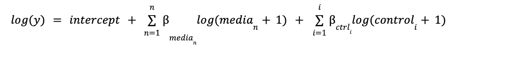
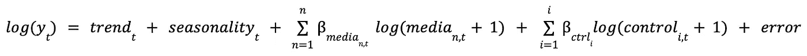

# 营销组合建模 101

> 原文：<https://towardsdatascience.com/marketing-mix-modeling-101-d0e24306277d>

## 营销组合建模(MMM)的非技术性介绍—第 1 部分

> “我花在广告上的钱有一半都浪费了；问题是我不知道是哪一半。”—约翰·沃纳梅克

约翰·沃纳梅克是一位成功的商人，是广告和其他许多领域的先驱。他在费城开设了第一家百货商店。他的百货连锁店被出售给多家公司，最终成为今天梅西百货的一部分。在他那个时代(1838 -1922)，营销测量很可能是猜测，可能依赖于直觉。如果沃纳梅克先生正在天堂观看，他会很高兴，他会有一个更加精确和科学严谨的答案。可以帮助他的事情之一是营销组合建模，也就是嗯。

作者图片

MMM 试图帮助营销人员解决数百万美元的问题:衡量营销活动的效率，以及如何在未来优化预算分配。MMM 可以帮助回答这样的问题:
——KPI 的驱动力是什么？
—每个营销渠道的广告支出回报率(ROAS)如何？
—如果我在某些渠道或整体营销上花费更多或更少，KPI 会是什么？
—我应该在每个渠道上分配多少支出才能在下一个周期实现 KPI 最大化？

## 内容摘要

在这篇文章(MMM 系列的第 1 部分)中，我计划用以下主题对 MMM 进行非技术性的介绍:

*   MMM 模型包含哪些数据和变量
*   理想的 MMM 心智模型中最重要的元素是什么
*   哪些模型属性的选择非常适合所提出的心智模型

## MMM 数据

MMM 是一个聚合模型，其数据粒度通常在渠道、国家/地区和/或产品级别，而不是用户级别。每天的支出数据可能很少且不稳定，因此每周或每月的汇总数据非常常见。业务 KPI 通常具有年度季节性和趋势性，因此该模型通常需要至少 2 年的历史数据(尤其是每周级别或每月级别)。也就是说，一切还是要看数据，对于某些数据量大、变化快的业务，每天和更短的周期也可能行得通。

MMM 模型通常包括以下目标和特征。

MMM 数据类别和示例-作者图片

感兴趣的 KPI 指标是响应变量。它可以是零售的销售额，在线商店的网站访问量，或者帐户注册数，谷歌搜索量等。

媒体变量应包括所有主要的营销渠道，并有可观的支出。例如付费搜索等在线媒体、付费社交媒体、电视等传统媒体和/或户外和直邮等离线媒体。建模单元可以是 spend，这更容易获得，因为它通常是内部跟踪的。但是，支出数据不考虑媒体成本。基于行动的变量，如点击、印象和 GRP 数据(如果可用且可靠)可能是更好的选择。

KPI 的其他重要驱动因素也应包括在模型中，以控制其影响。一些内部业务变量可以是促销、推荐和定价。其他外部控制包括季节性、趋势、重要节日等变量，以及可能导致 KPI 变化的事件(如 covid 或产品发布)、相关经济因素和竞争对手行为。

## MMM 心智模型

所有的模型都是错的，有些是有用的。有用的模型是那些心理模型最接近现实的模型。以下要素对于一个好的 MMM 模型很重要，它们决定了应该采取什么样的模型形式。

*   **收益递减**

收益递减说明了一个事实，即花在广告上的每一美元都不会产生相等的回报，随着我们在一个渠道上花更多的钱，一美元的回报将由于饱和而不断减少。开始时，有许多唾手可得的果实，最初的支出可以产生高回报。最终，随着市场越来越饱和，或者消费者对广告越来越厌倦，营销产生的回报会少得多，继续花钱就不值得了。这可以通过以媒体支出为 x 轴、KPI 为 y 轴的响应曲线图(见下例)来捕捉，这样我们就可以直观地看到支出的增加，以及 KPI 如何随之变化。

关于响应曲线应该是什么(C 曲线、S 曲线等)，有一些假设。下面的例子显示了响应曲线的一个最流行的假设:曲线在开始时更陡峭，最终变得更平坦。尽管我们看到 KPI 持续增长，但每增加一个 KPI 的成本会大幅增加。重要的是要了解在什么水平的支出，ROAS 不再理想，我们应该停止支出。模型应该采取能够模拟这种凹形的形式。

回复治疗-作者图片

*   **遗留效应**

广告的延续效应指的是消费者被广告感动的时间和消费者因为广告而转变的时间之间的时间差。假设有一天，我在回家的路上看到广告牌上有一个保险计划的广告，但是我不能马上买，因为我正在开车。这个广告仍然对我有一些挥之不去的影响。最后，一个星期后，我找到了一些时间，成为了他们的客户。这个广告对我的影响持续了一周。将我的经验扩展到成千上万的其他消费者，我们也可以有一个结转效应的平均衰减函数，也称为 adstock。参见下面的示例。该示例频道的广告效果在最初的一周大约为 40%,然后在接下来的一周下降到 20%,等等。

按周分类的广告——按作者分类的图片

虽然广告支出发生在第 0 周，但实际的广告效果直到后来才实现，因此在构建模型时，需要使用衰减率将第 0 周的支出公平分摊到接下来的 8 周。

存货、支出和转化支出——按作者分类的表格

adstock 衰减率需要针对不同的信道和目标。

广告库存可能因渠道而异。人们可以在一些频道上转换得更快，尤其是数字频道。例如，付费搜索渠道的用户可以很快转化，因为他们有更高的购买意愿，一次点击就可以带他们到商店或他们正在寻找的产品。另一方面，来自离线渠道的用户可能转换得慢得多，因为它可能需要一些时间来响应离线媒体。

adstock 也可能因业务而异。有些业务可能比其他业务慢。例如，如果你想成为 Lyft 的一名司机，需要时间来获得你的驾照和车辆检查和批准。因此，从接触广告到被认可为驾驶员之间的转换滞后时间较长。与注册网飞等视频流媒体服务不同，从看到广告到订阅可能只需要不到 5 分钟的时间。

*   **协同效应**

1+ 1 > 2.你可能会担心，我怎么能称自己为拥有如此数学技能的数据科学家。但有时多项营销活动的组合可能会比每项活动单独运作的总和产生更大的效果，这就是营销的协同效应。
在这个信息爆炸的世界里，许多消费者不仅仅被一个媒体渠道所感动。例如，用户可以在回家的路上看到广告牌上的广告，然后他可能会在晚饭后看电视时看到关于同一产品的第二个广告。如果他只看了一个广告，他可能不会转化，但看了两个广告后，他可能会转化。

*   **趋势、季节性、节假日、事件和其他控制**

除了目标和媒体特征之外，重要的是要理解业务 KPI 通常是季节性的和流行的，并且可能受到某些事件、假期和其他因素的高度影响。

快速增长的企业通常在目标上有上升趋势。零售商店可能在周末有更多的销售，而在一周内销售较少。一家面包店的销售额可能会突然发生变化，因为他们最近新开了三家分店。圣诞节促进了某些生意，因为许多人购买礼物。此外，由于竞争对手的大力促销，我们可能会看到销售额下降，当经济衰退时，开设投资账户的人会减少。

这些方面大多与营销活动没有什么关系，必须由模型很好地捕捉，以便进行无偏见的估计和合理的预测。

*   **纳入** **的实证和实验结果**

一个理想的 MMM 模型不应该纯粹由观测数据驱动，还应该结合实验结果、以前的经验见解、研究，甚至以前的模型。这将有助于模型解决数据问题，并产生与外部见解更一致且更具普遍性的结果。

通常，真实世界的数据，尤其是更细粒度的截面级别的营销数据可能非常稀疏，这可能会仅基于观察到的数据产生非常不合理的读数。在这种情况下，经验见解、以前的研究和行业基准可能会有所帮助。此外，具有较差数据质量的信道或 geo 可以使用来自具有稳健数据的类似信道或 geo 的信息来指导估计。例如，显示可以类似于编程显示。如果显示通道具有稀疏数据，我们可以使用从显示器上的编程显示中获得的信息来获得更合理的读数。新一代模型还可以利用以前版本模型的结果，并保持洞察力的一致性。

可信的实验结果被认为是理解因果关系和增量的圣杯。许多公司定期对营销渠道进行实验，以了解渠道增量。测试结果可能仅代表某一支出水平或短时间范围或渠道的子集。使用模型的测试结果可以利用两个世界的优势，并帮助校准模型结果。

## **模型属性的选择**

模型属性和损失函数的许多选择可以适合上述心理模型。下面的图表总结了一些我认为可以满足心智模型关键要求的选择。

模型形式与心智模型—作者列表

为了捕捉不同信道之间的协同效应，假设信道可以以任何组合对用户产生协同效应，我们可以在 adstock 变换之后使用具有媒体的乘法模型形式。

媒体变量应使用 adstock 进行转换，考虑广告效果的预期长度、广告影响的预期峰值时间和衰减率。

然后，我们可以在函数的两端应用对数变换(加 1 以避免对数为零)，方程就变成线性的了。对数转换为我们提供了凹形的介质成本曲线，也使扭曲的数据更加正常。可以通过对媒体数据应用附加变换来调整曲线的形状。

在上述等式之上，模型还应该是支持多变量和分解趋势、季节性、回归和误差项的时间序列模型。

贝叶斯框架是将外部信息整合到模型中的自然选择。贝叶斯框架允许使用具有期望变化水平的信息先验，以便结合先验知识和观测数据来估计后验概率。虽然媒体影响在短期内不会太不稳定，但营销杠杆和市场动态也可能会迅速变化，尤其是对新公司而言。在这种情况下需要时变系数，以便模型更加动态。

Orbit 是一个强大的 python 包，它可以构建支持上述属性的 MMM 模型。我有一个单独的介绍轨道的教程[这里](https://medium.com/towards-data-science/time-series-modeling-with-orbit-101-f6a262c1eaf6)(这是一个关于轨道的一般用法的教程，不是专门为建造 MMM 的)。你可以在这里找到关于 MMM 系列第二部分[的第二个故事，了解建立 MMM 模型时的挑战和陷阱，以及 MMM 与其他营销测量方法的比较。我还计划编写第 3 部分，使用 Orbit 用模拟数据构建一个 MMM 模型。](/marketing-mix-models-102-the-good-the-bad-and-the-ugly-f5895c86b7c3)

## 参考

[1] Dominique M. Hanssens，Leonard J. Parsons，Randall L. Schultz，**市场反应模型——计量经济学和时间序列分析**

[2] Edwin Ng，Zhishi Wang，，**贝叶斯时变系数模型及其在营销组合建模中的应用**

# 谢谢你，并关注我更多！

感谢您阅读到目前为止，并了解营销组合模式。如果你对 MMM 模型感兴趣，请关注更多，因为我计划为 MMM 写一系列故事。

*敬请关注，关注我，订阅电子邮件了解更多关于数据科学和其他有趣话题的故事！*