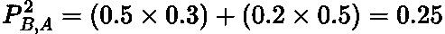
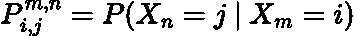
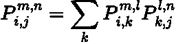
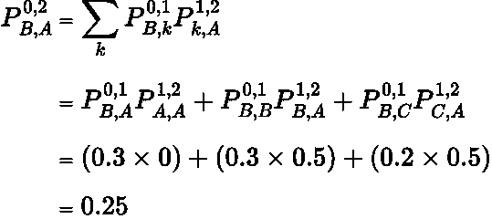

# 马尔可夫链:多步转移

> 原文：<https://towardsdatascience.com/markov-chains-multi-step-transitions-6772114bcc1d>

## 使用 Chapman-Kolmogorov 方程理解马尔可夫链中的多步转移

沃洛季米尔·赫里先科在 [Unsplash](https://unsplash.com?utm_source=medium&utm_medium=referral) 上的照片

# 介绍

在我以前的文章中，我们介绍了 [**马尔可夫属性**](https://en.wikipedia.org/wiki/Markov_property) 的概念，并将其发展为解释一个 [**马尔可夫链**](https://en.wikipedia.org/wiki/Markov_chain) **。**我建议现在的读者在阅读这篇文章之前先浏览一下那篇文章:

</markov-chains-simply-explained-dc77836b47e3>  

然而，在坚果壳中，马尔可夫性质是当转移到下一个状态**的概率仅取决于当前状态**时。系统是 [**无记忆**](https://en.wikipedia.org/wiki/Memorylessness) **。**马尔可夫链是有限状态空间下马尔可夫性质下的时间离散变迁的**序列。**

在本文中，我们将讨论 Chapman-Kolmogorov 方程以及如何使用它们来计算给定马尔可夫链的多步转移概率。

# 马尔可夫链和转移矩阵

考虑以下状态空间为 **{A，B，C}** 的马尔可夫链:

作者制作的图像。

这个马尔可夫链有如下关联的 [**转移矩阵**](https://en.wikipedia.org/wiki/Stochastic_matrix) **:**

由作者在 LaTeX 中生成的矩阵。

这些值告知我们从状态 *i* (行)移动到状态 *j* (列)的**概率。**然而，这些概率仅针对**单步过渡**。比如说，分两步从**状态** **B 到状态 A 的概率是多少？**我们可以通过参考马尔可夫链图来解决这个问题:

LaTeX 中生成的方程。

然而，当状态空间变大，我们需要计算两个以上的转换时，这种方法变得越来越困难。有一种更简单、更通用的方法来表达多步跃迁，使用 T **和 Chapman-Kolmogorov 方程**，我们接下来将深入探讨。

# 查普曼-柯尔莫哥洛夫方程

我们可以使用以下公式概括多步转换:

LaTeX 中生成的方程。

也就是我们刚刚在时间 ***m*** 处于状态 ***i*** 时，在时间 ***n*** 进入状态 ***j*** 的概率。这个方程可以用**查普曼-科尔莫戈罗夫方程求解:**

LaTeX 中生成的方程。

其中 ***l*** 为介于 ***m*** 和 ***n 之间的整数值，P*** 为状态间转移的概率， ***k*** 为只能占用**状态空间中的值的索引变量。**

让我们通过一个例子来实现上面马尔可夫链的Chapman-Kolmogorov 方程。我们希望分两步**从状态 B 到状态 A:**

LaTeX 中生成的方程。

我们得到了**和上面一样的概率！**

> 我将当前时间设置为零。这是允许的，因为状态的历史与马尔可夫链无关，所以将当前时间设置为零不会失去表达式的通用性。

直觉上，我们只是**将**两步转换分解为**一组一步转换**，因为我们知道它们的概率。然后，我们将它们结合起来计算两步跃迁概率。

> 如果我们想分三步计算转换，那么 **l** 的值可以是 **1 或 2** 。因此，我们必须应用两次查普曼-科尔莫戈罗夫方程**来表达一步转换公式。这个过程被称为**递归**，因为我们不断地向后计算概率。**

# **多步转移矩阵**

**转移矩阵是一个正方形矩阵，其中每个单元给出了在一步**中从状态*到 ***j*** 的概率。****解读上面的Chapman-Kolmogorov 方程，可以看到，从状态 ***i*** 到 ***j*** 中的**两步**等于转移矩阵**的平方**:***

******

***LaTeX 中生成的方程。***

***请注意，对于从 B 到 A 的**条目(1，0)** (我使用的是从零开始的索引)，我们得到的概率是 **0.25，**正是我们上面得到的**相同结果**！***

***因此，要得到多步转移概率，你所要做的就是**将一步转移矩阵本身乘以你需要的转移次数！*****

# ***结论***

***在本文中，我们展示了如何使用 Chapman-Kolmogorov 方程推导出**马尔可夫链**的**多步转移概率**。在我的下一篇文章中，我们将看到当**转换的数量变大并趋于无穷大时会发生什么！*****

# ***和我联系！***

*   ***要在媒体上阅读无限的故事，请务必在这里注册！ 💜***
*   ***[T49*😀*](/subscribe/@egorhowell)***
*   ***[*领英*](https://www.linkedin.com/in/egor-howell-092a721b3/) 👔***
*   ***[*推特*](https://twitter.com/EgorHowell) 🖊***
*   ***[*github*](https://github.com/egorhowell)*🖥****
*   ****<https://www.kaggle.com/egorphysics>**🏅******

> *****(所有表情符号都是由 [OpenMoji](https://openmoji.org/) 设计的——开源的表情符号和图标项目。许可证: [CC BY-SA 4.0](https://creativecommons.org/licenses/by-sa/4.0/#)*****