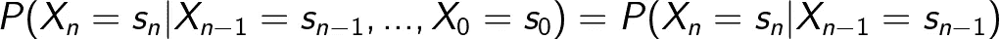
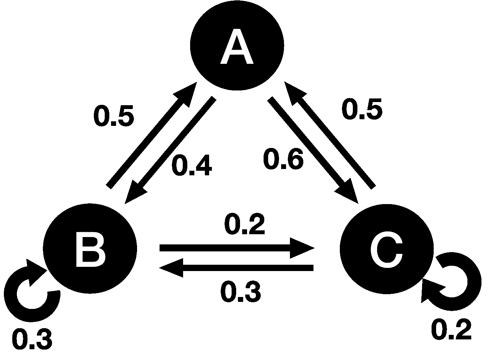
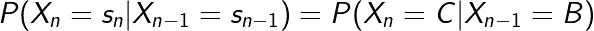
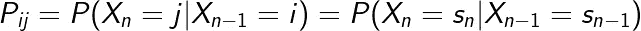

# 马尔可夫链简单地解释了

> 原文：<https://towardsdatascience.com/markov-chains-simply-explained-dc77836b47e3>

## 马尔可夫性和马尔可夫链的直观而简单的解释

照片由[郭佳欣·阿维蒂西安](https://unsplash.com/@kar111?utm_source=medium&utm_medium=referral)在 [Unsplash](https://unsplash.com?utm_source=medium&utm_medium=referral) 上拍摄

# 介绍

[马尔可夫链](https://en.wikipedia.org/wiki/Markov_chain)出现在许多领域:物理学、遗传学、金融，当然还有数据科学和机器学习。作为一名数据科学家，你可能听说过这个词**‘马尔可夫’**在你的研究或一般阅读中出现过几次。它是自然语言处理和强化学习中的典型统计技术。在本文中，我们将简单解释什么是马尔可夫链，以及它的含义。

# 马尔可夫性质

对于任何被认为是马尔可夫/马尔可夫的建模过程，它必须满足 [**马尔可夫特性**](https://en.wikipedia.org/wiki/Markov_property) 。这个性质表明下一个状态**的概率只取决于当前状态**，当前状态之前的一切都是无关的。换句话说，整个系统完全是**无记忆**。

从数学上来说，这可以写成:

LaTeX 中生成的方程

其中 ***n*** 是**时间步长参数**和 ***X*** 是在给定的**状态空间***中取值的**随机变量**状态空间是指事件的所有可能结果。例如，一次掷硬币在其状态空间中有两个值:***s = {正面，反面}*** 和**从一种状态转移到另一种状态的概率**为 0.5。*

# *马尔可夫链*

*使用马尔可夫属性的过程被称为**马尔可夫过程**。如果状态空间是**有限的**并且我们使用**离散时间步**这个过程被称为**马尔可夫链**。换句话说，它是在给定的状态空间中呈现状态的随机变量序列。*

*在本文中，我们将考虑**时间齐次离散时间马尔可夫链**，因为它们最容易处理并建立背后的直觉。确实存在**非时齐马尔可夫链**，其中状态之间的转移概率**不是固定的，而是随时间变化的**。*

*下面显示的是带有**状态空间{A，B，C}** 的示例马尔可夫链。箭头**上的数字表示在这两种状态之间转换**的概率。*

**

*图片作者。*

*比如你想从状态 B 到状态 C，那么这个转换有 20%的几率。从数学角度来看，我们得出以下结论:*

**

*LaTeX 中生成的方程*

# *概率转移矩阵*

*我们可以通过为给定的马尔可夫链构建一个**概率转移矩阵**来简化和概括这些转移。转移矩阵具有行 ***i*** 和列 ***j*** ，因此 ***i，j*** 索引值给出了从 ***i*** 到 ***j*** 的转移概率:*

**

*LateX 中生成的方程*

*上述马尔可夫链的转移矩阵是:*

**

*由作者在 LaTeX 中生成的矩阵。*

*所以(0，1)项告诉我们从 A 到 B 的转移概率是 0.4。这与我们在上面的马尔可夫链图中得到的结果一致。*

# *摘要*

*在本文中，我们介绍了马尔可夫性质的概念，并使用这一概念来构建和理解一个基本的马尔可夫链。这种随机过程出现在数据科学和机器学习的许多方面，因此对它有所了解是很重要的。在我的下一篇文章中，我们将深入研究马尔可夫链和过程的更复杂和更特殊的部分。*

*希望你喜欢这篇文章！*

# *和我联系！*

*   *要在媒体上阅读无限的故事，请务必在这里注册！T35*💜**
*   **😀**
*   *[*LinkedIn*](https://www.linkedin.com/in/egor-howell-092a721b3/)*👔**
*   **[*碎碎念*](https://twitter.com/EgorHowell) 🖊**
*   **[*github*](https://github.com/egorhowell)*🖥***
*   *****🏅*****

> ***(所有表情符号都是由 [OpenMoji](https://openmoji.org/) 设计的——开源的表情符号和图标项目。许可证: [CC BY-SA 4.0](https://creativecommons.org/licenses/by-sa/4.0/#)***