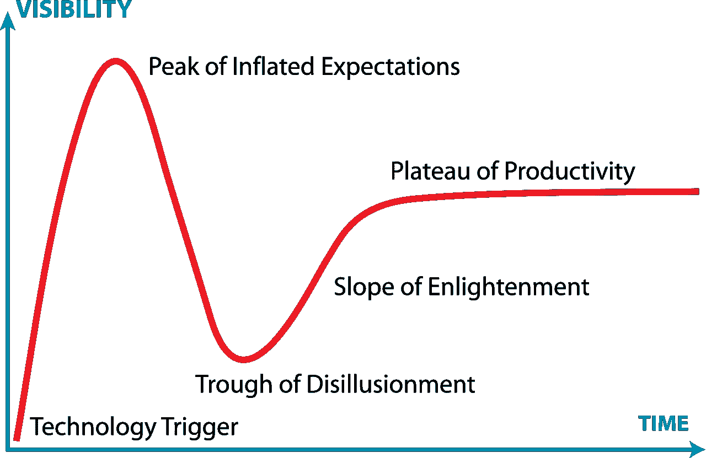
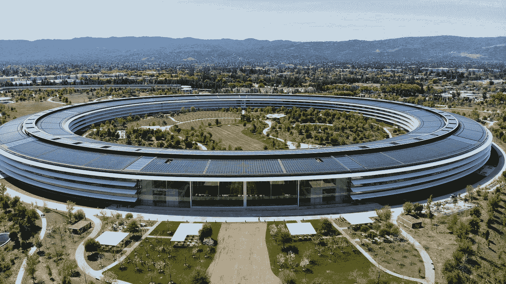

# 科技领域大规模裁员——人工智能的冬天来了吗？

> 原文：<https://towardsdatascience.com/mass-layoffs-in-tech-is-the-ai-winter-coming-d7f9968006d>

## 意见

## 面对经济逆风，亚马逊、Meta 和 Twitter 等科技巨头削减了数千个工作岗位。这对人工智能的未来意味着什么？

照片由 [Unsplash](https://unsplash.com?utm_source=medium&utm_medium=referral) 上的 [Aditya Vyas](https://unsplash.com/@aditya1702?utm_source=medium&utm_medium=referral) 拍摄

直到最近，公司还在努力吸引和留住数据科学领域的优秀员工。在线业务在封锁时期蓬勃发展，世界突然依赖于包裹递送、云环境、在线会议空间和虚拟娱乐。科技巨头报告了创纪录的利润，将多余的现金投入到雄心勃勃的人工智能项目和创新中。

每个合格的数据科学家都是高价值的商品，公司竭尽全力阻止员工加入伟大的辞职运动。不管有没有电晕，天空似乎是科技行业的极限。

然后，几乎在一夜之间，LinkedIn 突然被寻找另一份工作的有经验的数据科学家淹没了。几天之内，Twitter 解雇了一半的员工，亚马逊和 Meta 都在大规模裁员中削减了超过 10，000 个职位，更多的公司要么冻结招聘，要么大幅缩减员工人数[2]。在全球范围内，估计已经有 200，000 名技术工人失业，这个数字在未来几个月内可能会上升。

突然之间，数据科学界似乎陷入了低谷。我们正在走向另一个人工智能冬天吗？

# 什么是 AI 冬天？

首先，什么是 AI 冬天？维基百科[4]将其定义为:

> "人工智能研究资金和兴趣减少的时期."

通向这样一个冬天的道路概述如下:

> “这是一个连锁反应，首先是人工智能界的悲观情绪，然后是媒体的悲观情绪，接着是资金的大幅削减，然后是严肃研究的结束。”

更广泛地说，人工智能的冬天可以被归类为 **Gartner 炒作周期**【5】中的一个低谷，在这个周期中，当事实证明过高的预期无法满足时，人们对某项技术的兴趣急剧下降。

Gartner 炒作周期。如果过高的期望得不到满足，这项技术就会失去兴趣，资金也会被抽走，从而阻碍进一步的发展

据报道，主要的 AI 冬季发生在 1974-1980 年和 1987-1993 年，人们一直预测另一次萧条迟早会到来。

总而言之，要实现人工智能冬天，在一段较长的时间内，必须满足以下两个条件:

*   资金减少
*   降低利息

> 根据记录，炒作周期存在的经验证据充其量也是站不住脚的，但为了这篇文章，我们将配合一下。

# 为什么数据科学家会被解雇？

先说经费减少。科技公司创纪录的裁员自然降低了进一步开发人工智能的能力。

显然，不是所有被解雇的人都是数据科学家，也不是所有数据科学家都设计 AI。尽管如此，大多数从事技术工作的人确实在日常工作中以这样或那样的方式使用人工智能。

在更多的应用角色中，你甚至可能不会直接注意到创新。然而，从长远来看，考虑一下如果没有更有效的矩阵乘法发明、更快速的梯度计算、透明地解释自动化决策的实践，会发生什么……你使用五年前的工具包会有多有效？

当这类创新停滞时，整个行业都会停滞不前，数据科学家的影响力也会大打折扣。人工智能与数据科学的许多分支交织在一起，大规模裁员的影响将渗透到该领域的所有缝隙中。自然，那些不幸失业的人受到的影响最大，然而我们所有人都会受到人工智能创新能力丧失的影响。

从商业常识的角度来看，裁员的原因很简单:

*   **高成本削减**:数据科学以高工资和丰厚奖金著称；这也是很多人试图进入这个领域的原因之一。因此，削减对公司的运营成本有着重大而直接的影响。
*   **降低 R & D** 的优先级:尽管“数据科学”的概念相当宽泛，但该领域的许多人都以某种方式参与了研究开发。在危机时期，研发活动总是受到打击，人们关注的是短期生存，而不是长期愿景和投机努力。
*   **修正表现不佳**:科技股最近经历了大幅下跌。corona 似乎将推动不断扩张的数字世界发生永久性变化，科技行业也随之扩张。然而，实际表现与乐观的预期并不相符。

一些具体的例子？

*   Meta 向元宇宙投入了数十亿美元——仅今年一年就在这个项目上损失了近 100 亿美元[6]——还看不到盈亏平衡点。
*   根据马斯克的说法，Twitter 目前每天损失 400 万美元。
*   亚马逊最近成为历史上第一家亏损一万亿(！)的市值，微软紧随其后。
*   谷歌继续经历利润缩水，部分原因是广告市场饱和，部分原因是创新失败[9]。

在更细的层面上，特定的团队或产品无法产生利润，无论成员的素质或想法的才华如何。稍后会详细介绍。

最终，裁员决定通常只是一个团队花费多少和产生多少的问题。有办公室政治和商业愿景，但底线最终很重要。

马克西姆·霍普曼在 [Unsplash](https://unsplash.com?utm_source=medium&utm_medium=referral) 上的照片

# 艾温特或'只是'另一个危机？

人工智能资金的减少是不可否认的，但从表面上看，裁员有明显的宏观经济原因。全球经济出人意料地迅速从科罗纳危机中复苏——部分原因是政府机构近乎无限的资助——但乌克兰战争引发了另一系列问题，包括供应链进一步中断和能源价格飙升。通货膨胀率飙升，消费者有了购买力，人们变得恐惧……这就是一场危机所需要的所有要素。

经济逆风和裁员齐头并进，因此仅仅削减员工成本不足以构成人工智能的冬天。然而，如果我们仔细看看被解雇的*，我们可能会认为最近的发展不仅仅是为风暴做准备。是时候考虑一些例子了:*

*   Twitter 的整个道德人工智能团队的解散引起了广泛的关注，因为该团队被认为是透明和公正人工智能的领导者[10]。裁员可能会被解读为独角戏，但类似的有针对性的裁员可能也会在其他科技公司出现。
*   Meta 的**概率团队**完全解散了，他们的工作主题是概率和微分编程，这可以帮助 ML 工程师。据报道，这是一个世界级的专家团队，但似乎它缺乏足够明显的影响[11]。
*   据报道，亚马逊解雇了其**机器人和设备部门的大部分人员，**标志着重新定位于被证明能够产生现金流的服务。

在这些决策中，应该考虑到科技巨头——尽管显然不是慈善家——有大量现金可供支配。因此，停止人工智能项目对于短期生存来说并不重要，这意味着他们对长期的盈利能力或价值失去了信心。

终止项目随时都在发生，但此时一批*插头正在被拔出。对许多公司来说，这是几十年来最大规模的裁员；很难夸大当前事件的重要性。*

处于过程中间，缺乏关于重组努力的规模和范围的全面声明，现在看 AI 将走向何方还为时过早。然而，鉴于即使是世界级的人工智能专家也不再能保证得到一份工作，这似乎不仅仅是简单地预测经济挫折。

由[卡莱斯·拉巴达](https://unsplash.com/@carlesrgm?utm_source=medium&utm_medium=referral)在 [Unsplash](https://unsplash.com?utm_source=medium&utm_medium=referral) 上拍摄

# 下一步是什么？

未来如何发展显然取决于许多因素:战争、能源危机、反通胀措施的成功、消费者的情绪等等。尽管如此，日冕期间经历的 V 型复苏(快速内爆后同样快速的反弹)似乎不太可能。一个 U 型模式(逐渐衰退、停滞、缓慢复苏)似乎是我们所能期待的最好结果。鉴于科技劳动力的大幅减少，我们需要相当长的时间才能回到 2022 年开始时的水平。

所有这些是否意味着一个迫在眉睫的人工智能冬天？资金和人力的减少似乎是既定的，许多人工智能部门的有针对性的取消和精简肯定可以解释为对人工智能或至少该领域分支的兴趣减少。

话虽如此，AI 发展当然不会停止。甚至以前的冬天也没有完全停止人工智能的发展。此外，上一个冬天发生在 90 年代初。当今的人工智能如此庞大，在日常生活中如此根深蒂固，很难想象人工智能发展会出现真正的“突破”。

尽管大规模裁员、许多人工智能计划的终止以及公司目前的短期关注不太可能*而不是*损害人工智能的进展，但**经济逆风似乎是比普遍丧失对人工智能的信心更强大的驱动力**。因此，一个严重的人工智能冬天不太可能出现——人工智能仍然有太多的优势。

也就是说，在我们未来的日子里，多一条毯子可能没什么坏处。

罗伯特·蒂曼在 [Unsplash](https://unsplash.com?utm_source=medium&utm_medium=referral) 上拍摄的照片

*喜欢这篇文章？你可能也会喜欢下面这些:*

      

# 参考

[1][https://www.bbc.com/news/business-57979268](https://www.bbc.com/news/business-57979268)

[2][https://www . computer world . com/article/3679733/tech-裁员-in-2022-a-timeline.html](https://www.computerworld.com/article/3679733/tech-layoffs-in-2022-a-timeline.html)

[3]https://www.trueup.io/layoffs

[https://en.wikipedia.org/wiki/AI_winter](https://en.wikipedia.org/wiki/AI_winter)

[5][https://www . Gartner . com/en/research/methodologies/Gartner-hype-cycle](https://www.gartner.com/en/research/methodologies/gartner-hype-cycle)

[6][https://www . ign . com/articles/meta-正在元宇宙损失数十亿美元，而它并没有好转](https://www.ign.com/articles/meta-is-losing-billions-on-the-metaverse-and-its-not-getting-better)

[7][https://www . Reuters . com/markets/deals/twitters-massive-revenue-drop-adds-heavy-debt-burden-2022-11-07/](https://www.reuters.com/markets/deals/twitters-massive-revenue-drop-adds-heavy-debt-burden-2022-11-07/)

[8][https://www . Bloomberg . com/news/articles/2022-11-09/Amazon-hits-unwanted-milestone-with-one-万亿-value-lost](https://www.bloomberg.com/news/articles/2022-11-09/amazon-hits-unwelcome-milestone-with-1-trillion-in-value-lost)

[9][https://www . the verge . com/2022/10/25/23423560/Google-Q3-2022-增长-收入-萎缩-利润-收益](https://www.theverge.com/2022/10/25/23423560/google-q3-2022-growing-revenue-shrinking-profits-earnings)

[https://www.wired.com/story/twitter-ethical-ai-team/](https://www.wired.com/story/twitter-ethical-ai-team/)

[11][https://venturebeat . com/ai/why-meta-and-twitters-ai-and-ml-offsets-matter-the-ai-beat/](https://venturebeat.com/ai/why-meta-and-twitters-ai-and-ml-layoffs-matter-the-ai-beat/)

[12][https://www . business today . in/latest/corporate/story/after-meta-Twitter-and-Microsoft-now-Amazon-starts-fireing-employees-352547-2022-11-11](https://www.businesstoday.in/latest/corporate/story/after-meta-twitter-and-microsoft-now-amazon-starts-firing-employees-352547-2022-11-11)

[13][https://www . nytimes . com/2022/11/14/technology/Amazon-offsets . html](https://www.nytimes.com/2022/11/14/technology/amazon-layoffs.html)

[14][https://TechCrunch . com/2022/11/11/面临-经济-逆风-亚马逊-整合-机器人-项目/](https://techcrunch.com/2022/11/11/facing-economic-headwinds-amazon-consolidates-robotic-projects/?guccounter=1&guce_referrer=aHR0cHM6Ly93d3cuZ29vZ2xlLmNvbS8&guce_referrer_sig=AQAAALguC78u5eT1BfLBOwBcGBxPoGNQwCY4QAiCRDcZnzsBlLSyn0joeXCgc1CQxGY-v1s8NHfjIq2jX5bsL8VrM2l69jHETogj4t5oqtnqu6Ig4Rjag2aYbrB8GmqyhcFow2aJrGi2-F0ntvgAsap53hFvGqu3R2rXX14PzmfgOnAq)

[15][https://edition . CNN . com/2022/05/12/investing/recession-shapes-alphabet/index . html](https://edition.cnn.com/2022/05/12/investing/recession-shapes-alphabet/index.html)