# Python 中图像处理和深度学习准备的大量教程#2

> 原文：<https://towardsdatascience.com/massive-tutorial-on-image-processing-and-preparation-for-deep-learning-in-python-2-14816263b4a5>

## 随意操纵和变换图像

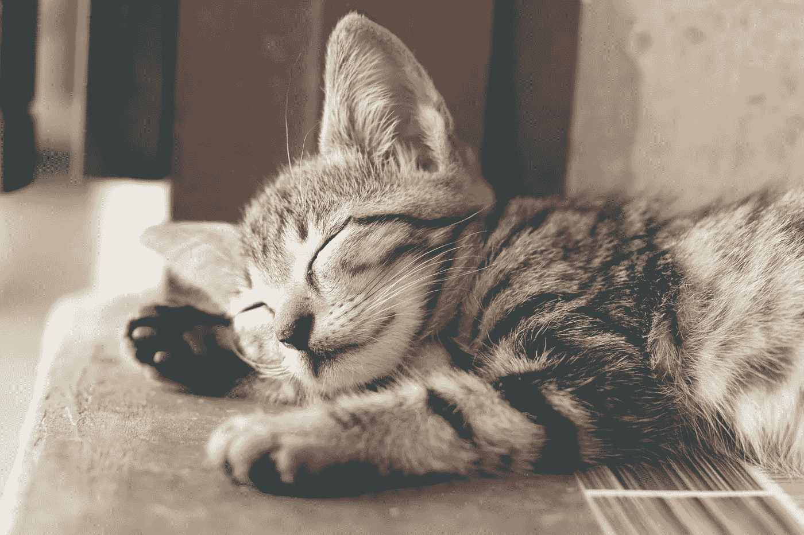

照片由 Ihsan [Adityawarman](https://www.pexels.com/photo/close-up-photography-of-sleeping-tabby-cat-1056251/) 在 Pexels 上拍摄

> 这是我关于图像处理的第一篇文章的第二部分。请阅读[第一篇了解背景和设置](/massive-tutorial-on-image-processing-and-preparation-for-deep-learning-in-python-1-e534ee42f122)。

我们将从对比度增强开始第二部分。

## 6.对比度增强

某些类型的图像(如医疗分析结果)对比度较低，难以发现细节，如下所示:

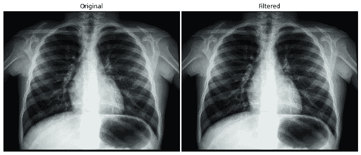

图片由 [Pixabay](https://pixabay.com/photos/diagnosis-xray-chest-lungs-ribs-1476620/) 提供

在这种情况下，我们可以使用对比度增强来使细节更加清晰。有两种类型的对比度增强算法:

1.  对比度扩展
2.  直方图均衡

我们将在本帖中讨论直方图均衡化，它依次有三种类型:

1.  标准直方图均衡化
2.  自适应直方图均衡
3.  对比度受限的自适应直方图均衡(CLAHE)

[直方图均衡](https://en.wikipedia.org/wiki/Histogram_equalization)将图像对比度最高的区域扩展到亮度较低的区域，*对其进行均衡*。

> 哦，对了，你可以通过从最高像素值中减去最低像素值来计算图像的对比度。

```
>>> xray.max() - xray.min()255
```

现在，让我们试试来自`exposure`模块的标准直方图均衡化:

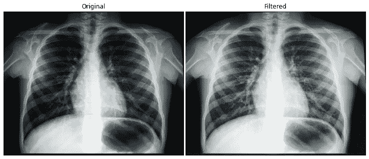

图片由 [Pixabay](https://pixabay.com/photos/diagnosis-xray-chest-lungs-ribs-1476620/) 提供

我们已经可以更清楚地看到细节了。

接下来，我们将使用 **CLAHE** (这是一个有趣的发音单词！)，它为图像中不同的像素邻域计算许多直方图，即使在最暗的区域也能获得更多细节:

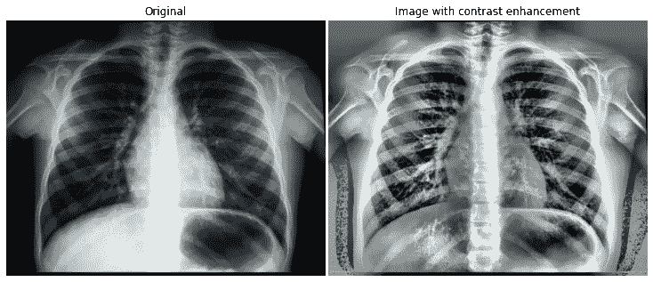

图片由 [Pixabay](https://pixabay.com/photos/diagnosis-xray-chest-lungs-ribs-1476620/) 提供

这张看起来好很多，因为它可以在背景中显示细节，在左下角显示更多丢失的肋骨。您可以调整`clip_limit`来获得更多或更少的细节。

<https://ibexorigin.medium.com/membership>  

获得由强大的 AI-Alpha 信号选择和总结的最佳和最新的 ML 和 AI 论文:

<https://alphasignal.ai/?referrer=Bex>  

## 7.转换

数据集中的影像可能有几个相互冲突的特征，如不同的比例、未对齐的旋转等。ML 和 DL 算法希望您的图片具有相同的形状和尺寸。因此，您需要学习如何修复它们。

**旋转**

要旋转图像，使用`transform`模块中的`rotate`功能。我选择了真正的时钟，所以你可能会更好地记住角度符号:

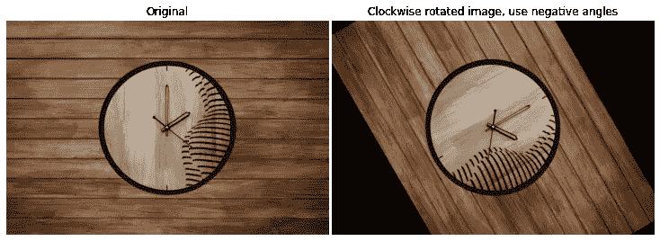

照片由来自 [Pexels](https://www.pexels.com/photo/brown-wooden-round-wall-clock-4095545/?utm_content=attributionCopyText&utm_medium=referral&utm_source=pexels) 的 [RP Singh](https://www.pexels.com/@rp-singh-2210025?utm_content=attributionCopyText&utm_medium=referral&utm_source=pexels) 拍摄

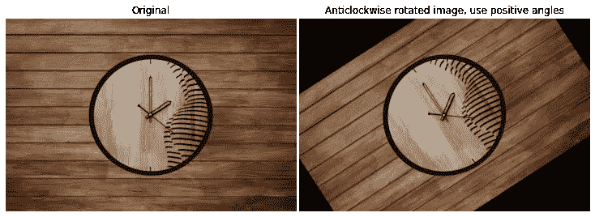

照片由 [RP Singh](https://www.pexels.com/@rp-singh-2210025?utm_content=attributionCopyText&utm_medium=referral&utm_source=pexels) 从 [Pexels](https://www.pexels.com/photo/brown-wooden-round-wall-clock-4095545/?utm_content=attributionCopyText&utm_medium=referral&utm_source=pexels) 拍摄

**重新缩放**

另一个标准操作是缩放图像，它主要在图像比例不同的情况下有用。

我们使用一个类似的`[rescale](https://scikit-image.org/docs/stable/api/skimage.transform.html#skimage.transform.rescale)`函数来完成这个操作:

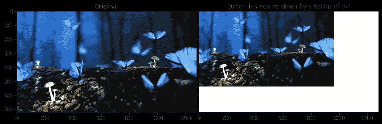

照片由 [Pixabay](https://www.pexels.com/@pixabay?utm_content=attributionCopyText&utm_medium=referral&utm_source=pexels) 从[像素](https://www.pexels.com/photo/close-up-photo-of-glowing-blue-butterflies-326055/?utm_content=attributionCopyText&utm_medium=referral&utm_source=pexels)拍摄

当图像分辨率较高时，过度缩小可能会导致质量下降，或者像素随意地摩擦在一起，从而产生意外的边缘或拐角。为了考虑这种影响，您可以将`anti_aliasing`设置为 True，这将使用高斯平滑:

[https://gist.github.com/f7ae272b6eb1bce408189d8de2b71656](https://gist.github.com/f7ae272b6eb1bce408189d8de2b71656)

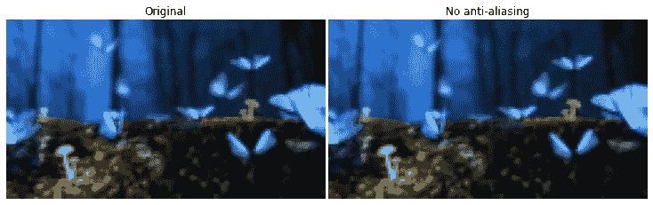

照片由[像素](https://www.pexels.com/photo/close-up-photo-of-glowing-blue-butterflies-326055/?utm_content=attributionCopyText&utm_medium=referral&utm_source=pexels)的 [Pixabay](https://www.pexels.com/@pixabay?utm_content=attributionCopyText&utm_medium=referral&utm_source=pexels) 拍摄

和以前一样，平滑并不明显，但在更精细的层次上它会很明显。

**调整大小**

如果您希望图像具有特定的宽度和高度，而不是按某个因子缩放，您可以通过提供一个`output_shape`来使用`[resize](https://scikit-image.org/docs/stable/api/skimage.transform.html#skimage.transform.resize)`函数:

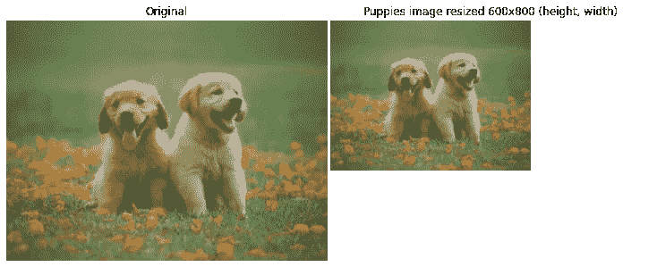

照片由[切瓦农摄影](https://www.pexels.com/@chevanon?utm_content=attributionCopyText&utm_medium=referral&utm_source=pexels)从 [Pexels](https://www.pexels.com/photo/two-yellow-labrador-retriever-puppies-1108099/?utm_content=attributionCopyText&utm_medium=referral&utm_source=pexels) 拍摄

# 图像恢复和增强

在文件转换、错误下载或许多其他情况下，一些图像可能会扭曲、损坏或丢失。与其放弃这个想法，你可以使用`skimage`来说明损坏的原因，并使图像完好如初。

在这一节中，我们将讨论一些图像恢复技术，从修复开始。

## 1.修补

修复算法可以智能地填充图像中的空白。我找不到损坏的图片，所以我们将使用这张鲸鱼图片，并手动在上面放置一些空白:

```
whale_image = imread("images/00206a224e68de.jpg")>>> show(whale_image)
```

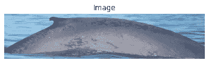

```
>>> whale_image.shape(428, 1916, 3)
```

下面的函数创建了四个漆黑的区域来模拟图像上丢失的信息:

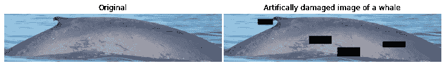

我们将使用来自`inpaint`模块的`[inpaint_biharmonic](https://scikit-image.org/docs/stable/api/skimage.restoration.html#skimage.restoration.inpaint_biharmonic)`函数来填充空白，传入我们创建的`mask`:


正如你所看到的，在看到有缺陷的图像之前，很难判断缺陷区域在哪里。

现在，让我们制造一些噪音📣！

## 2.噪音📣

如前所述，噪声在图像增强和恢复中起着重要作用。有时，您可能会有意将它添加到如下所示的图像中:

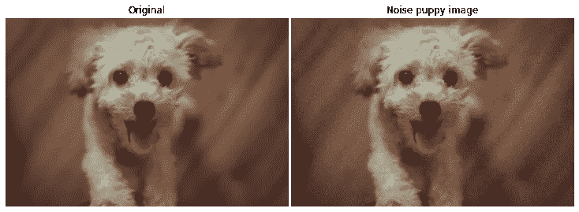

照片由[阮俊](https://www.pexels.com/@tuan1804?utm_content=attributionCopyText&utm_medium=referral&utm_source=pexels)从[派克斯](https://www.pexels.com/photo/cream-toy-poodle-666870/?utm_content=attributionCopyText&utm_medium=referral&utm_source=pexels)拍摄

我们使用`[random_noise](https://scikit-image.org/docs/dev/api/skimage.util.html#skimage.util.random_noise)`函数给一幅图像洒上随机的颜色斑点。因此，这种方法被称为“盐和胡椒”技术。

## 3.减少噪音—去噪

但是，大多数情况下，您希望从图像中去除噪声，而不是添加噪声。有几种去噪算法:

1.  全变差(TV)滤波器
2.  双边去噪
3.  小波去噪
4.  非局部均值去噪

在本文中，我们只看前两个。先来试试电视滤镜，有`[denoise_tv_chambolle](https://scikit-image.org/docs/stable/api/skimage.restoration.html#denoise-tv-chambolle)`的:

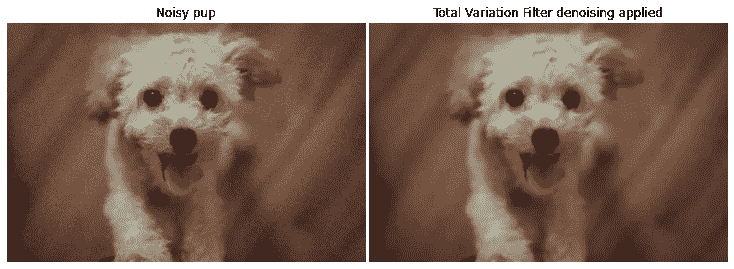

照片由 [Tuan Nguyen](https://www.pexels.com/@tuan1804?utm_content=attributionCopyText&utm_medium=referral&utm_source=pexels) 从 [Pexels](https://www.pexels.com/photo/cream-toy-poodle-666870/?utm_content=attributionCopyText&utm_medium=referral&utm_source=pexels) 拍摄

图像的分辨率越高，去噪的时间就越长。您可以使用`weight`参数控制去噪效果。现在，让我们试试`[denoise_bilateral](https://scikit-image.org/docs/stable/api/skimage.restoration.html#skimage.restoration.denoise_bilateral)`:

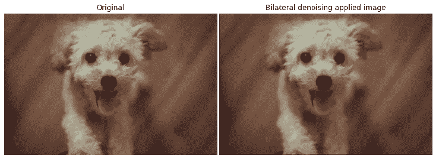

照片由 [Tuan Nguyen](https://www.pexels.com/@tuan1804?utm_content=attributionCopyText&utm_medium=referral&utm_source=pexels) 从 [Pexels](https://www.pexels.com/photo/cream-toy-poodle-666870/?utm_content=attributionCopyText&utm_medium=referral&utm_source=pexels) 拍摄

它不如电视滤镜有效，如下图所示:

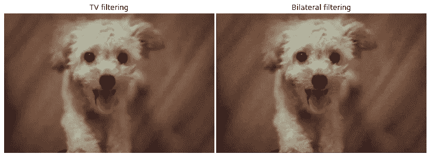

照片由 [Tuan Nguyen](https://www.pexels.com/@tuan1804?utm_content=attributionCopyText&utm_medium=referral&utm_source=pexels) 从 [Pexels](https://www.pexels.com/photo/cream-toy-poodle-666870/?utm_content=attributionCopyText&utm_medium=referral&utm_source=pexels) 拍摄

## 4.超像素和分段

图像分割是图像处理中最基本也是最常见的课题之一，广泛应用于运动和目标检测、图像分类等领域。

我们已经看到了一个分割的例子——对图像进行阈值处理，从前景中提取背景。本节将学习做更多的事情，比如将图像分割成相似的区域。

要开始分段，我们需要了解超像素的概念。

一个像素，就其本身而言，只是代表一个很小的颜色区域，一旦从图像中分离出来，单个像素就没用了。因此，分割算法使用多组对比度、颜色或亮度相似的像素，它们被称为超像素。

一种试图寻找超像素的算法是简单线性迭代聚类(SLIC ),它使用 k 均值聚类。让我们看看如何在`skimage`库中可用的咖啡图像上使用它:

```
from skimage import datacoffee = data.coffee()>>> show(coffee)
```

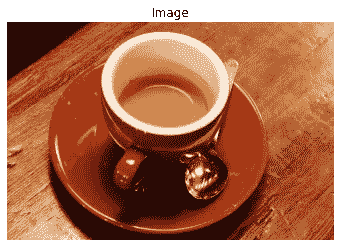

我们将使用`segmentation`模块中的`[slic](https://scikit-image.org/docs/dev/api/skimage.segmentation.html?highlight=slic#skimage.segmentation.slic)`函数:

```
from skimage.segmentation import slicsegments = slic(coffee)>>> show(segments)
```

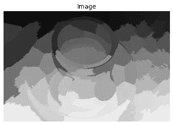

`slic`默认查找 100 个段或标签。为了把它们放回图像上，我们使用了`[label2rgb](https://scikit-image.org/docs/dev/api/skimage.color.html#skimage.color.label2rgb)`函数:

```
from skimage.color import label2rgbfinal_image = label2rgb(segments, coffee, kind="avg")>>> show(final_image)
```

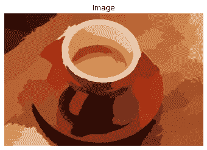

让我们将这个操作封装在一个函数中，并尝试使用更多的段:

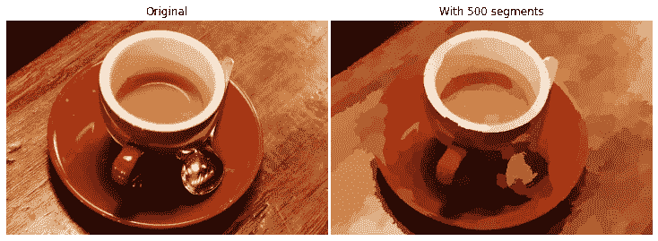

分割将使计算机视觉算法更容易从图像中提取有用的特征。

## 5.轮廓

物体的大部分信息存在于它的形状中。如果我们能检测出一个物体的线条或轮廓，我们就能提取出有价值的数据，如它的大小、标记等。

让我们来看看在实践中使用多米诺骨牌的形象寻找轮廓。

```
dominoes = imread("images/dominoes.jpg")>>> show(dominoes)
```

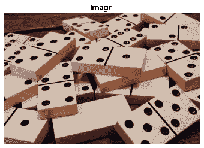

照片由 [Pixabay](https://www.pexels.com/@pixabay?utm_content=attributionCopyText&utm_medium=referral&utm_source=pexels) 从[像素](https://www.pexels.com/photo/addiction-deck-dominoes-gambling-278912/?utm_content=attributionCopyText&utm_medium=referral&utm_source=pexels)拍摄

我们将看看是否可以使用`skimage`中的`[find_contours](https://scikit-image.org/docs/stable/api/skimage.measure.html#skimage.measure.find_contours)`函数隔离瓷砖和圆圈。这个函数需要一个二值(黑白)图像，所以我们必须先对图像进行阈值处理。

产生的数组是表示等高线坐标的(n，2)数组列表:

我们将把操作包装在一个名为`mark_contours`的函数中:

为了在图像上绘制等高线，我们将创建另一个名为`plot_image_contours`的函数，它使用了上面的函数:

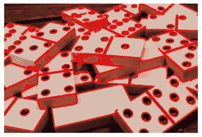

照片由[像素](https://www.pexels.com/photo/addiction-deck-dominoes-gambling-278912/?utm_content=attributionCopyText&utm_medium=referral&utm_source=pexels)的[像素](https://www.pexels.com/@pixabay?utm_content=attributionCopyText&utm_medium=referral&utm_source=pexels)拍摄

正如我们所看到的，我们成功地检测到了大多数轮廓，但我们仍然可以看到中心的一些随机波动。在将多米诺骨牌的图像传递给我们的轮廓寻找函数之前，让我们应用去噪:

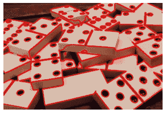

照片由 [Pixabay](https://www.pexels.com/@pixabay?utm_content=attributionCopyText&utm_medium=referral&utm_source=pexels) 从[像素](https://www.pexels.com/photo/addiction-deck-dominoes-gambling-278912/?utm_content=attributionCopyText&utm_medium=referral&utm_source=pexels)拍摄

就是这样！我们消除了大部分的噪声，导致不正确的轮廓线！

# 高级操作

## 1.边缘检测

之前，我们使用 Sobel 算法来检测对象的边缘。在这里，我们将使用 Canny 算法，因为它更快、更准确，所以应用更广泛。像往常一样，函数`[canny](https://scikit-image.org/docs/dev/api/skimage.feature.html#skimage.feature.canny)`需要一个灰度图像。

这一次，我们将使用包含更多硬币的图像，从而检测更多边缘:


照片由来自 [Pexels](https://www.pexels.com/photo/silver-and-gold-round-coins-3790639/?utm_content=attributionCopyText&utm_medium=referral&utm_source=pexels) 的[德米特里·德米多夫](https://www.pexels.com/@dmitry-demidov-515774?utm_content=attributionCopyText&utm_medium=referral&utm_source=pexels)拍摄

为了找到边缘，我们只需将图像传递给`canny`函数:

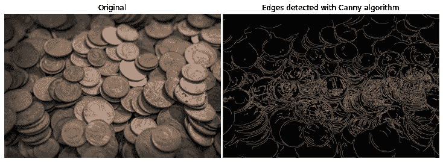

照片由来自 [Pexels](https://www.pexels.com/photo/silver-and-gold-round-coins-3790639/?utm_content=attributionCopyText&utm_medium=referral&utm_source=pexels) 的[德米特里·德米多夫](https://www.pexels.com/@dmitry-demidov-515774?utm_content=attributionCopyText&utm_medium=referral&utm_source=pexels)拍摄

该算法发现了几乎所有硬币的边缘，但它非常嘈杂，因为硬币上的雕刻也被检测到。我们可以通过调整`sigma`参数来降低`canny`的灵敏度:


照片由来自 [Pexels](https://www.pexels.com/photo/silver-and-gold-round-coins-3790639/?utm_content=attributionCopyText&utm_medium=referral&utm_source=pexels) 的[德米特里·德米多夫](https://www.pexels.com/@dmitry-demidov-515774?utm_content=attributionCopyText&utm_medium=referral&utm_source=pexels)拍摄

可以看到，`canny`现在只找到了硬币的大致轮廓。

## 2.角点检测

另一种重要的图像处理技术是角点检测。在图像分类中，角点可能是对象的关键特征。

为了找到角点，我们将使用哈里斯角点检测算法。让我们加载一个样本图像并将其转换为灰度:


照片由 [Pixabay](https://www.pexels.com/@pixabay?utm_content=attributionCopyText&utm_medium=referral&utm_source=pexels) 从[像素](https://www.pexels.com/photo/building-wall-architecture-window-87628/?utm_content=attributionCopyText&utm_medium=referral&utm_source=pexels)拍摄

我们将使用`[corner_harris](https://scikit-image.org/docs/dev/api/skimage.feature.html#skimage.feature.corner_harris)`功能来生成一个测量图像，该图像遮盖了角所在的区域。

```
from skimage.feature import corner_harrismeasured_image = corner_harris(windows_gray)>>> show(measured_image)
```

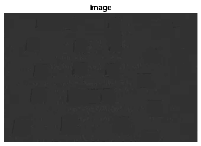

现在，我们将把这个屏蔽的测量图像传递给`corner_peaks`函数，这次它返回角坐标:

该函数找到了 79 个角，每个角之间的最小距离为 50 个像素。让我们将到目前为止的操作封装在一个函数中:

现在，我们将创建另一个函数，使用上述函数生成的坐标绘制每个角:

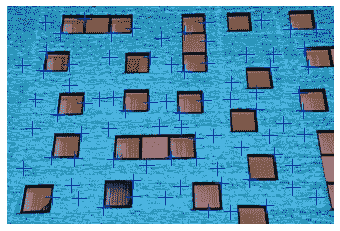

照片由[像素](https://www.pexels.com/photo/building-wall-architecture-window-87628/?utm_content=attributionCopyText&utm_medium=referral&utm_source=pexels)的[皮克斯拜](https://www.pexels.com/@pixabay?utm_content=attributionCopyText&utm_medium=referral&utm_source=pexels)拍摄

不幸的是，算法并不像预期的那样工作。这些标记被放置在砖块的相交处，而不是寻找窗户的角落。这些路口都是噪音，让他们没用。让我们对图像进行降噪，并再次将其传递给函数:

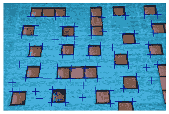

现在，这样好多了！它忽略了砖块的边缘，找到了大部分的窗户角落。

# 结论

唷！多好的帖子！你和我都值得表扬！

写这两篇文章的时候，我很开心。当然，在真正的计算机视觉问题中，你不会同时使用所有这些。你可能已经注意到了，我们今天学到的东西并不复杂，最多只需要几行代码。棘手的部分是将它们应用到实际问题中，并实际提高模型的性能。

这一点来自艰苦的工作和实践，而不是很好地包装在一篇文章中。感谢您的阅读！

> 在这里阅读第一部分。

**您可以使用下面的链接成为高级媒体会员，并访问我的所有故事和数以千计的其他故事:**

<https://ibexorigin.medium.com/membership>  

**或者订阅我的邮件列表:**

<https://ibexorigin.medium.com/subscribe>  

**你可以在**[**LinkedIn**](https://twitter.com/BexTuychiev)**或者**[**Twitter**](https://twitter.com/BexTuychiev)**上联系我，友好的聊一聊万物数据。或者你可以读我的另一个故事。这些怎么样:**

</good-bye-pandas-meet-terality-its-evil-twin-with-identical-syntax-455b42f33a6d>  </github-copilot-crushes-data-science-and-ml-tasks-ultimate-review-c8bcbefb928a>  </10-minute-guide-to-julia-for-die-hard-python-lovers-a2fcf7dcb860>  </6-pandas-mistakes-that-silently-tell-you-are-a-rookie-b566a252e60d>  </8-booming-data-science-libraries-you-must-watch-out-in-2022-cec2dbb42437> 