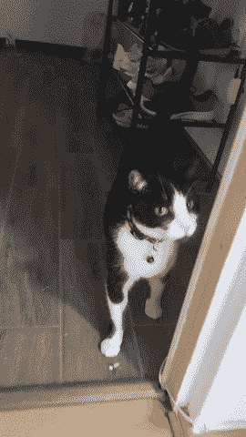
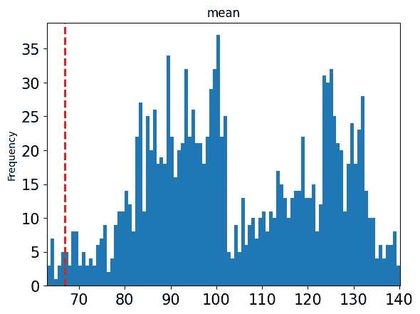
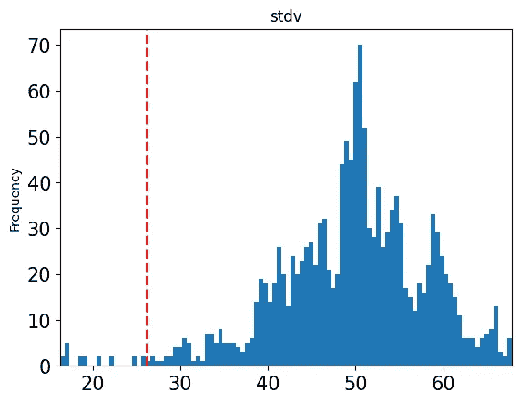
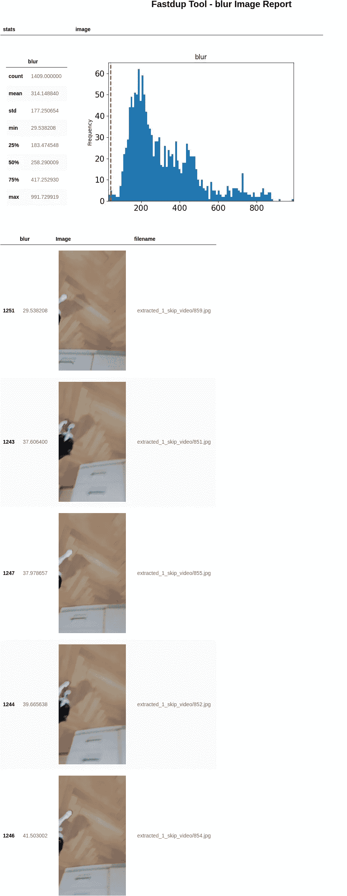
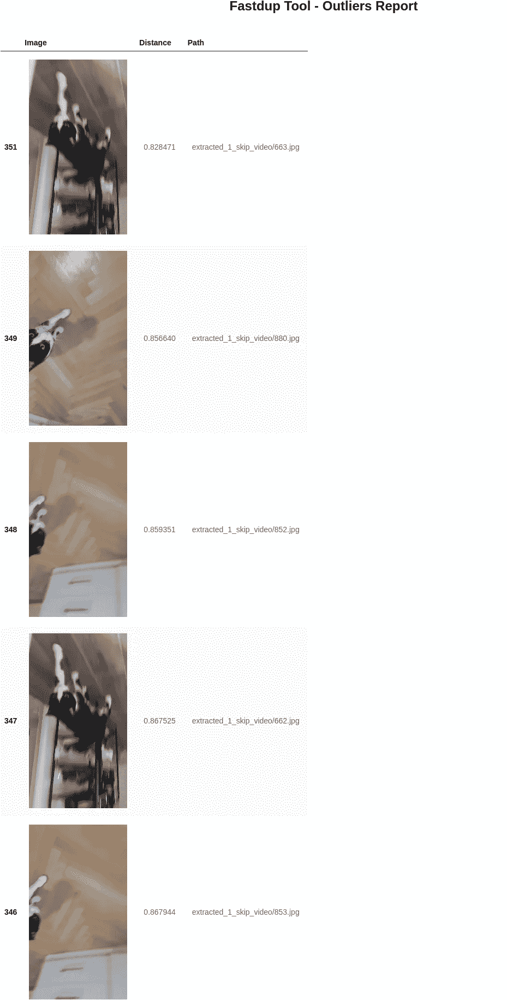
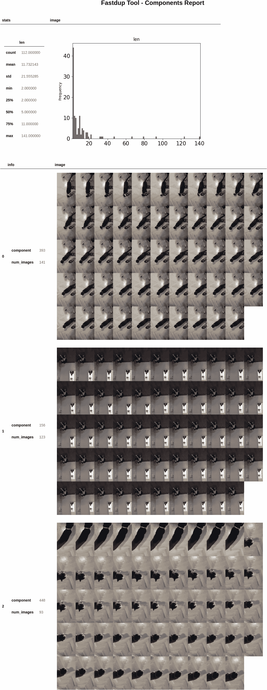
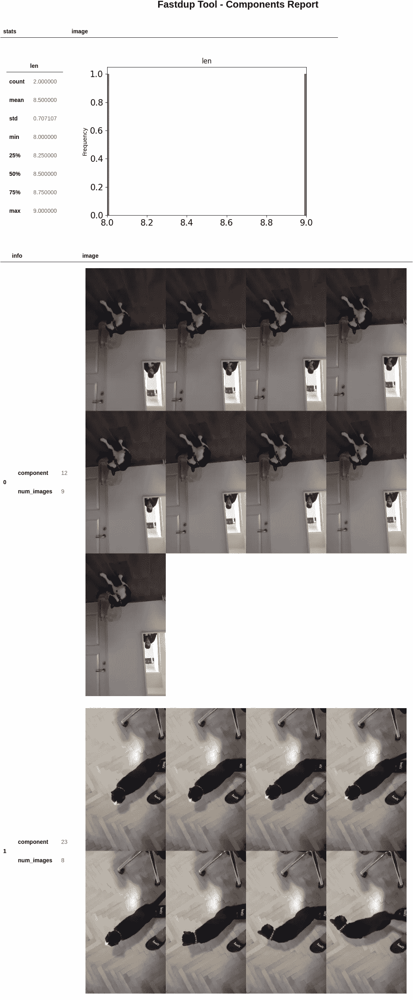
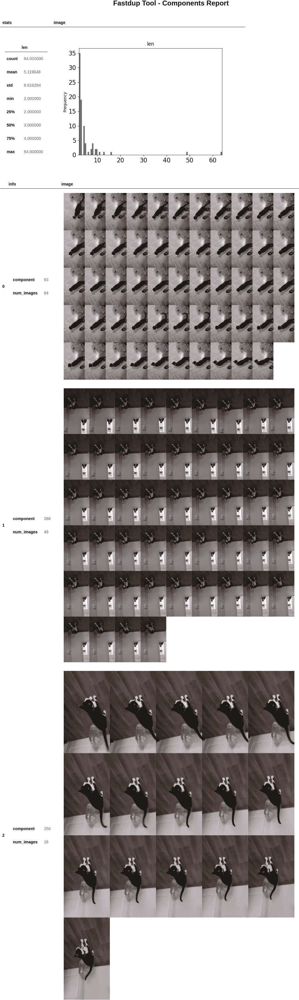

# 主数据完整性清理您的计算机视觉数据集

> 原文：<https://towardsdatascience.com/master-data-integrity-to-clean-your-computer-vision-datasets-df432cf9e596>

## 辅导的

## 处理数据泄漏。降低贴标成本。减少计算时间和费用。


[JESHOOTS.COM](https://unsplash.com/@jeshoots?utm_source=medium&utm_medium=referral)在 [Unsplash](https://unsplash.com?utm_source=medium&utm_medium=referral) 上拍照

**数据完整性**是最近一段时间公司和工程师最关心的问题之一。

我们必须处理和理解的数据量只会变得更加重要，手动查看数百万个样本是不可持续的。因此，我们需要能够帮助我们浏览数据集的工具。

> 本教程将介绍如何清理、可视化和理解**计算机视觉**数据集，如视频或图像。

我们将制作一部关于我家最珍贵的东西——我的猫的视频。*我们的最终目标是从视频中提取关键帧*，这些帧最近可以被发送到标签和训练你的模型。从视频中提取关键信息并不简单，因为视频属性不断变化。例如，在开始时，视频是高度静态的，从中间开始有很多动作。因此，我们需要一种智能的方法来理解视频的属性，以消除重复的图像，找到离群值，并对相似的照片进行聚类。



GIF 来自我的 sassy 猫的视频【作者 GIF】。

利用 FastDup，一个用于理解和清理 CV 数据集的工具，我们将向您展示如何解决上述问题。

## 最终目标

我们将提供一个教程，对我的野蛮女友的视频进行解码，并从中提取所有帧作为图像。我们将使用 FastDup 来可视化图片数据集上的不同统计数据。

主要目标是从数据集中移除相似/重复的图像。在下一节中，我们将详细说明为什么清除数据集的重复项至关重要。最终，我们将查看移除所有相似照片前后的异常值。

# 为什么删除重复图像很重要？

当数据变大时，手动解析和理解所有的样本是非常困难的。因此，您需要更多创新的方法来查询数据集以找到重复的图像。

当使用表格数据时，可以用 Pandas、SQL 等工具绕过这个问题。但是，当建模图像是一个挑战。因此，我们需要从不同的角度来处理这个问题。使用 FastDup，我们可以快速计算数据集上的一组嵌入，用它我们可以执行数据检索、聚类、离群点检测等。最终，我们可以轻松地查询和可视化我们的数据集，以更好地理解它。

我们将消除相似图像的重要性归结为三个主要观点:

## **#1 数据泄露**

在处理图像时，尤其是处理视频时，许多示例都是相似的。一个稳健的策略是使用嵌入来检测相似的照片，并相应地删除重复的照片。保留副本容易导致数据泄露。比如在拆分数据时，很容易不小心在列车拆分中加入图像 A，在测试拆分中加入图像 B，其中 A 和 B 是相似的。在处理大型数据集时，经常会遇到这样的数据泄漏问题，不幸的是，这会导致错误的结果，并可能导致在生产中部署模型时性能不佳。

## **#2 降低贴标成本**

大多数表现良好的 ML 模型使用有监督的方法来学习。因此，我们需要标签来训练它们。

在数据集中保留相似的影像会使数据集变大，但没有任何积极效果。在这种情况下，更多的数据不会增加任何价值，因为它不会增加任何新的信息。而是你只是花钱花力气给相似的图像贴标签。

## **#3 减少计算时间&成本**

正如我们在第 3 点**中讨论的。**，数据需要添加额外的信息来帮助建模。因此，通过在您的数据集中保留相似的样本，您的训练时间将会更长且成本更高。最终，它将导致更少和更长的实验，由于缺乏反馈而导致更差的模型。

# 什么是 FastDup？

FastDup 是计算机视觉中的一个 Python 工具，具有许多奇妙的特性，可以洞察大量的图像/视频集合。

它们的一些主要特征:

*   发现异常
*   查找重复项
*   使聚集
*   图像/视频之间的交互
*   计算嵌入

它是无人监督的，可伸缩的，并且在你的 CPU 上运行很快。这太棒了，因为 GPU 很贵，是小型团队的最大障碍之一。

现在，因为我们看到了理解和清理数据集的重要性，所以让我们开始本教程，并使用 **FastDup** 来看看我们如何在我的 sassy 猫的视频中解决这些问题。

我们走吧👇🏻

# 从视频中提取图像

下面是一些反映我们资源位置的常量。我们有输入视频的路径、提取帧的目录，以及 FastDup 计算和缓存数据集信息(如嵌入、离群值和各种统计数据)的目录。FastDup 提取的信息只计算一次，可以随时访问。

我们将视频逐帧提取到给定的输出目录中。该视频的 FPS 为 30，长度为 47 秒。 **skip_rate** 是我们从视频中提取帧的速率。这种情况下， **skip_rate = 1** 。因此，我们逐帧提取视频。如果 skip_rate = 5，我们将提取第 0 帧、第 5 帧、第 10 帧等等。

```
frames_count = extract(input_video_path=INPUT_VIDEO_PATH, output_dir=VIDEO_EXTRACTION_1_SKIP_DIR)FPS = 30
Frame Count = 1409
Video Length = 47 seconds
Extract Frame Count = 1409
```

# 使用 FastDup 可视化数据

首先，让我们了解一些我们将在本文中继续使用的术语:

*   **成分:**相似图像的聚类。一个组件总是有多个图像。
*   **相似图像:**不完全相同但包含相同信息的图像。大多数图像不会是彼此完美的复制品。因此，必须有一种机制来查找密切相关的图像。

现在我们调用 FastDup 来分析我们的数据集，并在给定的目录中缓存所有的分析数据。

```
compute_fastdup_analytics(images_dir=VIDEO_EXTRACTION_1_SKIP_DIR, analytics_dir=FASTDUP_ANALYTICS_1_SKIP_DIR)
```

## 统计数字

使用 FastDup，您可以根据不同的统计数据有效地计算数据集的直方图，这些统计数据包括:平均值、标准差、最小值、最大值、大小等。

```
fastdup.create_stats_gallery(FASTDUP_ANALYTICS_1_SKIP_DIR, save_path="stats", metric="mean")
```



视频内图像平均值的直方图【图片由作者提供】。

```
fastdup.create_stats_gallery(FASTDUP_ANALYTICS_1_SKIP_DIR, save_path="stats", metric="stdv")
```



视频内图像标准差直方图【图片由作者提供】。

最有趣的指标是**模糊**，它可以快速突出模糊图像及其统计数据:



关于视频内模糊图像的统计[图片由作者提供]。

## 极端值

Fastdup 利用嵌入和 K-Means 将图像聚类到嵌入空间中。因此，我们可以快速找到相似图像的集群(用他们的行话来说就是“组件”)和离群值。

让我们来计算异常值:

离群值可视化帮助我们看到令人兴奋的场景。在我们的例子中，异常图像是模糊的。只要样本中的信息是有效的，使用有噪声的样本来提高模型的稳健性是一种好的做法。



视频中的前 5 个异常值，用 FastDup 快速计算[图片由作者提供]。

## 复制

最后，让我们计算并找出我们从视频中提取了多少相似的图像:

FastDup 基于组件的大小创建直方图，其中组件是相似图像的集群。



视频中的前 3 个组件逐帧提取。最重要的部分是包含最相似图像的部分。

正如所料，如果我们导出视频中的所有帧，我们最终会得到许多重复的帧。我们可以清楚地看到包含最多副本的前 3 个组件。此外，我们可以看到组件大小的分布。6 个分量有超过 40 个图像，这表明在大约 6 个场景中，视频非常静态。

此外，通过计算 *num_images / FPS* ，我们可以估计静态场景的秒数。

## 我们如何删除所有重复的内容？

一种简单的方法是增加 **skip_rate** 来消除相似相邻帧之间的冗余。让我们看看表现如何。

# 提取具有较高跳过率的帧

正如我们之前所说的，让我们使用 **skip_rate = 10** 来看看我们是否可以解决相似性问题。该视频的 FPS 为 30，经过几次实验，我们发现 **skip_rate = 10** 是一个平衡的数字。

```
frames_count_10_skip = extract(input_video_path=INPUT_VIDEO_PATH, output_dir=VIDEO_EXTRACTION_10_SKIP_DIR, skip_rate=SKIP_RATE)FPS = 30
Frame Count = 1409
Video Length = 47 seconds
Extract Frame Count = 140
```

我们必须重新计算 FastDup 分析，以可视化新组件:

现在让我们来想象一下组件:



视频摘录中跳过率为 10 的前 3 个组件。最重要的部分是包含最相似图像的部分。

在尝试了多种跳过率之后，我们解决了大部分相似性问题。我们可以看到，在只有 9 个和 8 个样本的 2 个组件中发现了重复图像。我们用这种简单的方法做了一件体面的工作。

此外，一个巨大的好处是提取时间快了 10 倍。当有大量视频时，这是需要考虑的一个重要方面。

但遗憾的是，这种方法一点也不健壮。原因如下:

# 增加跳级率的危险

## #1.信息的丢失

视频中的活动总是以不同的速率移动。我们可以找到 2-3 个视频的最佳 **skip_rate** ，在保留足够的必要样本和去除冗余数据之间找到最合适的平衡。尽管如此，因为现实世界是混乱的，这个数字可能会在新视频的某个时候打破。在不知情的情况下，你会跳过视频中的关键帧。

## #2.你无法控制相似性问题

因为视频是动态的，固定的跳过率只适合你的一些视频。因此，为数据集中的每个视频寻找不同的跳过率是不可持续的。此外，在所有视频中使用一个较高的 skip_rate 值是行不通的。

即使对于我们的视频，这是非常简单的，我们只能删除一些重复的。

如上所述，我们看到，使用更高的跳过率不会做这项工作。因此，我们需要一种更加智能和动态的方法来找到相似的图像并删除重复的图像。

我们很幸运，因为 Fastdup 正在这么做。让我们看看怎么做。

# 使用 FastDup 排除重复项

使用 FastDup，我们可以使用更巧妙的方法。我们已经知道图像的聚类嵌入空间内的分量。因此，我们知道哪些图像在同一个聚类中，这转化为相似的照片。FastDup 为我们提供了仅保留一个映像/组件的功能。

这种方法好 10 倍，因为它独立于视频中的动态。相对于视频语义的不规则性，它是鲁棒的和灵活的。

我们必须再次提取所有帧并重新计算 FastDup 分析。

```
 FPS = 30
Frame Count = 1409
Video Length = 47 seconds
Extract Frame Count = 1409

-------------Deleted frames count: 1202
Deleted 85.308730% of the frames.
```

哇哦。85%的图像代表冗余数据，这是一个很大的数字。想象一下，不用标注 1000 张图片，只需要标注 150 张。这节省了很多时间。

清理完目录映像后，让我们重新计算组件，看看它们是什么样子。

```
compute_fastdup_analytics(images_dir=VIDEO_EXTRACTION_1_SKIP_DIR, analytics_dir=FASTDUP_ANALYTICS_1_SKIP_DIR)
```

```
AssertionError: No components found with more than one image/video
```

那是什么？我们出错了吗？

是的，我们做到了，这是完美的。这意味着 FastDup 不再找到任何组件。因此，数据集不再包含相似的图像。

仅此而已。简单对吗？是不是很酷？

# 最终策略。将 Fastdup 与更高的提取率相结合。

我称赞说，使用嵌入来删除相似的图像是最好的方法。但不幸的是，逐帧导出视频需要很长时间。因此，最好的方法是将这两种策略结合起来。但这一次，我们将使用 2 的低跳过率，因为现在跳过的目标不是消除表里不一，而是加快提取时间。我们仍将使用 FastDup 来处理清理过程。

```
frames_count_2_skip = extract(input_video_path=INPUT_VIDEO_PATH, output_dir=VIDEO_EXTRACTION_2_SKIP_DIR, skip_rate=SKIP_RATE)FPS = 30
Frame Count = 1409
Video Length = 47 seconds
Extract Frame Count = 704compute_fastdup_analytics(images_dir=VIDEO_EXTRACTION_2_SKIP_DIR, analytics_dir=FASTDUP_ANALYTICS_2_SKIP_DIR)
```



视频摘录中跳过率为 2 的前 3 个组件。最重要的部分是包含最相似图像的部分。

如你所见，使用 **skip_rate = 2** ，我们仍然有很多相似的图像。但是导出时间快了两倍。

```
delete_duplicates(FASTDUP_ANALYTICS_2_SKIP_DIR, total_frames_count=frames_count_2_skip)Deleted frames count: 346
Deleted 49.147727% of the frames.
```

很好。这次只有总帧数的 50%是重复的。

## 移除相似图像前后的异常值

观察清理前后异常值的 IoU 是很有趣的。理论上，离群值在删除重复项后基本保持不变，因为数据集的一般语义信息应该保持不变。不幸的是，异常值之前和之后之间的 IoU 只有大约 30%，这表明移除所有重复图像改变了几何空间，这可以更好。

```
0.31
```

通过向您展示离群值的例子，我想强调的是，尽管这种方法是创新的并且非常有用，但它仍然需要改进。我们刚刚开始以数据为中心的运动；因此，我们必须保持关注，看看它会给未来带来什么。

# 结论

谢谢你看我的教程。如果你读过它，你会发现控制你的数据集是多么容易。

我们展示了如何使用 FastDup 处理一个真实世界的视频(我的一只时髦的猫),以快速找到计算机视觉数据集中的相似图像和离群值。

我们强调了理解数据集并根据您的业务问题正确处理相似图像的重要性。否则，您可能会遇到数据泄漏、更高的标注成本以及更高的计算时间和成本。问题转化为错误的度量和更少的实验，最终导致更差的模型。

[这里是 GitHub 资源库的链接。](https://github.com/iusztinpaul/machine-learning-blog/tree/main/master-data-integrity-clean-computer-vision-datasets)

💡我的目标是让机器学习变得简单直观。如果你喜欢我的文章，我们可以在 [LinkedIn](https://www.linkedin.com/in/pauliusztin/) 上联系，了解关于[#数据](https://app.contentstudio.io/machine-learning/planner/calendar-view?sort_column=post_created_at&date=December%2026,%202022%20-%20February%2006,%202023#data)、 [#ml](https://app.contentstudio.io/machine-learning/planner/calendar-view?sort_column=post_created_at&date=December%2026,%202022%20-%20February%2006,%202023#ml) 和 [#mlops](https://app.contentstudio.io/machine-learning/planner/calendar-view?sort_column=post_created_at&date=December%2026,%202022%20-%20February%2006,%202023#mlops) 的每日见解。

[](https://pauliusztin.medium.com/membership) [## 通过我的推荐链接加入 Medium-Paul Iusztin

### 加入我们，从我和其他作者那里获得关于 ML、MLOps 和自由职业的独家内容。🚀解锁对…的完全访问权限

pauliusztin.medium.com](https://pauliusztin.medium.com/membership)