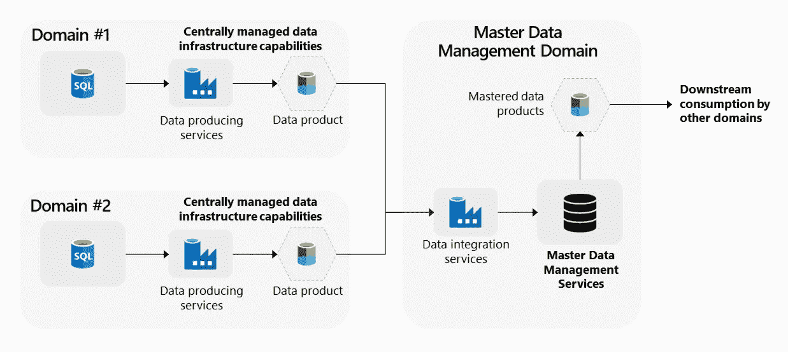
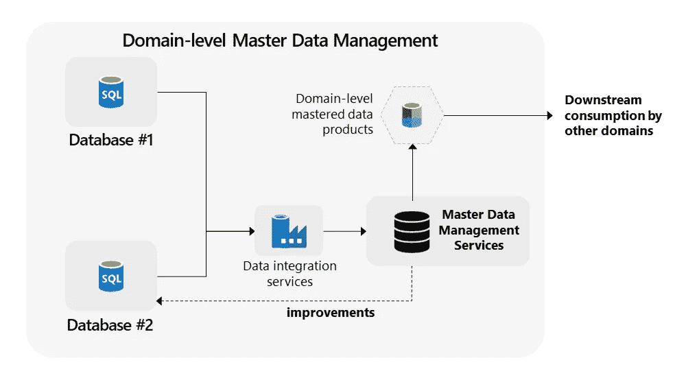

# 数据网格中的主数据管理

> 原文：<https://towardsdatascience.com/master-data-management-in-data-mesh-594d21f3ee10>

## 如果它是稳定的并且确实重要，那么考虑使用 MDM

使用数据网格架构的企业通常有大量的[域](https://piethein.medium.com/data-domains-where-do-i-start-a6d52fef95d1)，每个域都有自己的系统和数据。这意味着增加了复杂性，因为数据分布很广，同一数据可能存在多个版本。集成，例如提供客户的 360 度视图，因此需要更多的努力，因为它需要您集成和协调来自不同领域的相同数据的所有不同的独立部分。另一个挑战是，不同领域之间的数据可能不一致，数据质量水平也可能存在差异。为了应对这些挑战，您应该在数据网格架构中应用主数据管理(MDM)。

面向领域的架构中的主数据管理工作方式不同，因为它是分布式的。一致性更难实现，因为您依赖于域内主数据的管理。

> 如果数据是快速和流动的，将它分成更小的片段，并留给域处理。如果数据是稳定的并且确实很重要，那么考虑使用 MDM。

# 面向领域的主数据管理

尽管许多 MDM 解决方案可以管理参考数据和主数据，但我建议明确区分这两者。**参考数据**是用于定义、分类、组织、分组或归类其他数据(或价值层次，如产品和地理层次之间的关系)的数据。相比之下，**主数据**讲的是核心概念。每种类型通常都有不同的管理方式。

## 参考数据

实现域间数据一致性的一种方法是，在分发[数据产品](https://piethein.medium.com/data-domains-and-data-products-64cc9d28283e)时，要求您的域符合集中管理的**参考数据**。货币代码、国家代码或产品代码通常是可疑的。这些参考数据列表被发布在例如主数据存储或中央储存库中。当您的任何域跨其他域分发数据产品时，域使用企业参考数据中的企业参考标识符来对数据进行分类。本地数据到企业数据的映射允许其他域快速识别数据产品中的主数据。这种映射活动还意味着域需要查找或交换集中管理的参考数据，以了解哪些本地数据需要映射到中央主数据。

## 主数据

对于**主数据**，方法略有不同。主数据的一个重要方面是主标识号，它将主数据和域中的数据联系在一起。这些数据元素对于追踪哪些数据已经被掌握以及哪些属于一起是至关重要的。识别唯一数据和分配主标识符只能集中完成，而不能在系统内部本地完成。它需要将来自不同系统的主数据放在一个 MDM 解决方案中。

主数据管理领域(鸣谢:Piethein Strengholt)

当对 MDM 活动进行分组并使用主数据存储作为集中式存储库时，您还可以创建新的 MDM 域。这种 MDM 域指的是一个特定的数据主题，其中主要关注主数据的识别和控制。众所周知的例子有客户、产品、地理位置、财务和风险以及员工数据。来自这些 MDM 域的主数据有望返回到域中。这些数据的分发类似于数据产品的分发。

您可以确定主数据管理的范围，并允许不同的数据产品分发方法。例如，在某个范围边界内的一些数据产品不必符合企业主数据，而分布在该范围之外的数据产品必须符合。或者反过来应用这种模式:只有在特定的范围内才需要严格遵守。

## 主识别号

识别和维护这些关系不仅对于了解已经掌握了哪些数据非常重要，而且对于了解哪些数据可以快速链接到其他数据也非常重要。如果操作系统中的本地(域)键发生变化，将所有内容绑定在一起的唯一元素将是主标识符。因此，建议您也建立从 MDM 解决方案到当地管理部门的反馈回路。

在分发主标识符时，建议您不要将 MDM 主标识符外推至所有源系统，这可能会产生不一致的问题。只有受主数据管理区域约束的应用程序或系统才应该从 MDM hub 获取主标识符。不受 MDM 约束的系统应该使用自己的本地(域)完整性。

# 域级主数据管理

当您寻找重叠数据时，您可能会发现不同程度的重叠。有些数据是通用的，跨越许多领域；其他数据具有有限的重叠，并且仅跨越几个领域。为了区分重叠的重要性和数量，您还可以通过在特定范围内创建主数据的局部视图，将 MDM 扩展到域级 MDM。这对于在一些(但不是所有)域之间共享的数据非常有用。

域级主数据管理(鸣谢:Piethein Strengholt)

对于重叠的域来说，重要的是管理它们的数据，但是没有中心依赖性。这方面的 MDM 解决方案最好以服务的形式提供。将基础设施抽象出来，将 MDM 作为服务提供给域，可以极大地简化使用。如果您正在使用中央 MDM 基础设施，建议您对每个单独的域或范围应用隔离视图。

## 通过可重用组件实现 MDM 一致性

主数据协作和可重用性的另一种方式是代码共享。这里共享的不是主数据，而是底层代码(代码片段和脚本)来生成输出并促进有效的重用。这些代码存储在一个集中的开放的存储库中，包括版本控制，允许领域团队贡献和改进已经发布的内容。

这种模型的好处是，业务逻辑只在领域内应用，这允许团队在他们认为合适的时候偏离、改进或使用稍微优化的逻辑版本。此外，随着社区的改进进入中央代码库，这些输出可以重新生成。这种模型的一个缺点是一致性，因为允许团队修改他们的代码会使得在团队之间比较结果更加困难。

# 后续步骤

主数据管理的重要性显而易见:只有当用户使用的数据一致且正确时，他们才能做出正确的决策。MDM 确保跨域级别的一致性和质量。组织需要找到一个平衡点。引入过多的主数据或参考值区域会引入过多的跨域对齐。根本没有企业数据，无法比较任何结果。

开始在您的组织中实现 MDM 的一个实用方法是从最简单的主数据管理方式开始:实现存储库。有了存储库，您可以通过了解哪些数据需要调整或哪些数据质量差来快速交付价值，而无需调整任何域系统。

下一步将是设定更清晰的范围。不要因为选择所有数据而陷入企业数据统一的陷阱。从增加价值最多的主题开始，如客户、合同、组织单位或产品。只选择最重要的领域来掌握。属性的数量应该是十个，而不是几百个。在您与您的领域达成一致之后，调整流程和治理。让所有领域都清楚地了解您在时间表和评审方面的协议。还要处理元数据，因此主数据被编目，域知道来自什么源系统的什么数据元素是候选的，以及这些元素如何在数据管道中流动。

最后一步，也是最终目标，是实现共存:改进直接反馈到您的领域。这一步是最困难的，因为它需要对架构进行许多更改。域需要能够处理来自集中管理的 MDM 解决方案的修正和改进。