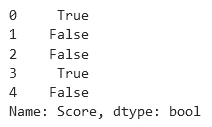
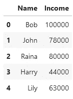
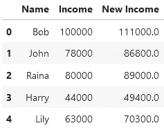
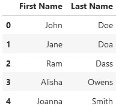
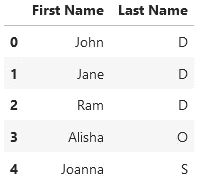
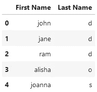

# 用这三种有用的技术掌握熊猫的数据转换

> 原文：<https://towardsdatascience.com/master-data-transformation-in-pandas-with-these-three-useful-techniques-20699f03e51d>

## 对过滤、操作和功能的深入研究


由 [Milad Fakurian](https://unsplash.com/@fakurian?utm_source=medium&utm_medium=referral) 在 [Unsplash](https://unsplash.com?utm_source=medium&utm_medium=referral) 上拍摄的照片

回想一下您最后一次使用格式良好的数据集的情况。命名良好的列、最少的缺失值和适当的组织。拥有不需要清理和转换的数据是一种很好的感觉——几乎是自由的。

好吧，这很好，直到你从你的白日梦中抽离出来，继续在你面前破碎的行和无意义的标签的绝望混乱中修补。

没有干净数据(原始形式)这种东西。如果你是一个数据科学家，你知道这一点。如果你刚刚开始，你应该接受这一点。为了有效地使用数据，您需要转换数据。

我们来谈谈三种方法。

## 过滤——但解释得当

让我们来谈谈过滤——但比你可能习惯做的更深入一点。作为最常见和最有用的数据转换操作之一，有效地过滤是任何数据科学家的必备技能。如果你了解熊猫，这可能是你学会做的第一个手术。

让我们回顾一下，用我最喜欢的，奇怪的通用例子:一个学生成绩的数据框架，恰当地称为`grades`:


作者图片

我们将过滤掉任何低于 90 分的分数，因为在这一天，我们决定成为只迎合优等生的训练不足的教育者(请永远不要这样做)。完成此任务的标准代码行如下:

```
grades[grades['Score'] >= 90]
```


作者图片

只剩下杰克和赫敏了。酷毙了。但是这里到底发生了什么？*为什么*上面这行代码行得通？让我们更深入一点，看看上面外层括号内的表达式的输出:

```
grades['Score'] >= 90
```



作者图片

啊，好吧。有道理。这一行代码似乎返回了一个 Pandas Series 对象，该对象包含由每一行返回的内容确定的布尔值(`True` / `False`)。这是关键的中间步骤。之后，就是这一系列的布尔值被传递到外层的括号中，并相应地过滤所有的行。

为了完整起见，我还将提到使用`loc`关键字可以实现相同的行为:

```
grades.loc[grades['Score'] >= 90]
```


作者图片

我们选择使用`loc`有很多原因(其中之一是它实际上允许我们通过一个操作来过滤行和列)，但是这打开了 Pandas 操作的潘多拉魔盒，最好留给另一篇文章来处理。

目前，重要的学习目标是这样的:当我们过滤熊猫时，令人困惑的语法不是某种怪异的魔法。我们只需要把它分解成两个组成步骤:1)获得满足我们条件的行的布尔序列，2)使用该序列过滤出整个数据帧。

你可能会问，这为什么有用？嗯，一般来说，如果你只是使用操作而不了解它们实际上是如何工作的，这很可能会导致令人困惑的错误。过滤是一种非常有用且非常常见的操作，您现在知道它是如何工作的了。

我们继续吧。

## λ函数的美妙之处

有时，您的数据需要转换，而这并不是 Pandas 的内置功能。尽管你可能会尝试，但是再多的搜索栈溢出或者勤奋地研究 Pandas 文档也不能揭示你的问题的解决方案。

输入 lambda 函数——这是一个有用的语言功能，与 Pandas 完美地集成在一起。

快速回顾一下，lambdas 是如何工作的:

```
>>> add_function = lambda x, y: x + y
>>> add_function(2, 3)
5
```

Lambda 函数与常规函数没有什么不同，只是它们的语法更简洁:

*   等号左边的函数名。
*   等号右边的`lambda`关键字(类似于传统 Python 函数定义中的`def`关键字，这让 Python 知道我们正在定义一个函数)。
*   参数在`lambda`关键字之后，冒号的左边。
*   冒号右边的返回值。

现在，让我们将 lambda 函数应用于实际情况。

数据集通常有自己的格式特点，具体到数据输入和收集的变化。因此，您正在处理的数据可能有您需要解决的奇怪的特定问题。例如，考虑下面的简单数据集，它存储了人们的姓名和收入。姑且称之为`monies`。



作者图片

现在，作为该公司的主数据殿下，我们得到了一些绝密信息:该公司的每个人都将获得 10%的加薪，外加 1000 美元。这种计算可能过于具体，无法找到具体的方法，但对于 lambda 函数来说就足够简单了:

```
update_income = lambda num: num + (num * .10) + 1000
```

然后，我们需要做的就是将这个函数与 Pandas `apply`函数一起使用，这样我们就可以将一个函数应用于所选系列的每个元素:

```
monies['New Income'] = monies['Income'].apply(update_income)
monies
```



作者图片

我们完事了。这是一个全新的数据框架，包含了我们需要的所有信息，只有两行代码。为了使它更加简洁，我们甚至可以直接在`apply`中定义 lambda 函数——这是一个值得记住的很酷的技巧。

我会简单地说明这一点。

Lambdas 非常有用，因此，你应该使用它们。尽情享受吧！

## 系列字符串操作函数

在上一节中，我们讨论了 lambda 函数的多功能性，以及它们可以帮助您使用数据完成的所有很酷的事情。这很好，*但是*你应该小心不要忘乎所以。如此沉迷于一种熟悉的做事方式，以至于错过了 Python 赋予程序员的更简单的捷径，这种情况非常普遍。当然，这不仅仅适用于 lambdas，但我们暂时会坚持这一点。

例如，假设我们有以下名为`names` 的数据帧，其中存储了人们的名字和姓氏:



作者图片

现在，由于数据库的空间限制，我们决定不存储一个人的整个姓氏，而只存储他们的姓首字母会更有效。因此，我们需要相应地转换`'Last Name'`列。对于 lambdas，我们这样做的尝试可能如下所示:

```
names['Last Name'] = names['Last Name'].apply(lambda s: s[:1])
names
```



作者图片

这显然是可行的，但是有点笨拙，因此不像 Pythonic 那样好。幸运的是，有了 Pandas 中的字符串操作功能，还有另一种更优雅的方式(为了下一行代码的目的，假设我们还没有用上面的代码修改过`'Last Name'`列):

```
names['Last Name'] = names['Last Name'].str[:1]
names
```


作者图片

哒哒！熊猫系列的`.str`属性让我们通过指定的字符串操作拼接系列中的每个字符串，就像我们单独处理每个字符串一样。

但是等等，还有更好的。由于`.str`有效地让我们通过系列访问字符串的正常功能，我们还可以应用一系列字符串函数来帮助快速处理我们的数据！例如，假设我们决定将两列都转换成小写。下面的代码完成了这项工作:

```
names['First Name'] = names['First Name'].str.lower()
names['Last Name'] = names['Last Name'].str.lower()
names
```



作者图片

这比定义自己的 lambda 函数并在其中调用字符串函数要简单得多。并不是说我不喜欢 lambdas——但是每样东西都有它的位置，在 Python 中简单应该总是优先考虑的。

这里我只介绍了几个例子，但是有大量的字符串函数供您使用。

自由地使用它们。他们很棒。

## **最终想法和总结**

这里有一个小小的数据转换备忘单:

1.  **认真过滤**。了解到底发生了什么，这样你才知道自己在做什么。
2.  **爱你的小羊羔**。它们可以帮助你以惊人的方式操纵数据。
3.  **熊猫和你一样热爱弦乐**。有许多内置的功能，你也可以使用它。

这里是最后一条建议:没有“正确”的方法来过滤数据集。这取决于手头的数据以及您希望解决的独特问题。然而，虽然每次都没有固定的方法可以遵循，但是有一些有用的工具值得您使用。在本文中，我讨论了其中的三种。

我鼓励你出去多找一些。

**想擅长 Python？** [**在这里**](https://witty-speaker-6901.ck.page/0977670a91) **获得独家、免费获取我简单易懂的指南。想在介质上无限阅读故事？用我下面的推荐链接注册！**

[](https://murtaza5152-ali.medium.com/?source=entity_driven_subscription-607fa603b7ce---------------------------------------)  

## 参考

[1][https://www . about datablog . com/post/10-most-used-string-functions-in-pandas](https://www.aboutdatablog.com/post/10-most-useful-string-functions-in-pandas)